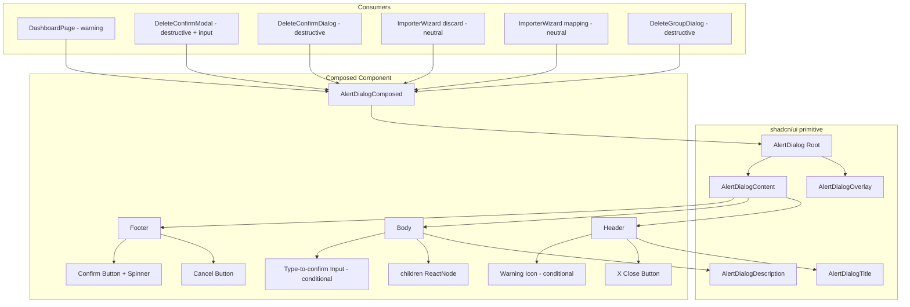

# Design Document: AlertDialog Composed Component

## Overview

A single composed `AlertDialog` component wrapping the existing shadcn/Radix AlertDialog primitive with three intent variants (neutral, warning, destructive). The component handles controlled open/close state, async confirm with loading spinner, and an optional type-to-confirm input guard. It replaces six existing ad-hoc dialog implementations across the app, consolidating them into one consistent, accessible pattern.

Key decisions: (1) wrap the existing Radix primitive rather than building from scratch — this gives us focus trapping, portal rendering, and keyboard handling for free; (2) use a single component file with internal variant logic rather than three separate components — the variants share 90% of their structure; (3) the loading state is managed internally via `useState` derived from the Promise returned by `onConfirm`.

## Architecture



### Key Architectural Decisions

1. **Single file, single export** — The component lives at `src/components/composed/alert-dialog-composed.tsx` and exports one named function `AlertDialogComposed`. Intent-specific styling is handled via `cn()` conditional classes, not separate sub-components.

2. **Wraps Radix primitives directly** — Uses `AlertDialog` (Root), `AlertDialogPortal`, `AlertDialogOverlay`, and `AlertDialogContent` from the shadcn primitive. Does NOT use `AlertDialogAction`/`AlertDialogCancel` because we need custom button behaviour (loading state, disabled logic, async handling). Instead, renders standard `Button` components from `src/components/ui/button.tsx`.

3. **Internal loading state** — When `onConfirm` returns a Promise, the component sets `isLoading = true`, awaits the promise, then sets `isLoading = false`. This avoids requiring consumers to manage loading state externally.

4. **Type-to-confirm is destructive-only** — The `requiresInput` prop is only meaningful when `intent === 'destructive'`. The confirm button stays disabled until the input matches the required string (case-sensitive exact match).

5. **Accessible by default** — Uses Radix's built-in focus trap, escape-to-close, and aria attributes. The close X button and Cancel button both call `onOpenChange(false)`. Title uses `AlertDialogTitle` for proper `aria-labelledby`. Body content is wrapped in `AlertDialogDescription` for `aria-describedby`.

## Components and Interfaces

### AlertDialogComposed

Location: `src/components/composed/alert-dialog-composed.tsx`

```typescript
import { type ReactNode } from 'react'

export interface AlertDialogComposedProps {
  /** Controlled open state */
  open: boolean
  /** Callback when open state changes (close via X, Cancel, overlay click) */
  onOpenChange: (open: boolean) => void
  /** Visual intent variant */
  intent: 'neutral' | 'warning' | 'destructive'
  /** Dialog title — sentence case */
  title: string
  /** Body content */
  children: ReactNode
  /** Primary action button label — sentence case */
  confirmLabel: string
  /** Cancel button label — defaults to "Cancel" */
  cancelLabel?: string
  /** Primary action callback — if returns Promise, shows loading state */
  onConfirm: () => void | Promise<void>
  /** Optional cancel callback (in addition to closing) */
  onCancel?: () => void
  /** Type-to-confirm guard string (destructive only) — e.g. "DELETE" */
  requiresInput?: string
  /** Placeholder for the type-to-confirm input */
  inputPlaceholder?: string
  /** Label shown on confirm button during async loading — e.g. "Deleting..." */
  loadingLabel?: string
}
```

### Internal State

```typescript
// Inside the component:
const [isLoading, setIsLoading] = useState(false)
const [inputValue, setInputValue] = useState('')

// Derived:
const inputValid = !requiresInput || inputValue === requiresInput
const confirmDisabled = isLoading || !inputValid
const cancelDisabled = isLoading
```

### Confirm Handler Logic

```typescript
async function handleConfirm() {
  if (confirmDisabled) return
  const result = onConfirm()
  if (result instanceof Promise) {
    setIsLoading(true)
    try {
      await result
    } finally {
      setIsLoading(false)
    }
  }
}
```

### Spinner Sub-component

An inline SVG circle with `animate-spin`, sized to match button text. Rendered inside the confirm button when `isLoading` is true, replacing the label text with `loadingLabel` (or keeping `confirmLabel` if no `loadingLabel` provided).

```typescript
function Spinner({ className }: { className?: string }) {
  return (
    <svg
      className={cn('animate-spin h-4 w-4', className)}
      xmlns="http://www.w3.org/2000/svg"
      fill="none"
      viewBox="0 0 24 24"
    >
      <circle
        className="opacity-25"
        cx="12" cy="12" r="10"
        stroke="currentColor"
        strokeWidth="4"
      />
      <path
        className="opacity-75"
        fill="currentColor"
        d="M4 12a8 8 0 018-8V0C5.373 0 0 5.373 0 12h4z"
      />
    </svg>
  )
}
```

### Variant Styling Map

```typescript
const intentStyles = {
  neutral: {
    border: '',                              // no top border
    confirmVariant: 'default' as const,      // teal primary
    icon: null,                              // no icon
  },
  warning: {
    border: 'border-t-4 border-t-warning',   // amber top border
    confirmVariant: 'secondary' as const,    // dark/foreground button
    icon: Warning,                           // Phosphor Warning icon
  },
  destructive: {
    border: 'border-t-4 border-t-destructive', // red top border
    confirmVariant: 'destructive' as const,    // red button
    icon: null,                                // no icon by default
  },
}
```

### Component Structure (JSX outline)

```tsx
<AlertDialog open={open} onOpenChange={handleOpenChange}>
  <AlertDialogPortal>
    <AlertDialogOverlay />
    <AlertDialogContent className={cn(
      'max-w-[460px] p-0 gap-0 overflow-hidden',
      intentStyles[intent].border
    )}>
      {/* Header */}
      <div className="flex items-center justify-between px-6 pt-6 pb-0">
        <AlertDialogTitle className="flex items-center gap-2 text-base font-semibold">
          {intent === 'warning' && (
            <Warning size={20} weight="fill" className="text-warning shrink-0" />
          )}
          {title}
        </AlertDialogTitle>
        <button
          onClick={() => onOpenChange(false)}
          disabled={isLoading}
          className="..."
          aria-label="Close"
        >
          <X size={18} />
        </button>
      </div>

      {/* Body */}
      <AlertDialogDescription asChild>
        <div className="px-6 py-4 text-sm text-muted-foreground">
          {children}
          {requiresInput && intent === 'destructive' && (
            <div className="mt-4">
              <p className="text-sm text-muted-foreground mb-2">
                Type <strong className="text-foreground">{requiresInput}</strong> to confirm
              </p>
              <Input
                value={inputValue}
                onChange={(e) => setInputValue(e.target.value)}
                placeholder={inputPlaceholder ?? `Type ${requiresInput} here`}
                disabled={isLoading}
                autoComplete="off"
              />
            </div>
          )}
        </div>
      </AlertDialogDescription>

      {/* Footer */}
      <div className="flex items-center justify-end gap-3 px-6 py-4 border-t border-border">
        <Button
          variant="secondary"
          onClick={handleCancel}
          disabled={cancelDisabled}
        >
          {cancelLabel ?? 'Cancel'}
        </Button>
        <Button
          variant={intentStyles[intent].confirmVariant}
          onClick={handleConfirm}
          disabled={confirmDisabled}
        >
          {isLoading && <Spinner />}
          {isLoading ? (loadingLabel ?? confirmLabel) : confirmLabel}
        </Button>
      </div>
    </AlertDialogContent>
  </AlertDialogPortal>
</AlertDialog>
```

## Data Models

No new data models required. The component is purely presentational with internal UI state only.

### State Shape (internal)

| State | Type | Purpose |
|---|---|---|
| `isLoading` | `boolean` | True while awaiting async `onConfirm` |
| `inputValue` | `string` | Current value of type-to-confirm input |

The `inputValue` resets to `''` when the dialog closes (via `useEffect` on `open` prop).

## Correctness Properties

### Property 1: Confirm button disabled until input matches

For any `requiresInput` string R and any user input string I, the confirm button is disabled if and only if `I !== R`. When `requiresInput` is undefined, the confirm button is always enabled (unless loading).

**Validates: Requirements 2.8, 5.2**

### Property 2: Loading state disables both buttons

For any async `onConfirm` that returns a pending Promise, both the Cancel and Confirm buttons must be disabled until the Promise settles (resolves or rejects).

**Validates: Requirements 4.2, 4.4**

### Property 3: Intent determines border accent class

For any `intent` value, the rendered content element has: no top border class when neutral, `border-t-warning` when warning, `border-t-destructive` when destructive.

**Validates: Requirements 1.2, 1.3, 1.4**

### Property 4: Warning icon renders only for warning intent

For any `intent` value, the Phosphor Warning icon is rendered inline with the title if and only if `intent === 'warning'`.

**Validates: Requirements 1.3, 1.5**

### Property 5: Input value resets on close

For any dialog that was open with a non-empty `inputValue`, when `open` transitions from `true` to `false`, the `inputValue` resets to `''` so re-opening shows a clean input.

**Validates: Requirements 5.3**

### Property 6: Confirm button variant matches intent

For any `intent`, the confirm button uses: `default` variant (teal) for neutral, `secondary` variant (dark foreground) for warning, `destructive` variant (red) for destructive.

**Validates: Requirements 1.2, 1.3, 1.4**

### Property 7: onConfirm not called when disabled

For any state where `confirmDisabled` is true (loading or input invalid), invoking `handleConfirm` must not call the `onConfirm` prop.

**Validates: Requirements 2.6, 5.2**

### Property 8: Loading label replaces confirm label during loading

For any async confirm with a `loadingLabel` prop, the confirm button text changes from `confirmLabel` to `loadingLabel` while `isLoading` is true, and reverts when loading completes.

**Validates: Requirements 2.10, 4.1**

## Error Handling

| Scenario | Handling |
|---|---|
| `onConfirm` Promise rejects | `isLoading` set to false via `finally` block. Dialog stays open. Consumer handles the error (e.g. toast). |
| `requiresInput` used with non-destructive intent | Input is not rendered. Prop is silently ignored. |
| `onConfirm` returns `undefined` (sync) | No loading state triggered. Dialog behaviour delegated to consumer (they call `onOpenChange(false)` themselves or the confirm closes it). |
| User clicks overlay during loading | `onOpenChange` is not called (Radix `onInteractOutside` prevented during loading via conditional handler). |
| User presses Escape during loading | Escape is suppressed during loading state (via `onEscapeKeyDown` handler that calls `preventDefault` when `isLoading`). |
| Empty `title` prop | Renders empty title element. No crash. Accessibility warning in dev via console. |

## Testing Strategy

### Unit Tests (Vitest + React Testing Library)

Located in `src/__tests__/alert-dialog-composed.test.tsx`:

1. **Renders title and body** — Mount with each intent, assert title text and children content visible.
2. **Neutral variant has no border accent** — Assert content element does not have `border-t-4` class.
3. **Warning variant shows amber border and icon** — Assert `border-t-warning` class and Warning icon rendered.
4. **Destructive variant shows red border** — Assert `border-t-destructive` class.
5. **Confirm button disabled when input required and empty** — Mount with `requiresInput="DELETE"`, assert button disabled.
6. **Confirm button enabled when input matches** — Type "DELETE" into input, assert button enabled.
7. **Loading state shows spinner and disables buttons** — Mock async `onConfirm`, click confirm, assert spinner visible and both buttons disabled.
8. **Loading label shown during loading** — Provide `loadingLabel`, trigger loading, assert button text changes.
9. **Input resets on close** — Open with input, type text, close, re-open, assert input empty.
10. **Cancel calls onCancel and onOpenChange** — Click cancel, assert both callbacks fired.
11. **Close X button calls onOpenChange(false)** — Click X, assert `onOpenChange` called with `false`.
12. **Escape suppressed during loading** — During loading, fire Escape keydown, assert dialog stays open.

### Property-Based Tests (Vitest + fast-check)

Located in `src/__tests__/alert-dialog-input-guard.property.test.ts`:

1. **For any string R and any string I where I !== R, confirm is disabled** — Generate arbitrary string pairs, assert disabled state.
2. **For any string R, typing exactly R enables confirm** — Generate arbitrary non-empty strings, assert enabled state.

### Integration Verification (manual)

- Each refactored usage (6 total) behaves identically to the original implementation.
- Keyboard navigation: Tab between Cancel/Confirm, Enter to activate, Escape to close.
- Screen reader: title announced, description announced, button labels clear.

## Demo Page

### AlertDialogDemo

Location: `src/pages/component-demos/AlertDialogDemo.tsx`

The demo replaces the existing basic AlertDialogDemo with a full interactive demo of the composed component. It renders a trigger button that opens the `AlertDialogComposed` with all props controlled by the component library's controls panel.

### Registry Entry Update

The existing `AlertDialog` entry in `componentRegistry.tsx` is updated to point at the new demo and include controls for the composed component's props:

```typescript
{
  name: 'AlertDialog',
  slug: 'alert-dialog',
  category: 'feedback',
  description: 'Confirmation dialog with neutral, warning, and destructive intent variants.',
  usesComponents: ['Button', 'Input'],
  component: lazy(() => import('../pages/component-demos/AlertDialogDemo')),
  propControls: [
    { name: 'intent', label: 'Intent', controlType: 'select', defaultValue: 'neutral', options: [
      { label: 'Neutral', value: 'neutral' },
      { label: 'Warning', value: 'warning' },
      { label: 'Destructive', value: 'destructive' },
    ]},
    { name: 'title', label: 'Title', controlType: 'text', defaultValue: 'Confirm action' },
    { name: 'body', label: 'Body', controlType: 'textarea', defaultValue: 'Are you sure you want to proceed? This action may have consequences.' },
    { name: 'confirm-label', label: 'Confirm label', controlType: 'text', defaultValue: 'Confirm' },
    { name: 'cancel-label', label: 'Cancel label', controlType: 'text', defaultValue: 'Cancel' },
    { name: 'requires-input', label: 'Requires input', controlType: 'toggle', defaultValue: false },
    { name: 'input-text', label: 'Input text', controlType: 'text', defaultValue: 'DELETE', visibleWhen: { controlName: 'requires-input', values: [true] } },
    { name: 'loading', label: 'Simulate loading', controlType: 'toggle', defaultValue: false },
    { name: 'loading-label', label: 'Loading label', controlType: 'text', defaultValue: 'Deleting...', visibleWhen: { controlName: 'loading', values: [true] } },
  ],
}
```
