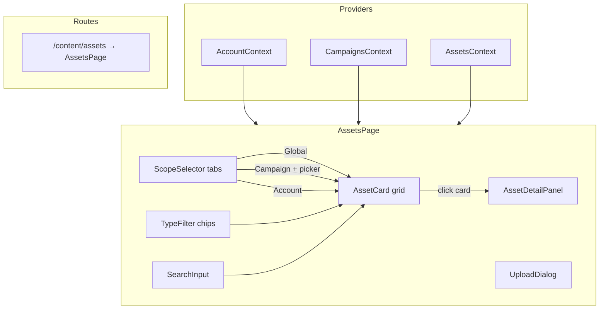

# Design Document: Asset Management

## Overview

Add an asset management system to the UbiQuity 2.0 prototype under Content > Assets. The system allows browsing, uploading (simulated), and organising digital assets across three scope levels: Global (workspace-wide), Campaign (tied to a specific campaign), and Account (tied to a specific account). A new `AssetsContext` manages asset state with localStorage persistence, following the same patterns as `CampaignsContext`. The existing account hierarchy and campaign data are reused for scope assignment. The asset library page lives at `/content/assets` with a tabbed scope selector, type filters, search, and a detail panel.

### Key Design Decisions

1. **Separate AssetsContext** — Asset state lives in its own context rather than extending existing contexts. This keeps asset concerns (CRUD, scope filtering) decoupled from campaign and account management. The context references `accountId` and `campaignId` as foreign keys but doesn't cross-reference other context state objects.

2. **Extended Asset model** — The existing `Asset` interface in `src/models/asset.ts` is extended to include `scope` (global/campaign/account), `campaignId`, and type-specific metadata (e.g. `colourValue` for colour assets). The `type` union is expanded to include `colour`, `font`, and `footer` alongside `image`.

3. **Scope as a tab, not a hierarchy** — The three scope levels are presented as tabs (Global | Campaign | Account) rather than a nested tree. This keeps the UI simple and avoids the complexity of inheritance visualisation. Campaign tab includes a campaign picker dropdown.

4. **Detail panel, not a detail page** — Clicking an asset opens a side panel overlay rather than navigating to a new route. This preserves context (the user stays on the assets page) and matches the "context preservation" design principle.

5. **Reuse TagFilter pattern** — The type filter chips reuse the same visual pattern as the `TagFilter` component from the campaign folder view, adapted for asset types.

## Architecture



### Component Tree

```
App
├── AssetsContext.Provider              (new)
│   └── AssetsPage                     (new)
│       ├── PageShell
│       ├── ScopeSelector              (new)
│       ├── CampaignPicker             (new, shown when Campaign tab active)
│       ├── TypeFilter                 (new, reuses TagFilter pattern)
│       ├── SearchInput                (new)
│       ├── AssetCard[]                (new)
│       ├── UploadDialog               (new)
│       ├── AssetDetailPanel           (new)
│       └── DeleteConfirmDialog        (reused pattern)
```

## Components and Interfaces

### ScopeSelector

Location: `src/components/assets/ScopeSelector.tsx`

```typescript
type AssetScope = 'global' | 'campaign' | 'account';

interface ScopeSelectorProps {
  activeScope: AssetScope;
  onScopeChange: (scope: AssetScope) => void;
}
```

Renders a segmented control with three tabs: Global, Campaign, Account. Uses teal text for the active tab and grey-100 background for inactive tabs, matching the UbiQuity design system segmented button pattern.

### CampaignPicker

Location: `src/components/assets/CampaignPicker.tsx`

```typescript
interface CampaignPickerProps {
  selectedCampaignId: string | null;
  onCampaignChange: (campaignId: string) => void;
}
```

A dropdown select populated from `CampaignsContext.campaigns`. Shown only when the Campaign scope tab is active. Defaults to the first campaign in the list if none is selected.

### AssetCard

Location: `src/components/assets/AssetCard.tsx`

```typescript
interface AssetCardProps {
  asset: Asset;
  onClick: (id: string) => void;
}
```

Displays a card with:
- Type-specific preview area: placeholder image thumbnail (image), colour swatch div (colour), sample text "Aa" in the font name (font), Phosphor `FileText` icon (footer)
- Asset name
- Type badge (chip-style label)
- Scope indicator label (Global / Campaign name / Account name)
- Creation date in relative or short format

Clicking the card body calls `onClick` with the asset ID.

### TypeFilter

Location: `src/components/assets/TypeFilter.tsx`

```typescript
interface TypeFilterProps {
  types: string[];
  selectedTypes: string[];
  onToggle: (type: string) => void;
}
```

Renders a horizontal row of chip buttons for asset types. Same visual pattern as the campaign `TagFilter` — multi-select toggle, OR logic, empty selection shows all.

### SearchInput

Location: `src/components/assets/SearchInput.tsx`

```typescript
interface SearchInputProps {
  value: string;
  onChange: (value: string) => void;
  placeholder?: string;
}
```

A text input with a Phosphor `MagnifyingGlass` icon prefix. Debounced input for filtering. Renders above the asset grid alongside the type filter.

### UploadDialog

Location: `src/components/assets/UploadDialog.tsx`

```typescript
interface UploadDialogProps {
  open: boolean;
  onClose: () => void;
  onUpload: (asset: Omit<Asset, 'id' | 'createdAt'>) => void;
  campaigns: Campaign[];
  currentAccountId: string;
}
```

Modal overlay with:
- Asset name input (required, validated non-empty on submit)
- Asset type dropdown (image, colour, font, footer)
- Scope radio group: Global, Campaign, Account
- Campaign picker dropdown (shown when scope is "campaign")
- Hex colour input (shown when type is "colour")
- Cancel / Upload buttons
- Backdrop click closes

### AssetDetailPanel

Location: `src/components/assets/AssetDetailPanel.tsx`

```typescript
interface AssetDetailPanelProps {
  asset: Asset | null;
  onClose: () => void;
  onDelete: (id: string) => void;
  scopeLabel: string;
}
```

A slide-in side panel (right-aligned overlay) displaying:
- Larger preview area (same type-specific rendering as AssetCard, but bigger)
- Asset name as heading
- Type, scope, creation date metadata
- Delete button (triggers confirmation dialog)
- Close button (X icon in top-right)

### AssetsPage

Location: `src/pages/AssetsPage.tsx`

```typescript
// No external props — uses contexts
```

Page layout:
- `PageShell` with "Assets" title and "Upload Asset" button in action slot
- `ScopeSelector` tabs
- `CampaignPicker` (conditionally rendered when Campaign tab active)
- Row containing `SearchInput` and `TypeFilter`
- Responsive CSS Grid of `AssetCard` components
- `UploadDialog` modal
- `AssetDetailPanel` overlay
- Empty state when no assets match filters

State management within the page:
- `activeScope: AssetScope` — which tab is selected
- `selectedCampaignId: string | null` — for campaign scope filtering
- `selectedTypes: string[]` — active type filter chips
- `searchQuery: string` — search input value
- `selectedAssetId: string | null` — which asset detail panel is open
- `uploadDialogOpen: boolean`

Filtering pipeline: `allAssets → scopeFilter → typeFilter → searchFilter → rendered grid`

## Data Models

### Extended Asset Interface

Location: `src/models/asset.ts` (updated)

```typescript
export type AssetType = 'image' | 'colour' | 'font' | 'footer';
export type AssetScope = 'global' | 'campaign' | 'account';

export interface Asset {
  id: string;
  name: string;
  type: AssetType;
  scope: AssetScope;
  accountId: string;          // always set — the owning account (or master for global)
  campaignId: string | null;  // set only when scope is 'campaign'
  tags: string[];
  createdAt: string;          // ISO date string
  colourValue?: string;       // hex colour value, only for type 'colour'
}
```

### AssetsContext

Location: `src/contexts/AssetsContext.tsx`

```typescript
interface AssetsContextValue {
  assets: Asset[];
  addAsset: (asset: Asset) => void;
  deleteAsset: (id: string) => void;
  getAssetsByScope: (scope: AssetScope, scopeId?: string) => Asset[];
}
```

- Initialises from `src/data/assets.ts` seed data
- Persists to `localStorage` under key `ubiquity-assets`
- Falls back to seed data on parse failure (same pattern as CampaignsContext)
- `getAssetsByScope('global')` returns all global assets
- `getAssetsByScope('campaign', campaignId)` returns assets for that campaign
- `getAssetsByScope('account', accountId)` returns assets for that account (or all account assets when master account)

### Seed Data

Location: `src/data/assets.ts`

Sample assets across all three scopes and all four types:

```typescript
export const seedAssets: Asset[] = [
  // Global assets
  { id: 'asset-g1', name: 'Brand Logo', type: 'image', scope: 'global', accountId: 'acc-master', campaignId: null, tags: ['branding'], createdAt: '2024-11-01T00:00:00Z' },
  { id: 'asset-g2', name: 'Primary Teal', type: 'colour', scope: 'global', accountId: 'acc-master', campaignId: null, tags: ['branding'], createdAt: '2024-11-01T00:00:00Z', colourValue: '#14B88A' },
  { id: 'asset-g3', name: 'Inter', type: 'font', scope: 'global', accountId: 'acc-master', campaignId: null, tags: ['typography'], createdAt: '2024-11-01T00:00:00Z' },
  { id: 'asset-g4', name: 'Standard Footer', type: 'footer', scope: 'global', accountId: 'acc-master', campaignId: null, tags: ['email'], createdAt: '2024-11-01T00:00:00Z' },
  // Campaign assets (tied to first seed campaign)
  { id: 'asset-c1', name: 'Summer Banner', type: 'image', scope: 'campaign', accountId: 'acc-master', campaignId: 'camp-1', tags: ['seasonal'], createdAt: '2024-12-01T00:00:00Z' },
  { id: 'asset-c2', name: 'Campaign Accent', type: 'colour', scope: 'campaign', accountId: 'acc-master', campaignId: 'camp-1', tags: ['seasonal'], createdAt: '2024-12-01T00:00:00Z', colourValue: '#F59E0B' },
  // Account assets
  { id: 'asset-a1', name: 'Auckland Hero Image', type: 'image', scope: 'account', accountId: 'acc-auckland', campaignId: null, tags: ['regional'], createdAt: '2024-12-15T00:00:00Z' },
  { id: 'asset-a2', name: 'Wellington Footer', type: 'footer', scope: 'account', accountId: 'acc-wellington', campaignId: null, tags: ['regional'], createdAt: '2024-12-15T00:00:00Z' },
  { id: 'asset-a3', name: 'Christchurch Brand Font', type: 'font', scope: 'account', accountId: 'acc-christchurch', campaignId: null, tags: ['regional'], createdAt: '2024-12-15T00:00:00Z' },
];
```

### Routing Changes

Add to `App.tsx`:

```typescript
<Route path="/content/assets" element={<AssetsPage />} />
```

### Navigation Changes

Add to `AppNavBar.tsx` NAV_ITEMS, under the Content section:

```typescript
{ label: 'Assets', path: '/content/assets' },
```

## Correctness Properties

### Property 1: Scope filter returns only matching assets

*For any* set of assets and any selected scope (global, campaign, account), the displayed assets should be exactly those whose `scope` field matches the selected scope tab. When scope is "campaign", only assets with the matching `campaignId` are shown. When scope is "account", only assets with the matching `accountId` are shown.

**Validates: Requirements 2.1, 2.2, 2.3**

### Property 2: Asset grid renders one card per filtered asset

*For any* list of assets after scope, type, and search filtering, the Assets_Page should render exactly as many AssetCard components as there are assets in the filtered list.

**Validates: Requirements 2.4, 3.1**

### Property 3: Type filter shows matching assets with OR logic

*For any* set of assets and any set of selected type chips, the visible assets should be exactly those whose type is in the selected set. When no chips are selected, all assets for the current scope should be visible.

**Validates: Requirements 4.2, 4.3, 4.4**

### Property 4: Creating an asset with valid inputs adds it to state

*For any* non-empty, non-whitespace asset name and valid type/scope combination, submitting the UploadDialog should add a new asset to the asset list with the correct metadata.

**Validates: Requirements 5.6**

### Property 5: Empty or whitespace asset names are rejected

*For any* string composed entirely of whitespace (including the empty string), the UploadDialog should prevent submission.

**Validates: Requirements 5.7**

### Property 6: Deleting an asset removes it from state

*For any* asset in the list, confirming deletion should reduce the asset count by one and the deleted asset should no longer appear in the list.

**Validates: Requirements 7.2**

### Property 7: Cancelling deletion preserves state

*For any* asset, cancelling the delete confirmation should leave the asset list unchanged.

**Validates: Requirements 7.3**

### Property 8: localStorage round-trip preserves asset data

*For any* set of valid assets, serialising to localStorage and deserialising should produce an equivalent set of assets.

**Validates: Requirements 8.1, 8.2, 8.4**

### Property 9: Search filter matches case-insensitive substring

*For any* search string and any set of assets, the filtered results should contain exactly those assets whose name includes the search text as a case-insensitive substring.

**Validates: Requirements 10.2, 10.3**

### Property 10: Combined filters produce intersection of results

*For any* combination of scope, type filter, and search text, the displayed assets should be exactly those that satisfy all three filter criteria simultaneously.

**Validates: Requirements 10.4, 4.2, 2.1**

### Property 11: Account scope with master account shows all account assets

*For any* set of account-scoped assets, when the master account is selected, all account-scoped assets should be visible regardless of their `accountId`.

**Validates: Requirements 9.3**

## Error Handling

| Scenario | Handling |
|---|---|
| Empty asset name on submit | UploadDialog disables submit button and shows inline validation message |
| localStorage parse failure | AssetsContext falls back to seed data (same pattern as CampaignsContext) |
| No assets match filters | Assets grid shows empty state message with prompt to upload |
| Invalid campaign selected in picker | CampaignPicker defaults to first available campaign |
| Asset detail panel for deleted asset | Panel closes automatically when asset is removed from state |

## Testing Strategy

### Unit Tests (Vitest + React Testing Library)

- **AssetCard**: renders name, type badge, scope label, creation date; correct preview per type; click calls onClick
- **ScopeSelector**: renders three tabs; clicking tab calls onScopeChange; active tab has correct styling
- **TypeFilter**: renders chips for provided types; toggling chips calls onToggle; visual active state
- **SearchInput**: renders input with placeholder; typing calls onChange; clearing resets
- **UploadDialog**: validates non-empty name; calls onUpload with correct metadata; shows campaign picker for campaign scope; shows colour input for colour type; closes on cancel/backdrop
- **AssetDetailPanel**: displays full metadata; delete button triggers confirmation; close button works
- **AssetsContext**: addAsset, deleteAsset, getAssetsByScope, localStorage persistence, fallback to seed data

### Property-Based Tests (fast-check)

Each correctness property above maps to a property-based test with minimum 100 iterations. Tests use `fast-check` to generate random assets, scopes, types, names, and filter combinations.

Key generators:
- `arbAsset()`: generates an Asset with random name, type, scope, accountId, campaignId
- `arbAssetType()`: picks from the 4 AssetType values
- `arbAssetScope()`: picks from the 3 AssetScope values
- `arbAccountId()`: picks from known account IDs including master
- `arbSearchQuery()`: generates random search strings

### File Organisation

```
src/
├── components/
│   └── assets/
│       ├── AssetCard.tsx
│       ├── AssetCard.module.css
│       ├── AssetDetailPanel.tsx
│       ├── AssetDetailPanel.module.css
│       ├── CampaignPicker.tsx
│       ├── CampaignPicker.module.css
│       ├── ScopeSelector.tsx
│       ├── ScopeSelector.module.css
│       ├── SearchInput.tsx
│       ├── SearchInput.module.css
│       ├── TypeFilter.tsx
│       ├── TypeFilter.module.css
│       ├── UploadDialog.tsx
│       ├── UploadDialog.module.css
│       └── __tests__/
│           ├── AssetCard.test.tsx
│           ├── ScopeSelector.test.tsx
│           ├── TypeFilter.property.test.ts
│           ├── UploadDialog.test.tsx
│           └── AssetDetailPanel.test.tsx
├── contexts/
│   ├── AssetsContext.tsx
│   └── __tests__/
│       └── AssetsContext.property.test.ts
├── data/
│   └── assets.ts
├── models/
│   └── asset.ts                       (updated)
├── pages/
│   ├── AssetsPage.tsx                 (new)
│   └── AssetsPage.module.css          (new)
```
