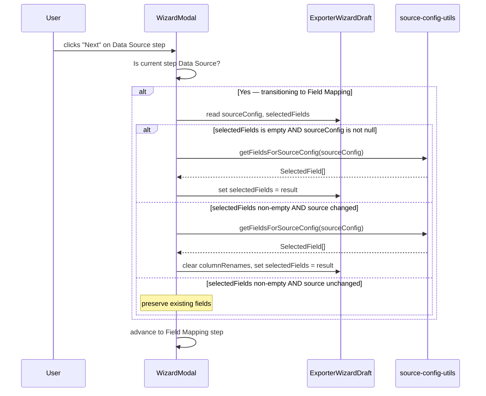

# Design Document: Auto-Populate Field Mapping

## Overview

This feature adds automatic field population to the exporter wizard's Field Mapping step. When a user transitions from the Data Source step to the Field Mapping step, the system pre-fills `selectedFields` with all fields available from their configured `SourceConfig`. This eliminates the manual work of selecting every field individually — users start with everything included and can remove what they don't need.

The implementation is localised to the step transition logic in `WizardModal.tsx`. The `FieldMappingStep` component already handles rendering selected/unselected fields, reordering, and renaming — no changes are needed there. The core change is intercepting the "Next" action when moving from step 1 (Data Source) to step 2 (Field Mapping) and conditionally populating the draft's `selectedFields`.

## Architecture

The auto-population logic lives in the wizard's step transition handler (`handleNext` in `WizardModal.tsx`). This is the natural place because:

1. The wizard already owns the `ExporterWizardDraft` state
2. The wizard already contains `didSourceOrSubSourceChange()` for detecting source changes
3. The `FieldMappingStep` is a controlled component that reads from the draft — it doesn't need to know how fields were populated



### Design Decision: Transition logic vs. useEffect

**Chosen approach:** Populate fields in the `handleNext` handler when transitioning from step 1 → step 2.

**Alternative considered:** A `useEffect` in `FieldMappingStep` that auto-populates when the component mounts with empty fields.

**Rationale:** The `handleNext` approach is simpler — it's a single point of control, avoids render-cycle complexity, and keeps `FieldMappingStep` as a pure controlled component. It also naturally handles the "source changed" re-population case since the transition handler already has access to both the previous and current source config.

## Components and Interfaces

### Modified: `WizardModal.tsx`

Add a `previousSourceConfig` ref to track the source config that was active when fields were last populated. This enables detecting whether the source changed when the user navigates back and forward.

```typescript
// New ref to track last-populated source config
const previousSourceConfigRef = useRef<SourceConfig | null>(null);
```

Add a helper function for the population logic:

```typescript
function populateFieldsForTransition(
  draft: ExporterWizardDraft,
  previousSourceConfig: SourceConfig | null,
): Partial<ExporterWizardDraft> | null {
  const { sourceConfig, selectedFields } = draft;

  // No source config — leave fields unchanged
  if (!sourceConfig) return null;

  // Fields empty — first visit, populate all
  if (selectedFields.length === 0) {
    const fields = getFieldsForSourceConfig(sourceConfig);
    return { selectedFields: fields.map(f => ({
      key: f.key,
      label: f.label,
      source: f.source as SelectedField['source'],
    }))};
  }

  // Source changed — clear and re-populate
  if (didSourceOrSubSourceChange(previousSourceConfig, sourceConfig)) {
    const fields = getFieldsForSourceConfig(sourceConfig);
    return {
      selectedFields: fields.map(f => ({
        key: f.key,
        label: f.label,
        source: f.source as SelectedField['source'],
      })),
      columnRenames: [],
    };
  }

  // Source unchanged, fields non-empty — preserve
  return null;
}
```

Modify `handleNext` to call this function when transitioning from step 1 (Data Source) to step 2 (Field Mapping):

```typescript
const handleNext = () => {
  // ... existing code ...

  // Auto-populate fields when transitioning Data Source → Field Mapping
  if (steps[currentStep]?.label === 'Data Source') {
    const patch = populateFieldsForTransition(draft, previousSourceConfigRef.current);
    if (patch) {
      setDraft(prev => ({ ...prev, ...patch }));
    }
    previousSourceConfigRef.current = draft.sourceConfig;
  }

  // ... advance step ...
};
```

### Unchanged: `FieldMappingStep.tsx`

No modifications needed. The component already:
- Reads `draft.selectedFields` for the selected list
- Computes `availableContactFields` from `draft.sourceConfig` via `getFieldsForSourceConfig()`
- Shows unselected fields as toggleable checkboxes
- Supports reordering and renaming of selected fields

### Unchanged: `source-config-utils.ts`

The existing `getFieldsForSourceConfig()` function already returns the correct field set for any `SourceConfig`. No modifications needed.

### Unchanged: `didSourceOrSubSourceChange()`

Already exists in `WizardModal.tsx` and correctly detects primary source or sub-source changes.

## Data Models

No new data models are introduced. The feature uses existing types:

| Type | Location | Role |
|------|----------|------|
| `ExporterWizardDraft` | `src/models/wizard.ts` | Wizard state — `selectedFields` and `columnRenames` are the target fields |
| `SelectedField` | `src/models/automation.ts` | `{ key, label, source }` — individual field entry |
| `SourceConfig` | `src/models/source-selection.ts` | Discriminated union describing the configured data source |
| `SourceFieldDefinition` | `src/utils/source-config-utils.ts` | Internal type returned by `getFieldsForSourceConfig()` |
| `ColumnRename` | `src/models/wizard.ts` | `{ fieldKey, outputName }` — custom column header |

### State Flow

```
sourceConfig (set in Data Source step)
    ↓
getFieldsForSourceConfig(sourceConfig) → SourceFieldDefinition[]
    ↓
map to SelectedField[] → draft.selectedFields (set on transition)
    ↓
FieldMappingStep renders selected/unselected fields
```

## Correctness Properties

*A property is a characteristic or behavior that should hold true across all valid executions of a system — essentially, a formal statement about what the system should do. Properties serve as the bridge between human-readable specifications and machine-verifiable correctness guarantees.*

### Property 1: Auto-population produces the complete field set

*For any* valid `SourceConfig` and an empty `selectedFields` array, invoking the transition logic SHALL produce a `selectedFields` array that is identical (same keys, same order) to the output of `getFieldsForSourceConfig(sourceConfig)`.

**Validates: Requirements 1.1, 1.3**

### Property 2: Non-empty fields are preserved when source is unchanged

*For any* non-empty `selectedFields` array and any pair of `SourceConfig` values where `didSourceOrSubSourceChange` returns `false`, invoking the transition logic SHALL leave `selectedFields` and `columnRenames` unchanged.

**Validates: Requirements 1.2, 2.2, 3.2, 5.1, 5.2**

### Property 3: Source change triggers full re-population and clears renames

*For any* pair of `SourceConfig` values where `didSourceOrSubSourceChange` returns `true`, invoking the transition logic SHALL produce `selectedFields` equal to `getFieldsForSourceConfig(newConfig)` AND SHALL produce an empty `columnRenames` array.

**Validates: Requirements 2.1, 2.3, 5.3**

### Property 4: Available fields partition invariant

*For any* `SourceConfig`, the union of selected fields and unselected fields displayed by the `FieldMappingStep` SHALL equal the full set returned by `getFieldsForSourceConfig(sourceConfig)`, with no duplicates and no omissions.

**Validates: Requirements 3.1, 3.3, 4.4**

### Property 5: Enrichment fields are included with correct prefix

*For any* `SourceConfig` that includes an `enrichment` entity, the output of `getFieldsForSourceConfig(sourceConfig)` SHALL contain all primary source fields PLUS all enrichment entity fields with keys prefixed by `enrichment_{entity}_` and labels prefixed by the capitalised singular entity name.

**Validates: Requirements 4.4**

## Error Handling

| Scenario | Behaviour |
|----------|-----------|
| `sourceConfig` is `null` at transition time | No population occurs; `selectedFields` remains empty. User sees "Select at least one field" validation message on the Field Mapping step. |
| `getFieldsForSourceConfig()` returns an empty array | `selectedFields` is set to `[]`. The "Next" button on Field Mapping is disabled (existing validation). |
| Source type changes but new config is incomplete | The existing `didSourceOrSubSourceChange()` returns `true` for null-to-config transitions. Fields are populated from whatever the new config resolves to. |
| User navigates directly to Field Mapping via stepper click (skipping Data Source) | Only possible if the step is already marked completed. In that case, `selectedFields` was already populated on the original forward navigation. No re-population occurs on stepper click. |

## Testing Strategy

### Property-Based Tests (Vitest + fast-check)

Each correctness property maps to a single property-based test with minimum 100 iterations. The `populateFieldsForTransition` function is extracted as a pure function, making it directly testable without rendering components.

**Generators needed:**
- `arbSourceConfig()` — generates random valid `SourceConfig` (contacts, transactions, messages) with optional enrichment
- `arbSelectedFields(config)` — generates random subsets of fields from a given config
- `arbColumnRenames(fields)` — generates random renames for a subset of fields

**Test file:** `src/utils/__tests__/auto-populate-fields.test.ts`

**Tag format:** `Feature: auto-populate-field-mapping, Property {n}: {title}`

**Configuration:** Each property test runs 100+ iterations via `fc.assert(fc.property(...), { numRuns: 100 })`.

### Unit Tests (Example-Based)

- Contacts source config → produces 7 contact fields
- Transactions source config → produces 6 transaction fields
- Messages source config → produces 6 message fields
- Contacts + transactions enrichment → produces 7 + 6 prefixed fields
- Null source config → no-op
- Source config unchanged (filter-only edit) → fields preserved

### Integration Tests

- Render `WizardModal`, configure a source, click Next, verify Field Mapping shows pre-populated fields
- Navigate back, change source type, navigate forward, verify fields cleared and re-populated
- Navigate back, change only filter, navigate forward, verify fields preserved
