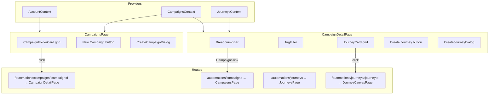
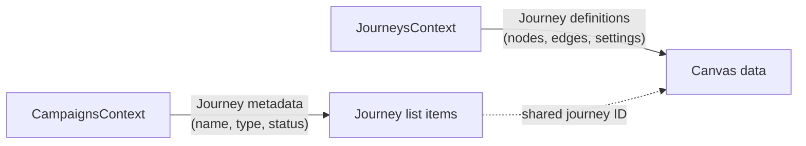

# Design Document: Campaign Folder View

## Overview

Redesign the Campaigns and Journeys pages from flat `DataTable` listings into a folder-based card navigation UI. Campaigns become clickable folder cards in a responsive grid. Clicking a campaign navigates to a detail view showing its journeys as cards. A new `CampaignsContext` manages campaign + journey list state (CRUD), while the existing `JourneysContext` continues to own journey *definitions* (nodes, edges, settings) for the canvas. Routing adds a `/automations/campaigns/:campaignId` detail route. All data is local-state only — no backend.

### Key Design Decisions

1. **Separate CampaignsContext** — Campaign list state (names, statuses, journey associations) lives in a new `CampaignsContext` rather than extending `JourneysContext`. This keeps journey-canvas concerns (nodes/edges) decoupled from folder-view concerns (campaign CRUD, journey metadata). The two contexts share IDs but don't cross-reference each other's state objects.

2. **Reuse existing OverflowMenu** — The dashboard `OverflowMenu` component is already generic (accepts `items` array). We reuse it directly on campaign and journey cards rather than creating a new component.

3. **Journey metadata lives in CampaignsContext** — The `Journey` type from `campaign.ts` (name, type, status, entryCount) is managed by `CampaignsContext`. The `JourneyDefinition` type (nodes, edges, settings) is managed by `JourneysContext`. When creating a new journey, both contexts are updated.

4. **Tag filter uses journey `type` field** — No new tag model needed. The distinct `type` values from journeys in the current campaign become the filter chips.

## Architecture



### Component Tree

```
App
├── CampaignsContext.Provider          (new)
│   ├── CampaignsPage                 (redesigned)
│   │   ├── PageShell
│   │   ├── CampaignFolderCard[]      (new)
│   │   │   └── OverflowMenu          (reused)
│   │   ├── CreateCampaignDialog      (new)
│   │   └── DeleteConfirmDialog       (new, generic)
│   │
│   ├── CampaignDetailPage            (new)
│   │   ├── PageShell
│   │   ├── BreadcrumbBar             (new)
│   │   ├── TagFilter                 (new)
│   │   ├── JourneyCard[]             (new)
│   │   │   └── OverflowMenu          (reused)
│   │   ├── CreateJourneyDialog       (new)
│   │   └── DeleteConfirmDialog       (reused)
│   │
│   └── JourneysPage                  (redesigned)
│       ├── PageShell
│       ├── TagFilter                 (reused)
│       └── JourneyCard[]             (reused)
```

## Components and Interfaces

### CampaignFolderCard

Location: `src/components/campaign/CampaignFolderCard.tsx`

```typescript
interface CampaignFolderCardProps {
  campaign: Campaign;
  journeyCount: number;
  onRename: (id: string, newName: string) => void;
  onDelete: (id: string) => void;
  onClick: (id: string) => void;
}
```

Displays a card with:
- Phosphor `Folder` icon (weight: duotone, teal fill)
- Campaign name (editable inline when renaming)
- Journey count label (e.g. "3 journeys")
- Status badge (draft/active/paused/completed)
- OverflowMenu with Rename and Delete actions

Clicking the card body navigates to `/automations/campaigns/:id`. The overflow menu trigger stops propagation to prevent navigation.

### JourneyCard

Location: `src/components/campaign/JourneyCard.tsx`

```typescript
interface JourneyCardProps {
  journey: Journey;
  campaignName?: string;        // shown on JourneysPage as subtitle
  onRename: (id: string, newName: string) => void;
  onDelete: (id: string) => void;
  onClick: (id: string) => void;
}
```

Displays a card with:
- Type-specific Phosphor icon: `HandWaving` (welcome), `ArrowsClockwise` (re-engagement), `Receipt` (transactional), `Megaphone` (promotional)
- Journey name (editable inline when renaming)
- Type label
- Status badge
- Entry count
- Optional campaign name subtitle (for JourneysPage cross-campaign view)
- OverflowMenu with Rename and Delete actions

### TagFilter

Location: `src/components/campaign/TagFilter.tsx`

```typescript
interface TagFilterProps {
  tags: string[];                // distinct type values
  selectedTags: string[];
  onToggle: (tag: string) => void;
}
```

Renders a horizontal row of chip buttons. Each chip toggles on/off. Multiple chips can be active simultaneously (OR logic). When no chips are selected, all items are shown.

### BreadcrumbBar

Location: `src/components/campaign/BreadcrumbBar.tsx`

```typescript
interface BreadcrumbBarProps {
  items: { label: string; to?: string }[];
}
```

Renders a simple breadcrumb trail with `>` separators. Items with a `to` prop are clickable links (React Router `<Link>`). The last item is plain text (current page).

### CreateCampaignDialog

Location: `src/components/campaign/CreateCampaignDialog.tsx`

```typescript
interface CreateCampaignDialogProps {
  open: boolean;
  onClose: () => void;
  onCreate: (name: string, goal: string) => void;
}
```

Modal overlay with:
- Campaign name input (required, validated non-empty on submit)
- Goal textarea (optional)
- Cancel / Create buttons
- Backdrop click closes

### CreateJourneyDialog

Location: `src/components/campaign/CreateJourneyDialog.tsx`

```typescript
interface CreateJourneyDialogProps {
  open: boolean;
  campaignId: string;
  onClose: () => void;
  onCreate: (name: string, type: JourneyType) => void;
}
```

Modal overlay with:
- Journey name input (required)
- Journey type dropdown (welcome, re-engagement, transactional, promotional)
- No campaign selector — pre-associated with current campaign
- Cancel / Create buttons

### DeleteConfirmDialog

Location: `src/components/campaign/DeleteConfirmDialog.tsx`

```typescript
interface DeleteConfirmDialogProps {
  itemName: string;
  itemType: 'campaign' | 'journey';
  onConfirm: () => void;
  onCancel: () => void;
}
```

Generic confirmation dialog reusable for both campaign and journey deletion. Similar pattern to existing `DeleteConfirmModal` but with configurable item type label.

### CampaignsPage (redesigned)

Location: `src/pages/CampaignsPage.tsx`

Replaces the current `DataTable`-based layout with:
- `PageShell` with "New Campaign" button in the action slot
- Responsive CSS Grid of `CampaignFolderCard` components
- Empty state when no campaigns match the account filter
- `CreateCampaignDialog` modal
- `DeleteConfirmDialog` for campaign deletion

### CampaignDetailPage (new)

Location: `src/pages/CampaignDetailPage.tsx`

- `PageShell` with campaign name as title, "Create Journey" button in action slot
- `BreadcrumbBar` showing "Campaigns > {campaign name}"
- `TagFilter` row derived from distinct journey types in the campaign
- Responsive CSS Grid of `JourneyCard` components, filtered by selected tags
- Empty state when campaign has no journeys
- `CreateJourneyDialog` and `DeleteConfirmDialog` modals

### JourneysPage (redesigned)

Location: `src/pages/JourneysPage.tsx`

Replaces the current `DataTable`-based layout with:
- `PageShell` with title "All Journeys"
- `TagFilter` for filtering by journey type
- Responsive CSS Grid of `JourneyCard` components (with `campaignName` subtitle)
- Each card click navigates to `/automations/journeys/:journeyId`

## Data Models

### Existing Models (no changes needed)

The `Campaign` and `Journey` interfaces in `src/models/campaign.ts` already contain all fields needed:

```typescript
// src/models/campaign.ts — unchanged
export interface Campaign {
  id: string;
  name: string;
  accountId: string;
  goal: string;
  dateRange: { start: string; end: string };
  status: CampaignStatus;
  journeyIds: string[];
  tags: string[];
}

export interface Journey {
  id: string;
  name: string;
  campaignId: string;
  accountId: string;
  status: CampaignStatus;
  nodeCount: number;
  entryCount: number;
  type: JourneyType;
}
```

### CampaignsContext (new)

Location: `src/contexts/CampaignsContext.tsx`

```typescript
interface CampaignsContextValue {
  campaigns: Campaign[];
  campaignJourneys: Journey[];
  addCampaign: (campaign: Campaign) => void;
  updateCampaign: (id: string, updates: Partial<Campaign>) => void;
  deleteCampaign: (id: string) => void;
  addJourney: (journey: Journey) => void;
  updateJourney: (id: string, updates: Partial<Journey>) => void;
  deleteJourney: (id: string) => void;
  getJourneysForCampaign: (campaignId: string) => Journey[];
}
```

- Initialises from `src/data/campaigns.ts` seed data (both `campaigns` and `journeys` arrays)
- Persists to `localStorage` under key `ubiquity-campaigns`
- `campaignJourneys` is the flat list of all `Journey` metadata objects
- `getJourneysForCampaign` filters `campaignJourneys` by `campaignId`
- When a campaign is deleted, its associated journeys are also removed from state
- When a journey is added, the parent campaign's `journeyIds` array is updated

### Relationship with JourneysContext



- **CampaignsContext** owns the journey *list* data (what appears on cards)
- **JourneysContext** owns the journey *definition* data (what appears on the canvas)
- When creating a new journey, both contexts are updated: `CampaignsContext.addJourney()` for the metadata, and `JourneysContext.addJourney()` for the canvas definition
- When deleting a journey, both contexts are updated similarly
- The two contexts are linked by journey `id`

### Routing Changes

Add to `App.tsx`:

```typescript
<Route path="/automations/campaigns/:campaignId" element={<CampaignDetailPage />} />
```

The `CampaignsContext.Provider` wraps the existing provider tree in `App.tsx`, alongside `AccountProvider` and `JourneysProvider`.


## Correctness Properties

*A property is a characteristic or behavior that should hold true across all valid executions of a system — essentially, a formal statement about what the system should do. Properties serve as the bridge between human-readable specifications and machine-verifiable correctness guarantees.*

### Property 1: Campaign grid renders one card per campaign

*For any* list of campaigns (after account filtering), the CampaignsPage should render exactly as many CampaignFolderCard components as there are campaigns in the filtered list.

**Validates: Requirements 1.1**

### Property 2: Campaign folder card displays all required fields

*For any* campaign with associated journeys, the rendered CampaignFolderCard should contain the campaign name, the correct journey count, and the campaign status text.

**Validates: Requirements 1.2**

### Property 3: Campaign card click navigates to detail view

*For any* campaign, clicking its CampaignFolderCard should trigger navigation to `/automations/campaigns/{campaign.id}`.

**Validates: Requirements 2.1**

### Property 4: Campaign detail view renders correct heading and journey cards

*For any* campaign with N journeys (after account filtering), the CampaignDetailPage should display the campaign name as a heading and render exactly N JourneyCard components.

**Validates: Requirements 2.2**

### Property 5: Breadcrumb displays campaign name

*For any* campaign, the BreadcrumbBar on the CampaignDetailPage should contain "Campaigns" as a link and the campaign name as the current page label.

**Validates: Requirements 2.3**

### Property 6: Journey card displays all required fields

*For any* journey, the rendered JourneyCard should contain the journey name, type label, status badge text, and entry count.

**Validates: Requirements 3.1**

### Property 7: Journey card click navigates to canvas

*For any* journey (whether on CampaignDetailPage or JourneysPage), clicking its JourneyCard should trigger navigation to `/automations/journeys/{journey.id}`.

**Validates: Requirements 3.3, 9.3**

### Property 8: Tag filter shows distinct types and filters correctly

*For any* list of journeys and any set of selected type tags, the visible journeys should be exactly those whose type is in the selected set. When no tags are selected, all journeys should be visible.

**Validates: Requirements 4.1, 4.2, 4.3, 4.4**

### Property 9: Creating a campaign with a valid name adds a draft campaign

*For any* non-empty, non-whitespace campaign name, submitting the CreateCampaignDialog should add a new campaign with that name and status "draft" to the campaign list.

**Validates: Requirements 5.4**

### Property 10: Empty or whitespace campaign names are rejected

*For any* string composed entirely of whitespace (including the empty string), the CreateCampaignDialog should prevent submission.

**Validates: Requirements 5.5**

### Property 11: Journey creation is pre-associated with current campaign

*For any* campaign, creating a journey from that campaign's detail view should produce a journey whose `campaignId` matches the current campaign's ID, and should navigate to the new journey's canvas URL.

**Validates: Requirements 6.4, 6.5**

### Property 12: Rename pre-fills current name and updates state

*For any* campaign or journey, selecting Rename from the overflow menu should display an inline input pre-filled with the current name. Confirming with a new name should update the name in local state.

**Validates: Requirements 7.2, 7.3, 8.2, 8.3**

### Property 13: Account filter scopes campaigns correctly

*For any* account selection, the CampaignsPage should display only campaigns whose `accountId` matches the selected account (or all campaigns when the master account is selected).

**Validates: Requirements 10.1, 10.3**

### Property 14: Account filter scopes journeys correctly

*For any* account selection, the journey grids (on both CampaignDetailPage and JourneysPage) should display only journeys whose `accountId` matches the selected account (or all journeys when the master account is selected).

**Validates: Requirements 10.2, 10.4**

### Property 15: Journeys page shows all journeys with parent campaign name

*For any* set of campaigns with journeys, the JourneysPage should render a JourneyCard for every journey (after account filtering), and each card should display the parent campaign's name.

**Validates: Requirements 9.1, 9.2**

## Error Handling

| Scenario | Handling |
|---|---|
| Campaign not found (invalid URL param) | CampaignDetailPage shows "Campaign not found" message with link back to Campaigns |
| Empty campaign name on submit | CreateCampaignDialog disables submit button and shows inline validation message |
| Empty journey name on submit | CreateJourneyDialog disables submit button and shows inline validation message |
| localStorage parse failure | CampaignsContext falls back to seed data (same pattern as JourneysContext) |
| Delete last journey in campaign | Campaign detail view transitions to empty state |
| Account context changes while on detail view | Journey grid re-filters; if campaign itself is filtered out, redirect to campaigns list |

## Testing Strategy

### Unit Tests (Vitest + React Testing Library)

- **CampaignFolderCard**: renders name, journey count, status; click triggers navigation; overflow menu opens with Rename/Delete
- **JourneyCard**: renders name, type, status, entry count; correct icon per type; click triggers navigation; optional campaign name subtitle
- **TagFilter**: renders chips for provided tags; toggling chips calls onToggle; visual active state
- **BreadcrumbBar**: renders items with separators; clickable links navigate correctly
- **CreateCampaignDialog**: validates non-empty name; calls onCreate with name and goal; closes on cancel/backdrop
- **CreateJourneyDialog**: validates non-empty name; calls onCreate with name and type; no campaign selector shown
- **DeleteConfirmDialog**: shows item name and type; calls onConfirm/onCancel
- **CampaignsContext**: addCampaign, updateCampaign, deleteCampaign, addJourney, deleteJourney, getJourneysForCampaign

### Property-Based Tests (fast-check)

Each correctness property above maps to a property-based test with minimum 100 iterations. Tests use `fast-check` to generate random campaigns, journeys, names, and account selections.

Tag format: `Feature: campaign-folder-view, Property {N}: {title}`

Key generators:
- `arbCampaign()`: generates a Campaign with random name, status, accountId, journeyIds
- `arbJourney(campaignId)`: generates a Journey with random name, type, status, entryCount
- `arbJourneyType()`: picks from the 4 JourneyType values
- `arbAccountId()`: picks from known account IDs including master

### Integration Tests

- Full navigation flow: Campaigns grid → click card → detail view → click journey → canvas
- Create campaign → appears in grid → open → create journey → navigates to canvas
- Delete journey → card removed → delete last journey → empty state
- Account switcher → campaign grid updates → detail view journey grid updates

### File Organisation

```
src/
├── components/
│   └── campaign/
│       ├── BreadcrumbBar.tsx
│       ├── BreadcrumbBar.module.css
│       ├── CampaignFolderCard.tsx
│       ├── CampaignFolderCard.module.css
│       ├── CreateCampaignDialog.tsx
│       ├── CreateCampaignDialog.module.css
│       ├── CreateJourneyDialog.tsx
│       ├── CreateJourneyDialog.module.css
│       ├── DeleteConfirmDialog.tsx
│       ├── DeleteConfirmDialog.module.css
│       ├── JourneyCard.tsx
│       ├── JourneyCard.module.css
│       ├── TagFilter.tsx
│       └── TagFilter.module.css
├── contexts/
│   └── CampaignsContext.tsx
├── pages/
│   ├── CampaignsPage.tsx              (redesigned)
│   ├── CampaignsPage.module.css       (redesigned)
│   ├── CampaignDetailPage.tsx         (new)
│   ├── CampaignDetailPage.module.css  (new)
│   ├── JourneysPage.tsx               (redesigned)
│   └── JourneysPage.module.css        (redesigned)
```
