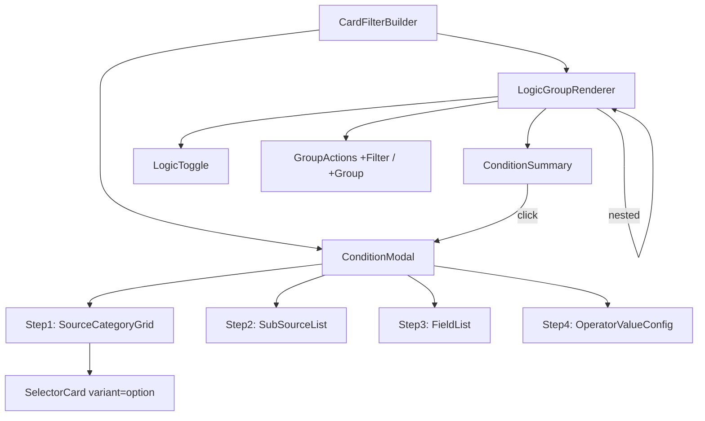

# Design Document: Card-Based Filter Builder

## Overview

The Card Filter Builder replaces the existing inline-dropdown `FilterBuilder` with a progressive drill-down experience. Instead of flat field dropdowns, users navigate through visual category cards in a modal to configure conditions step-by-step: source category → sub-source (optional) → field → operator/value. The main view displays configured conditions as natural language summaries within AND/OR logic groups.

The component is a drop-in replacement that shares the same `FilterGroup` type structure, extended with `sourceCategory` and `subSource` on each condition row. It lives at `src/components/composed/card-filter-builder.tsx` and uses the existing `SelectorCard` (variant="option") for source category cards and shadcn/ui `Dialog` for the condition modal.

### Design Rationale

- **Progressive disclosure** reduces cognitive load — users see only the fields relevant to their chosen source, not a flat list of 50+ options.
- **Card-based selection** leverages visual recognition (icons + titles) over textual scanning.
- **Natural language summaries** make the filter state instantly readable without decoding dropdown values.
- **Controlled component pattern** matches the existing FilterBuilder API for seamless integration.

## Architecture



### Component Hierarchy

1. **CardFilterBuilder** — top-level controlled component. Accepts `value`, `onChange`, `sourceCategories`, `allowNesting`, `maxDepth`.
2. **LogicGroupRenderer** — recursive component rendering a logic group (AND/OR toggle, condition summaries, nested groups, action buttons).
3. **ConditionSummary** — renders a single condition as a natural language string with remove and edit actions.
4. **ConditionModal** — multi-step dialog managing the progressive configuration flow with internal step state.
5. **Step components** — `SourceCategoryGrid`, `SubSourceList`, `FieldList`, `OperatorValueConfig` — each step is a sub-component within the modal.
6. **ChipInput** — sub-component within `OperatorValueConfig` for "Is in" / "Is not in" operators. Renders a text input that adds chips on Enter, supports multi-line paste (each line → chip), displays removable chips with count label and "Clear all" action.
7. **DateModeSelector** — sub-component within `OperatorValueConfig` for date fields. Displays below the operator dropdown when a date operator is selected (except "In last N days", "Is empty", "Is not empty"). Offers three modes: "Specific date", "Anniversary", "Same day as".

### State Management

The component is purely controlled — no internal filter state. Modal state (current step, in-progress selections) is held locally within `ConditionModal` using `useState`. On confirm, the modal emits the completed condition upward; on dismiss, everything is discarded.

## Components and Interfaces

### Props API

```typescript
interface CardFilterBuilderProps {
  value: FilterGroup
  onChange: (value: FilterGroup) => void
  sourceCategories: SourceCategoryConfig[]
  allowNesting?: boolean   // default: true
  maxDepth?: number        // default: 3, range 1–10
}
```

### Source Category Configuration

```typescript
interface SourceCategoryConfig {
  key: string
  icon: React.ReactNode        // Phosphor icon element
  title: string                // max 40 chars display
  description: string          // max 120 chars display
  subSources?: SubSourceConfig[]
  fields: FilterFieldDef[]     // fields when no sub-sources, or shared fields
}

interface SubSourceConfig {
  key: string
  label: string
  fields: FilterFieldDef[]
}

interface FilterFieldDef {
  key: string
  label: string
  dataType: 'text' | 'number' | 'date' | 'boolean' | 'enum'
  enumOptions?: { value: string; label: string }[]
}
```

### Extended Filter Types

The existing `FilterGroup` / `FilterCondition` types are extended (not replaced) to include source tracking:

```typescript
// Extended from existing filter-builder.tsx types
interface CardFilterRow {
  sourceCategory: string       // key from SourceCategoryConfig
  subSource: string | null     // key from SubSourceConfig, or null
  field: string                // field key
  operator: string             // operator key
  value: string | number | boolean | null | [string, string] | string[]
  // null for no-value operators, tuple for Between,
  // string[] for "is_in" / "is_not_in" operators
  dateMode: 'specific' | 'anniversary' | 'same_day' | null
  // null for non-date fields; specifies how date comparison is performed
}

// The FilterGroup structure remains unchanged:
// { logic: 'and' | 'or', conditions: FilterCondition[] }
// where FilterCondition = { type: 'row', row: CardFilterRow } | { type: 'group', group: FilterGroup }
```

### Summary Generation

```typescript
function generateConditionSummary(
  row: CardFilterRow,
  sourceCategories: SourceCategoryConfig[]
): string
```

Resolves keys to labels: `"{Source Title} {Field Label} {Operator Label} {Formatted Value}"`. Falls back to raw keys with a visual warning indicator when a key can't be resolved.

**"Is in" / "Is not in" summary format:** When the operator is `is_in` or `is_not_in`, the value portion renders as `"{N} values"` (e.g., "Contact email is in 5 values") rather than listing all values inline. On hover, a tooltip shows the first 10 values with a "+N more" indicator if the list exceeds 10.

**Date mode summary format:** When `dateMode` is `"anniversary"`, the summary includes "anniversary" before the formatted date (e.g., "DOB anniversary on 15 Mar"). When `dateMode` is `"same_day"`, the summary includes "same day as" (e.g., "DOB same day as 25 Dec"). When `dateMode` is `"specific"` or `null`, no mode qualifier is added.

### Modal Step State

```typescript
interface ModalState {
  mode: 'add' | 'edit'
  step: 1 | 2 | 3 | 4
  sourceCategory: string | null
  subSource: string | null
  field: string | null
  operator: string | null
  value: string | number | boolean | null | [string, string] | string[]
  dateMode: 'specific' | 'anniversary' | 'same_day' | null
  editIndex: number | null  // position in parent group when editing
}
```

### Component Dependencies

| Component | Source | Usage |
|---|---|---|
| `Dialog` | shadcn/ui | Condition modal overlay |
| `SelectorCard` | composed/selector-card | Source category cards (variant="option") |
| `Button` | shadcn/ui | Actions (+Filter, +Group, Confirm, Back) |
| `Select` | shadcn/ui | Operator selector, enum value selector, date mode selector |
| `Input` | shadcn/ui | Text/number value inputs, chip text entry |
| `Calendar` / `Popover` | shadcn/ui | Date picker for date fields |
| `Tooltip` | shadcn/ui | Truncated value hover, max-depth message, "Is in" value list tooltip |
| `Badge` | shadcn/ui | Chip display for "Is in"/"Is not in" values |
| Phosphor Icons | @phosphor-icons/react | All iconography |
| `ChipInput` | card-filter-builder/steps/chip-input | Bulk value entry for "Is in"/"Is not in" operators |
| `DateModeSelector` | card-filter-builder/steps/date-mode-selector | Date mode toggle (Specific/Anniversary/Same day as) |

## Data Models

### FilterGroup (unchanged from existing)

```typescript
type FilterLogic = 'and' | 'or'

interface FilterGroup {
  logic: FilterLogic
  conditions: FilterCondition[]
}

type FilterCondition =
  | { type: 'row'; row: CardFilterRow }
  | { type: 'group'; group: FilterGroup }
```

### CardFilterRow (new)

```typescript
interface CardFilterRow {
  sourceCategory: string
  subSource: string | null
  field: string
  operator: string
  value: string | number | boolean | null | [string, string] | string[]
  dateMode: 'specific' | 'anniversary' | 'same_day' | null
}
```

### Operator Definitions (reused from existing filter-builder.tsx)

The operator sets remain identical to the existing implementation grouped by data type:
- **text**: equals, not_equals, contains, starts_with, ends_with, is_in, is_not_in, is_empty, is_not_empty
- **number**: equals, not_equals, greater_than, less_than, greater_or_equal, less_or_equal, is_in, is_not_in, is_empty, is_not_empty
- **date**: equals (On), before, after, between, in_last_n_days, is_empty, is_not_empty
- **boolean**: is_true, is_false
- **enum**: equals (Is), not_equals (Is not), is_in, is_not_in, is_empty, is_not_empty

### No-Value Operators

`['is_true', 'is_false', 'is_empty', 'is_not_empty']` — these operators require no value input.

### Array-Value Operators

`['is_in', 'is_not_in']` — these operators require a `string[]` value (chip-based input). Confirm is disabled when the array is empty.

### Date Mode Applicability

The `dateMode` field is only relevant for date-type fields when the operator is NOT `in_last_n_days`, `is_empty`, or `is_not_empty`. For all other operators on date fields, the mode selector appears below the operator with three options:

| Mode | Value Input | Comparison Behaviour |
|---|---|---|
| `specific` (default) | Standard date picker | Exact date comparison |
| `anniversary` | Month/day picker (no year) | Matches recurring annual date (day + month) |
| `same_day` | Standard date picker | Compares day + month only, ignores year |

### Validation Rules

| Data Type | Operator | Value Constraint |
|---|---|---|
| text | requires value | max 500 chars, non-empty |
| text | is_in / is_not_in | non-empty string[] (at least one chip) |
| number | requires value | valid integer or decimal |
| number | is_in / is_not_in | non-empty string[] where each chip is a valid number |
| date | On/Before/After | valid ISO date string |
| date | Between | two valid dates, start ≤ end |
| date | In last N days | whole number 1–3650 |
| date | On/Before/After + anniversary mode | valid month/day (1–12, 1–31) |
| enum | Is/Is not | must be one of enumOptions |
| enum | is_in / is_not_in | non-empty string[] where each chip is a valid enumOption |
| any | no-value operator | value is null |


## Correctness Properties

*A property is a characteristic or behavior that should hold true across all valid executions of a system — essentially, a formal statement about what the system should do. Properties serve as the bridge between human-readable specifications and machine-verifiable correctness guarantees.*

### Property 1: Logic toggle flips correctly

*For any* FilterGroup with logic L (AND or OR), toggling the logic should produce a FilterGroup with the opposite logic and all conditions unchanged.

**Validates: Requirements 1.2**

### Property 2: Nested group has opposite logic

*For any* parent FilterGroup with logic L, adding a new nested group should create a child group whose logic is the opposite of L (AND→OR, OR→AND), containing one empty condition row.

**Validates: Requirements 1.3**

### Property 3: Empty group auto-removal preserves root

*For any* filter tree with nested groups, removing the last condition from a nested group should recursively remove that empty group from its parent. The root LogicGroup is never removed regardless of how many removals occur.

**Validates: Requirements 1.6, 1.7**

### Property 4: Summary generation resolves keys to labels

*For any* valid CardFilterRow where sourceCategory, field, and operator keys all exist in the current SourceCategoryConfig, the generated summary string should contain: the source category title, the field label, and the operator display label — in that order — with no raw key strings present.

**Validates: Requirements 2.1, 2.4, 11.4**

### Property 5: No-value operators produce summary without value

*For any* CardFilterRow with a no-value operator (is_empty, is_not_empty, is_true, is_false), the generated summary should contain the source title, field label, and operator label, but should not contain any value portion after the operator.

**Validates: Requirements 2.2**

### Property 6: Date formatting in summaries

*For any* CardFilterRow with a date field using the "between" operator and a valid date range [start, end], the summary should format both dates using locale short-date formatting. For "in_last_n_days" operator with value N, the summary should contain "in last {N} days".

**Validates: Requirements 2.3**

### Property 7: Unresolvable keys fall back to raw text

*For any* CardFilterRow where the sourceCategory key or field key is NOT present in the current SourceCategoryConfig, the summary generator should use the raw key as fallback text (not throw or produce empty string).

**Validates: Requirements 11.5**

### Property 8: Removing a condition produces correct group

*For any* FilterGroup with N conditions (N ≥ 1) and any valid index i (0 ≤ i < N), removing the condition at index i should produce a group with exactly N-1 conditions where all other conditions retain their relative order.

**Validates: Requirements 2.5**

### Property 9: Confirm appends new condition to target group

*For any* FilterGroup with N conditions and any valid complete CardFilterRow, confirming a new condition should produce a group with N+1 conditions where the new condition is at position N (appended to end) and all existing conditions are unchanged.

**Validates: Requirements 3.4**

### Property 10: Fields displayed in alphabetical order

*For any* set of FilterFieldDefs, the field selection step should present them sorted alphabetically by their label property (case-insensitive).

**Validates: Requirements 6.1**

### Property 11: Field search filters case-insensitively

*For any* list of FilterFieldDefs and any search string S, the filtered results should contain exactly those fields whose label contains S as a case-insensitive substring, in alphabetical order.

**Validates: Requirements 6.3**

### Property 12: Operators map correctly to data types

*For any* data type D ∈ {text, number, date, boolean, enum}, the operator set returned for D should exactly match the specified operator list for that type — no extras, no missing entries.

**Validates: Requirements 7.1, 7.2, 7.3, 7.4, 7.5, 7.6**

### Property 13: Date range validation

*For any* two date strings representing start and end, the Between operator validation should pass if and only if both dates are valid and start ≤ end. For "In last N days", validation should pass if and only if N is a whole number where 1 ≤ N ≤ 3650.

**Validates: Requirements 7.9, 7.10**

### Property 14: Edit replaces condition in-place

*For any* FilterGroup with N conditions, editing the condition at index i and confirming should produce a group with exactly N conditions where position i contains the updated condition and all other positions are unchanged.

**Validates: Requirements 8.4**

### Property 15: Invalid condition detection on config change

*For any* existing condition whose sourceCategory key or field key is not present in a given SourceCategoryConfig, the condition should be marked as invalid. Conditions whose keys ARE present in the config should NOT be marked invalid.

**Validates: Requirements 9.3**

### Property 16: JSON round-trip integrity

*For any* valid CardFilterRow, serializing it via JSON.stringify and deserializing via JSON.parse should produce an object that is deeply equal to the original, preserving sourceCategory, subSource, field, operator, value, and dateMode.

**Validates: Requirements 11.3**

### Property 17: "Is in" chip operations produce correct array

*For any* sequence of chip add, remove, and clear-all operations on an initially empty chip list, the resulting value array should contain exactly the chips that were added and not subsequently removed or cleared — with no duplicates introduced by the operations themselves, and in insertion order.

**Validates: Requirements 13.1, 13.2, 13.5, 13.6**

### Property 18: Date mode serialisation integrity

*For any* valid CardFilterRow with a date field and a dateMode value ("specific", "anniversary", or "same_day"), serialising the row to JSON and deserialising it back should produce an object where dateMode is deeply equal to the original — the mode is never dropped or mutated during round-trip.

**Validates: Requirements 7.14, 7.15, 7.16, 7.17, 11.3**

### Property 19: "Is in" summary shows count not values

*For any* CardFilterRow where the operator is "is_in" or "is_not_in" and the value is a non-empty string array of length N, the generated summary string should contain "{N} values" and should NOT contain any individual chip value from the array.

**Validates: Requirements 13.9**

## Error Handling

### Modal Dismissal

- **Close button / Escape / Backdrop click** → discard in-progress condition entirely, no state change.
- **Back navigation** → return to previous step preserving all session data entered so far.

### Invalid Configuration States

- **Zero source categories** → empty state message, "+Filter" action disabled.
- **Zero fields for a source/sub-source** → empty state in field list step, advancement disabled.
- **Config change removes referenced category/field** → affected conditions display warning icon + muted styling. Remove action still works; edit action is blocked.

### Value Validation

- **Non-numeric input in number field** → inline validation message below input, confirm disabled.
- **Empty required value** → confirm remains disabled until valid value provided.
- **Date range with start > end** → inline validation message, confirm disabled.
- **"In last N days" outside 1–3650** → inline validation message, confirm disabled.
- **Text exceeding 500 chars** → input is capped at maxLength, no error shown.
- **Empty chip array for "Is in"/"Is not in"** → confirm remains disabled until at least one chip is added. No inline error message; the disabled confirm button is sufficient feedback.
- **Invalid date mode for non-date field** → dateMode is silently set to null when the field is not a date type.

### Graceful Degradation

- **Unresolvable keys in summary** → raw keys displayed as fallback, visual warning indicator.
- **Missing icon in source category** → render without icon, layout adapts.

## Testing Strategy

### Property-Based Tests (Vitest + fast-check)

The feature's pure logic functions are well-suited to property-based testing:

| Property | Function Under Test | Min Iterations |
|---|---|---|
| 1–3 | Group manipulation (toggle, add group, remove) | 100 |
| 4–7 | `generateConditionSummary()` | 100 |
| 8–9 | Condition add/remove operations | 100 |
| 10–11 | Field sorting and filtering | 100 |
| 12 | `getOperatorsForType()` | 100 |
| 13 | Validation functions | 100 |
| 14 | Condition edit/replace | 100 |
| 15 | Invalid condition detection | 100 |
| 16, 18 | JSON serialization round-trip (incl. dateMode) | 100 |
| 17 | Chip array operations (add, remove, clear) | 100 |
| 19 | "Is in" summary format (count, not values) | 100 |

**Library:** `fast-check` with Vitest  
**Tag format:** `// Feature: card-based-filter-builder, Property {N}: {title}`  
**Configuration:** Minimum 100 iterations per property test.

### Unit Tests (Vitest)

Example-based tests for specific UI interactions and edge cases:

- Modal opens at correct step for add vs. edit
- Single category bypasses Step 1
- Zero/one sub-source skips Step 2
- No-value operator hides value input
- Operator change clears value
- Back navigation preserves vs. clears downstream selections
- Invalid conditions block edit but allow remove
- Component registry entry exists with correct structure
- ChipInput: typing + Enter adds a chip
- ChipInput: pasting multi-line text creates one chip per non-empty line
- ChipInput: clicking X removes a single chip
- ChipInput: "Clear all" removes all chips
- ChipInput: count label shows correct number (e.g., "12 values")
- ChipInput: confirm disabled when zero chips present
- DateModeSelector: appears for date operators except "In last N days", "Is empty", "Is not empty"
- DateModeSelector: defaults to "Specific date"
- DateModeSelector: switching to "Anniversary" renders month/day picker (no year)
- DateModeSelector: switching to "Same day as" renders date picker with year-ignoring comparison
- DateModeSelector: changing operator to "In last N days" hides the mode selector and resets dateMode to null
- "Is in" summary tooltip shows first 10 values with "+N more" for larger lists

### Integration Tests

- Full flow: add condition from Step 1 → confirm → verify summary renders
- Edit flow: click summary → modify → confirm → verify in-place update
- Nested group creation and removal lifecycle
- Config change marking conditions invalid

### Visual Review

Since this is a design prototype (not production), visual correctness is verified by:
- Component library demo with interactive controls
- Manual testing of modal transitions and animations
- Responsive grid layout verification at different widths
