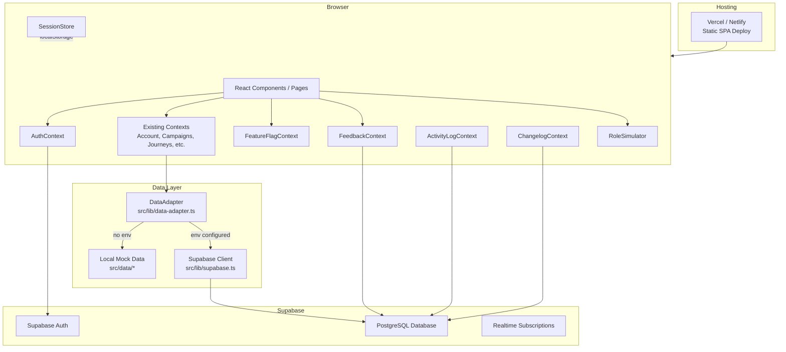

# Design Document: Collaborative Prototype Infrastructure

## Overview

This design transforms the UbiQuity 2.0 prototype from a local-only React application into a collaborative, hosted review environment. The core strategy is to introduce Supabase as a persistence and auth layer while preserving the existing React context interfaces so that UI components remain unchanged.

The architecture follows a "data source adapter" pattern: a thin abstraction layer sits between the existing contexts and the data source (Supabase or local mock files). This allows the prototype to run in two modes — connected (Supabase) and offline (local mock data) — controlled by environment variables.

New collaboration features (feedback, activity logging, changelog, role simulation) are layered on top as independent modules that only activate when Supabase is available.

## Architecture



### Key Architectural Decisions

1. **Domain-specific adapters over generic CRUD**: Each context gets its own async adapter that mirrors its actual method signatures (including cross-entity operations like `addJourney` updating the parent campaign's `journeyIds`). No generic `DataAdapter<T>`.
2. **Graceful degradation**: Missing `VITE_SUPABASE_URL` env var triggers local-only mode. No Supabase dependency for local dev.
3. **Supabase client singleton**: A single `createClient()` instance in `src/lib/supabase.ts` shared across all modules.
4. **Basic RLS**: Enable Row-Level Security with a simple "require authenticated user" policy on all tables. The anon key is visible in the JS bundle, so unauthenticated access must be blocked at the database level. No per-user row isolation — all authenticated reviewers share the same dataset.
5. **Batched activity logging**: Activity events queue in memory and flush on a debounced interval to avoid per-interaction network calls.
6. **Session state in localStorage**: UI state (filters, open panels) stays in browser storage keyed by user ID. Supabase stores persistent data only.
7. **DataLayerProvider for parallel loading**: A single `DataLayerProvider` wraps all domain contexts, fetches all data in parallel on mount, and provides a unified `isLoading` / `error` state. Individual contexts receive their initial data as props rather than fetching independently, avoiding waterfall fetches.
8. **Collaboration features compose into a single provider**: `FeedbackContext`, `ChangelogContext`, and `ActivityLogService` share the same activation condition (Supabase configured + user authenticated) and are composed into a single `CollaborationProvider` to reduce provider nesting depth.

## Components and Interfaces

### 1. Supabase Client (`src/lib/supabase.ts`)

```typescript
import { createClient, SupabaseClient } from '@supabase/supabase-js';

const supabaseUrl = import.meta.env.VITE_SUPABASE_URL;
const supabaseAnonKey = import.meta.env.VITE_SUPABASE_ANON_KEY;

export const supabase: SupabaseClient | null =
  supabaseUrl && supabaseAnonKey
    ? createClient(supabaseUrl, supabaseAnonKey)
    : null;

export const isSupabaseConfigured = (): boolean => supabase !== null;
```

### 2. Domain-Specific Data Adapters (`src/lib/adapters/`)

Each domain gets its own adapter file that mirrors the actual context method signatures. Adapters check `isSupabaseConfigured()` and either query Supabase or return local mock data. Column name mapping (camelCase ↔ snake_case) is handled inside each adapter.

#### `src/lib/adapters/accounts-adapter.ts` (read-only)

```typescript
// AccountContext is read-only — no create/update/delete
interface AccountsAdapter {
  getAll(): Promise<Account[]>;
  getById(id: string): Promise<Account | undefined>;
}
```

#### `src/lib/adapters/campaigns-adapter.ts` (manages campaigns + journeys)

```typescript
// CampaignsContext manages two entities with cross-entity operations
interface CampaignsAdapter {
  getAllCampaigns(): Promise<Campaign[]>;
  getAllJourneys(): Promise<Journey[]>;
  addCampaign(campaign: Campaign): Promise<Campaign>;
  updateCampaign(id: string, updates: Partial<Campaign>): Promise<Campaign>;
  deleteCampaign(id: string): Promise<void>; // also deletes child journeys
  addJourney(journey: Journey): Promise<Journey>; // also updates parent campaign's journeyIds
  updateJourney(id: string, updates: Partial<Journey>): Promise<Journey>;
  deleteJourney(id: string): Promise<void>; // also updates parent campaign's journeyIds
}
```

#### `src/lib/adapters/journeys-adapter.ts` (journey definitions with nodes/edges)

```typescript
// JourneysContext has node-level and edge-level operations on nested structures
interface JourneysAdapter {
  getAll(): Promise<JourneyDefinition[]>;
  addJourney(journey: JourneyDefinition): Promise<JourneyDefinition>;
  updateJourney(id: string, updates: Partial<JourneyDefinition>): Promise<JourneyDefinition>;
  deleteJourney(id: string): Promise<void>;
  // Node/edge operations update the JSONB columns on the journey row
  updateNode(journeyId: string, nodeId: string, updates: Partial<JourneyNode>): Promise<void>;
  addNode(journeyId: string, node: JourneyNode): Promise<void>;
  removeNode(journeyId: string, nodeId: string): Promise<void>;
  addEdge(journeyId: string, edge: JourneyEdge): Promise<void>;
  removeEdge(journeyId: string, edgeId: string): Promise<void>;
}
```

#### `src/lib/adapters/connections-adapter.ts`

```typescript
interface ConnectionsAdapter {
  getAll(): Promise<Connection[]>;
  add(connection: Connection): Promise<Connection>;
  update(id: string, updates: Partial<Connection>): Promise<Connection>;
  delete(id: string): Promise<void>;
}
```

#### `src/lib/adapters/connectors-adapter.ts`

```typescript
// ConnectorsContext.addConnector takes a WizardDraft, not a Connector
// The adapter accepts the final Connector shape — the WizardDraft→Connector
// transformation stays in the context (business logic, not persistence)
interface ConnectorsAdapter {
  getAll(): Promise<Connector[]>; // applies migrateFilters() on read
  add(connector: Connector): Promise<Connector>;
  update(id: string, updates: Partial<Connector>): Promise<Connector>;
  delete(id: string): Promise<void>;
}
```

Note: `migrateFilters()` is applied when reading from Supabase, matching the existing `ConnectorsContext` behaviour that applies it on localStorage load.

#### `src/lib/adapters/data-adapter.ts` (read-only: contacts, treatments, products)

```typescript
// DataContext is entirely read-only
interface DataReadAdapter {
  getContacts(): Promise<ContactRecord[]>;
  getTreatments(): Promise<TreatmentRecord[]>;
  getProducts(): Promise<ProductRecord[]>;
}
```

#### `src/lib/adapters/permissions-adapter.ts`

```typescript
interface PermissionsAdapter {
  getPermissionGroups(): Promise<PermissionGroup[]>;
  getAssignments(): Promise<UserAccountAssignment[]>;
  getUsers(): Promise<PermissionUser[]>;
  addPermissionGroup(group: PermissionGroup): Promise<PermissionGroup>;
  updatePermissionGroup(id: string, updates: Partial<PermissionGroup>): Promise<PermissionGroup>;
  deletePermissionGroup(id: string): Promise<void>;
  setAssignmentsForUser(userId: string, assignments: UserAccountAssignment[]): Promise<void>;
  setAssignmentForUserAccount(userId: string, accountId: string, groupId: string | null, customPermissions: Record<string, FunctionalPermissions> | null): Promise<void>;
  removeAssignment(userId: string, accountId: string): Promise<void>;
}
```

#### `src/lib/adapters/assets-adapter.ts`

```typescript
interface AssetsAdapter {
  getAll(): Promise<Asset[]>;
  add(asset: Omit<Asset, 'id' | 'createdAt'>): Promise<Asset>; // matches existing AssetsContext.addAsset signature
  update(id: string, updates: Partial<Asset>): Promise<Asset>;
  delete(id: string): Promise<void>;
}
```

#### `src/lib/adapters/segments-adapter.ts`

```typescript
interface SegmentsAdapter {
  getAll(): Promise<Segment[]>;
  add(segment: Segment): Promise<Segment>;
  update(id: string, updates: Partial<Segment>): Promise<Segment>;
  delete(id: string): Promise<void>;
}
```

### 3. DataLayerProvider (`src/providers/DataLayerProvider.tsx`)

Wraps all domain contexts. On mount, fetches all data from adapters in parallel (`Promise.all`). Provides a single `isLoading` and `error` state. Renders a full-page loading skeleton while data is in flight. Individual contexts receive their initial data as props.

```typescript
interface DataLayerState {
  isLoading: boolean;
  error: string | null;
  accounts: Account[];
  campaigns: Campaign[];
  campaignJourneys: Journey[];
  journeyDefinitions: JourneyDefinition[];
  connections: Connection[];
  connectors: Connector[];
  contacts: ContactRecord[];
  treatments: TreatmentRecord[];
  products: ProductRecord[];
  permissionGroups: PermissionGroup[];
  assignments: UserAccountAssignment[];
  users: PermissionUser[];
  segments: Segment[];
  assets: Asset[];
}
```

When Supabase is not configured, the provider loads from local mock data synchronously (no loading state).

### 4. AuthContext (`src/contexts/AuthContext.tsx`)

```typescript
interface AuthUser {
  id: string;
  email: string;
  displayName: string;
  avatarInitials: string;
}

interface AuthContextValue {
  user: AuthUser | null;
  isLoading: boolean; // true while initial auth state is being resolved (prevents login page flash)
  signIn: (email: string, password: string) => Promise<{ error?: string }>;
  signOut: () => Promise<void>;
}
```

Auth loading state: On mount, `AuthContext` subscribes to Supabase `onAuthStateChange`. While the initial session check is in-flight, `isLoading` is `true`. The `ProtectedRoute` component renders nothing (or a spinner) during this phase, preventing a flash of the login page before the session is confirmed.

### 5. FeatureFlagContext (`src/contexts/FeatureFlagContext.tsx`)

```typescript
interface FeatureFlag {
  name: string;
  enabled: boolean;
  description: string;
  scope: 'page' | 'component';
  target: string; // route path for page-scoped flags (e.g., '/automations/campaigns'), component key for component-scoped flags
}

interface FeatureFlagContextValue {
  flags: Record<string, FeatureFlag>;
  isEnabled: (flagName: string) => boolean;
  isRouteEnabled: (routePath: string) => boolean; // checks if any page-scoped flag disables this route
  isLoading: boolean;
}
```

The `target` field links each flag to a specific route or component. `isRouteEnabled` is used by the nav bar to filter items and by `ProtectedRoute` to show the "coming soon" placeholder.

### 6. FeedbackContext (`src/contexts/FeedbackContext.tsx`)

```typescript
interface FeedbackComment {
  id: string;
  pageRoute: string;
  userId: string;
  userDisplayName: string;
  body: string;
  createdAt: string;
}

interface FeedbackContextValue {
  comments: FeedbackComment[];
  commentCountForPage: (route: string) => number;
  addComment: (body: string) => Promise<void>;
  deleteComment: (id: string) => Promise<void>;
  isOpen: boolean;
  togglePanel: () => void;
}
```

### 7. ActivityLogService (`src/lib/activity-log.ts`)

```typescript
interface ActivityEvent {
  pageRoute: string;
  interactionType?: string;
  targetId?: string;
  timestamp: string;
  userId: string;
}

// Batched writer — queues events and flushes every 5 seconds or on page unload
export function trackPageView(route: string): void;
export function trackInteraction(type: string, targetId: string): void;
```

### 8. ChangelogContext (`src/contexts/ChangelogContext.tsx`)

```typescript
interface ChangelogEntry {
  id: string;
  title: string;
  description: string;
  affectedRoutes: string[];
  createdAt: string;
}

interface ChangelogContextValue {
  entries: ChangelogEntry[];
  unseenEntries: ChangelogEntry[];
  dismissBanner: () => void;
  showBanner: boolean;
}
```

The "What's New" link is placed in the right-side actions area of `AppNavBar`, next to the search bar. It opens a slide-out panel (`src/components/layout/WhatsNewPanel.tsx`) showing the full changelog history.

### 9. RoleSimulator (`src/components/layout/RoleSimulator.tsx`)

```typescript
type SimulatedRole = 'admin' | 'marketer' | 'viewer';

interface RoleSimulatorContextValue {
  activeRole: SimulatedRole;
  setRole: (role: SimulatedRole) => void;
  permissions: Record<string, FunctionalPermissions>;
}
```

The RoleSimulator wraps `PermissionsContext` — when a role is selected, it overrides the permission context's resolved permissions with the predefined set for that role. The existing `PermissionsContext` interface remains unchanged; the override happens at the provider level.

#### Persona Permission Sets

These map directly to the existing `FUNCTIONAL_GROUPS` in `src/data/permissions.ts`:

| Functional Group | Admin | Marketer | Viewer |
|---|---|---|---|
| Dashboard | CRUD | CRUD | R only |
| Audiences | CRUD | CR only | R only |
| Campaigns | CRUD | CRUD | — |
| Content | CRUD | CRUD | — |
| Analytics | CRUD | R only | R only |
| Settings | CRUD | — | — |

These match the existing `defaultPermissionGroups` (Admin = `grp-admin`, Marketer ≈ `grp-editor`, Viewer = `grp-viewer`).

### 10. SessionStore (`src/lib/session-store.ts`)

```typescript
interface SessionState {
  selectedAccountId: string;
  activeFilters: {
    segmentFilters?: FilterGroup;       // from src/models/segment.ts
    campaignTags?: string[];
    assetTypeFilter?: string;
  };
  openPanels: string[];                 // panel identifiers (e.g., 'feedback', 'inspector')
  simulatedRole: SimulatedRole;
  lastRoute: string;                    // for redirect-after-login
}

export function saveSession(userId: string, state: Partial<SessionState>): void;
export function loadSession(userId: string): SessionState | null;
export function clearSession(userId: string): void;
```

`saveSession` merges partial updates into the existing stored state (not a full replace). This allows individual contexts to persist their slice without overwriting others.

### 11. ProtectedRoute (`src/components/auth/ProtectedRoute.tsx`)

A wrapper component that checks `AuthContext` and `FeatureFlagContext`:

1. If `AuthContext.isLoading` is true → render nothing (prevents login page flash)
2. If user is not authenticated → redirect to `/login?returnTo={currentPath}`
3. If the current route has a disabled feature flag → render `ComingSoonPlaceholder`
4. Otherwise → render children

Integration with App.tsx router structure:

```tsx
// In App.tsx — ProtectedRoute wraps the Routes block, NOT individual routes
// LoginPage sits outside the ProtectedRoute
<BrowserRouter>
  <AuthProvider>
    <FeatureFlagProvider>
      <Routes>
        <Route path="/login" element={<LoginPage />} />
        <Route path="/*" element={
          <ProtectedRoute>
            <DataLayerProvider>
              <CollaborationProvider>
                {/* existing provider tree + AppNavBar + Routes */}
              </CollaborationProvider>
            </DataLayerProvider>
          </ProtectedRoute>
        } />
      </Routes>
    </FeatureFlagProvider>
  </AuthProvider>
</BrowserRouter>
```

The `LoginPage` reads the `returnTo` query parameter and redirects there after successful sign-in.

### 12. CollaborationProvider (`src/providers/CollaborationProvider.tsx`)

Composes `FeedbackContext`, `ChangelogContext`, and `ActivityLogService` into a single provider. Only activates when Supabase is configured and user is authenticated. In local-only mode, provides no-op implementations.

### 13. ComingSoonPlaceholder (`src/components/shared/ComingSoonPlaceholder.tsx`)

A simple full-page placeholder shown when a feature-flagged route is accessed directly. Displays the page name and a "This feature is coming soon" message with a link back to the dashboard.

### 14. ActivityLogAdminView (`src/pages/ActivityLogPage.tsx`)

A read-only admin page accessible at `/admin/activity` showing:
- Aggregated page visit counts (bar chart or table)
- Interaction frequency by type
- Per-user activity summary
- Date range filter

Only visible to the prototype maintainer (controlled by a feature flag or hardcoded user check).

### 15. ResetAccountButton (`src/components/shared/ResetAccountButton.tsx`)

A button in the user avatar dropdown menu. When clicked, calls a Supabase RPC function (`reset_user_data`) that:
1. Deletes all rows in mutable tables where `modified_by` matches the current user ID
2. Re-inserts the seed baseline data for those rows

This requires a `modified_by` column on mutable domain tables (campaigns, journeys, connections, connectors, segments, assets, permission_groups, user_account_assignments). Read-only tables (accounts, contacts, treatments, products) are shared and not user-resettable.

### 16. Seed Script (`scripts/seed.ts`)

A Node.js script (run via `tsx`) that reads all `src/data/*.ts` modules and upserts them into Supabase tables. Uses `ON CONFLICT ... DO UPDATE` for idempotency.

## Data Models

### Supabase Schema

All existing TypeScript interfaces map to Supabase tables. JSON columns are used for nested/polymorphic data to avoid over-normalisation in a prototype context.

```sql
-- Core domain tables (mirror existing src/data/ modules)

CREATE TABLE accounts (
  id TEXT PRIMARY KEY,
  name TEXT NOT NULL,
  parent_id TEXT REFERENCES accounts(id),
  child_ids TEXT[] DEFAULT '{}',
  region TEXT NOT NULL,
  status TEXT NOT NULL CHECK (status IN ('active', 'inactive'))
);

CREATE TABLE campaigns (
  id TEXT PRIMARY KEY,
  name TEXT NOT NULL,
  account_id TEXT NOT NULL REFERENCES accounts(id),
  goal TEXT NOT NULL DEFAULT '',
  date_range JSONB NOT NULL DEFAULT '{}',
  status TEXT NOT NULL CHECK (status IN ('draft', 'active', 'paused', 'completed')),
  journey_ids TEXT[] DEFAULT '{}',
  tags TEXT[] DEFAULT '{}',
  modified_by TEXT
);

CREATE TABLE journeys (
  id TEXT PRIMARY KEY,
  name TEXT NOT NULL,
  campaign_id TEXT NOT NULL REFERENCES campaigns(id),
  account_id TEXT NOT NULL REFERENCES accounts(id),
  status TEXT NOT NULL CHECK (status IN ('draft', 'active', 'paused', 'completed')),
  node_count INTEGER NOT NULL DEFAULT 0,
  entry_count INTEGER NOT NULL DEFAULT 0,
  type TEXT NOT NULL CHECK (type IN ('welcome', 're-engagement', 'transactional', 'promotional')),
  nodes JSONB NOT NULL DEFAULT '[]',
  edges JSONB NOT NULL DEFAULT '[]',
  settings JSONB NOT NULL DEFAULT '{}',
  modified_by TEXT
);

CREATE TABLE connections (
  id TEXT PRIMARY KEY,
  name TEXT NOT NULL,
  protocol TEXT NOT NULL CHECK (protocol IN ('S3', 'SFTP', 'Azure Blob')),
  status TEXT NOT NULL CHECK (status IN ('connected', 'error')),
  base_path TEXT NOT NULL DEFAULT '',
  config JSONB NOT NULL DEFAULT '{}',
  modified_by TEXT
);

CREATE TABLE connectors (
  id TEXT PRIMARY KEY,
  connection_id TEXT NOT NULL REFERENCES connections(id),
  name TEXT NOT NULL,
  direction TEXT NOT NULL DEFAULT 'export',
  data_type TEXT NOT NULL,
  transactional_source TEXT,
  enrichment_key_field TEXT,
  selected_fields JSONB NOT NULL DEFAULT '[]',
  file_type TEXT NOT NULL CHECK (file_type IN ('csv', 'json', 'xml')),
  format_options JSONB NOT NULL DEFAULT '{}',
  file_naming_pattern TEXT NOT NULL DEFAULT '',
  schedule TEXT NOT NULL,
  filters JSONB NOT NULL DEFAULT '{}',
  status TEXT NOT NULL CHECK (status IN ('active', 'paused')),
  created_at TIMESTAMPTZ NOT NULL DEFAULT now(),
  updated_at TIMESTAMPTZ NOT NULL DEFAULT now(),
  modified_by TEXT
);

CREATE TABLE contacts (
  id TEXT PRIMARY KEY,
  first_name TEXT NOT NULL,
  last_name TEXT NOT NULL,
  email TEXT NOT NULL,
  phone TEXT NOT NULL DEFAULT '',
  membership_tier TEXT NOT NULL CHECK (membership_tier IN ('Bronze', 'Silver', 'Gold', 'Platinum')),
  join_date TEXT NOT NULL,
  communication_preferences JSONB NOT NULL DEFAULT '{}',
  account_id TEXT NOT NULL REFERENCES accounts(id),
  segment_ids TEXT[] DEFAULT '{}',
  journey_ids TEXT[] DEFAULT '{}',
  activity_timeline JSONB NOT NULL DEFAULT '[]'
);

CREATE TABLE segments (
  id TEXT PRIMARY KEY,
  name TEXT NOT NULL,
  account_id TEXT NOT NULL REFERENCES accounts(id),
  type TEXT NOT NULL CHECK (type IN ('smart', 'manual')),
  root_group JSONB NOT NULL DEFAULT '{}',
  member_count INTEGER NOT NULL DEFAULT 0,
  modified_by TEXT
);

CREATE TABLE assets (
  id TEXT PRIMARY KEY,
  name TEXT NOT NULL,
  type TEXT NOT NULL CHECK (type IN ('image', 'colour', 'font', 'footer')),
  scope TEXT NOT NULL CHECK (scope IN ('global', 'campaign', 'account')),
  account_id TEXT NOT NULL REFERENCES accounts(id),
  campaign_id TEXT,
  tags TEXT[] DEFAULT '{}',
  created_at TIMESTAMPTZ NOT NULL DEFAULT now(),
  colour_value TEXT,
  modified_by TEXT
);

CREATE TABLE treatments (
  id TEXT PRIMARY KEY,
  customer_id TEXT NOT NULL REFERENCES contacts(id),
  treatment_type TEXT NOT NULL,
  therapist_name TEXT NOT NULL,
  treatment_date TEXT NOT NULL,
  duration_minutes INTEGER NOT NULL,
  price NUMERIC NOT NULL
);

CREATE TABLE products (
  id TEXT PRIMARY KEY,
  customer_id TEXT NOT NULL REFERENCES contacts(id),
  product_name TEXT NOT NULL,
  category TEXT NOT NULL CHECK (category IN ('Skincare', 'Wellness', 'Gift Card', 'Treatment Voucher')),
  purchase_channel TEXT NOT NULL CHECK (purchase_channel IN ('In-Person', 'Online')),
  purchase_date TEXT NOT NULL,
  price NUMERIC NOT NULL
);

CREATE TABLE permission_groups (
  id TEXT PRIMARY KEY,
  name TEXT NOT NULL,
  description TEXT NOT NULL DEFAULT '',
  permissions JSONB NOT NULL DEFAULT '{}'
);

CREATE TABLE user_account_assignments (
  user_id TEXT NOT NULL,
  account_id TEXT NOT NULL REFERENCES accounts(id),
  permission_group_id TEXT REFERENCES permission_groups(id),
  custom_permissions JSONB,
  PRIMARY KEY (user_id, account_id)
);

CREATE TABLE prototype_users (
  id TEXT PRIMARY KEY,
  name TEXT NOT NULL,
  email TEXT NOT NULL UNIQUE,
  initials TEXT NOT NULL DEFAULT ''
);

CREATE TABLE notifications (
  id TEXT PRIMARY KEY,
  type TEXT NOT NULL CHECK (type IN ('info', 'warning', 'success', 'error')),
  message TEXT NOT NULL,
  timestamp TIMESTAMPTZ NOT NULL DEFAULT now(),
  read BOOLEAN NOT NULL DEFAULT false,
  link_to TEXT
);

CREATE TABLE field_registry (
  id TEXT PRIMARY KEY,
  data JSONB NOT NULL
);

CREATE TABLE operator_registry (
  id TEXT PRIMARY KEY,
  data JSONB NOT NULL
);

CREATE TABLE journey_seeds (
  id TEXT PRIMARY KEY,
  data JSONB NOT NULL
);

CREATE TABLE spa_contacts (
  id TEXT PRIMARY KEY,
  data JSONB NOT NULL
);

CREATE TABLE transactional_data (
  id TEXT PRIMARY KEY,
  data JSONB NOT NULL
);

-- Collaboration tables (new for this feature)

CREATE TABLE feature_flags (
  name TEXT PRIMARY KEY,
  enabled BOOLEAN NOT NULL DEFAULT true,
  description TEXT NOT NULL DEFAULT '',
  scope TEXT NOT NULL CHECK (scope IN ('page', 'component')) DEFAULT 'page',
  target TEXT NOT NULL DEFAULT '' -- route path for page flags, component key for component flags
);

CREATE TABLE feedback_comments (
  id TEXT PRIMARY KEY DEFAULT gen_random_uuid()::text,
  page_route TEXT NOT NULL,
  user_id TEXT NOT NULL,
  user_display_name TEXT NOT NULL DEFAULT '',
  body TEXT NOT NULL,
  created_at TIMESTAMPTZ NOT NULL DEFAULT now()
);

CREATE TABLE activity_log (
  id BIGINT GENERATED ALWAYS AS IDENTITY PRIMARY KEY,
  user_id TEXT NOT NULL,
  page_route TEXT NOT NULL,
  interaction_type TEXT,
  target_id TEXT,
  created_at TIMESTAMPTZ NOT NULL DEFAULT now()
);

CREATE TABLE changelog_entries (
  id TEXT PRIMARY KEY DEFAULT gen_random_uuid()::text,
  title TEXT NOT NULL,
  description TEXT NOT NULL DEFAULT '',
  affected_routes TEXT[] DEFAULT '{}',
  created_at TIMESTAMPTZ NOT NULL DEFAULT now()
);

CREATE TABLE user_changelog_seen (
  user_id TEXT NOT NULL,
  last_seen_entry_id TEXT NOT NULL REFERENCES changelog_entries(id),
  PRIMARY KEY (user_id)
);

-- Index for activity log queries
CREATE INDEX idx_activity_log_user ON activity_log(user_id, created_at DESC);
CREATE INDEX idx_activity_log_route ON activity_log(page_route, created_at DESC);
CREATE INDEX idx_feedback_route ON feedback_comments(page_route);

-- RLS: require authenticated user on all tables
-- (applied to every table above via a script; example for one table)
ALTER TABLE campaigns ENABLE ROW LEVEL SECURITY;
CREATE POLICY "Authenticated users can access all rows"
  ON campaigns FOR ALL
  USING (auth.role() = 'authenticated');
-- Repeat for all tables. No per-user row isolation — all authenticated reviewers share the dataset.

-- RPC function for per-user data reset (Req 4.4)
CREATE OR REPLACE FUNCTION reset_user_data(target_user_id TEXT)
RETURNS void AS $$
BEGIN
  -- Delete rows modified by this user from mutable tables
  DELETE FROM connectors WHERE modified_by = target_user_id;
  DELETE FROM connections WHERE modified_by = target_user_id;
  DELETE FROM campaigns WHERE modified_by = target_user_id;
  DELETE FROM journeys WHERE modified_by = target_user_id;
  DELETE FROM segments WHERE modified_by = target_user_id;
  DELETE FROM assets WHERE modified_by = target_user_id;
  -- Re-insert seed baseline is handled by the client calling the seed adapter
END;
$$ LANGUAGE plpgsql SECURITY DEFINER;
```

### Data Mapping Strategy

| TypeScript Interface | Supabase Table | Mapping Notes |
|---|---|---|
| `Account` | `accounts` | Direct 1:1 |
| `Campaign` | `campaigns` | `dateRange` → `date_range` JSONB |
| `Journey` | `journeys` | Direct 1:1 |
| `JourneyDefinition` | `journeys` | `nodes` → JSONB array, `edges` → JSONB array, `settings` → JSONB. Canvas data stored on the same row as journey metadata. |
| `Connection` | `connections` | `config` stays as JSONB (polymorphic) |
| `Connector` | `connectors` | `selectedFields`, `formatOptions`, `filters` → JSONB |
| `Contact` | `contacts` | `activityTimeline` → JSONB array |
| `Segment` | `segments` | `rootGroup` → JSONB (recursive structure) |
| `Asset` | `assets` | Direct 1:1 |
| `TreatmentRecord` | `treatments` | Direct 1:1 |
| `ProductRecord` | `products` | Direct 1:1 |
| `PermissionGroup` | `permission_groups` | `permissions` → JSONB |
| `UserAccountAssignment` | `user_account_assignments` | Composite PK |
| `PermissionUser` | `prototype_users` | Direct 1:1 |
| `Notification` | `notifications` | Direct 1:1 |

Lookup/registry tables (`field_registry`, `operator_registry`, `journey_seeds`, `spa_contacts`, `transactional_data`) use a generic `{id, data: JSONB}` shape since they are static reference data with varying structures.

Note: The `connectors` table has no seed data — connectors are created at runtime by users. The seed script does not populate this table. The `connectors-adapter` applies `migrateFilters()` on read from Supabase, matching the existing `ConnectorsContext` behaviour.

Note: Mutable domain tables (`campaigns`, `journeys`, `connections`, `connectors`, `segments`, `assets`) include a `modified_by TEXT` column. Adapters set this to the current user's auth ID on create/update operations. This enables per-user data reset (Req 4.4) without full row-level isolation.


## Correctness Properties

*A property is a characteristic or behavior that should hold true across all valid executions of a system — essentially, a formal statement about what the system should do. Properties serve as the bridge between human-readable specifications and machine-verifiable correctness guarantees.*

### Property 1: Data adapter round-trip preserves shape

*For any* valid domain object (Account, Campaign, Journey, Connection, Connector, Contact, Segment, Asset), writing it through the data adapter and reading it back by ID should produce an object deeply equal to the original.

**Validates: Requirements 1.1**

### Property 2: Mutations are reflected in subsequent reads

*For any* valid domain object and any supported mutation (create, update, delete), after the mutation completes successfully, a subsequent read should reflect the change — created objects are findable, updated fields match, deleted objects are absent.

**Validates: Requirements 1.3**

### Property 3: Unauthenticated users are redirected to login

*For any* protected route in the application, when the user is not authenticated, navigating to that route should result in a redirect to `/login` with the original route preserved as a return target.

**Validates: Requirements 2.2**

### Property 4: Disabled feature flags hide navigation and show placeholder

*For any* feature flag with `enabled: false` and scope `page`, the associated navigation item should not be rendered in the nav bar, and directly accessing the route should render a "coming soon" placeholder instead of the page content.

**Validates: Requirements 3.3**

### Property 5: Feedback comments are stored with all required fields

*For any* valid comment body submitted on any page route by any authenticated user, the resulting stored record should contain the correct `page_route`, `user_id`, a valid ISO timestamp in `created_at`, and the exact `body` text.

**Validates: Requirements 5.2**

### Property 6: Feedback badge count equals stored comment count

*For any* page route, the badge count displayed on the feedback button should equal the number of feedback_comments records where `page_route` matches the current route.

**Validates: Requirements 5.3**

### Property 7: Feedback comments are ordered by timestamp descending

*For any* set of feedback comments on a page, the comment thread panel should display them sorted by `created_at` in descending order (newest first).

**Validates: Requirements 5.4**

### Property 8: Whitespace-only comments are rejected

*For any* string composed entirely of whitespace characters (including the empty string), attempting to submit it as a feedback comment should be rejected without creating a record, and a validation message should be displayed.

**Validates: Requirements 5.5**

### Property 9: Session state round-trip with partial merge

*For any* valid `SessionState` object and any user ID, calling `saveSession(userId, state)` followed by `loadSession(userId)` should return a state object equivalent to what was saved. Calling `saveSession` with a partial state should merge into the existing stored state without overwriting unrelated keys.

**Validates: Requirements 6.1, 6.2, 7.3**

### Property 10: Role selection updates permission context

*For any* simulated role (admin, marketer, viewer), selecting that role via the RoleSimulator should cause the permission context to reflect exactly the predefined CRUD matrix for that role (as defined in the Persona Permission Sets table).

**Validates: Requirements 7.2**

### Property 11: Unseen changelog entries trigger banner

*For any* authenticated user whose `last_seen_entry_id` is older than the most recent changelog entry (or has no record in `user_changelog_seen`), the changelog banner should be visible and list all entries newer than their last seen entry.

**Validates: Requirements 8.2**

### Property 12: Activity log records all navigations and interactions

*For any* page navigation or tracked interaction performed by an authenticated user, an `activity_log` record should exist with the correct `user_id`, `page_route`, and a `created_at` timestamp within a reasonable window of the event.

**Validates: Requirements 9.1, 9.2**

## Error Handling

| Scenario | Behaviour |
|---|---|
| Supabase query failure (read) | Show non-blocking toast with error message; retain previous local state in context |
| Supabase query failure (write) | Show toast with "Save failed" message; do not update local state; allow retry |
| Missing Supabase env vars | Fall back to local mock data mode silently; collaboration features (feedback, activity log, changelog) are disabled |
| Auth token expired | Attempt silent refresh via Supabase `onAuthStateChange`; if refresh fails, redirect to `/login` |
| Auth state loading (initial) | `ProtectedRoute` renders nothing (or spinner) while `AuthContext.isLoading` is true; prevents login page flash |
| Invalid login credentials | Display inline error below the password field: "Invalid email or password" |
| Feature flags fetch failure | Treat all flags as enabled (fail-open) |
| Seed script connection failure | Exit with non-zero code and descriptive error message |
| Activity log flush failure | Log to console; discard batch; do not retry (non-critical) |
| Feedback submission with empty body | Prevent submission client-side; show "Comment cannot be empty" validation |
| Session storage quota exceeded | Silently fail; log warning to console; app continues without persistence |
| Concurrent write conflict | Last-write-wins (no optimistic locking). Acceptable for a prototype with a small number of trusted reviewers. If data looks wrong, use "Reset Account" to restore baseline. |
| Supabase rate limiting | Activity log batching (5-second flush interval) mitigates this. If a 429 is returned, the batch is discarded with a console warning. |
| Network drop mid-session | Collaboration features (feedback, activity log) queue in memory and retry on next flush. Domain data operations show a toast and retain local state. Changelog uses cached entries. |

### Toast Notification Pattern

All Supabase errors surface via a lightweight toast component (`src/components/shared/Toast.tsx`) that auto-dismisses after 5 seconds. Toasts stack vertically in the bottom-right corner. They do not block interaction.

## Testing Strategy

### Unit Tests (Vitest + React Testing Library)

- **Domain adapters**: Test each adapter function with mocked Supabase client responses (one test file per adapter)
- **AuthContext**: Test sign-in/sign-out flows with mocked Supabase Auth; test `isLoading` state prevents login flash
- **FeatureFlagContext**: Test flag resolution, `isRouteEnabled`, fallback behavior
- **FeedbackContext**: Test comment CRUD, validation, ordering
- **SessionStore**: Test save/load/clear with mocked localStorage; test partial merge behaviour
- **RoleSimulator**: Test role switching updates permission context with correct CRUD matrix per persona
- **ChangelogContext**: Test banner visibility logic, dismiss behavior
- **ActivityLog**: Test batching behavior (queue fills, flush triggers, 429 handling)
- **ProtectedRoute**: Test redirect behavior for authenticated/unauthenticated states; test `returnTo` query parameter; test feature flag placeholder rendering
- **ComingSoonPlaceholder**: Test renders page name and dashboard link
- **LoginPage**: Test form validation, error display, `returnTo` redirect after success
- **ResetAccountButton**: Test calls RPC function with correct user ID
- **WhatsNewPanel**: Test renders changelog entries, opens/closes
- **Nav bar feature flag integration**: Test that disabled page flags hide nav items

### Property-Based Tests (fast-check)

Property-based testing is appropriate for this feature because several core behaviors are pure functions or have clear input/output relationships that should hold across a wide range of inputs.

- **Library**: `fast-check` (already in devDependencies)
- **Existing generators**: Extend `src/test/generators.ts` (already used by campaign property tests) with generators for new domain objects
- **Minimum iterations**: 100 per property
- **Tag format**: `Feature: collaborative-prototype-infra, Property {N}: {title}`
- **Supabase mocking**: Properties 1-2 use a mocked Supabase client (not a live DB) for speed and reliability

Properties to implement:
1. Data adapter round-trip — mocked Supabase client (generate random domain objects, write/read, assert equality)
2. Mutation persistence — mocked Supabase client (generate random objects + random mutations, verify reads)
3. Route protection (generate random route paths, verify redirect with `returnTo` param)
4. Feature flag visibility (generate random flag configs with `target` routes, verify nav/placeholder)
5. Feedback storage completeness (generate random comments, verify stored fields)
6. Feedback badge count (generate random comment sets, verify count)
7. Feedback ordering (generate random timestamps, verify sort)
8. Whitespace rejection (generate whitespace strings, verify rejection)
9. Session state round-trip (generate random SessionState, verify save/load with partial merge)
10. Role → permissions mapping (for each role, verify permission set matches CRUD matrix)
11. Changelog banner visibility (generate random seen/unseen states, verify banner)
12. Activity log completeness (generate random events, verify records)

### Integration Tests

- Seed script execution against a test Supabase instance (includes idempotency check: run twice, compare state)
- End-to-end auth flow (sign in, navigate, sign out, verify `returnTo` redirect)
- Feedback submission and retrieval
- Per-user data reset via RPC function
- Deployment build verification (`npm run build` produces valid output)

### What Is NOT Property-Tested

- UI rendering (toast appearance, modal layout) → snapshot/visual tests
- Supabase Auth token refresh → integration test with 1 example
- Seed script idempotency → integration test (fixed input, no random generation; run twice and compare state)
- Deployment/hosting → manual verification + CI smoke test
- Per-user data reset → integration test against test Supabase instance
