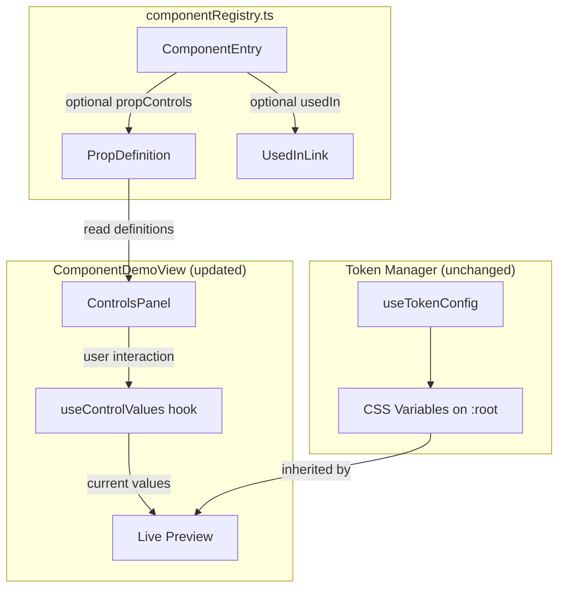

# Design Document: Component Controls Panel

## Overview

The Controls Panel adds interactive prop editing to the Component Library page (`/admin/components`). It extends the existing `ComponentEntry` interface with declarative prop definitions and renders a per-component controls panel that drives live prop updates to the demo component.

The design follows the existing patterns in the codebase:
- Data-driven rendering (like the Token Manager sections that iterate over config entries)
- Local component state via `useState` (no global state management needed)
- Tailwind utilities with `cn()` for styling
- Lazy-loaded demo components via the existing `<Outlet>` routing pattern

The Controls Panel is architecturally independent from the Token Manager — tokens operate at the CSS variable level (global), while prop controls operate at the React props level (per-component instance). Both affect the rendered output simultaneously without interference.

## Architecture



**Key architectural decisions:**

1. **State lives in the demo view** — A custom `useControlValues` hook manages prop state per component. It initialises from `defaultValue` entries and exposes a setter + reset function. State is local to the `ComponentDemoView` and resets when navigating between components.

2. **Demo components accept optional props** — Each demo component that supports controls will accept props matching the `propControls` names. The `ComponentDemoView` spreads the current values as props. Demos without `propControls` continue to work unchanged (no props passed).

3. **Token Manager integration is implicit** — Tokens inject CSS variables on `:root`. The Live Preview inherits these variables through normal CSS cascade. No explicit wiring is needed between the two systems.

## Components and Interfaces

### Extended ComponentEntry Interface

```typescript
// src/data/componentRegistry.ts

export type ControlType = 'text' | 'select' | 'toggle' | 'colour' | 'number' | 'range' | 'radio'

export interface PropOption {
  label: string
  value: string
}

export interface PropDefinition {
  name: string
  label: string
  controlType: ControlType
  defaultValue: string | number | boolean
  options?: PropOption[]       // Required for 'select' and 'radio'
  min?: number                 // Optional for 'number' and 'range'
  max?: number                 // Optional for 'number' and 'range'
  step?: number                // Optional for 'number' and 'range'
}

export interface UsedInLink {
  label: string
  route: string
}

export interface ComponentEntry {
  name: string
  slug: string
  category: ComponentCategory
  description: string
  component: LazyExoticComponent<ComponentType>
  propControls?: PropDefinition[]   // NEW
  usedIn?: UsedInLink[]             // NEW
}
```

### useControlValues Hook

```typescript
// src/lib/useControlValues.ts

interface UseControlValuesReturn {
  values: Record<string, string | number | boolean>
  setValue: (name: string, value: string | number | boolean) => void
  resetAll: () => void
  isDirty: boolean
}

export function useControlValues(propControls: PropDefinition[]): UseControlValuesReturn
```

- Initialises state from `propControls[].defaultValue`
- `setValue` updates a single prop by name
- `resetAll` restores all values to their defaults
- `isDirty` is `true` when any value differs from its default
- Re-initialises when `propControls` reference changes (component navigation)

### ControlsPanel Component

```typescript
// src/components/component-library/ControlsPanel.tsx

interface ControlsPanelProps {
  propControls: PropDefinition[]
  values: Record<string, string | number | boolean>
  onChange: (name: string, value: string | number | boolean) => void
  onReset: () => void
  isDirty: boolean
  usedIn?: UsedInLink[]
}

export function ControlsPanel(props: ControlsPanelProps): JSX.Element
```

Renders:
1. A labelled control for each `PropDefinition` (delegating to type-specific sub-components)
2. A "Reset" button (visible only when `isDirty` is true)
3. A "View in context" section with navigation links (when `usedIn` is provided)

### Control Sub-components

Each control type maps to a small presentational component:

| ControlType | Component | Renders |
|---|---|---|
| `text` | `TextControl` | `<Input>` from shadcn/ui |
| `select` | `SelectControl` | `<Select>` from shadcn/ui |
| `toggle` | `ToggleControl` | `<Switch>` from shadcn/ui |
| `colour` | `ColourControl` | Native `<input type="color">` |
| `number` | `NumberControl` | `<Input type="number">` with min/max/step |
| `range` | `RangeControl` | `<Slider>` from shadcn/ui |
| `radio` | `RadioControl` | `<RadioGroup>` from shadcn/ui |

All sub-components share a common wrapper that renders the label and current value display.

### Updated ComponentDemoView

The existing `ComponentDemoView` in `ComponentLibraryPage.tsx` is updated to:

1. Check if the matched `ComponentEntry` has `propControls`
2. If yes: initialise `useControlValues`, render the demo with spread props, and render `ControlsPanel` below the preview
3. If no: render the demo as-is (current behaviour preserved)

```tsx
// Simplified flow in ComponentDemoView
const entry = componentRegistry.find(...)
const { values, setValue, resetAll, isDirty } = useControlValues(entry?.propControls ?? [])

return (
  <div className="flex flex-col gap-6">
    {/* Header */}
    <div>...</div>

    {/* Live Preview */}
    <div className="bg-background p-6 border border-border rounded-lg">
      <DemoComponent {...(entry.propControls ? values : {})} />
    </div>

    {/* Controls Panel (conditional) */}
    {entry.propControls && (
      <ControlsPanel
        propControls={entry.propControls}
        values={values}
        onChange={setValue}
        onReset={resetAll}
        isDirty={isDirty}
        usedIn={entry.usedIn}
      />
    )}
  </div>
)
```

## Data Models

### PropDefinition Validation Rules

| Field | Type | Required | Constraints |
|---|---|---|---|
| `name` | string | Always | Must be a valid JS identifier (used as prop name) |
| `label` | string | Always | Human-readable display label |
| `controlType` | ControlType | Always | One of the 7 defined types |
| `defaultValue` | string \| number \| boolean | Always | Must match the expected type for the controlType |
| `options` | PropOption[] | When controlType is `select` or `radio` | At least 1 entry |
| `min` | number | Never (optional) | Only meaningful for `number` and `range` |
| `max` | number | Never (optional) | Only meaningful for `number` and `range` |
| `step` | number | Never (optional) | Only meaningful for `number` and `range` |

### UsedInLink

| Field | Type | Required | Constraints |
|---|---|---|---|
| `label` | string | Always | Display text for the link |
| `route` | string | Always | Valid route path (e.g. `/dashboard`) |

### Control Values State Shape

The hook maintains a flat `Record<string, string | number | boolean>` keyed by `PropDefinition.name`. This keeps the state simple and avoids nested structures. The type of each value is determined by the corresponding `PropDefinition.controlType`:

| ControlType | Value Type | Example |
|---|---|---|
| `text` | string | `"Hello"` |
| `select` | string | `"secondary"` |
| `toggle` | boolean | `true` |
| `colour` | string | `"#14B88A"` |
| `number` | number | `16` |
| `range` | number | `50` |
| `radio` | string | `"active"` |

## Correctness Properties

*A property is a characteristic or behavior that should hold true across all valid executions of a system — essentially, a formal statement about what the system should do. Properties serve as the bridge between human-readable specifications and machine-verifiable correctness guarantees.*

### Property 1: PropDefinition schema completeness

*For any* PropDefinition object, it must contain a non-empty `name`, a non-empty `label`, a valid `controlType` from the defined union, and a `defaultValue` that is not undefined.

**Validates: Requirements 1.2**

### Property 2: Select and radio controls require options

*For any* PropDefinition with `controlType` of `select` or `radio`, the `options` array must be present and contain at least one `{ label, value }` entry where both label and value are non-empty strings.

**Validates: Requirements 1.4**

### Property 3: Control count matches definitions

*For any* array of PropDefinitions passed to the ControlsPanel, the number of rendered interactive controls must equal the length of the array.

**Validates: Requirements 2.2**

### Property 4: All current prop values are passed to the rendered component

*For any* set of PropDefinitions and any combination of valid current values, the Live Preview component instance must receive all values as props — each keyed by the PropDefinition `name` and set to the current value from state.

**Validates: Requirements 3.1, 3.2**

### Property 5: Initial state matches defaults

*For any* array of PropDefinitions, when the `useControlValues` hook initialises, the resulting `values` record must map each `PropDefinition.name` to its corresponding `defaultValue`.

**Validates: Requirements 3.3**

### Property 6: Reset restores all values to defaults

*For any* set of PropDefinitions and any modified state (where at least one value differs from its default), calling `resetAll` must produce a state where every value equals its corresponding `defaultValue`.

**Validates: Requirements 4.2**

### Property 7: Reset visibility tracks state divergence from defaults

*For any* set of PropDefinitions and current values, `isDirty` must be `true` if and only if at least one value in the current state differs from its corresponding `defaultValue`. The Reset button visibility is driven by this flag.

**Validates: Requirements 4.1, 4.3**

## Error Handling

| Scenario | Handling |
|---|---|
| Component has no `propControls` | Render demo without ControlsPanel (current behaviour) |
| `propControls` is an empty array | Treat same as undefined — no panel rendered |
| `options` missing on select/radio | TypeScript enforces at compile time; runtime: render empty dropdown/radio group |
| `min`/`max` violated on number input | HTML input constraints prevent invalid entry; clamp on blur |
| Invalid colour value entered | Native colour picker constrains to valid hex |
| `usedIn` route doesn't exist | Link renders but navigation shows 404 (existing router behaviour) |
| Demo component doesn't accept the prop | React ignores unknown props on DOM elements; custom components can use rest props |
| Navigation between components | `useControlValues` re-initialises from new `propControls` via dependency array |

## Testing Strategy

### Property-Based Tests (fast-check + Vitest)

Property-based testing is appropriate here because the Controls Panel has clear input/output behaviour with universal properties that hold across a wide input space (arbitrary prop definitions, arbitrary value combinations).

- Library: `fast-check` (already a dev dependency)
- Framework: Vitest
- Minimum 100 iterations per property test
- Each test tagged with: **Feature: component-controls-panel, Property {N}: {title}**

**Properties to implement:**
1. Schema completeness validation
2. Select/radio options requirement
3. Control count matches definitions
4. All values passed as props
5. Initial state matches defaults
6. Reset restores defaults
7. isDirty tracks divergence

### Unit Tests (Vitest + Testing Library)

Example-based tests for:
- Each control type renders the correct input element (7 tests)
- Component without `propControls` renders no panel
- "View in context" links render when `usedIn` is provided
- "View in context" section omitted when `usedIn` is absent
- Navigation links route correctly
- Panel has independent scroll when content overflows
- Panel is visually separated (border/background class present)

### Integration Tests

- Token override + prop change coexistence: set a token via `useTokenConfig`, set a prop via controls, verify both are reflected
- Token change doesn't reset prop values
- Prop change doesn't reset token overrides
