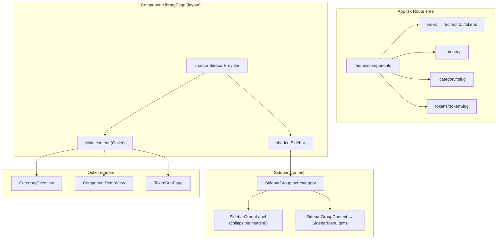

# Design Document: Component Library Reorganisation

## Overview

This design restructures the Component Library page (`/admin/components`) across three axes:

1. **Sidebar replacement** — swap the custom `<aside>` sidebar with the shadcn Sidebar component for consistent accessibility and styling.
2. **Category taxonomy** — replace the abstraction-level grouping (Foundations/Primitives/Composed/Custom) with a purpose-driven taxonomy (Tokens, Inputs, Display, Feedback, Navigation, Composed).
3. **Token sub-pages** — decompose the monolithic `TokenManagerDemo` (tabbed) into individual routed pages per token type, each with its own URL.

The Controls Panel, lazy-loading, and all existing component demos remain unchanged. The `componentRegistry.ts` data file is the single source of truth for what appears in the sidebar and at what route.

## Architecture



The layout component (`ComponentLibraryPage`) wraps the shadcn `SidebarProvider` and renders the `Sidebar` on the left with an `<Outlet>` for content. React Router nested routes determine what renders in the outlet.

## Components and Interfaces

### Updated `ComponentCategory` type

```typescript
export type ComponentCategory = 'tokens' | 'inputs' | 'display' | 'feedback' | 'navigation' | 'composed'
```

The `foundations` and `custom` values are removed.

### shadcn Sidebar integration

Install via `npx shadcn@latest add sidebar`. This adds `src/components/ui/sidebar.tsx` which exports:

- `SidebarProvider` — context wrapper
- `Sidebar` — the root sidebar element
- `SidebarContent` — scrollable content area
- `SidebarGroup` — a collapsible group
- `SidebarGroupLabel` — the group heading (acts as collapse trigger)
- `SidebarGroupContent` — the items within a group
- `SidebarMenu`, `SidebarMenuItem`, `SidebarMenuButton` — menu primitives

### ComponentLibraryPage (layout)

```typescript
// src/pages/ComponentLibraryPage.tsx
interface CategoryDef {
  id: ComponentCategory
  label: string
}

const CATEGORIES: CategoryDef[] = [
  { id: 'tokens', label: 'Tokens' },
  { id: 'inputs', label: 'Inputs' },
  { id: 'display', label: 'Display' },
  { id: 'feedback', label: 'Feedback' },
  { id: 'navigation', label: 'Navigation' },
  { id: 'composed', label: 'Composed' },
]
```

The sidebar iterates `CATEGORIES`, filters `componentRegistry` by category, and renders `SidebarGroup` per category with `NavLink` items inside `SidebarMenuButton`. Active state uses `text-primary` and `border-l-primary` via `cn()`.

### TokenSubPage component

```typescript
// src/pages/component-demos/TokenSubPage.tsx
interface TokenSubPageProps {}

// Uses useParams() to read :tokenSlug
// Maps slug to the correct section component:
//   colours → ColourSection
//   typography → TypographySection
//   shadows → ShadowsDemo (existing)
//   spacing-radius → SpacingSection + RadiusSection
//   icons → IconSection
// Renders ActionBar with reset/export at the bottom
```

### TokenConfigProvider (new context)

```typescript
// src/contexts/TokenConfigContext.tsx
interface TokenConfigContextValue {
  config: TokenConfig
  updateColour: (tokenName: string, mode: 'light' | 'dark', value: PrimitiveRef) => void
  updateSpacing: (tokenName: string, value: number) => void
  updateRadius: (base: number) => void
  updateFontSize: (tokenName: string, value: number) => void
  reset: () => void
  exportJSON: () => void
}
```

Currently `useTokenConfig()` is called inside `TokenManagerDemo`. To preserve edits across sub-page navigation, the hook's state must be lifted into a React context that wraps all token sub-pages. The context provider lives inside `ComponentLibraryPage` so it persists for the session.

### Route structure

```
/admin/components                         → redirect to /admin/components/tokens
/admin/components/tokens                  → redirect to /admin/components/tokens/colours
/admin/components/tokens/:tokenSlug       → TokenSubPage
/admin/components/:category               → CategoryOverview
/admin/components/:category/:slug         → ComponentDemoView
```

Legacy redirects:
```
/admin/components/foundations             → /admin/components/tokens
/admin/components/foundations/colours     → /admin/components/tokens/colours
/admin/components/foundations/typography  → /admin/components/tokens/typography
/admin/components/foundations/shadows     → /admin/components/tokens/shadows
/admin/components/foundations/spacing-radius → /admin/components/tokens/spacing-radius
/admin/components/foundations/tokens      → /admin/components/tokens
```

### Sidebar active state

The active item is determined by matching the current URL against the item's `to` prop. For token items, the link target is `/admin/components/tokens/:slug`. For all other components, it's `/admin/components/:category/:slug`. The `NavLink` `isActive` callback applies:

```tsx
cn(
  "block py-1.5 px-4 pl-6 text-sm text-muted-foreground border-l-2 border-transparent transition-all duration-150",
  "hover:text-foreground hover:bg-background-elevated",
  isActive && "text-primary font-medium border-l-primary bg-accent"
)
```

### Collapsible groups

Each `SidebarGroup` uses local state (`useState(true)` — expanded by default). Clicking the `SidebarGroupLabel` toggles the boolean. When collapsed, `SidebarGroupContent` is hidden via `hidden` attribute or conditional rendering, and a `CaretRight`/`CaretDown` Phosphor icon indicates state.

## Data Models

### Updated componentRegistry entries

The `tokens` category entries replace the old `foundations` entries. Each token type gets its own entry pointing to a dedicated demo component:

```typescript
// tokens category
{ name: 'Colours', slug: 'colours', category: 'tokens', description: '...', component: lazy(() => import('./TokenSubPage')) }
{ name: 'Typography', slug: 'typography', category: 'tokens', ... }
{ name: 'Shadows', slug: 'shadows', category: 'tokens', ... }
{ name: 'Spacing & Radius', slug: 'spacing-radius', category: 'tokens', ... }
{ name: 'Icons', slug: 'icons', category: 'tokens', ... }
```

Note: Token items use a special route pattern (`/admin/components/tokens/:slug`) rather than the generic `:category/:slug` pattern, because they render `TokenSubPage` instead of `ComponentDemoView`.

### Category assignment mapping

| Category | Components |
|---|---|
| tokens | Colours, Typography, Shadows, Spacing & Radius, Icons |
| inputs | Button, Calendar, Checkbox, Input, InputOTP, Label, RadioGroup, Select, Slider, Switch, Textarea, Toggle, ToggleGroup, Form |
| display | Avatar, Badge, Card, Separator, Skeleton, Table, Progress |
| feedback | Alert, AlertDialog, Dialog, Sheet, Sonner, Tooltip, HoverCard, Popover |
| navigation | Accordion, Breadcrumb, Collapsible, Command, ContextMenu, DropdownMenu, Menubar, NavigationMenu, Pagination, ScrollArea, Tabs |
| composed | CardSelector, StatusBadge, MetricCard, DataTable, Toast, Modal |

## Correctness Properties

*A property is a characteristic or behavior that should hold true across all valid executions of a system — essentially, a formal statement about what the system should do. Properties serve as the bridge between human-readable specifications and machine-verifiable correctness guarantees.*

### Property 1: Category validity

*For any* component entry in the registry, its `category` field must be one of `'tokens' | 'inputs' | 'display' | 'feedback' | 'navigation' | 'composed'` — no other values are permitted.

**Validates: Requirements 2.1, 2.10, 4.4**

### Property 2: No legacy entries

*For any* component entry in the registry, its `slug` must not be one of the removed foundation slugs (`'typography'`, `'colours'`, `'shadows'`, `'spacing-radius'`, `'tokens'`) when combined with a `foundations` category, and the `foundations` and `custom` category values must not appear.

**Validates: Requirements 4.1, 4.2, 4.4**

### Property 3: Sidebar item order matches registry

*For any* category, the sidebar items rendered under that category heading appear in the same order as the entries are defined in the `componentRegistry` array for that category.

**Validates: Requirements 2.3**

### Property 4: Sidebar group toggle

*For any* category group in the sidebar, clicking the group heading toggles the visibility of its child items — if expanded, items become hidden; if collapsed, items become visible.

**Validates: Requirements 1.7, 1.8**

### Property 5: Route structure consistency

*For any* component entry in the registry (excluding tokens), its navigable route is exactly `/admin/components/${entry.category}/${entry.slug}`.

**Validates: Requirements 6.1, 1.3**

### Property 6: Category overview completeness

*For any* valid category, navigating to `/admin/components/:category` without a slug renders a category overview that lists every component registered in that category (by name and description).

**Validates: Requirements 6.3**

### Property 7: Lazy loading

*For any* component entry in the registry, its `component` field is a `LazyExoticComponent` (created via `React.lazy()`).

**Validates: Requirements 6.4**

### Property 8: ControlsPanel rendering predicate

*For any* component entry, the ControlsPanel renders if and only if `propControls` is defined and has length > 0. When it renders, it displays exactly one control input per `PropDefinition` entry.

**Validates: Requirements 5.1, 5.5**

### Property 9: Control value propagation

*For any* `PropDefinition` and any valid value for its `controlType`, changing the control passes the new value to the demo component as a prop.

**Validates: Requirements 5.2**

### Property 10: Control reset round-trip

*For any* set of prop value changes applied via the ControlsPanel, clicking the reset button restores all values to their `PropDefinition.defaultValue`.

**Validates: Requirements 5.3**

### Property 11: UsedIn links rendering

*For any* component entry with a non-empty `usedIn` array, the ControlsPanel renders one navigable link per `UsedInLink` entry.

**Validates: Requirements 5.4**

### Property 12: Token state preservation across navigation

*For any* token edit made on a token sub-page, navigating to a different token sub-page and returning preserves the edited value in memory.

**Validates: Requirements 3.8**

### Property 13: Icon search filter

*For any* non-empty search string entered in the Icons sub-page, the displayed icons are exactly those whose names contain the search string (case-insensitive).

**Validates: Requirements 3.7**

## Error Handling

| Scenario | Behaviour |
|---|---|
| Invalid category in URL | Redirect to `/admin/components/tokens` |
| Invalid slug in URL | Redirect to `/admin/components/tokens` |
| Legacy foundation route | Redirect to corresponding token sub-page |
| Component demo fails to load (lazy) | Suspense fallback shows "Loading…" text; React error boundary catches chunk failures |
| Token config corrupted in localStorage | `useTokenConfig` falls back to `DEFAULT_TOKEN_CONFIG` (existing behaviour) |
| Empty component registry category | Category group not rendered in sidebar |

## Testing Strategy

### Unit tests (example-based)

- Verify sidebar renders all six category headings in correct order
- Verify each category contains the exact components in the specified order (requirements 2.4–2.9)
- Verify legacy route redirects work (4.3, 4.5)
- Verify `/admin/components` redirects to `/admin/components/tokens` (6.2)
- Verify `/admin/components/tokens` redirects to `/admin/components/tokens/colours` (3.9)
- Verify active styling classes are applied to the current route's sidebar item (1.4)
- Verify keyboard navigation (Tab, Enter, Space) on sidebar items (1.6)
- Verify sidebar fixed positioning and 220px width (1.5)

### Property-based tests (Vitest + fast-check)

Each property test runs a minimum of 100 iterations using `fast-check` for input generation.

- **Property 1**: Generate random subsets of registry entries → assert all categories are valid
- **Property 2**: Assert no entry has a legacy category or removed slug
- **Property 3**: For randomly selected categories, verify rendered order matches registry order
- **Property 4**: For randomly selected category groups, simulate click and verify toggle state
- **Property 5**: For randomly selected entries, verify route matches pattern
- **Property 6**: For randomly selected categories, verify overview lists all entries
- **Property 7**: For all entries, verify component is LazyExoticComponent
- **Property 8**: For randomly generated PropDefinition arrays (including empty), verify ControlsPanel renders/doesn't render correctly
- **Property 9**: For randomly generated prop values within valid ranges, verify propagation
- **Property 10**: For randomly generated prop changes, verify reset restores defaults
- **Property 11**: For randomly generated UsedInLink arrays, verify link rendering
- **Property 12**: For randomly generated token edits, verify persistence across navigation
- **Property 13**: For randomly generated search strings, verify icon filtering

Tag format: `Feature: component-library-reorganisation, Property {N}: {title}`

### Integration tests

- Full navigation flow: load page → click sidebar item → verify demo renders
- Token editing flow: edit colour → navigate to typography → return → verify colour preserved
- Controls Panel flow: change prop → verify demo updates → reset → verify defaults restored
