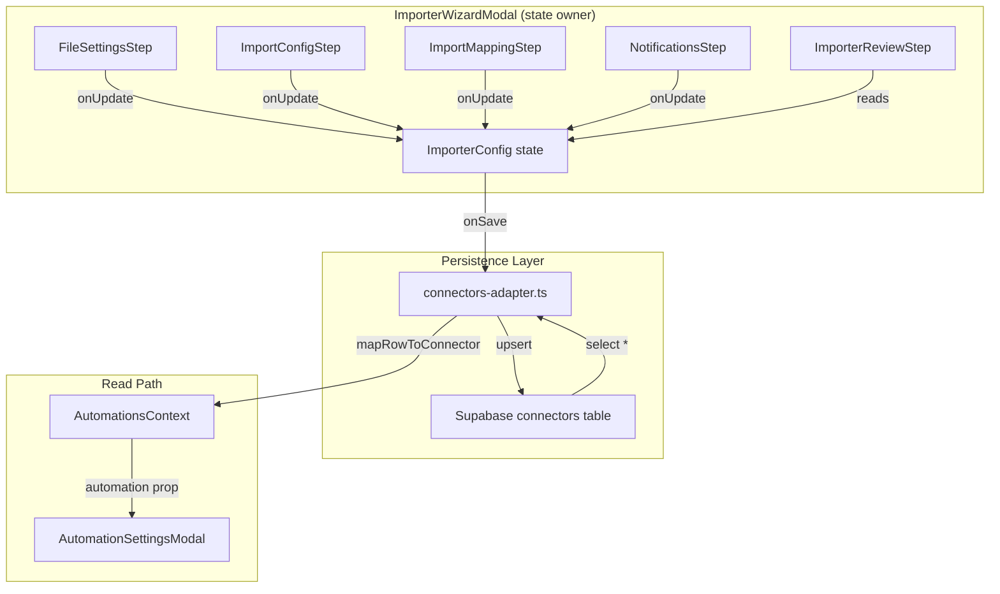

# Design Document: Connector Data Persistence

## Overview

This feature closes the persistence gap between importer and exporter automations. Currently, exporters persist all configuration to Supabase via the `connectors` table, but importers only store the base `Automation` fields — contact config, field mappings, and notification settings are managed as local component state and lost after creation.

The design adds a JSONB `importer_config` column to the existing `connectors` table, introduces typed TypeScript interfaces to replace `Record<string, unknown>`, and wires wizard step components to lift state via callbacks so the parent modal owns the complete configuration before persisting.

### Design Decisions

| Decision | Rationale |
|---|---|
| JSONB column on `connectors` table (not a separate table) | Importer config is always read/written alongside the automation row. A single row fetch is simpler and avoids joins. JSONB gives schema flexibility for future fields. |
| Typed sub-interfaces inside `ImporterConfig` | Compile-time safety catches shape mismatches early. The current `Record<string, unknown>` provides zero guarantees. |
| Callback-based state lifting (not context) | The wizard is a single modal with a known step sequence. Prop-drilling one level (parent → step) is simpler than adding another context provider. |
| Extend existing adapter pattern | The `connectors-adapter.ts` already handles camelCase ↔ snake_case mapping. Adding `importer_config` follows the same pattern. |

## Architecture



## Components and Interfaces

### Step Component Interface Changes

Each wizard step component gains two props:

```typescript
interface StepProps<T> {
  value: T;                    // Current config section (controlled)
  onUpdate: (value: T) => void; // Lift state to parent
}
```

Concrete step prop interfaces:

```typescript
// ImportConfigStep
interface ImportConfigStepProps {
  type: 'contact' | 'transactional';
  value: ContactConfig | TransactionalConfig;
  onUpdate: (config: ContactConfig | TransactionalConfig) => void;
}

// ImportMappingStep
interface ImportMappingStepProps {
  type: 'contact' | 'transactional';
  value: FieldMapping[];
  onUpdate: (mappings: FieldMapping[]) => void;
}

// NotificationsStep
interface NotificationsStepProps {
  value: NotificationConfig;
  onUpdate: (config: NotificationConfig) => void;
  onValidChange?: (valid: boolean) => void;
}

// ImporterReviewStep
interface ImporterReviewStepProps {
  config: ImporterConfig;
}
```

### ImporterWizardModal Changes

The parent modal already owns `config: ImporterConfig` state. The change is passing the relevant section and an `onUpdate` handler to each step:

```typescript
// Inside stepContent rendering
if (stepLabel === 'Contact Configuration') {
  return (
    <ImportConfigStep
      type="contact"
      value={config.contactConfig}
      onUpdate={(contactConfig) => handleConfigUpdate({ contactConfig })}
    />
  );
}
```

### AutomationSettingsModal Changes

The settings modal currently hardcodes importer sections. It will be updated to read from `automation.importerConfig` (which comes from the context, which comes from the adapter, which reads from Supabase):

```typescript
// Before (hardcoded)
<Row label="Update Type" value="Append / Update" />

// After (from data)
<Row label="Update Type" value={UPDATE_TYPE_LABELS[automation.importerConfig?.contactConfig.updateType]} />
```

### Connectors Adapter Changes

`mapRowToConnector` and `mapConnectorToRow` gain handling for the new `importer_config` column:

```typescript
function mapRowToConnector(row: any): Automation {
  return {
    // ...existing fields...
    importerConfig: row.importer_config ?? undefined,
  };
}

function mapConnectorToRow(connector: Automation) {
  return {
    // ...existing fields...
    importer_config: connector.importerConfig ?? null,
  };
}
```

## Data Models

### Typed ImporterConfig (replaces Record<string, unknown>)

```typescript
// src/models/importer.ts

export type UpdateType = 'append-update' | 'append' | 'update';
export type BlankValueHandling = 'preserve' | 'import';

export interface ContactConfig {
  updateType: UpdateType;
  blankValueHandling: BlankValueHandling;
  matchingFields: string[];  // e.g. ['Email', 'Customer ID']
}

export interface TransactionalConfig {
  updateType: UpdateType;
  blankValueHandling: BlankValueHandling;
  matchingFields: string[];
}

export interface FieldMapping {
  sourceField: string;   // Column name from imported file
  targetField: string;   // Field key in UbiQuity database
}

export interface NotificationConfig {
  failureEmails: string[];
  successEnabled: boolean;
  successEmails: string[];
  noFileAlertEnabled: boolean;
  noFileAlertEmails: string[];
}

export interface FilePathConfig {
  pathMode: PathMode;
  folderName: string;
  readPath: string;
  errorFolderPath: string;
  archiveFolderPath: string;
  fileNamePattern: string;
}

export interface ImporterConfig {
  connectionId: string;
  name: string;
  dataType: ImportDataType | null;
  filePathConfig: FilePathConfig;
  notifications: NotificationConfig;
  contactConfig: ContactConfig;
  contactMapping: FieldMapping[];
  transactionalConfig: TransactionalConfig;
  transactionalMapping: FieldMapping[];
}
```

### Automation Model Extension

```typescript
// src/models/automation.ts — add optional field
export interface Automation {
  // ...existing fields...
  importerConfig?: ImporterConfig;  // Present when direction === 'import'
}
```

### Default Values

```typescript
export const DEFAULT_CONTACT_CONFIG: ContactConfig = {
  updateType: 'append-update',
  blankValueHandling: 'preserve',
  matchingFields: ['Email', 'Customer ID'],
};

export const DEFAULT_TRANSACTIONAL_CONFIG: TransactionalConfig = {
  updateType: 'append-update',
  blankValueHandling: 'preserve',
  matchingFields: ['Customer ID'],
};

export const DEFAULT_NOTIFICATION_CONFIG: NotificationConfig = {
  failureEmails: [],
  successEnabled: false,
  successEmails: [],
  noFileAlertEnabled: false,
  noFileAlertEmails: [],
};
```

## Supabase Schema

### Column Addition

Add a single JSONB column to the existing `connectors` table:

```sql
ALTER TABLE connectors
ADD COLUMN importer_config JSONB DEFAULT NULL;
```

This column is `NULL` for exporters and contains the full `ImporterConfig` object for importers.

### Stored Shape (example)

```json
{
  "connectionId": "c1a2b3d4-e5f6-7890-abcd-ef1234567801",
  "name": "Daily Contact Import",
  "dataType": "contact",
  "filePathConfig": {
    "pathMode": "automatic",
    "folderName": "daily-contact-import",
    "readPath": "",
    "errorFolderPath": "",
    "archiveFolderPath": "",
    "fileNamePattern": ""
  },
  "contactConfig": {
    "updateType": "append-update",
    "blankValueHandling": "preserve",
    "matchingFields": ["Email", "Customer ID"]
  },
  "contactMapping": [
    { "sourceField": "email_address", "targetField": "email" },
    { "sourceField": "first_name", "targetField": "firstName" },
    { "sourceField": "last_name", "targetField": "lastName" },
    { "sourceField": "phone_number", "targetField": "phone" },
    { "sourceField": "membership_level", "targetField": "membershipTier" }
  ],
  "transactionalConfig": {
    "updateType": "append-update",
    "blankValueHandling": "preserve",
    "matchingFields": []
  },
  "transactionalMapping": [],
  "notifications": {
    "failureEmails": ["ops@serenity-spa.co.nz"],
    "successEnabled": true,
    "successEmails": ["ops@serenity-spa.co.nz"],
    "noFileAlertEnabled": false,
    "noFileAlertEmails": []
  }
}
```

### Why JSONB (not normalized tables)

- The config is always read/written as a unit — no partial queries needed
- Schema flexibility for future fields without migrations
- Matches the existing pattern (`format_options`, `filters`, `selected_fields` are all JSONB)
- This is a prototype — query performance on JSONB internals is not a concern

## Data Flow

### Create Flow (Wizard → Supabase)

1. User opens ImporterWizardModal
2. Each step renders with `value` from parent state, calls `onUpdate` on change
3. Parent `ImporterConfig` state accumulates all sections
4. User clicks "Create Importer" on Review step
5. `onSave(config)` is called → parent component calls `addAutomationDirect()` from AutomationsContext
6. AutomationsContext calls `connectors-adapter.add()` which maps `importerConfig` → `importer_config` JSONB
7. Supabase stores the row

### Read Flow (Supabase → Settings Modal)

1. App loads → DataLayerProvider fetches all connectors via `connectors-adapter.getAll()`
2. Adapter maps `importer_config` column → `automation.importerConfig` field
3. AutomationsContext holds the full `Automation[]` array
4. User clicks an importer row → AutomationSettingsModal receives the `Automation` object as a prop
5. Modal reads `connector.importerConfig.contactConfig`, `.contactMapping`, `.notifications` etc.
6. No hardcoded values — all sections render from the stored data

### Update Flow (Edit → Supabase)

1. User clicks "Edit Automation" in settings modal
2. ImporterWizardModal opens pre-populated with `automation.importerConfig` values
3. Steps initialize from props (controlled components)
4. On save, `connectors-adapter.update()` sends the updated `importer_config` JSONB

## Seed Script Changes

### New Seed Data Shape

The `src/data/automations.ts` file gains `importerConfig` on importer records. At minimum, one record gets a complete config:

```typescript
// Example: auto-spa-s3-contacts gains full importer config
{
  id: 'auto-spa-s3-contacts',
  // ...existing fields...
  importerConfig: {
    connectionId: 'c1a2b3d4-e5f6-7890-abcd-ef1234567801',
    name: 'Daily Contact Import',
    dataType: 'contact',
    filePathConfig: {
      pathMode: 'automatic',
      folderName: 'daily-contact-import',
      readPath: '',
      errorFolderPath: '',
      archiveFolderPath: '',
      fileNamePattern: '',
    },
    contactConfig: {
      updateType: 'append-update',
      blankValueHandling: 'preserve',
      matchingFields: ['Email', 'Customer ID'],
    },
    contactMapping: [
      { sourceField: 'policy_number', targetField: 'policy_id' },
      { sourceField: 'first_name', targetField: 'firstName' },
      { sourceField: 'last_name', targetField: 'lastName' },
      { sourceField: 'salutation', targetField: 'greeting' },
      { sourceField: 'email_address', targetField: 'email' },
      { sourceField: 'phone_number', targetField: 'phone' },
      { sourceField: 'membership_level', targetField: 'membershipTier' },
    ],
    transactionalConfig: {
      updateType: 'append-update',
      blankValueHandling: 'preserve',
      matchingFields: [],
    },
    transactionalMapping: [],
    notifications: {
      failureEmails: ['ops@serenity-spa.co.nz'],
      successEnabled: true,
      successEmails: ['ops@serenity-spa.co.nz'],
      noFileAlertEnabled: false,
      noFileAlertEmails: [],
    },
  },
}
```

### Seed Script Mapping

`scripts/seed.ts` `seedConnectors()` function adds the new column:

```typescript
async function seedConnectors(): Promise<void> {
  const rows = connectors.map((c) => ({
    // ...existing mappings...
    importer_config: c.importerConfig ?? null,
  }));
  await upsertRows('connectors', rows);
}
```

## Correctness Properties

*A property is a characteristic or behavior that should hold true across all valid executions of a system — essentially, a formal statement about what the system should do. Properties serve as the bridge between human-readable specifications and machine-verifiable correctness guarantees.*

### Property 1: ImporterConfig round-trip serialization

*For any* valid `ImporterConfig` object (with arbitrary `ContactConfig`, `TransactionalConfig`, `FieldMapping[]`, and `NotificationConfig` values), serializing it to the Supabase row format via `mapConnectorToRow` and deserializing back via `mapRowToConnector` SHALL produce an object deeply equal to the original.

**Validates: Requirements 1.2, 2.2, 3.3, 4.2, 5.1, 5.2**

### Property 2: Step callback state lifting

*For any* valid field value change within a wizard step component (`ImportConfigStep`, `ImportMappingStep`, or `NotificationsStep`), invoking the `onUpdate` callback SHALL pass the complete current state of that section, and the parent `ImporterConfig` SHALL contain exactly those values after the update.

**Validates: Requirements 1.1, 2.1, 3.1, 3.2, 4.1, 6.1, 6.2, 6.3**

### Property 3: Controlled component initialization

*For any* non-default `ImporterConfig` section passed as the `value` prop to a step component, the component SHALL render those values as its initial state rather than falling back to empty defaults.

**Validates: Requirements 6.5, 8.1, 8.2, 8.3, 8.4**

## Error Handling

| Scenario | Handling |
|---|---|
| Supabase write fails on save | Optimistic UI rolls back via AutomationsContext pattern (already implemented). Toast shows error message. |
| `importer_config` column is NULL for an importer | Settings modal falls back to "Not configured" display. No crash. |
| Malformed JSONB in database | `mapRowToConnector` returns `importerConfig: undefined` if parsing fails. Modal shows fallback. |
| Step component receives undefined value prop | Each step has a default constant (`DEFAULT_CONTACT_CONFIG`, etc.) used when `value` is undefined. |
| Network timeout during fetch | DataLayerProvider already handles this — shows cached/localStorage data. |

## Testing Strategy

### Unit Tests (example-based)

- AutomationSettingsModal renders stored importer config values (not hardcoded)
- ImporterReviewStep renders all sections from props
- Seed data contains at least one complete importer config
- TypeScript compilation verifies interface shapes (no `Record<string, unknown>`)

### Property Tests (fast-check, minimum 100 iterations)

- **Property 1**: Generate random `ImporterConfig` objects → round-trip through adapter mapping functions → assert deep equality
- **Property 2**: Generate random config section values → simulate onUpdate → assert parent state matches
- **Property 3**: Generate random initial configs → pass as props → assert rendered output matches input

### Integration Tests

- Create importer via wizard → read back from Supabase → verify all fields persisted
- Edit existing importer → verify updated fields in database

### Test Library

Property-based tests use **fast-check** (already available in the project's test dependencies via Vitest ecosystem). Each property test runs a minimum of 100 iterations and is tagged with:

```typescript
// Feature: connector-data-persistence, Property 1: ImporterConfig round-trip serialization
```
