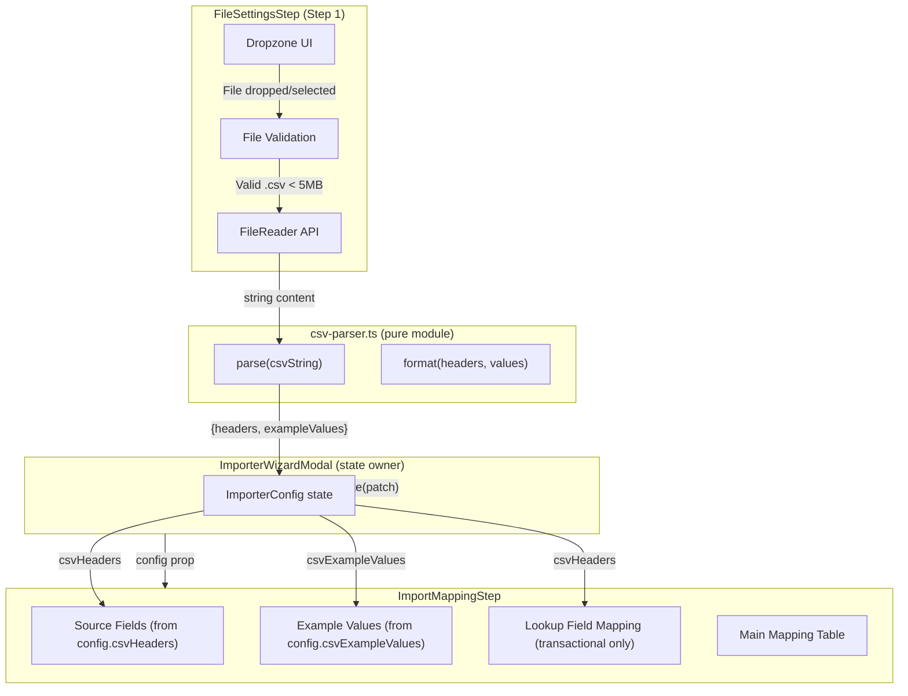
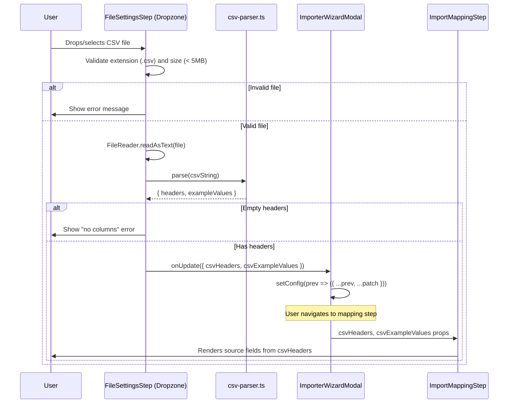

# Design Document: CSV Sample Upload

## Overview

This feature makes the CSV sample file upload on the importer wizard's File Settings step functional. When a user uploads a CSV file via the existing dropzone, a client-side CSV parser extracts the header row and first data row. The extracted headers replace the hardcoded source field arrays in the mapping step, and example values display alongside each mapping row.

The design introduces a new `csv-parser` utility module, extends the `ImporterConfig` model with three new fields (`csvHeaders`, `csvExampleValues`, `lookupMappings`), and rewires the `ImportMappingStep` to read dynamic source fields from config rather than hardcoded arrays.

### Design Decisions

| Decision | Rationale |
|---|---|
| Standalone `csv-parser.ts` module (not inline in component) | Keeps parsing logic pure and testable. The module exports `parse` and `format` functions with no DOM dependencies beyond the input string. |
| FileReader in the component, not the parser | The parser accepts a string — this keeps it pure. The component handles the async FileReader bridge. |
| Store headers as `string[]` on ImporterConfig | Preserves column order from the CSV. The mapping step renders rows in this order. |
| Store example values as `Record<string, string>` | O(1) lookup by header name. The mapping step needs to display the example value for each header. |
| `LookupMapping` as a separate interface | Lookup mappings have different semantics (CSV column → contact table column) than regular field mappings (CSV column → target database field). Separate type makes this explicit. |
| 5 MB file size limit | Prevents browser memory issues. CSV files for import configuration are typically small sample files (< 100 rows). |
| Client-side only (no server) | This is a prototype — no backend processing needed. The parsed data lives in React state. |

## Architecture



## Components and Interfaces

### csv-parser.ts

A pure utility module at `src/utils/csv-parser.ts` with two exports:

```typescript
export interface CsvParseResult {
  headers: string[];
  exampleValues: Record<string, string>;
}

/**
 * Parses a CSV string and extracts the header row and first data row.
 * Handles RFC 4180 quoted fields (commas, newlines, escaped quotes).
 * Trims whitespace from headers, assigns "Column N" for empty headers.
 * Deduplicates headers by appending _2, _3, etc.
 */
export function parse(csvString: string): CsvParseResult;

/**
 * Formats headers and example values into a valid RFC 4180 CSV string.
 * Header row on line 1, data row on line 2, separated by CRLF.
 * Quotes fields containing commas, newlines, or double quotes.
 * Returns empty string if headers array is empty.
 */
export function format(
  headers: string[],
  exampleValues: Record<string, string>
): string;
```

### FileSettingsStep Changes

The existing dropzone div becomes a functional file upload area:

```typescript
interface FileSettingsStepProps {
  config: ImporterConfig;
  basePath: string;
  connectionName: string;
  onUpdate: (patch: Partial<ImporterConfig>) => void;
}
```

New internal state:
- `uploadedFileName: string | null` — displayed in the dropzone after upload
- `fileError: string | null` — validation error message

New behaviour:
- Hidden `<input type="file" accept=".csv">` triggered by click/browse
- `onDrop` / `onChange` handler validates file extension and size
- On valid file: reads via FileReader, calls `parse()`, calls `onUpdate({ csvHeaders, csvExampleValues })`
- On invalid file: sets `fileError` state, does not call `onUpdate`
- Remove button: clears `uploadedFileName`, calls `onUpdate({ csvHeaders: undefined, csvExampleValues: undefined, lookupMappings: [] })`

### ImportMappingStep Changes

The component currently reads from hardcoded `CONTACT_SOURCE_FIELDS` / `TRANSACTIONAL_SOURCE_FIELDS` arrays. After this feature:

```typescript
interface ImportMappingStepProps {
  type: 'contact' | 'transactional';
  value: FieldMapping[];
  onUpdate: (mappings: FieldMapping[]) => void;
  csvHeaders?: string[];
  csvExampleValues?: Record<string, string>;
  lookupMappings?: LookupMapping[];
  onLookupUpdate?: (mappings: LookupMapping[]) => void;
}
```

Behaviour changes:
- If `csvHeaders` is provided and non-empty, use it as the source fields array
- If `csvHeaders` is undefined or empty, display a "Please upload a sample CSV file on the File Settings step" message instead of the mapping table
- Display `csvExampleValues[header] || '—'` in the example values column
- For `type === 'transactional'`: render the Lookup Field Mapping section above the main table
- Remove all hardcoded `*_SOURCE_FIELDS`, `*_EXAMPLE_VALUES`, and `*_INITIAL_MAPPINGS` constants

### Lookup Field Mapping Section

Rendered only when `type === 'transactional'`. Contains:
- A heading "Lookup Field Mapping"
- One or more rows, each with:
  - "File Column" dropdown — options from `csvHeaders` (disabled if no headers)
  - "Contact Table Column" dropdown — options from a `CONTACT_LOOKUP_FIELDS` constant
- "+ Add Lookup Field" button to add rows
- Remove button on each row (when > 1 row exists)

### ImporterWizardModal Changes

The modal passes the new CSV fields through to the mapping step:

```typescript
if (stepLabel === 'Contact Mapping') {
  return (
    <ImportMappingStep
      type="contact"
      value={config.contactMapping}
      onUpdate={(contactMapping) => handleConfigUpdate({ contactMapping })}
      csvHeaders={config.csvHeaders}
      csvExampleValues={config.csvExampleValues}
    />
  );
}

if (stepLabel === 'Transactional Mapping') {
  return (
    <ImportMappingStep
      type="transactional"
      value={config.transactionalMapping}
      onUpdate={(transactionalMapping) => handleConfigUpdate({ transactionalMapping })}
      csvHeaders={config.csvHeaders}
      csvExampleValues={config.csvExampleValues}
      lookupMappings={config.lookupMappings}
      onLookupUpdate={(lookupMappings) => handleConfigUpdate({ lookupMappings })}
    />
  );
}
```

## Data Models

### New fields on ImporterConfig

```typescript
// src/models/importer.ts — additions

export interface LookupMapping {
  sourceField: string;    // CSV column header
  contactField: string;   // Contact table column
}

export interface ImporterConfig {
  // ...existing fields...
  csvHeaders?: string[];
  csvExampleValues?: Record<string, string>;
  lookupMappings?: LookupMapping[];
}
```

### Constraints

| Field | Type | Constraints |
|---|---|---|
| `csvHeaders` | `string[]` | 0–1000 items, each 1–255 characters, non-empty after trim |
| `csvExampleValues` | `Record<string, string>` | Keys match `csvHeaders`, values 0–1000 characters |
| `lookupMappings` | `LookupMapping[]` | 0–10 items, each with non-empty `sourceField` and `contactField` |

### Contact Lookup Fields Constant

```typescript
// Used in the Lookup Field Mapping section dropdown
export const CONTACT_LOOKUP_FIELDS = [
  'Email',
  'Customer ID',
  'Phone',
  'External ID',
  'Account Number',
];
```

## Data Flow

### Upload → Parse → Store → Display



### File Replacement Flow

1. User uploads File A → headers/values stored in config
2. User uploads File B (valid) → headers/values overwritten, `contactMapping` and `transactionalMapping` cleared
3. User uploads File C (invalid) → error shown, File A's data preserved
4. User clicks remove → headers/values/lookupMappings cleared from config

## Correctness Properties

*A property is a characteristic or behavior that should hold true across all valid executions of a system — essentially, a formal statement about what the system should do. Properties serve as the bridge between human-readable specifications and machine-verifiable correctness guarantees.*

### Property 1: CSV parse/format round-trip

*For any* valid array of pre-trimmed, non-empty header strings (1–1000 items, each 1–255 characters) and any record of example values (strings of 0–1000 characters, potentially containing commas, newlines, and double quotes), formatting the headers and values into a CSV string via `format` and then parsing the result via `parse` SHALL produce headers that are character-for-character identical to the input headers, and example values that are character-for-character identical to the input values.

**Validates: Requirements 2.1, 2.2, 2.3, 2.6, 7.1, 7.2, 7.5**

### Property 2: Header whitespace trimming and placeholder assignment

*For any* CSV string where the header row contains fields with leading/trailing whitespace or fields that are empty/whitespace-only, parsing SHALL produce headers where all leading and trailing whitespace is removed, and any header that becomes empty after trimming is replaced with "Column N" where N is the 1-based column index.

**Validates: Requirements 2.4**

### Property 3: Duplicate header deduplication

*For any* CSV string where the header row contains duplicate values after trimming, parsing SHALL produce an array of headers where every element is unique, with duplicates receiving a numeric suffix (_2, _3, etc.) appended in left-to-right order.

**Validates: Requirements 2.7**

### Property 4: ImporterConfig serialization round-trip

*For any* valid `ImporterConfig` object containing `csvHeaders`, `csvExampleValues`, and `lookupMappings` fields, serializing to JSON and deserializing back SHALL produce a deeply equal object (all fields, nested arrays, and record entries identical in value and order).

**Validates: Requirements 3.2, 3.3, 3.6, 5.5, 5.7**

### Property 5: Mapping step displays headers in CSV order with correct example values

*For any* non-empty array of CSV headers and corresponding example values record, the mapping step SHALL render exactly one row per header in the same order as the array, displaying the example value for each header or a dash character when the example value is an empty string.

**Validates: Requirements 4.1, 4.2**

### Property 6: Lookup dropdown populated from CSV headers

*For any* non-empty array of CSV headers passed to the transactional mapping step, the "File Column" dropdown in the Lookup Field Mapping section SHALL contain exactly those headers as selectable options, in the same order as the array.

**Validates: Requirements 5.2**

### Property 7: Filename display truncation

*For any* filename string, the dropzone SHALL display the full filename when it is 40 characters or fewer, and SHALL truncate to 40 characters with an ellipsis suffix when the filename exceeds 40 characters.

**Validates: Requirements 6.1**

## Error Handling

| Scenario | Handling |
|---|---|
| Non-.csv file dropped/selected | Show inline error "Only .csv files are accepted", do not parse |
| File exceeds 5 MB | Show inline error "File is too large (max 5 MB)", do not parse |
| Empty file (0 bytes) | Show inline error "File has no columns" |
| CSV with only whitespace/empty headers | Parser assigns "Column N" placeholders — no error |
| FileReader error (e.g. file unreadable) | Show inline error "Unable to read file", do not update config |
| CSV with no data rows (header only) | Valid — example values are all empty strings, no error |
| Replacement file fails validation | Show error, preserve previous file's data in config |
| User removes file | Clear `csvHeaders`, `csvExampleValues`, `lookupMappings` from config |
| Mapping step rendered with no CSV headers | Show "Please upload a sample CSV file on the File Settings step" message instead of mapping table |

## Testing Strategy

### Property-Based Tests (fast-check, minimum 100 iterations)

Property-based testing is appropriate for this feature because the CSV parser is a pure function with clear input/output behaviour, universal properties (round-trip), and a large input space (arbitrary strings with special characters).

| Property | Test File | Tag |
|---|---|---|
| Property 1: Round-trip | `csv-parser-roundtrip.property.test.ts` | Feature: csv-sample-upload, Property 1: CSV parse/format round-trip |
| Property 2: Whitespace trimming | `csv-parser-trimming.property.test.ts` | Feature: csv-sample-upload, Property 2: Header whitespace trimming and placeholder assignment |
| Property 3: Deduplication | `csv-parser-dedup.property.test.ts` | Feature: csv-sample-upload, Property 3: Duplicate header deduplication |
| Property 4: Config round-trip | `csv-config-roundtrip.property.test.ts` | Feature: csv-sample-upload, Property 4: ImporterConfig serialization round-trip |
| Property 5: Mapping display | `csv-mapping-display.property.test.ts` | Feature: csv-sample-upload, Property 5: Mapping step displays headers in CSV order |
| Property 6: Lookup dropdown | `csv-lookup-dropdown.property.test.ts` | Feature: csv-sample-upload, Property 6: Lookup dropdown populated from CSV headers |
| Property 7: Filename truncation | `csv-filename-truncation.property.test.ts` | Feature: csv-sample-upload, Property 7: Filename display truncation |

Each property test:
- Uses `fast-check` (already in devDependencies)
- Runs minimum 100 iterations (`{ numRuns: 100 }`)
- Is tagged with a comment referencing the design property
- Implements a SINGLE property-based test per correctness property

### Unit Tests (example-based)

- FileSettingsStep: file picker opens with `accept=".csv"`, filename displays after upload, error messages for invalid files
- ImportMappingStep: "sample file required" message when no headers, target field dropdowns populated per data type, mappings cleared on file replacement
- Lookup section: renders only for transactional, add/remove rows, disabled when no headers
- csv-parser edge cases: empty string input, single-column CSV, 1000-column CSV

### Integration Tests

- Full wizard flow: upload CSV on step 1 → navigate to mapping step → verify headers appear as source fields
- File replacement: upload file A → configure mappings → upload file B → verify mappings cleared and new headers shown
