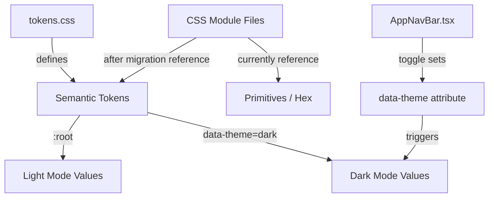

# Design Document: Dark Mode Token Migration

## Overview

This feature migrates ~95 CSS Module files from hardcoded hex values and primitive palette variables to semantic design tokens, enabling the existing `[data-theme="dark"]` mechanism to produce a correct dark theme across the entire prototype. Additionally, the dark mode text button in the avatar dropdown is replaced with a toggle switch for clearer state indication.

The token system is already fully set up — `tokens.css` defines both light and dark semantic token values, and `globals.css` maps them to Tailwind. The problem is purely that component-level CSS modules reference the wrong layer (primitives/hex instead of semantic tokens).

**AppNavBar.module.css** serves as the reference implementation — it already uses semantic tokens exclusively and responds correctly to dark mode.

## Architecture

The migration is a CSS-only refactoring with one small React component change. No new architecture is introduced.



### Migration Strategy

The migration uses a **batch find-and-replace approach** with contextual review:

1. **Automated pass** — regex-based find-and-replace for unambiguous mappings (e.g. `var(--color-zinc-200)` in a `border` property → `var(--color-border-default)`)
2. **Contextual review** — for each replacement, verify the CSS property context matches the semantic role (a `--color-zinc-200` used as a background needs `--color-background-sunken`, not `--color-border-default`)
3. **Validation** — confirm zero remaining primitive/hex references in colour-accepting properties

### Processing Order

Files are processed in batches by component area to allow incremental visual verification:

1. `src/components/layout/` (excluding AppNavBar which is already done)
2. `src/components/billing/`
3. `src/components/assets/`
4. `src/components/campaigns/`
5. `src/components/audiences/`
6. `src/components/shared/`
7. Remaining `src/components/` subdirectories
8. `src/pages/`

## Components and Interfaces

### Token Mapping Table

The canonical mapping from primitives/hex to semantic tokens:

| Source Value | Target Semantic Token | Context |
|---|---|---|
| `#fff` / `#FFFFFF` | `var(--color-background-default)` | Background context |
| `#fff` / `#FFFFFF` | `var(--color-text-on-accent)` | Text on teal/accent background |
| `#14B88A` | `var(--color-accent-default)` | Brand teal |
| `#E6F9F5` / `#e6f7f2` | `var(--color-accent-subtle)` | Light teal background |
| `#10A078` | `var(--color-accent-hover)` | Teal hover state |
| `#0D8866` | `var(--color-accent-text)` | Dark teal text |
| `var(--color-zinc-50)` | `var(--color-background-default)` | Page/section background |
| `var(--color-zinc-100)` | `var(--color-background-subtle)` | Surface/card background |
| `var(--color-zinc-200)` | `var(--color-border-default)` | Border context |
| `var(--color-zinc-200)` | `var(--color-background-sunken)` | Background/divider context |
| `var(--color-zinc-300)` | `var(--color-border-strong)` | Stronger border |
| `var(--color-zinc-400)` | `var(--color-text-tertiary)` | Low-emphasis text |
| `var(--color-zinc-500)` | `var(--color-text-secondary)` | Medium-emphasis text |
| `var(--color-zinc-600)` | `var(--color-text-secondary)` | Medium-emphasis text |
| `var(--color-zinc-800)` | `var(--color-text-primary)` | High-emphasis text |
| `var(--color-zinc-900)` | `var(--color-text-primary)` | High-emphasis text |
| `var(--color-zinc-950)` | `var(--color-text-primary)` | High-emphasis text |
| `var(--color-primary-500)` | `var(--color-accent-default)` | Brand accent |
| `var(--color-primary-50)` | `var(--color-accent-subtle)` | Light accent background |
| `var(--color-primary-600)` | `var(--color-accent-hover)` | Accent hover |
| `var(--color-primary-700)` | `var(--color-accent-text)` | Accent text |
| `var(--color-grey-*)` | Same as `--color-zinc-*` mapping | Grey aliases to zinc |

### Context-Sensitive Decisions

Some primitives map to different semantic tokens depending on the CSS property:

- `var(--color-zinc-200)` in `border` → `var(--color-border-default)`
- `var(--color-zinc-200)` in `background` → `var(--color-background-sunken)`
- `#fff` in `color` on accent bg → `var(--color-text-on-accent)`
- `#fff` in `background` → `var(--color-background-default)`
- `var(--color-zinc-100)` in `background` → `var(--color-background-subtle)`
- `var(--color-zinc-100)` in `border` → `var(--color-border-default)` (rare, use judgement)

### Dark Mode Toggle Switch Component Change

The existing text button in `AppNavBar.tsx` that reads "Light Mode" / "Dark Mode" is replaced with a labelled toggle switch using the existing shadcn `Switch` component from `src/components/ui/switch.tsx`.

**Current implementation (to be replaced):**
```tsx
<button type="button" role="menuitem" className={styles.dropdownItem} onClick={() => setDarkMode((v) => !v)}>
  {darkMode ? 'Light Mode' : 'Dark Mode'}
</button>
```

**New implementation:**
```tsx
<div className={styles.darkModeToggle}>
  <span className={styles.darkModeLabel}>Dark Mode</span>
  <Switch checked={darkMode} onCheckedChange={setDarkMode} />
</div>
```

**New CSS (AppNavBar.module.css):**
```css
.darkModeToggle {
  display: flex;
  align-items: center;
  justify-content: space-between;
  padding: 8px 12px;
  border-radius: 4px;
}

.darkModeLabel {
  font-family: 'Inter', sans-serif;
  font-size: 13px;
  font-weight: 500;
  color: var(--color-text-primary);
}
```

## Data Models

No data model changes. This migration is purely CSS and one minor React component update. The `darkMode` state and `data-theme` attribute mechanism remain unchanged.

## Correctness Properties

*A property is a characteristic or behavior that should hold true across all valid executions of a system — essentially, a formal statement about what the system should do. Properties serve as the bridge between human-readable specifications and machine-verifiable correctness guarantees.*

### Property 1: Zero hardcoded hex colours in colour-accepting properties

*For any* CSS Module file in scope (`src/components/**/*.module.css` excluding `src/components/ui/`, and `src/pages/**/*.module.css`), a case-insensitive regex scan for `#[0-9a-fA-F]{3,8}` within colour-accepting CSS property declarations (`color`, `background-color`, `background`, `border-color`, `border`, `border-top`, `border-bottom`, `border-left`, `border-right`, `outline-color`, `outline`, `box-shadow`, `fill`, `stroke`, `accent-color`) SHALL return zero matches.

**Validates: Requirements 1.1, 1.5**

### Property 2: Zero primitive palette variable references in colour-accepting properties

*For any* CSS Module file in scope, scanning for references to `var(--color-zinc-*)`, `var(--color-primary-*)`, or `var(--color-grey-*)` within colour-accepting CSS property declarations SHALL return zero matches.

**Validates: Requirements 2.1, 2.2, 2.3**

### Property 3: Light mode value preservation

*For any* mapping entry in the token migration (source primitive/hex → semantic token), the semantic token's `:root` value in `tokens.css` SHALL resolve to the same hex value as the source it replaces, or to the closest available semantic token value where an exact match does not exist (documented deviations only: `#FFFFFF` → `--color-background-default` resolves to `#FAFAFA`, `--color-zinc-600` → `--color-text-secondary` resolves to `#71717A` not `#52525B`).

**Validates: Requirements 3.1, 3.3**

### Property 4: Dark mode contrast ratio

*For any* text/background semantic token pair used together in the application (e.g. `--color-text-primary` on `--color-background-default`, `--color-text-secondary` on `--color-background-subtle`), the contrast ratio computed from the `[data-theme="dark"]` values SHALL be at least 4.5:1.

**Validates: Requirements 4.2**

### Property 5: Non-colour primitive references preserved

*For any* CSS Module file in scope, references to primitive palette variables (`--color-zinc-*`, `--color-primary-*`, `--color-grey-*`) used in non-colour CSS properties (e.g. `font-size`, `padding`, `margin`, `gap`, `width`, `height`, `border-radius`, `transition`, `opacity`, `z-index`) SHALL remain unchanged after migration.

**Validates: Requirements 6.5**

## Error Handling

This migration has minimal runtime error surface since it's a CSS-only change. Potential issues and mitigations:

| Scenario | Mitigation |
|---|---|
| Semantic token not defined | All tokens used in the mapping are already defined in `tokens.css` — no new tokens are introduced. Build will show missing variable warnings if a typo occurs. |
| Incorrect context mapping (e.g. border token used for background) | Visual review per batch. AppNavBar serves as the reference for correct token usage. |
| Shorthand property breakage (e.g. `border: 1px solid var(...)`) | Only the colour portion is replaced. The shorthand structure is preserved. |
| `#FFFFFF` → `#FAFAFA` visual difference | The 2% luminance difference between pure white and `--color-background-default` (#FAFAFA) is imperceptible. For text-on-accent contexts, `--color-text-on-accent` (#FFFFFF) is used instead. |
| Dark mode toggle state lost on refresh | Existing behaviour — `darkMode` state is initialised from `document.documentElement.getAttribute('data-theme')`. No change to persistence logic (out of scope). |

## Testing Strategy

### Automated Validation (Property-Based)

The primary validation mechanism is a **CSS static analysis script** that can be run as a Vitest test. This script:

1. Globs all `.module.css` files in scope
2. Parses each file to extract colour-accepting property declarations
3. Asserts zero matches for hex patterns and primitive variable references

This approach is well-suited to property-based testing because:
- The input space is the set of all CSS module files (enumerable)
- The property is universal: "for all files, zero violations"
- Running 100+ iterations isn't needed since we enumerate all files, but the property structure holds

**Library:** Vitest (already in the project)

**Test configuration:**
- Each property test references its design document property
- Tag format: `Feature: dark-mode-token-migration, Property {number}: {property_text}`

### Unit Tests (Example-Based)

| Test | Validates |
|---|---|
| Avatar dropdown renders Switch component with "Dark Mode" label | Req 5.1 |
| Switch is checked when `darkMode` state is true | Req 5.2, 5.3 |
| Clicking Switch toggles `data-theme` on document root | Req 5.4 |
| No text button with "Light Mode"/"Dark Mode" text in dropdown | Req 5.5 |

### Manual Validation

| Check | Method |
|---|---|
| Light mode visual parity | Side-by-side screenshot comparison before/after migration |
| Dark mode full coverage | Toggle dark mode, navigate all pages, verify no light-mode remnants |
| Toggle switch styling | Visual check that switch aligns with dropdown menu items |
| Scope boundaries | `git diff` confirms no changes to `tokens.css`, `globals.css`, or `src/components/ui/` |

### Known Deviations (Light Mode)

These replacements introduce a minor value difference that is visually imperceptible:

| Original | Replacement | Original Value | New Value | Delta |
|---|---|---|---|---|
| `#FFFFFF` (background) | `--color-background-default` | #FFFFFF | #FAFAFA | ΔL ≈ 0.4% |
| `var(--color-zinc-600)` (text) | `--color-text-secondary` | #52525B | #71717A | Lighter by 1 step |

The zinc-600 → text-secondary deviation is intentional: `--color-text-secondary` is the correct semantic role for medium-emphasis text, and its dark mode counterpart (#A1A1AA) provides proper contrast on dark backgrounds. Using the semantic token is preferred over value-exact matching.

## File Change Summary

| Area | Estimated Files | Change Type |
|---|---|---|
| `src/components/layout/AppNavBar.tsx` | 1 | Replace text button with Switch toggle |
| `src/components/layout/AppNavBar.module.css` | 1 | Add `.darkModeToggle` and `.darkModeLabel` styles |
| `src/components/**/*.module.css` (excl. ui/) | ~80 | Replace hex/primitives with semantic tokens |
| `src/pages/**/*.module.css` | ~15 | Replace hex/primitives with semantic tokens |
| **Total** | ~97 files | |

No changes to: `tokens.css`, `globals.css`, `src/components/ui/*`, any non-module CSS files.

