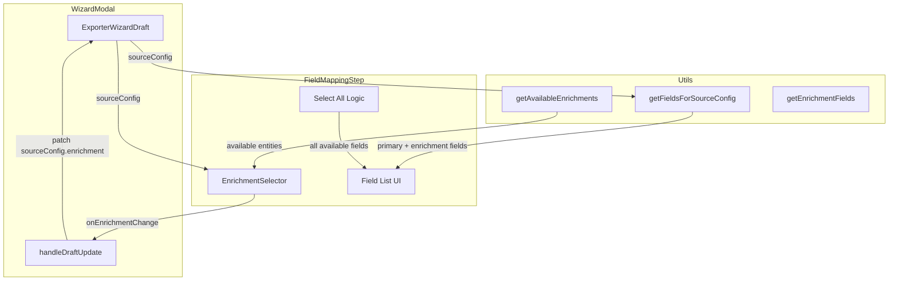

# Design Document: Enrichment Field Selection

## Overview

This feature adds an "Enrichment Selector" UI within the `FieldMappingStep` component that allows users to explicitly toggle additional source entities (contacts, transactions, messages) to pull fields from — independently of what they filtered on in the Data Source step.

Currently, enrichment fields only appear when a user configures an enrichment entity during the Data Source step. This feature decouples enrichment selection from filter configuration, giving users a dedicated control in the Field Mapping step to add secondary entity fields to their export.

### Key Design Decisions

1. **Enrichment selector lives in FieldMappingStep** — it's a field-level concern, not a source/filter concern. Users decide which fields they want at the point where they see available fields.
2. **Single enrichment entity at a time** — the existing `EnrichmentConfig` model supports one enrichment entity per `SourceConfig`. This constraint is preserved (no multi-enrichment in this iteration).
3. **Enrichment fields are opt-in** — when an enrichment entity is toggled on, its fields appear in the "available" (unselected) pool. Users must explicitly select which enrichment fields to include.
4. **Source badge distinguishes field origin** — the existing `source` badge on each field row already shows the entity origin. Enrichment fields will display their entity name (e.g. "transactions") in this badge.

## Architecture



### Data Flow

1. `FieldMappingStep` reads `draft.sourceConfig` to derive available enrichment options via `getAvailableEnrichments(primarySource)`
2. User toggles an enrichment entity in the `EnrichmentSelector`
3. The toggle calls `onUpdate({ sourceConfig: { ...sourceConfig, enrichment: newEnrichmentConfig } })`
4. `WizardModal.handleDraftUpdate` processes the patch — existing logic already handles enrichment removal (field cleanup)
5. `getFieldsForSourceConfig(sourceConfig)` returns primary + enrichment fields
6. `FieldMappingStep` renders enrichment fields as unselected in the available pool

## Components and Interfaces

### EnrichmentSelector (new component)

A chip-based toggle group rendered at the top of the `FieldMappingStep`, above the field list.

```typescript
interface EnrichmentSelectorProps {
  primarySource: PrimarySourceType;
  currentEnrichment: EnrichmentConfig | null;
  onEnrichmentChange: (enrichment: EnrichmentConfig | null) => void;
}
```

**Rendering:**
- Displays as a row of toggle chips (one per available enrichment entity)
- Active chip has primary colour border + filled background
- Inactive chip has default border + transparent background
- Label: "Enrich with:" followed by entity chips (e.g. "Transactions", "Messages")

**Behaviour:**
- Clicking an inactive chip activates it (sets enrichment to that entity)
- Clicking the active chip deactivates it (sets enrichment to null)
- Only one chip can be active at a time (matches single-enrichment model constraint)

### FieldMappingStep modifications

The existing `FieldMappingStep` component will be extended with:

1. **EnrichmentSelector rendering** — placed between the join key indicator and the field list, conditionally rendered when `sourceConfig` is non-null
2. **Enrichment toggle handler** — builds the appropriate `EnrichmentConfig` for the selected entity and patches `sourceConfig`
3. **Unselected enrichment fields in available pool** — when enrichment is active, `getFieldsForSourceConfig` already returns enrichment fields, which will appear in the unselected section

### handleDraftUpdate (WizardModal) — no changes needed

The existing `handleDraftUpdate` already handles:
- Enrichment removal → filters out fields with `source === oldEnrichmentEntity`
- Enrichment change → removes old entity's fields, preserves primary fields
- Filter-only changes → preserves all fields including enrichment

### Utility functions — minimal changes

`getAvailableEnrichments(primarySource)` already exists in `source-config-utils.ts` and returns the correct enrichment options.

`getFieldsForSourceConfig(config)` already returns enrichment fields when `config.enrichment` is set.

New helper needed:

```typescript
/**
 * Creates a default EnrichmentConfig for a given entity.
 * - contacts: { entity: 'contacts' }
 * - transactions: { entity: 'transactions', tableId: '', joinStrategy: 'most_recent' }
 * - messages: { entity: 'messages', channel: 'email', statuses: ['delivered'] }
 */
function createDefaultEnrichmentConfig(entity: EnrichmentEntity): EnrichmentConfig;
```

## Data Models

### Existing models (no changes)

```typescript
// SourceConfig already has enrichment field
interface ContactsSourceConfig {
  primarySource: 'contacts';
  filter: ContactsFilterConfig;
  enrichment: EnrichmentConfig | null;  // ← this is what we toggle
}

// EnrichmentConfig already supports all three entities
type EnrichmentConfig =
  | TransactionEnrichmentOptions
  | MessageEnrichmentOptions
  | ContactEnrichmentOptions;

// SelectedField already has source discrimination
interface SelectedField {
  key: string;
  label: string;
  source: 'contact' | 'transactions' | 'messages' | 'event' | string;
}
```

### State lifecycle

```
sourceConfig.enrichment: null → user toggles "Transactions" → { entity: 'transactions', tableId: '', joinStrategy: 'most_recent' }
                              → getFieldsForSourceConfig returns primary + transaction fields
                              → enrichment fields appear in unselected pool
                              → user selects specific enrichment fields → added to selectedFields
                              → user toggles off "Transactions" → enrichment: null
                              → handleDraftUpdate removes transaction fields from selectedFields
                              → handleDraftUpdate removes transaction field renames from columnRenames
```

## Correctness Properties

*A property is a characteristic or behavior that should hold true across all valid executions of a system — essentially, a formal statement about what the system should do. Properties serve as the bridge between human-readable specifications and machine-verifiable correctness guarantees.*

### Property 1: Available enrichment derivation

*For any* `PrimarySourceType` value, `getAvailableEnrichments(primarySource)` SHALL return exactly the two `EnrichmentEntity` values that are not equal to `primarySource`.

**Validates: Requirements 1.1, 1.2, 1.3, 1.4**

### Property 2: Enrichment field key and label prefixing

*For any* valid `EnrichmentConfig`, the fields returned by `getEnrichmentFields(enrichment)` SHALL all have keys prefixed with `enrichment_{entity}_` and labels prefixed with the capitalised singular entity name followed by `: `.

**Validates: Requirements 3.1**

### Property 3: Deselection cleanup removes entity fields and renames

*For any* set of `selectedFields` and `columnRenames` containing fields from an enrichment entity, deselecting that entity SHALL result in `selectedFields` containing no fields whose source matches the deselected entity, and `columnRenames` containing no entries whose `fieldKey` matches a field from the deselected entity.

**Validates: Requirements 2.3, 2.4**

### Property 4: Filter-only changes preserve enrichment state

*For any* `SourceConfig` change where `primarySource` remains the same and only the `filter` property changes, the `enrichment` field, all enrichment fields in `selectedFields`, and their associated `columnRenames` SHALL remain unchanged.

**Validates: Requirements 4.2**

### Property 5: Primary source conflict clears enrichment

*For any* source config change where the new `primarySource` equals the currently selected `enrichment.entity`, the system SHALL clear the enrichment (set to null) and remove all fields belonging to that enrichment entity from `selectedFields`.

**Validates: Requirements 4.3**

### Property 6: Select All includes all available fields

*For any* set of available fields (primary + enrichment), invoking "Select All" SHALL result in `selectedFields` containing every field from the available fields list.

**Validates: Requirements 6.3, 6.4**

## Error Handling

| Scenario | Handling |
|---|---|
| `sourceConfig` is null | EnrichmentSelector does not render. No enrichment options shown. |
| Enrichment entity requires configuration (e.g. transactions needs tableId) | Create with empty defaults. Fields appear but validation in Data Source step will block export until configured. For this prototype, default values are used. |
| User selects enrichment then changes primary source to same entity | handleDraftUpdate detects conflict and clears enrichment + associated fields automatically. |
| User navigates back to Data Source and changes filter only | Enrichment state preserved — no field loss. |
| User navigates back to Data Source and changes primary source | Full reset via `didSourceOrSubSourceChange` — enrichment cleared with all fields. |

## Testing Strategy

### Property-Based Tests (Vitest + fast-check)

Property-based testing is appropriate here because the enrichment logic involves pure utility functions with clear input/output relationships and a meaningful input space (3 primary sources × 3 enrichment entities × variable field sets).

**Library:** `fast-check` with Vitest
**Minimum iterations:** 100 per property

Each property test will be tagged with:
```
// Feature: enrichment-field-selection, Property {N}: {property_text}
```

**Properties to implement:**
1. Available enrichment derivation — generate random primary source, verify output
2. Enrichment field prefixing — generate random enrichment configs, verify key/label format
3. Deselection cleanup — generate random field sets with enrichment fields, apply deselection logic, verify cleanup
4. Filter-only preservation — generate draft with enrichment, apply filter-only patch, verify preservation
5. Primary source conflict clearing — generate configs where enrichment matches new primary, verify clearing
6. Select All completeness — generate random available field sets, verify select all includes all

### Unit Tests (Example-Based)

- EnrichmentSelector renders correct chips for each primary source
- EnrichmentSelector does not render when sourceConfig is null
- Clicking active chip deselects enrichment
- Enrichment fields appear as unselected in available pool
- Enrichment fields support drag-and-drop reorder
- Enrichment fields support column rename
- Select All / Deselect All includes enrichment fields

### Integration Tests

- Full wizard flow: select enrichment → pick fields → navigate away → return → verify state preserved
- Full wizard flow: change primary source → verify enrichment cleared
- Full wizard flow: select enrichment → deselect → verify fields removed from export
