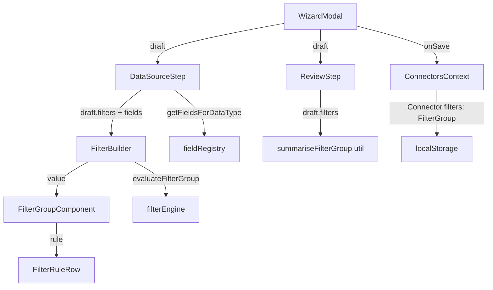
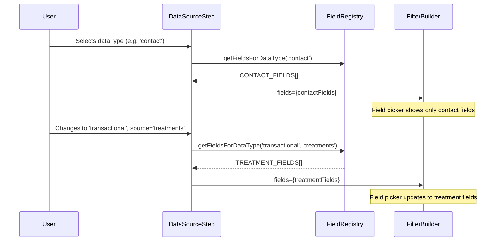
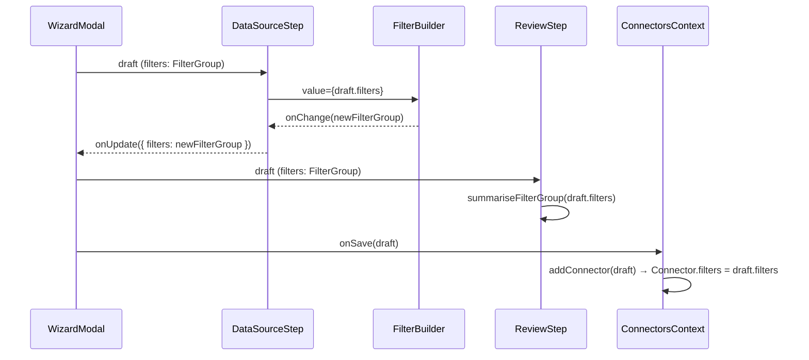

# Design Document: Exporter Wizard Filters

## Overview

This feature replaces the static `FilterSection` component in the exporter wizard with the shared `FilterBuilder` component from the segmentation-filters spec. The core change is a data model migration from the flat `FilterConfig` type (with hardcoded `dateRange`, `membershipTier`, `transactionType` fields) to the recursive `FilterGroup` model that supports dynamic rule-based filtering with AND/OR combinators, nested groups, and field-aware operators.

This is primarily a wiring/integration task. The `FilterBuilder` component, the `FilterGroup` model, the `evaluateFilterGroup()` engine, and the `getFieldsForDataType()` registry function all exist and are functional. The work involves:

1. Changing the `filters` type on `WizardDraft` and `Connector` from `FilterConfig` to `FilterGroup`
2. Replacing `FilterSection` with `FilterBuilder` in `DataSourceStep`
3. Updating `ReviewStep` to render a human-readable filter summary from `FilterGroup`
4. Migrating test fixtures and adding a legacy data guard
5. Deleting the dead `FilterSection` component and `FilterConfig` type

## Architecture

### Current State

```
WizardDraft.filters: FilterConfig ──► FilterSection (static dropdowns)
                                          │
                                          ▼
                                    ReviewStep (reads dateRange, membershipTier, transactionType)
                                          │
                                          ▼
                                    Connector.filters: FilterConfig (persisted to localStorage)
```

### Target State

```
WizardDraft.filters: FilterGroup ──► FilterBuilder (dynamic rule UI)
                                          │
                                          ├── fields ◄── getFieldsForDataType(dataType, transactionalSource)
                                          ├── value  ◄── draft.filters
                                          ├── onChange ──► onUpdate({ filters: newGroup })
                                          └── match count ◄── evaluateFilterGroup(group, accountContacts)
                                          │
                                          ▼
                                    ReviewStep (summarises FilterGroup rules as human-readable text)
                                          │
                                          ▼
                                    Connector.filters: FilterGroup (persisted to localStorage)
```

### Component Dependency Flow



## Components and Interfaces

### Modified Components

| Component | File | Change |
|---|---|---|
| `DataSourceStep` | `src/components/wizard/DataSourceStep.tsx` | Replace `FilterSection` with `FilterBuilder`. Compute `fields` from `getFieldsForDataType()`. Update hint text. Remove `FilterConfig` import. |
| `ReviewStep` | `src/components/wizard/ReviewStep.tsx` | Replace legacy `dateRange`/`membershipTier`/`transactionType` display with a `summariseFilterGroup()` utility that renders each complete rule as "Field Operator Value" with combinators between groups. |
| `WizardModal` | `src/components/wizard/WizardModal.tsx` | Update `DEFAULT_FILTERS` import to use the new `FilterGroup` default. No structural changes — the modal already passes `draft.filters` through generically. |

### Deleted Components

| Component | File | Reason |
|---|---|---|
| `FilterSection` | `src/components/wizard/FilterSection.tsx` | Replaced by `FilterBuilder` |
| `FilterSection styles` | `src/components/wizard/FilterSection.module.css` | No longer referenced |

### Existing Components (unchanged)

| Component | File | Role |
|---|---|---|
| `FilterBuilder` | `src/components/shared/FilterBuilder.tsx` | Renders the dynamic filter UI with live match count. Already accepts `value: FilterGroup`, `onChange`, `fields`, `readOnly` props. |
| `FilterGroupComponent` | `src/components/shared/FilterGroup.tsx` | Renders recursive filter groups with combinators. |
| `FilterRuleRow` | `src/components/shared/FilterRuleRow.tsx` | Renders individual filter rules with field/operator/value pickers. |

### New Utility: `summariseFilterGroup`

A pure function in `src/utils/filterSummary.ts` that converts a `FilterGroup` into a human-readable string array for the ReviewStep.

```typescript
import type { FilterGroup } from '../models/segment';
import type { FieldDefinition } from '../data/fieldRegistry';

interface RuleSummary {
  text: string;       // e.g. "First Name contains John"
}

interface GroupSummary {
  combinator: 'AND' | 'OR';
  items: (RuleSummary | GroupSummary)[];
}

export function summariseFilterGroup(
  group: FilterGroup,
  fieldLookup: (key: string) => FieldDefinition | undefined,
): GroupSummary;

export function hasCompleteRules(group: FilterGroup): boolean;
```

### New Utility: `isLegacyFilterConfig`

A type guard in `src/utils/filterMigration.ts` that detects legacy `FilterConfig` shapes loaded from localStorage and converts them to empty `FilterGroup` objects.

```typescript
import type { FilterGroup } from '../models/segment';

export function isLegacyFilterConfig(value: unknown): boolean;

export function migrateFilters(value: unknown): FilterGroup;
```

## Data Models

### FilterGroup (existing, from `src/models/segment.ts`)

```typescript
interface FilterRule {
  field: string;
  operator: string;
  value: string | string[] | number;
}

interface FilterGroup {
  combinator: 'AND' | 'OR';
  rules: FilterRule[];
  groups: FilterGroup[];
}
```

### WizardDraft (modified)

```typescript
// BEFORE
import type { FilterConfig } from './connector';

interface WizardDraft {
  // ...
  filters: FilterConfig;
}

export const DEFAULT_FILTERS: FilterConfig = {
  dateRange: 'all_time',
};

// AFTER
import type { FilterGroup } from './segment';

interface WizardDraft {
  // ...
  filters: FilterGroup;
}

export const DEFAULT_FILTERS: FilterGroup = {
  combinator: 'AND',
  rules: [{ field: '', operator: '', value: '' }],
  groups: [],
};
```

### Connector (modified)

```typescript
// BEFORE
import type { FilterConfig } from './connector'; // same file

interface Connector {
  // ...
  filters: FilterConfig;
}

// AFTER
import type { FilterGroup } from './segment';

interface Connector {
  // ...
  filters: FilterGroup;
}
```

### FilterConfig (removed)

The `FilterConfig` interface and its references are removed from `src/models/connector.ts` and `src/models/index.ts`. No other module depends on it after the migration.

### Data Flow: Field Selection



### Data Flow: FilterGroup Through the Wizard



## Seed Data Migration

The test fixtures in `ConnectionRow.test.tsx` and `ConnectorsContext.test.tsx` contain `Connector` objects with the old `FilterConfig` shape (`{ dateRange: 'all_time' }`, `{ dateRange: 'last_30_days' }`, etc.). These must be updated to use `FilterGroup` objects.

### Migration Strategy

**Test fixtures**: Replace all `FilterConfig` literals with equivalent `FilterGroup` objects. Since the old filters were non-functional (preview only), the equivalent is an empty `FilterGroup`:

```typescript
// BEFORE
filters: { dateRange: 'last_30_days' }

// AFTER
filters: { combinator: 'AND', rules: [{ field: '', operator: '', value: '' }], groups: [] }
```

**localStorage guard**: The `ConnectorsContext` loads connectors from `localStorage`. Existing users may have connectors saved with the old `FilterConfig` shape. The `migrateFilters()` utility handles this:

```typescript
// In ConnectorsContext loadConnectors()
function loadConnectors(): Connector[] {
  // ... existing parse logic ...
  return parsed.map((c: Connector) => ({
    ...c,
    filters: migrateFilters(c.filters),
  }));
}
```

The `isLegacyFilterConfig` guard detects objects with a `dateRange` property (which `FilterGroup` never has) and returns an empty `FilterGroup`.

## Files to Modify

| File | Change |
|---|---|
| `src/models/connector.ts` | Remove `FilterConfig` interface. Change `Connector.filters` type to `FilterGroup`. Add import of `FilterGroup` from `./segment`. |
| `src/models/wizard.ts` | Change `WizardDraft.filters` type to `FilterGroup`. Update `DEFAULT_FILTERS` to empty `FilterGroup`. Replace `FilterConfig` import with `FilterGroup` from `./segment`. |
| `src/models/index.ts` | Remove `FilterConfig` from re-exports. |
| `src/components/wizard/DataSourceStep.tsx` | Replace `FilterSection` with `FilterBuilder`. Add `getFieldsForDataType()` call. Remove `FilterConfig` import. Update hint text. |
| `src/components/wizard/ReviewStep.tsx` | Remove legacy filter display. Add `summariseFilterGroup()` call. Import `FilterGroup` from segment model. |
| `src/components/wizard/WizardModal.tsx` | Update `DEFAULT_FILTERS` usage (no structural change needed — it imports from wizard.ts). |
| `src/contexts/ConnectorsContext.tsx` | Add `migrateFilters()` call in `loadConnectors()` for localStorage migration. |
| `src/contexts/ConnectorsContext.test.tsx` | Update all `FilterConfig` test fixtures to `FilterGroup` shape. |
| `src/components/dashboard/ConnectionRow.test.tsx` | Update `FilterConfig` test fixtures to `FilterGroup` shape. |

## Files to Create

| File | Purpose |
|---|---|
| `src/utils/filterSummary.ts` | Pure function `summariseFilterGroup()` for ReviewStep display. |
| `src/utils/filterMigration.ts` | `isLegacyFilterConfig()` guard and `migrateFilters()` function. |

## Files to Delete

| File | Reason |
|---|---|
| `src/components/wizard/FilterSection.tsx` | Replaced by `FilterBuilder` |
| `src/components/wizard/FilterSection.module.css` | Styles for deleted component |

## Correctness Properties

*A property is a characteristic or behavior that should hold true across all valid executions of a system — essentially, a formal statement about what the system should do. Properties serve as the bridge between human-readable specifications and machine-verifiable correctness guarantees.*

### Property 1: FilterGroup round-trip through wizard draft

*For any* valid `FilterGroup` value, when it is set as `draft.filters` and passed to the `FilterBuilder` component, and the `FilterBuilder` emits the same value via `onChange`, the resulting `draft.filters` should be deeply equal to the original `FilterGroup`.

**Validates: Requirements 2.2, 2.3**

### Property 2: Field selection matches data type

*For any* `(ExportDataType, TransactionalSource | undefined)` pair, the fields passed to the `FilterBuilder` by `DataSourceStep` should be exactly equal to the result of `getFieldsForDataType(dataType, transactionalSource)` from the field registry.

**Validates: Requirements 3.1, 3.2, 3.3, 3.4**

### Property 3: Match count accuracy

*For any* `FilterGroup` and any set of account-scoped contacts, the match count displayed by the `FilterBuilder` should equal the length of `evaluateFilterGroup(group, contacts)` when the group contains complete rules, or the total contact count when no complete rules exist.

**Validates: Requirements 4.1, 4.4**

### Property 4: Filter summary completeness

*For any* `FilterGroup` containing at least one complete rule (field, operator, and value all set), the summary produced by `summariseFilterGroup()` should contain the field label, operator label, and value for every complete rule, and should include the combinator text ("AND"/"OR") between rules and between nested groups.

**Validates: Requirements 5.1, 5.2, 5.3**

### Property 5: Connector save/load round-trip

*For any* valid `FilterGroup` stored in a `WizardDraft`, when the wizard saves a new connector and then the wizard reopens in edit mode for that connector, the loaded `draft.filters` should be deeply equal to the original `FilterGroup`.

**Validates: Requirements 6.2, 6.3**

### Property 6: Legacy FilterConfig migration

*For any* object with a `dateRange` property (the legacy `FilterConfig` shape), `migrateFilters()` should return a valid `FilterGroup` with combinator `'AND'`, at least one rule in the `rules` array, and an empty `groups` array. Conversely, for any valid `FilterGroup` input, `migrateFilters()` should return it unchanged.

**Validates: Requirements 7.2**

## Error Handling

| Scenario | Handling |
|---|---|
| Legacy `FilterConfig` in localStorage | `migrateFilters()` detects the `dateRange` property and returns an empty `FilterGroup`. The user sees a clean filter builder with no pre-set rules. |
| Corrupted/invalid filters in localStorage | `migrateFilters()` returns an empty `FilterGroup` for any value that is not a valid `FilterGroup` (missing `combinator`, `rules`, or `groups`). |
| Data type changes with existing filter rules | Filter rules remain in the draft. Rules referencing fields not in the new field set will show as incomplete (no field selected) in the FilterBuilder. The user can remove or update them. This matches existing FilterBuilder behavior. |
| Empty FilterGroup at save time | Valid state — the connector saves with an empty FilterGroup. The ReviewStep shows "No filters applied". |

## Testing Strategy

### Unit Tests (example-based)

- `DEFAULT_FILTERS` matches the expected empty `FilterGroup` shape (Req 1.2)
- `WizardModal` initialises draft with default `FilterGroup` (Req 1.3)
- `DataSourceStep` renders `FilterBuilder` instead of `FilterSection` when data type is selected (Req 2.1)
- `DataSourceStep` hint text says "Narrow down the records to export" not "Preview only" (Req 2.4, 2.5)
- `ReviewStep` shows "No filters applied" for empty `FilterGroup` (Req 5.4)
- `ReviewStep` does not render dateRange/membershipTier/transactionType labels (Req 5.5)
- `FilterSection` files do not exist (Req 8.1, 8.2)
- No imports reference `FilterSection` (Req 8.3)

### Property Tests (fast-check, minimum 100 iterations)

Property tests use `fast-check` to generate random `FilterGroup` structures and verify universal properties.

- **Property 1**: FilterGroup round-trip through wizard draft
  - Tag: `Feature: exporter-wizard-filters, Property 1: FilterGroup round-trip through wizard draft`
- **Property 2**: Field selection matches data type
  - Tag: `Feature: exporter-wizard-filters, Property 2: Field selection matches data type`
- **Property 3**: Match count accuracy
  - Tag: `Feature: exporter-wizard-filters, Property 3: Match count accuracy`
- **Property 4**: Filter summary completeness
  - Tag: `Feature: exporter-wizard-filters, Property 4: Filter summary completeness`
- **Property 5**: Connector save/load round-trip
  - Tag: `Feature: exporter-wizard-filters, Property 5: Connector save/load round-trip`
- **Property 6**: Legacy FilterConfig migration
  - Tag: `Feature: exporter-wizard-filters, Property 6: Legacy FilterConfig migration`

### Integration Tests

- Full wizard flow: select data type → build filter rules → verify ReviewStep summary → save → reopen in edit mode → verify filters preserved
- Account switching: verify match count updates when account context changes
