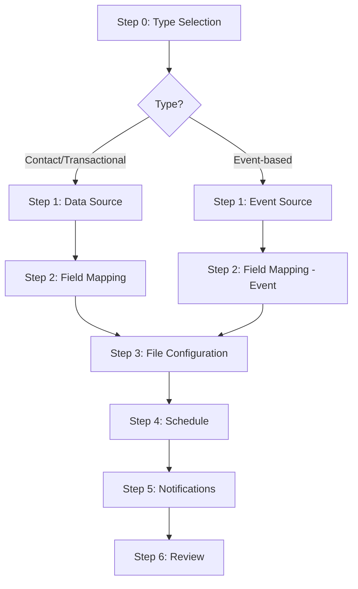

# Design Document: Exporter Wizard Rework

## Overview

This design reworks the existing exporter wizard (`WizardModal`) to support two distinct exporter types — **Contact/Transactional** and **Event-based** — within a single shared wizard shell. The rework simplifies configuration by removing user-configurable join keys, adding column renaming, enforcing `{timestamp}.csv` file naming, removing time-of-day from scheduling, and adopting the importer's `NotificationsStep` pattern for notification configuration.

### Key Design Decisions

1. **Shared wizard shell with conditional steps** — A single `WizardModal` component handles both exporter types. The step list and step content adapt based on the selected exporter type. This avoids duplicating the modal chrome, stepper, navigation, and draft management logic.

2. **Type selection as Step 0** — A new first step lets the user choose between Contact/Transactional and Event-based before any other configuration. Selecting a type determines which subsequent steps render.

3. **Reuse importer NotificationsStep pattern** — The exporter notifications step adopts the same three-section layout (Failure, Success, No File) with identical UX patterns (chip inputs, toggles, copy-from-above, schedule config for No File). A shared `NotificationsStep` component is extracted to `src/components/shared/NotificationsStep.tsx` and used by both importer and exporter wizards.

4. **Predefined join key (Email Address)** — The join key input is removed entirely. When multiple sources are selected, a read-only indicator shows "Joined by: Email Address".

5. **Default timezone Pacific/Auckland** — New exporters default to `Pacific/Auckland` instead of `UTC`.

## Architecture

### Wizard Flow by Exporter Type



Both paths converge at File Configuration (Step 3) and share the same Schedule, Notifications, and Review steps.

### Step Configuration

| Step | Contact/Transactional | Event-based |
|------|----------------------|-------------|
| 0 | Type Selection | Type Selection |
| 1 | Data Source (sources + filters) | Event Source (checkboxes) |
| 2 | Field Mapping (select/reorder/rename) | Field Mapping (read-only events + optional contact fields + rename) |
| 3 | File Configuration | File Configuration |
| 4 | Schedule (no time) | Schedule (no time) |
| 5 | Notifications | Notifications |
| 6 | Review | Review |

### Component Tree

```
WizardModal (shared shell)
├── Stepper (dynamic step labels based on type)
├── TypeSelectionStep (new)
├── DataSourceStep (reworked — no join key input)
├── EventSourceStep (new)
├── FieldMappingStep (reworked — column rename, read-only event fields)
├── OutputConfigStep (reworked — {timestamp}.csv naming, NZ timezone default)
├── ScheduleStep (new — extracted from DeliveryStep, no time input)
├── NotificationsStep (shared — extracted from importer pattern)
└── ReviewStep (reworked — reflects new steps)
```

## Components and Interfaces

### New Components

#### `TypeSelectionStep`
- Location: `src/components/wizard/TypeSelectionStep.tsx`
- Two card options: "Contact/Transactional" and "Event-based"
- Uses the existing `CheckboxCard` pattern but as radio-style (single select)
- Props: `{ selectedType: ExporterType | null; onSelect: (type: ExporterType) => void }`

#### `EventSourceStep`
- Location: `src/components/wizard/EventSourceStep.tsx`
- Displays checkboxes for event sources: "Mailouts from this send", "All event channels from this campaign", "All failed sends from this send"
- Props: `{ draft: ExporterWizardDraft; onUpdate: (patch) => void }`

#### `ScheduleStep`
- Location: `src/components/wizard/ScheduleStep.tsx`
- Extracted from `DeliveryStep` — frequency selector (hourly/daily/weekly/monthly) with day-of-week or day-of-month pickers
- **No time-of-day input** — system assigns execution time automatically
- Props: `{ draft: ExporterWizardDraft; onUpdate: (patch) => void }`

#### `NotificationsStep` (shared)
- Location: `src/components/shared/NotificationsStep.tsx`
- Extracted from `src/components/importer/NotificationsStep.tsx` to be reusable
- Three sections: Failure (always visible, required), Success (toggle), No File (toggle + schedule)
- Props: `{ value: NotificationConfig; onUpdate: (config) => void; onValidChange?: (valid: boolean) => void; teamEmails?: string[] }`
- The existing importer `NotificationsStep` becomes a thin wrapper or is replaced by the shared version

### Reworked Components

#### `FieldMappingStep` (reworked)
- Adds an inline editable "Output Column" field next to each selected field
- For event-based exports: predefined fields render as read-only (cannot deselect) but can be reordered and renamed
- Optional contact fields section appears below event fields when event-based type is selected
- Validation: no empty/whitespace-only column names, no duplicates, max 128 chars

#### `OutputConfigStep` (reworked)
- File naming pattern: user edits a prefix (1–100 chars, alphanumeric + hyphens + underscores), suffix is always `{timestamp}.csv`
- Live preview resolves `{timestamp}` to current UTC `YYYYMMDD-HHmmss`
- Default timezone changed to `Pacific/Auckland`

#### `DataSourceStep` (reworked)
- Join key input removed entirely
- When multiple sources selected, shows read-only text: "Joined by: Email Address"
- Otherwise unchanged

#### `WizardModal` (reworked)
- Step array is dynamic based on `draft.exporterType`
- Step 0 is always TypeSelectionStep
- `canProceed` validation updated for new step structure
- Draft model extended with new fields

## Data Models

### `ExporterType` (new)

```typescript
export type ExporterType = 'contact_transactional' | 'event_based';
```

### `EventSource` (new)

```typescript
export type EventSource =
  | 'mailout_sends'
  | 'campaign_events'
  | 'failed_sends';
```

### `ColumnRename` (new)

```typescript
export interface ColumnRename {
  fieldKey: string;       // References SelectedField.key
  outputName: string;     // Custom column header (max 128 chars)
}
```

### `ExporterScheduleConfig` (new — simplified)

```typescript
export interface ExporterScheduleConfig {
  frequency: 'hourly' | 'daily' | 'weekly' | 'monthly';
  weeklyDays: boolean[];           // 7 booleans, Mon–Sun
  monthlyDays: number[];           // 1–28
  // No time fields — system assigns execution time
}
```

### `ExporterNotificationConfig` (new — matches importer pattern)

```typescript
export interface ExporterNotificationConfig {
  failureEmails: string[];          // Required, at least one
  successEnabled: boolean;
  successEmails: string[];
  noFileAlertEnabled: boolean;
  noFileAlertEmails: string[];
  noFileSchedule?: {
    frequency: 'hourly' | 'daily' | 'weekly' | 'monthly';
    starting: string;
    every: string;
    at: string;
    weeklyDays: boolean[];
    monthlyPattern: 'day' | 'date';
    monthlyOrdinal: string;
    monthlyDayOfWeek: string;
    monthlyDates: string[];
  };
}
```

### `ExporterWizardDraft` (reworked from `WizardDraft`)

```typescript
export interface ExporterWizardDraft {
  // Identity
  connectionId: string | null;
  name: string;

  // Type selection (Step 0)
  exporterType: ExporterType | null;

  // Contact/Transactional path
  selectedSources: ExportDataType[];
  transactionalSource: TransactionalSource | null;
  filters: FilterGroup;

  // Event-based path
  selectedEventSources: EventSource[];

  // Field mapping (both paths)
  selectedFields: SelectedField[];
  columnRenames: ColumnRename[];

  // File configuration
  fileNamingPrefix: string;          // User-editable prefix
  formatOptions: FormatOptions;      // timezone defaults to Pacific/Auckland

  // Schedule
  schedule: ExporterScheduleConfig;

  // Notifications
  notifications: ExporterNotificationConfig;
}
```

### Default Values

```typescript
export const DEFAULT_EXPORTER_DRAFT: ExporterWizardDraft = {
  connectionId: null,
  name: '',
  exporterType: null,
  selectedSources: [],
  transactionalSource: null,
  filters: { combinator: 'AND', rules: [], groups: [] },
  selectedEventSources: [],
  selectedFields: [],
  columnRenames: [],
  fileNamingPrefix: '',
  formatOptions: {
    delimiter: ',',
    includeHeader: true,
    dateFormat: 'ISO8601',
    timezone: 'Pacific/Auckland',
  },
  schedule: {
    frequency: 'daily',
    weeklyDays: [false, false, false, false, false, false, false],
    monthlyDays: [],
  },
  notifications: {
    failureEmails: [],
    successEnabled: false,
    successEmails: [],
    noFileAlertEnabled: false,
    noFileAlertEmails: [],
  },
};
```

### Predefined Event Fields

```typescript
export const EVENT_FIELDS: Record<EventSource, SelectedField[]> = {
  mailout_sends: [
    { key: 'event_timestamp', label: 'Event Timestamp', source: 'event' },
    { key: 'recipient_email', label: 'Recipient Email', source: 'event' },
    { key: 'mailout_name', label: 'Mailout Name', source: 'event' },
    { key: 'send_status', label: 'Send Status', source: 'event' },
    { key: 'open_count', label: 'Open Count', source: 'event' },
    { key: 'click_count', label: 'Click Count', source: 'event' },
  ],
  campaign_events: [
    { key: 'event_timestamp', label: 'Event Timestamp', source: 'event' },
    { key: 'recipient_email', label: 'Recipient Email', source: 'event' },
    { key: 'campaign_name', label: 'Campaign Name', source: 'event' },
    { key: 'channel', label: 'Channel', source: 'event' },
    { key: 'event_type', label: 'Event Type', source: 'event' },
  ],
  failed_sends: [
    { key: 'event_timestamp', label: 'Event Timestamp', source: 'event' },
    { key: 'recipient_email', label: 'Recipient Email', source: 'event' },
    { key: 'mailout_name', label: 'Mailout Name', source: 'event' },
    { key: 'failure_reason', label: 'Failure Reason', source: 'event' },
    { key: 'bounce_type', label: 'Bounce Type', source: 'event' },
  ],
};
```


## Correctness Properties

*A property is a characteristic or behavior that should hold true across all valid executions of a system — essentially, a formal statement about what the system should do. Properties serve as the bridge between human-readable specifications and machine-verifiable correctness guarantees.*

### Property 1: Contact/Transactional field list is the union of selected sources

*For any* non-empty subset of data sources (contact, transactional, mailout), the available field list produced by the field generation function should contain exactly the union of fields defined for each selected source, with no duplicates and no fields from unselected sources.

**Validates: Requirements 3.3**

### Property 2: Event field generation produces deduplicated union

*For any* non-empty subset of event sources, the predefined field list should contain exactly the deduplicated union of fields defined for each selected event source — fields shared across multiple sources appear only once.

**Validates: Requirements 4.3, 5.1, 5.6**

### Property 3: Reorder preserves field set membership

*For any* ordered list of selected fields and any valid reorder operation (moving a field from index i to index j), the resulting list should contain exactly the same set of fields as the original — no additions, no removals, same length.

**Validates: Requirements 3.4, 5.4**

### Property 4: Event fields are immutable

*For any* set of predefined event fields in the field mapping step, no deselect or remove operation should alter the set of event fields. After any sequence of user deselect actions, the event field set should remain identical to the initial predefined set.

**Validates: Requirements 5.3**

### Property 5: Column name resolution

*For any* selected field, the resolved output column name should equal the custom rename value if one exists in the columnRenames list for that field's key, otherwise it should equal the field's default label.

**Validates: Requirements 6.2, 6.3**

### Property 6: Column name validation rejects invalid input

*For any* string that is empty, composed entirely of whitespace characters, or exceeds 128 characters in length, the column name validation function should return a validation error.

**Validates: Requirements 6.1, 6.5**

### Property 7: Duplicate column name detection

*For any* list of resolved output column names where two or more names are identical (case-sensitive comparison), the validation function should return a duplicate error identifying the conflicting name.

**Validates: Requirements 6.6**

### Property 8: File naming prefix validation

*For any* string, the prefix validation function should return valid if and only if the string is between 1 and 100 characters (inclusive) and contains only characters matching `[a-zA-Z0-9_-]`.

**Validates: Requirements 7.2, 7.5**

### Property 9: Timestamp token resolution format

*For any* valid JavaScript Date object, resolving the `{timestamp}` token should produce a string matching the pattern `YYYYMMDD-HHmmss` that correctly represents the same instant in UTC.

**Validates: Requirements 7.3**

### Property 10: Timezone conversion for datetime values

*For any* UTC datetime value and any valid IANA timezone identifier, the formatted output should represent the same instant converted to the target timezone with the correct UTC offset (including DST transitions).

**Validates: Requirements 8.4**

### Property 11: Date-only values bypass timezone conversion

*For any* date-only value (no time component) and any timezone setting, the output should equal the input value unchanged — no timezone conversion applied.

**Validates: Requirements 8.5**

## Error Handling

### Validation Errors (per step)

| Step | Condition | Behaviour |
|------|-----------|-----------|
| Type Selection | No type selected | Next button disabled |
| Data Source | No name entered | Next button disabled |
| Data Source | Transactional selected but no sub-source | Next button disabled |
| Event Source | No event source selected | Next button disabled, inline message |
| Field Mapping | No fields selected (contact/transactional) | Next button disabled, inline message |
| Field Mapping | Column name empty/whitespace/over 128 chars | Inline error on field, Next disabled |
| Field Mapping | Duplicate column names | Inline error on both fields, Next disabled |
| File Configuration | Prefix empty or invalid characters | Inline error, Next disabled |
| Schedule | Weekly with no days selected | Next disabled |
| Schedule | Monthly with no days selected | Next disabled |
| Notifications | Zero failure emails | Next disabled, inline message |

### State Recovery

- **Draft persistence**: The wizard draft is held in React state within `WizardModal`. If the modal is closed without saving, a discard confirmation dialog appears (existing pattern).
- **Edit mode**: When editing an existing exporter, the draft is hydrated from the saved automation. Legacy join key values are silently overridden with the predefined "Email Address" key.
- **Type change**: If the user returns to Step 0 and changes the exporter type, the wizard resets type-specific state (selectedSources, selectedEventSources, selectedFields, columnRenames) while preserving shared state (name, file config, schedule, notifications).

### Edge Cases

- **Empty field registry**: If no fields are available for a selected source (data issue), the field mapping step shows an empty state with a message.
- **All event sources share identical fields**: Deduplication produces a shorter list than expected — this is correct behaviour, not an error.
- **Timezone with DST**: The timezone selector shows the current offset in parentheses. The actual conversion happens at export time (backend), not in the wizard.

## Testing Strategy

### Unit Tests (Example-based)

Focus on specific scenarios and edge cases:

- TypeSelectionStep renders two options, neither pre-selected
- Selecting a type updates the step list correctly
- DataSourceStep does not render join key input
- DataSourceStep shows read-only join key indicator when multiple sources selected
- EventSourceStep renders all three event source options
- FieldMappingStep shows read-only styling for event fields
- FieldMappingStep shows editable rename input for all fields
- ScheduleStep does not render time-of-day input
- NotificationsStep renders failure section always visible
- canProceed returns false for each validation edge case
- File naming preview updates correctly as prefix changes
- Default timezone is Pacific/Auckland for new drafts

### Property-Based Tests

Library: **fast-check** (TypeScript property-based testing library)

Each property test runs a minimum of **100 iterations** with randomly generated inputs.

| Property | Test Target | Generator Strategy |
|----------|-------------|-------------------|
| 1: Source field union | `getFieldsForSources(sources)` | Random subsets of ExportDataType[] |
| 2: Event field union | `getEventFields(eventSources)` | Random subsets of EventSource[] |
| 3: Reorder preserves set | `reorderFields(fields, from, to)` | Random field lists + valid index pairs |
| 4: Event fields immutable | `deselectField(fields, key)` | Random event field keys |
| 5: Column name resolution | `resolveColumnName(field, renames)` | Random fields + optional rename entries |
| 6: Column name validation | `validateColumnName(name)` | Arbitrary strings (including whitespace, long strings) |
| 7: Duplicate detection | `validateColumnNames(names[])` | Random string arrays with injected duplicates |
| 8: Prefix validation | `validatePrefix(prefix)` | Arbitrary strings + valid prefix strings |
| 9: Timestamp resolution | `resolveTimestamp(date)` | Random Date objects |
| 10: Timezone conversion | `formatDatetime(utcDate, timezone)` | Random dates × random IANA timezones |
| 11: Date-only passthrough | `formatDate(dateOnly, timezone)` | Random date-only values × random timezones |

### Integration Tests

- Wizard modal opens and closes correctly
- Full wizard flow (type → source → fields → file → schedule → notifications → review → save) produces a valid draft
- Edit mode hydrates draft from existing automation correctly
- Type change resets type-specific state

### Tag Format

Each property test is tagged with:
```
Feature: exporter-wizard-rework, Property {N}: {property_text}
```
