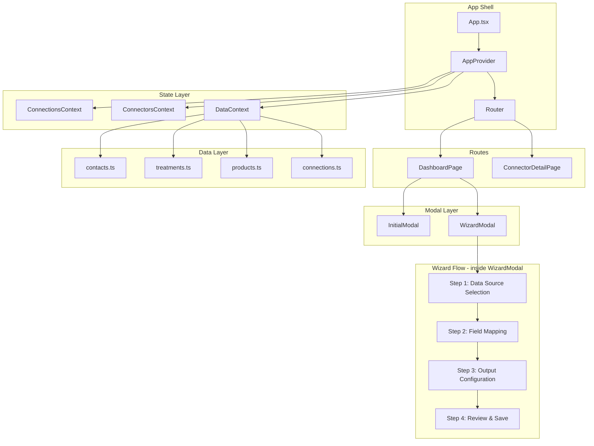

# Design Document: Connector Exporter Prototype

## Overview

The Connector Exporter Prototype is a standalone React + TypeScript application bootstrapped with Vite. It demonstrates the UbiQuity export connector creation and management flow using pre-seeded wellness spa data. The entire application runs client-side with no backend — all state is managed in-memory via React Context and persisted to `localStorage` for session continuity.

The app has one primary view — the Connections Dashboard — with two modal layers for connector creation:

1. **Connections Dashboard** — Lists pre-seeded connections as expandable rows with nested connector cards. Provides entry points for creating, editing, pausing/resuming, and deleting connectors.
2. **Initial Modal** — A small dialog triggered from a Connection_Row's "+ Add Connector" button. Displays the parent connection context (read-only), an import/export toggle (import disabled), and a connector name input. Proceeds to the Wizard Modal.
3. **Wizard Modal** — A 60%×80% viewport modal overlay on the dashboard containing a 4-step creation wizard: Data Source Selection → Field Mapping → Output Configuration → Review & Save. The dashboard remains visible but non-interactive behind the overlay.

### Key Design Decisions

- **Vite + React + TypeScript**: Fast dev server, type safety, minimal config.
- **React Context for state**: Lightweight, no external dependency. Sufficient for a prototype with ~3 data collections and a handful of connectors.
- **Modal-based wizard instead of route-based**: The wizard is rendered as a modal overlay on the dashboard rather than navigating to `/wizard/:step`. This preserves dashboard context and simplifies navigation. Modal open/close state is managed via React state in `DashboardPage`, eliminating the wizard route entirely.
- **CSS Modules**: Scoped styles, no build-time CSS framework dependency. A small design-tokens file provides the UbiQuity color palette and spacing scale.
- **Pre-seeded data as static JSON modules**: Imported at build time, loaded into context on app init. No async fetching.
- **Non-functional filters**: Filter dropdowns on Step 1 store values in the connector config but never filter actual data. They exist purely for demo/discussion purposes.
- **File naming with tokens**: A pattern builder lets users compose file names from tokens (`{connector_name}`, `{date}`, `{timestamp}`). The pattern is stored as a string; no actual file generation occurs.

## Architecture



### Data Flow

1. **App init**: `AppProvider` loads pre-seeded connections and datasets into context. Any previously saved connectors are restored from `localStorage`.
2. **Dashboard rendering**: `DashboardPage` reads connections and connectors from context, renders `ConnectionRow` components with nested `ConnectorCard` components.
3. **Initial Modal**: Clicking "+ Add Connector" on a `ConnectionRow` opens the `InitialModal` with the parent connection's name and protocol shown as read-only context. The user selects "Export" (import is disabled) and enters a connector name. On proceed, the `InitialModal` closes and the `WizardModal` opens.
4. **Wizard Modal flow**: `WizardModal` renders as a 60%×80% overlay on the dashboard. It maintains local wizard state (a `WizardDraft` object). Each step component reads/writes to this draft. On "Save" at the review step, the draft is committed to `ConnectorsContext`, which persists to `localStorage`, and the modal closes.
5. **Edit flow**: Opening the wizard in edit mode pre-populates the `WizardDraft` from an existing connector's configuration. The `InitialModal` is skipped; the `WizardModal` opens directly.

### Modal State Management

The `DashboardPage` manages modal visibility via local state:

```typescript
// DashboardPage state for modal management
const [initialModalConnectionId, setInitialModalConnectionId] = useState<string | null>(null);
const [wizardModalState, setWizardModalState] = useState<{
  open: boolean;
  connectionId: string | null;
  connectorName: string;
  editConnectorId: string | null;
} | null>(null);
```

- `initialModalConnectionId` controls the Initial Modal (non-null = open for that connection).
- `wizardModalState` controls the Wizard Modal (non-null = open with the given context).
- The `/wizard/:step` route is removed from the router. Only `/` and `/connector/:id` remain.

## Components and Interfaces

### Page Components

| Component | Route | Responsibility |
|---|---|---|
| `DashboardPage` | `/` | Renders connections list, manages Initial Modal and Wizard Modal state |
| `ConnectorDetailPage` | `/connector/:id` | Read-only view of a connector's full configuration |

### Dashboard Components

| Component | Props | Responsibility |
|---|---|---|
| `ConnectionRow` | `connection: Connection`, `connectors: Connector[]`, `onAddConnector: (connectionId: string) => void` | Expandable row with chevron, protocol icon, name, connector count. "+ Add Connector" calls `onAddConnector` instead of navigating to a route |
| `ConnectorCard` | `connector: Connector` | Nested card showing name, type badge, data type, schedule, status toggle, overflow menu |
| `StatusToggle` | `active: boolean`, `onToggle: () => void` | Green/grey toggle switch for pause/resume |
| `OverflowMenu` | `items: MenuItem[]` | Three-dot menu with Edit, Delete actions |
| `DeleteConfirmModal` | `connectorName: string`, `onConfirm: () => void`, `onCancel: () => void` | Confirmation dialog before deletion |

### Modal Components

| Component | Props | Responsibility |
|---|---|---|
| `InitialModal` | `connection: Connection`, `onProceed: (name: string) => void`, `onClose: () => void` | Small dialog showing read-only connection context, import/export toggle (import disabled), connector name input. Validates non-empty name + export selected before enabling proceed |
| `WizardModal` | `connectionId: string`, `connectorName: string`, `editConnectorId?: string`, `onSave: (draft: WizardDraft) => void`, `onClose: () => void` | 60%×80% viewport overlay containing the 4-step wizard. Manages wizard draft state, step navigation, and step validation internally |

### Wizard Step Components

| Component | Props | Responsibility |
|---|---|---|
| `WizardStepper` | `steps: StepDef[]`, `currentStep: number`, `completedSteps: number[]`, `onStepClick: (step) => void` | Vertical left-sidebar stepper with numbered circles and connecting lines |
| `DataSourceStep` | `draft: WizardDraft`, `onUpdate: (patch) => void` | Data type radio cards + transactional source sub-selector + key field picker (for enrichments) + non-functional filter section |
| `FieldMappingStep` | `draft: WizardDraft`, `onUpdate: (patch) => void` | Checkbox list of available fields, drag-to-reorder for selected fields, "Select All" toggle, Data Preview panel |
| `OutputConfigStep` | `draft: WizardDraft`, `onUpdate: (patch) => void` | File type selector (CSV/JSON/XML) + contextual format options (delimiter only for CSV, header row, date format, timezone) + file naming convention input with token builder + schedule dropdown |
| `ReviewStep` | `draft: WizardDraft`, `onStepClick: (step) => void` | Read-only summary of all configuration including file type, file naming pattern, key field, and filter values. "Edit" links to each section |
| `WizardNavButtons` | `onBack`, `onNext`, `canProceed`, `isLast`, `showBack` | Back (outlined) + Next/Save (filled green) buttons |

### New Sub-Components

| Component | Props | Responsibility |
|---|---|---|
| `KeyFieldPicker` | `transactionalSource: TransactionalSource`, `value: string \| null`, `onChange: (key: string) => void` | Displays explanatory text "This field links each transaction to a contact record". Shows `customerId` as the only valid option. Contact side fixed to `ContactRecord.id` |
| `FilterSection` | `dataType: ExportDataType`, `filters: FilterConfig`, `onUpdate: (filters: FilterConfig) => void` | Renders non-functional filter dropdowns: date range (always), membership tier (when contacts involved), transaction type (when transactional involved). Visual only |
| `DataPreview` | `draft: WizardDraft` | Shows a 3-row static sample table based on selected fields and their order, using pre-seeded data. Updates dynamically when fields or order change |
| `FileNamingInput` | `value: string`, `onChange: (pattern: string) => void` | Text input with clickable token chips (`{connector_name}`, `{date}`, `{timestamp}`). Clicking a token inserts it at cursor position |

### Shared UI Components

| Component | Responsibility |
|---|---|
| `ProtocolIcon` | Renders S3 cube or SFTP folder icon based on connection type |
| `StatusBadge` | Green "Active" / Grey "Paused" pill badge |
| `DataTypeBadge` | Label pill for Contact / Transactional / Enriched |
| `DragHandle` | Six-dot grip icon for drag-and-drop reordering |
| `Checkbox` | Styled checkbox matching UbiQuity green/teal theme |
| `Dropdown` | Styled select dropdown |
| `Toggle` | Boolean toggle switch |
| `RadioCard` | Selectable card with icon, title, description, green border when selected |


## Data Models

### Connection (unchanged)

```typescript
interface Connection {
  id: string;                    // UUID
  name: string;                  // e.g., "Spa AWS S3 Bucket"
  protocol: 'S3' | 'SFTP';
  status: 'connected' | 'error';
  config: S3Config | SFTPConfig; // Protocol-specific display details
}

interface S3Config {
  region: string;
  bucket: string;
  prefix: string;
}

interface SFTPConfig {
  host: string;
  port: number;
  path: string;
}
```

### Connector (updated)

```typescript
type ExportDataType =
  | 'contact'
  | 'transactional'
  | 'transactional_with_contact';

type TransactionalSource = 'treatments' | 'products';

type ScheduleFrequency =
  | 'every_15_min'
  | 'hourly'
  | 'daily'
  | 'weekly'
  | 'monthly';

type ConnectorStatus = 'active' | 'paused';

type FileType = 'csv' | 'json' | 'xml';

interface FilterConfig {
  dateRange: 'last_7_days' | 'last_30_days' | 'last_90_days' | 'all_time';
  membershipTier?: 'Bronze' | 'Silver' | 'Gold' | 'Platinum' | 'All';
  transactionType?: string;
}

interface FormatOptions {
  delimiter: ',' | '|' | '\t' | ';';  // Only relevant when fileType is 'csv'
  includeHeader: boolean;
  dateFormat: 'ISO8601' | 'US' | 'EU' | 'UNIX';
  timezone: string; // IANA timezone string, default 'UTC'
}

interface SelectedField {
  key: string;       // Field identifier (e.g., 'firstName', 'treatmentType')
  label: string;     // Display name (e.g., 'First Name', 'Treatment Type')
  source: 'contact' | 'treatment' | 'product'; // Which dataset this field comes from
}

interface Connector {
  id: string;                          // UUID
  connectionId: string;                // Parent connection reference
  name: string;                        // User-provided name
  direction: 'export';                 // Always 'export' in this prototype
  dataType: ExportDataType;
  transactionalSource?: TransactionalSource; // Required when dataType includes transactional
  enrichmentKeyField?: string;         // Key field on transactional side for enrichment join (e.g., 'customerId')
  selectedFields: SelectedField[];     // Ordered list of selected fields
  fileType: FileType;                  // Output file format
  formatOptions: FormatOptions;
  fileNamingPattern: string;           // e.g., '{connector_name}_{date}_{timestamp}'
  schedule: ScheduleFrequency;
  filters: FilterConfig;               // Non-functional filter values (stored but not applied)
  status: ConnectorStatus;
  createdAt: string;                   // ISO timestamp
  updatedAt: string;                   // ISO timestamp
}
```

### Wizard Draft (updated)

```typescript
interface WizardDraft {
  connectionId: string;                // Set from InitialModal or edit context
  name: string;                        // Set from InitialModal or edit context
  dataType: ExportDataType | null;
  transactionalSource: TransactionalSource | null;
  enrichmentKeyField: string | null;   // Key field for enrichment join
  selectedFields: SelectedField[];
  fileType: FileType;
  formatOptions: FormatOptions;
  fileNamingPattern: string;
  schedule: ScheduleFrequency | null;
  filters: FilterConfig;
}

const DEFAULT_FORMAT_OPTIONS: FormatOptions = {
  delimiter: ',',
  includeHeader: true,
  dateFormat: 'ISO8601',
  timezone: 'UTC',
};

const DEFAULT_FILTERS: FilterConfig = {
  dateRange: 'all_time',
};

const DEFAULT_FILE_NAMING_PATTERN = '{connector_name}_{date}';
```

### Pre-seeded Data Records (unchanged)

```typescript
interface ContactRecord {
  id: string;
  firstName: string;
  lastName: string;
  email: string;
  phone: string;
  membershipTier: 'Bronze' | 'Silver' | 'Gold' | 'Platinum';
  joinDate: string;
  communicationPreferences: {
    email: boolean;
    sms: boolean;
    push: boolean;
  };
}

interface TreatmentRecord {
  id: string;
  customerId: string;         // References ContactRecord.id
  treatmentType: string;
  therapistName: string;
  treatmentDate: string;
  durationMinutes: number;
  price: number;
}

interface ProductRecord {
  id: string;
  customerId: string;         // References ContactRecord.id
  productName: string;
  category: 'Skincare' | 'Wellness' | 'Gift Card' | 'Treatment Voucher';
  purchaseChannel: 'In-Person' | 'Online';
  purchaseDate: string;
  price: number;
}
```

### Field Registry (unchanged)

A static registry maps each data source to its available fields:

```typescript
interface FieldDefinition {
  key: string;
  label: string;
  source: 'contact' | 'treatment' | 'product';
}

// CONTACT_FIELDS, TREATMENT_FIELDS, PRODUCT_FIELDS arrays as before

function getFieldsForDataType(
  dataType: ExportDataType,
  transactionalSource?: TransactionalSource
): FieldDefinition[] {
  switch (dataType) {
    case 'contact':
      return CONTACT_FIELDS;
    case 'transactional':
      return transactionalSource === 'treatments'
        ? TREATMENT_FIELDS
        : PRODUCT_FIELDS;
    case 'transactional_with_contact': {
      const txFields = transactionalSource === 'treatments'
        ? TREATMENT_FIELDS
        : PRODUCT_FIELDS;
      return [...txFields, ...CONTACT_FIELDS];
    }
  }
}
```

### Data Preview Generation

The `DataPreview` component generates a 3-row sample from pre-seeded data:

```typescript
function generatePreviewRows(
  selectedFields: SelectedField[],
  dataType: ExportDataType,
  transactionalSource: TransactionalSource | null,
  contacts: ContactRecord[],
  treatments: TreatmentRecord[],
  products: ProductRecord[]
): Record<string, string>[] {
  // Select 3 records from the appropriate dataset
  // For enrichments, join transactional records with contacts via customerId
  // Project only the selected fields in order
  // Return array of 3 row objects
}
```


## Correctness Properties

*A property is a characteristic or behavior that should hold true across all valid executions of a system — essentially, a formal statement about what the system should do. Properties serve as the bridge between human-readable specifications and machine-verifiable correctness guarantees.*

### Property 1: Connection data integrity

*For any* pre-seeded Connection, it SHALL have a non-empty `name`, a valid `protocol` value (`'S3'` or `'SFTP'`), and a valid `status` value (`'connected'` or `'error'`).

**Validates: Requirements 1.2**

### Property 2: Contact record completeness

*For any* record in the Contact_Database, it SHALL have non-null values for `firstName`, `lastName`, `email`, `phone`, `membershipTier`, `joinDate`, and `communicationPreferences`.

**Validates: Requirements 2.2**

### Property 3: Treatment record completeness

*For any* record in the Treatment_Database, it SHALL have non-null values for `customerId`, `treatmentType`, `therapistName`, `treatmentDate`, `durationMinutes` (positive number), and `price` (non-negative number).

**Validates: Requirements 3.2**

### Property 4: Product record completeness

*For any* record in the Product_Database, it SHALL have non-null values for `customerId`, `productName`, `category` (one of the valid categories), `purchaseChannel` (one of the valid channels), `purchaseDate`, and `price` (non-negative number).

**Validates: Requirements 4.2**

### Property 5: Connection row toggle round-trip

*For any* Connection on the dashboard, expanding the row and then collapsing it SHALL return the row to its original collapsed state with child connectors hidden.

**Validates: Requirements 5.2, 5.3**

### Property 6: Connector card displays all required information

*For any* Connector, its rendered ConnectorCard SHALL contain the connector name, direction type (import/export), data type label, schedule label, and status indicator.

**Validates: Requirements 5.5**

### Property 7: Wizard step validation prevents invalid progression

*For any* wizard step, if the step's required fields are not satisfied, the `canProceed` validation SHALL return `false`. Specifically: Step 1 requires a data type (and transactional source if applicable); Step 2 requires at least one selected field; Step 3 requires a schedule selection. Additionally, the Initial Modal requires a non-empty connector name and "Export" selection before enabling proceed.

**Validates: Requirements 6.5, 8.2, 9.5, 10.9**

### Property 8: Field resolution returns correct fields for data type

*For any* valid `(ExportDataType, TransactionalSource)` pair, `getFieldsForDataType` SHALL return the correct field set: contact fields for `'contact'`, transactional source fields for `'transactional'`, and the union of both for `'transactional_with_contact'`.

**Validates: Requirements 9.1, 9.2**

### Property 9: Field toggle preserves state round-trip

*For any* field in the available fields list, selecting it and then deselecting it SHALL restore the `selectedFields` array to its original state.

**Validates: Requirements 9.3**

### Property 10: Field reorder preserves all fields

*For any* list of selected fields and any valid pair of source/destination indices, reordering a field SHALL preserve all fields with no duplicates and no losses — only the order changes.

**Validates: Requirements 9.4**

### Property 11: Data preview reflects selected fields

*For any* non-empty set of selected fields, the Data_Preview panel SHALL produce exactly 3 rows where each row contains exactly the selected fields as columns, in the same order as the selected fields list.

**Validates: Requirements 9.6, 9.7**

### Property 12: Delimiter visibility depends on file type

*For any* file type selection, the delimiter option SHALL be visible when `fileType` is `'csv'` and SHALL be hidden when `fileType` is `'json'` or `'xml'`.

**Validates: Requirements 10.3, 10.4**

### Property 13: Non-functional filter visibility depends on data type

*For any* Export_Data_Type that includes contact data (`'contact'` or `'transactional_with_contact'`), the membership tier filter SHALL be visible. *For any* Export_Data_Type that includes transactional data (`'transactional'` or `'transactional_with_contact'`), the transaction type filter SHALL be visible. The date range filter SHALL always be visible.

**Validates: Requirements 8.9, 8.10**

### Property 14: Review step displays complete configuration

*For any* complete `WizardDraft` (all required fields populated), the review step rendering SHALL include the parent connection name, data type label, key field (when applicable), all selected field names in order, file type, format option values (delimiter only for CSV), file naming pattern, schedule label, and non-functional filter values.

**Validates: Requirements 11.1**

### Property 15: Saving wizard draft creates connector with matching configuration

*For any* valid complete `WizardDraft`, saving SHALL produce a new `Connector` in state whose `connectionId`, `dataType`, `transactionalSource`, `enrichmentKeyField`, `selectedFields`, `fileType`, `formatOptions`, `fileNamingPattern`, `schedule`, and `filters` match the draft values exactly.

**Validates: Requirements 8.11, 10.10, 11.3**

### Property 16: Edit mode populates draft from existing connector

*For any* existing `Connector`, opening edit mode SHALL produce a `WizardDraft` whose `connectionId`, `name`, `dataType`, `transactionalSource`, `enrichmentKeyField`, `selectedFields`, `fileType`, `formatOptions`, `fileNamingPattern`, `schedule`, and `filters` match the connector's current values.

**Validates: Requirements 13.1**

### Property 17: Saving edit updates connector preserving identity

*For any* existing `Connector` and any valid configuration change applied through the edit wizard, saving SHALL update that connector's stored configuration to match the new values while preserving its `id` and `createdAt`.

**Validates: Requirements 13.3**

### Property 18: Pause/resume round-trip restores active status

*For any* active `Connector`, pausing it SHALL set its status to `'paused'`, and subsequently resuming it SHALL set its status back to `'active'`.

**Validates: Requirements 14.1, 14.3**

### Property 19: Delete confirmation removes connector; cancel preserves state

*For any* `Connector`, confirming deletion SHALL remove it from state (reducing connector count by one), while canceling deletion SHALL leave the connector list completely unchanged.

**Validates: Requirements 15.2, 15.3**

### Property 20: Wizard navigation to completed steps preserves draft

*For any* completed wizard step, navigating back to that step from a later step SHALL preserve all draft values and allow the user to resume from that step.

**Validates: Requirements 16.3**


## Error Handling

Since this is a client-side prototype with no backend, error handling is minimal and focused on UI state consistency.

### Initial Modal Validation

| Condition | Error Behavior |
|---|---|
| No connector name entered (empty or whitespace-only) | "Proceed" button disabled; inline hint below input |
| Import toggle selected | Import option is visually disabled and non-clickable; no error message needed |

### Wizard Validation Errors

| Step | Validation | Error Behavior |
|---|---|---|
| Data Source Selection | No data type selected; transactional selected but no source chosen; enrichment selected but no key field chosen | "Next" button disabled; inline hint text below the unselected control |
| Field Mapping | Zero fields selected | "Next" button disabled; hint text "Select at least one field" |
| Output Configuration | No schedule selected | "Next" button disabled; hint text "Select a schedule". File type, format options, and file naming have defaults so no validation needed |
| Review | N/A — read-only | N/A |

### Delete Confirmation

- Clicking delete opens a confirmation modal. If the user confirms, the connector is removed. If the user cancels or closes the modal, no state change occurs.
- No undo capability — deletion is immediate and permanent within the session.

### State Consistency

- If `localStorage` contains corrupted data on app load, the app falls back to the default pre-seeded state and clears the corrupted entry.
- Connector IDs are generated using `crypto.randomUUID()` to avoid collisions.

### Drag-and-Drop Edge Cases

- Dropping a field onto itself is a no-op (no state change).
- Dropping outside the valid drop zone cancels the drag operation.

### Modal Edge Cases

- Clicking the backdrop overlay of the Wizard Modal does NOT close it (prevents accidental data loss). Only explicit cancel/close button closes the modal.
- Pressing Escape on the Initial Modal closes it. Pressing Escape on the Wizard Modal shows a "discard changes?" confirmation if the draft has been modified.

## Testing Strategy

### Unit Tests (Vitest + React Testing Library)

Unit tests cover specific examples, edge cases, and UI rendering:

- **Seed data smoke tests**: Verify correct record counts and data variety (Requirements 1–4)
- **Initial Modal rendering**: Verify connection context is read-only, import toggle is disabled, name input exists (Requirements 6.2–6.4)
- **Initial Modal interaction**: Verify proceed opens Wizard Modal with correct context (Requirement 6.6)
- **Wizard Modal rendering**: Verify 60%×80% dimensions, 4-step stepper, backdrop non-interactivity (Requirements 7.1–7.3)
- **Data Source Selection step**: Verify 3 data type options, transactional source sub-selector, key field picker for enrichments, filter section (Requirements 8.1, 8.3–8.8)
- **Field Mapping step**: Verify Data Preview panel shows 3 rows (Requirement 9.6)
- **Output Configuration step**: Verify file type selector (CSV/JSON/XML), format options, file naming input with tokens, schedule dropdown with 5 options, default values (Requirements 10.1–10.2, 10.5–10.8)
- **Review step**: Verify edit links navigate to correct steps (Requirement 11.2)
- **Connector detail view**: Verify full config display including new fields (Requirements 12.1–12.2)
- **Delete confirmation flow**: Verify modal appears and handles confirm/cancel (Requirement 15.1)
- **Visual indicators**: Verify active/paused status badges render correctly (Requirements 14.2, 14.4)
- **Responsive layout**: Verify layout at 1280px viewport (Requirement 17.3)

### Property-Based Tests (fast-check + Vitest)

Property-based tests verify universal correctness properties across generated inputs. Each test runs a minimum of 100 iterations.

- **Property 1–4**: Generate random indices into seed data arrays, verify record completeness
  - Tag: `Feature: connector-exporter, Property 1: Connection data integrity`
  - Tag: `Feature: connector-exporter, Property 2: Contact record completeness`
  - Tag: `Feature: connector-exporter, Property 3: Treatment record completeness`
  - Tag: `Feature: connector-exporter, Property 4: Product record completeness`

- **Property 7**: Generate random wizard drafts with missing required fields, verify `canProceed` returns false for each step. Also generate random empty/whitespace names for Initial Modal validation.
  - Tag: `Feature: connector-exporter, Property 7: Wizard step validation prevents invalid progression`

- **Property 8**: Generate all valid `(ExportDataType, TransactionalSource)` combinations, verify field resolution
  - Tag: `Feature: connector-exporter, Property 8: Field resolution returns correct fields for data type`

- **Property 9**: Generate random field selections, toggle on/off, verify round-trip
  - Tag: `Feature: connector-exporter, Property 9: Field toggle preserves state round-trip`

- **Property 10**: Generate random field lists and reorder indices, verify set equality after reorder
  - Tag: `Feature: connector-exporter, Property 10: Field reorder preserves all fields`

- **Property 11**: Generate random non-empty field selections, verify preview produces 3 rows with matching columns
  - Tag: `Feature: connector-exporter, Property 11: Data preview reflects selected fields`

- **Property 12**: Generate random file type values, verify delimiter visibility matches expected behavior
  - Tag: `Feature: connector-exporter, Property 12: Delimiter visibility depends on file type`

- **Property 13**: Generate random data type values, verify correct filter dropdowns are visible
  - Tag: `Feature: connector-exporter, Property 13: Non-functional filter visibility depends on data type`

- **Property 15**: Generate random complete WizardDrafts (including fileType, fileNamingPattern, enrichmentKeyField, filters), save, verify connector matches
  - Tag: `Feature: connector-exporter, Property 15: Saving wizard draft creates connector with matching configuration`

- **Property 16**: Generate random connectors (with new fields), open edit, verify draft matches connector
  - Tag: `Feature: connector-exporter, Property 16: Edit mode populates draft from existing connector`

- **Property 17**: Generate random connectors and valid config changes, save edit, verify id/createdAt preserved
  - Tag: `Feature: connector-exporter, Property 17: Saving edit updates connector preserving identity`

- **Property 18**: Generate random active connectors, pause then resume, verify status restored
  - Tag: `Feature: connector-exporter, Property 18: Pause/resume round-trip restores active status`

- **Property 19**: Generate random connector lists, delete with confirm vs cancel, verify state
  - Tag: `Feature: connector-exporter, Property 19: Delete confirmation removes connector; cancel preserves state`

### UI Interaction Tests (Properties 5, 6, 14, 20)

These properties involve DOM rendering and are tested via React Testing Library with representative examples rather than full PBT, since DOM-based assertions are expensive to run 100+ times:

- **Property 5**: Expand/collapse toggle on connection rows
- **Property 6**: Connector card content completeness
- **Property 14**: Review step content completeness
- **Property 20**: Wizard step navigation with draft preservation

### Test Configuration

- **Framework**: Vitest (fast, Vite-native)
- **PBT Library**: fast-check (mature, TypeScript-first)
- **DOM Testing**: @testing-library/react + jsdom
- **Minimum PBT iterations**: 100 per property
- **Each PBT test tagged**: `Feature: connector-exporter, Property {N}: {title}`
