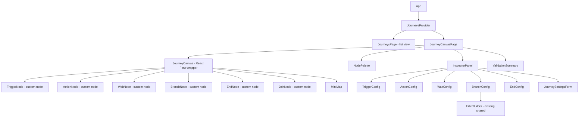
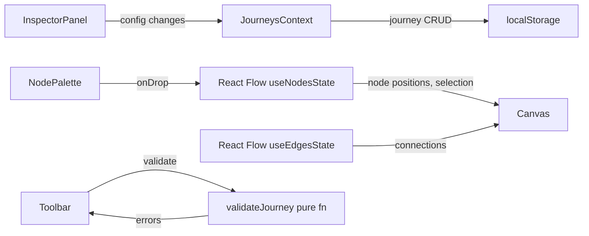
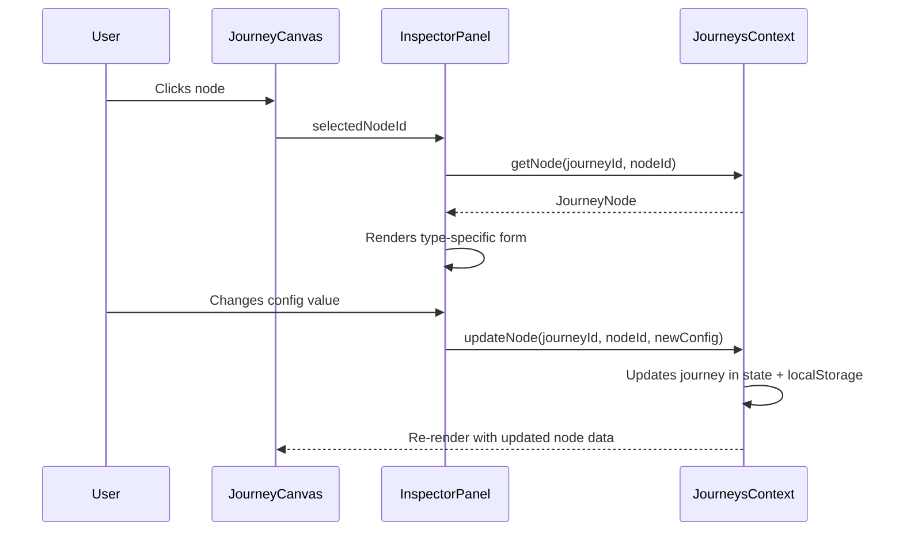

# Design Document: Journey Builder

## Overview

The journey builder adds a visual, canvas-based workflow editor to the UbiQuity 2.0 prototype. Users compose automated customer journeys by dragging nodes from a palette onto a React Flow canvas, connecting them into directed flows, and configuring each node via a slide-out inspector panel.

This is a prototype — no backend, no execution engine, no API calls. All state lives in a React context backed by localStorage. The goal is to let stakeholders experience the full journey-building UX with realistic sample data from the NZ spa chain dataset.

The feature touches three areas:
1. **Data layer** — new TypeScript interfaces extending the existing `Journey` model, a `JourneysContext` for CRUD, and seed data in `journeySeeds.ts`
2. **Canvas layer** — a React Flow wrapper (`JourneyCanvas`) with custom node components, a node palette, minimap, toolbar, and keyboard shortcuts
3. **Configuration layer** — an `InspectorPanel` that renders type-specific forms, reuses the existing `FilterBuilder` for branch conditions, and opens content modals for email/form/survey creation

React Flow (`@xyflow/react`) must be added as a dependency — it is not currently in `package.json`.

## Architecture

### Page Routing

The existing route `/automations/journeys` renders `JourneysPage` (list view). A new route `/automations/journeys/:journeyId` renders the canvas view for a specific journey.

```
/automations/journeys          → JourneysPage (list)
/automations/journeys/:journeyId → JourneyCanvasPage (canvas)
```

### Component Tree



### State Management



- **JourneysContext** owns the journey list and persists to localStorage. Follows the same pattern as `ConnectorsContext` — `useState` + `useEffect` for persistence, `useCallback` for mutations.
- **Canvas state** is managed by React Flow's `useNodesState` and `useEdgesState` hooks. These are local to `JourneyCanvas` and synced back to `JourneysContext` on changes.
- **Inspector state** reads from the selected node's config and writes back through `JourneysContext.updateNode()`.

### Data Flow: Node Configuration



## Components and Interfaces

### New Pages

| Component | File | Purpose |
|---|---|---|
| `JourneyCanvasPage` | `src/pages/JourneyCanvasPage.tsx` | Route wrapper that loads a journey by ID from context and renders the canvas layout (palette + canvas + inspector). |

### New Components — Canvas

| Component | File | Purpose |
|---|---|---|
| `JourneyCanvas` | `src/components/journey/JourneyCanvas.tsx` | React Flow `<ReactFlow>` wrapper. Manages `useNodesState`, `useEdgesState`, handles drop events, keyboard shortcuts, and syncs state to context. |
| `NodePalette` | `src/components/journey/NodePalette.tsx` | Sidebar listing draggable node types grouped by category. Disables trigger category when one exists. |
| `InspectorPanel` | `src/components/journey/InspectorPanel.tsx` | Slide-out right panel. Renders the correct config form based on selected node type/subType, or journey settings when settings mode is active. |
| `CanvasToolbar` | `src/components/journey/CanvasToolbar.tsx` | Top bar with zoom controls, fit-to-view, validate button, settings gear, and journey name/status display. |
| `ValidationSummary` | `src/components/journey/ValidationSummary.tsx` | Dropdown panel listing validation errors with clickable links to pan/select offending nodes. |
| `ContentModal` | `src/components/journey/ContentModal.tsx` | Full-screen overlay for email/form/survey editing. Canvas remains visible at reduced opacity behind it. |

### New Components — Custom Nodes

| Component | File | Purpose |
|---|---|---|
| `TriggerNodeComponent` | `src/components/journey/nodes/TriggerNode.tsx` | Custom React Flow node for trigger type. Teal accent, shows trigger sub-type icon and summary label. Single output handle. |
| `ActionNodeComponent` | `src/components/journey/nodes/ActionNode.tsx` | Custom React Flow node for actions. Blue accent, shows action sub-type icon and summary. Input + output handles. |
| `WaitNodeComponent` | `src/components/journey/nodes/WaitNode.tsx` | Custom React Flow node for waits. Amber accent, shows duration/condition label. Input + output handles. |
| `BranchNodeComponent` | `src/components/journey/nodes/BranchNode.tsx` | Custom React Flow node for branches. Purple accent, multiple output handles (one per path). Input handle. |
| `EndNodeComponent` | `src/components/journey/nodes/EndNode.tsx` | Custom React Flow node for ends. Zinc-400 accent. Input handle only. |
| `JoinNodeComponent` | `src/components/journey/nodes/JoinNode.tsx` | Custom React Flow node for joins. Zinc-300 accent. Multiple input handles, single output handle. |

### New Components — Inspector Config Forms

| Component | File | Purpose |
|---|---|---|
| `TriggerConfig` | `src/components/journey/config/TriggerConfig.tsx` | Trigger type selector + type-specific fields (segment picker, event dropdown, date picker, manual description). |
| `ActionConfig` | `src/components/journey/config/ActionConfig.tsx` | Action sub-type forms: email reference + edit button, SMS fields, update contact field picker, webhook URL/method. |
| `WaitConfig` | `src/components/journey/config/WaitConfig.tsx` | Wait sub-type forms: time delay (duration + unit), wait for event (event + timeout), wait until date. |
| `BranchConfig` | `src/components/journey/config/BranchConfig.tsx` | Branch sub-type forms: if/else (FilterBuilder), A/B split (percentage inputs), multi-way (list of FilterBuilder conditions + add path). |
| `EndConfig` | `src/components/journey/config/EndConfig.tsx` | End sub-type forms: exit (label + reason), move to journey (journey picker). |
| `JourneySettingsForm` | `src/components/journey/config/JourneySettingsForm.tsx` | Journey-level settings: name, description, type, entry criteria (segment picker), re-entry rule, status. |

### Modified Components

| Component | File | Change |
|---|---|---|
| `JourneysPage` | `src/pages/JourneysPage.tsx` | Add "Create Journey" button, create dialog, row click navigation to `/automations/journeys/:id`. Wire to `JourneysContext`. |
| `App` | `src/App.tsx` | Add route for `/automations/journeys/:journeyId`. Wrap with `JourneysProvider`. |

### New Context

| Context | File | Purpose |
|---|---|---|
| `JourneysContext` | `src/contexts/JourneysContext.tsx` | Journey CRUD: `journeys`, `addJourney`, `updateJourney`, `deleteJourney`, `updateNode`, `addNode`, `removeNode`, `addEdge`, `removeEdge`. Persists to localStorage. |

### New Utilities

| Utility | File | Purpose |
|---|---|---|
| `validateJourney` | `src/utils/journeyValidation.ts` | Pure function. Takes a `JourneyDefinition` (nodes + edges + settings), returns `ValidationError[]`. Checks: required config completeness, connectivity (no orphans), single trigger, no cycles, end nodes have no outgoing edges. |
| `autoConnect` | `src/utils/journeyGraph.ts` | Pure function. Given a new node dropped on an existing edge, returns the updated edges array (split edge, insert node). |
| `autoHeal` | `src/utils/journeyGraph.ts` | Pure function. Given a node being removed, returns the updated edges array (reconnect upstream to downstream). |
| `detectCycle` | `src/utils/journeyGraph.ts` | Pure function. Given nodes and a proposed new edge, returns `true` if the edge would create a cycle. |

### New Seed Data

| File | Purpose |
|---|---|---|
| `src/data/journeySeeds.ts` | Three sample journeys (Welcome, Re-engagement, Post-Purchase) with full node/edge definitions and positioned for top-to-bottom layout. References existing campaigns and segments. |


## Data Models

### Extended Journey Interface

The existing `Journey` interface in `src/models/campaign.ts` is a list-level summary. The canvas needs the full node/edge graph. A new `JourneyDefinition` interface extends `Journey`:

```typescript
// src/models/journey.ts

import type { Journey } from './campaign';
import type { FilterGroup } from './segment';

// --- Node sub-type discriminated union ---

export type TriggerSubType = 'segment-entry' | 'event-based' | 'manual' | 'scheduled';
export type ActionSubType = 'send-email' | 'send-sms' | 'update-contact' | 'webhook';
export type WaitSubType = 'time-delay' | 'wait-for-event' | 'wait-until-date';
export type BranchSubType = 'if-else' | 'ab-split' | 'multi-way';
export type EndSubType = 'exit' | 'move-to-journey';

export type NodeType = 'trigger' | 'action' | 'wait' | 'branch' | 'end' | 'join';

// --- Node configuration types (discriminated union) ---

export interface SegmentEntryConfig {
  subType: 'segment-entry';
  segmentId: string;
}

export interface EventBasedConfig {
  subType: 'event-based';
  eventType: string; // 'form_submitted' | 'purchase_made' | 'page_visited' etc.
}

export interface ManualConfig {
  subType: 'manual';
  description: string;
}

export interface ScheduledConfig {
  subType: 'scheduled';
  date: string; // ISO date
  recurrence: 'once' | 'daily' | 'weekly' | 'monthly';
}

export type TriggerConfig =
  | SegmentEntryConfig
  | EventBasedConfig
  | ManualConfig
  | ScheduledConfig;

export interface SendEmailConfig {
  subType: 'send-email';
  emailRef: string; // reference label
  emailContent: string; // placeholder for modal-edited content
}

export interface SendSmsConfig {
  subType: 'send-sms';
  messageText: string;
  senderName: string;
}

export interface UpdateContactConfig {
  subType: 'update-contact';
  fieldKey: string; // from fieldRegistry
  value: string;
}

export interface WebhookConfig {
  subType: 'webhook';
  url: string;
  method: 'GET' | 'POST';
}

export type ActionConfig =
  | SendEmailConfig
  | SendSmsConfig
  | UpdateContactConfig
  | WebhookConfig;

export interface TimeDelayConfig {
  subType: 'time-delay';
  duration: number;
  unit: 'minutes' | 'hours' | 'days' | 'weeks';
}

export interface WaitForEventConfig {
  subType: 'wait-for-event';
  eventType: string;
  timeoutDuration: number;
  timeoutUnit: 'hours' | 'days' | 'weeks';
}

export interface WaitUntilDateConfig {
  subType: 'wait-until-date';
  targetDate: string; // ISO date
}

export type WaitConfig =
  | TimeDelayConfig
  | WaitForEventConfig
  | WaitUntilDateConfig;

export interface IfElseConfig {
  subType: 'if-else';
  condition: FilterGroup;
}

export interface AbSplitConfig {
  subType: 'ab-split';
  variantAPercent: number; // 0-100, variantB = 100 - variantA
}

export interface MultiWayCondition {
  id: string;
  label: string;
  condition: FilterGroup;
}

export interface MultiWayConfig {
  subType: 'multi-way';
  conditions: MultiWayCondition[];
  // "Everyone Else" path is implicit — always the last output handle
}

export type BranchConfig =
  | IfElseConfig
  | AbSplitConfig
  | MultiWayConfig;

export interface ExitConfig {
  subType: 'exit';
  label: string;
  reason: 'completed' | 'unsubscribed' | 'goal-met' | '';
}

export interface MoveToJourneyConfig {
  subType: 'move-to-journey';
  targetJourneyId: string;
}

export type EndConfig = ExitConfig | MoveToJourneyConfig;

export interface JoinConfig {
  subType: 'join';
}

export type NodeConfig =
  | TriggerConfig
  | ActionConfig
  | WaitConfig
  | BranchConfig
  | EndConfig
  | JoinConfig;

// --- Node and Edge ---

export interface JourneyNode {
  id: string;
  type: NodeType;
  subType: string; // matches the subType in config
  position: { x: number; y: number };
  label: string;
  config: NodeConfig;
}

export interface JourneyEdge {
  id: string;
  sourceNodeId: string;
  targetNodeId: string;
  sourceHandle: string; // e.g. 'yes', 'no', 'variant-a', 'variant-b', 'default'
  label?: string;
}

// --- Journey Settings ---

export type ReEntryRule = 'allow' | 'block' | 'delay';

export interface JourneySettings {
  name: string;
  description: string;
  journeyType: Journey['type'];
  entryCriteria: {
    segmentId: string;
  };
  reEntryRule: ReEntryRule;
  status: Journey['status'];
}

// --- Full journey definition (extends list-level Journey) ---

export interface JourneyDefinition extends Journey {
  nodes: JourneyNode[];
  edges: JourneyEdge[];
  settings: JourneySettings;
}
```

### Validation Types

```typescript
// src/utils/journeyValidation.ts

export interface ValidationError {
  nodeId?: string; // undefined for journey-level errors
  message: string;
  severity: 'error' | 'warning';
}

export function validateJourney(journey: JourneyDefinition): ValidationError[];
```

### Graph Utility Types

```typescript
// src/utils/journeyGraph.ts

export function autoConnect(
  nodes: JourneyNode[],
  edges: JourneyEdge[],
  newNode: JourneyNode,
  targetEdgeId: string,
): { nodes: JourneyNode[]; edges: JourneyEdge[] };

export function autoHeal(
  nodes: JourneyNode[],
  edges: JourneyEdge[],
  removedNodeId: string,
): { nodes: JourneyNode[]; edges: JourneyEdge[] };

export function detectCycle(
  nodes: JourneyNode[],
  edges: JourneyEdge[],
  proposedEdge: { sourceNodeId: string; targetNodeId: string },
): boolean;
```

### Auto-Connect Algorithm

When a node is dropped onto an existing edge:
1. Find the edge being dropped on (by proximity to drop position)
2. Remove the original edge (A → B)
3. Create two new edges: A → NewNode, NewNode → B
4. Position the new node at the midpoint of the removed edge

### Auto-Heal Algorithm

When a node with both incoming and outgoing edges is deleted:
1. Collect all incoming edges (sources → deletedNode)
2. Collect all outgoing edges (deletedNode → targets)
3. For each incoming source, create a new edge to the first outgoing target
4. Remove all edges referencing the deleted node
5. Special case: branch nodes with multiple outgoing edges — only heal if there's exactly one outgoing edge, otherwise just remove all edges

### Cycle Detection Algorithm

Uses depth-first search from the proposed target node. If the search reaches the proposed source node, a cycle would be created.

```
function detectCycle(nodes, edges, proposedEdge):
  visited = new Set()
  function dfs(nodeId):
    if nodeId === proposedEdge.sourceNodeId: return true
    if visited.has(nodeId): return false
    visited.add(nodeId)
    for each edge where edge.sourceNodeId === nodeId:
      if dfs(edge.targetNodeId): return true
    return false
  return dfs(proposedEdge.targetNodeId)
```

### Validation Rules

The `validateJourney` function checks:

| Rule | Severity | Message |
|---|---|---|
| No trigger node | error | "Journey must have a trigger node" |
| Multiple trigger nodes | error | "Journey can only have one trigger node" |
| Node missing required config | error | "{nodeLabel}: Missing required configuration" |
| Non-end node with no outgoing edge | error | "{nodeLabel}: No outgoing connection" |
| Disconnected node (no edges at all) | error | "{nodeLabel}: Node is disconnected" |
| End node with outgoing edge | warning | "{nodeLabel}: End node should not have outgoing connections" |

Config completeness checks per sub-type:
- `segment-entry`: `segmentId` must be non-empty
- `event-based`: `eventType` must be non-empty
- `scheduled`: `date` must be non-empty
- `send-email`: `emailRef` must be non-empty
- `send-sms`: `messageText` must be non-empty
- `update-contact`: `fieldKey` and `value` must be non-empty
- `webhook`: `url` must be non-empty
- `time-delay`: `duration` must be > 0
- `wait-for-event`: `eventType` must be non-empty
- `wait-until-date`: `targetDate` must be non-empty
- `if-else`: `condition` must have at least one complete rule
- `ab-split`: `variantAPercent` must be 1–99
- `multi-way`: must have at least one condition with a complete rule
- `exit`: always valid (label and reason are optional)
- `move-to-journey`: `targetJourneyId` must be non-empty
- `join`: always valid

### Sample Journey Seed Data Structure

```typescript
// src/data/journeySeeds.ts — structure example for Welcome Journey

const welcomeJourney: JourneyDefinition = {
  // Journey base fields
  id: 'jrn-welcome-akl',
  name: 'Auckland Welcome Journey',
  campaignId: 'cmp-welcome-series',
  accountId: 'acc-auckland',
  status: 'active',
  nodeCount: 6,
  entryCount: 5,
  type: 'welcome',

  // Canvas data
  nodes: [
    {
      id: 'n1', type: 'trigger', subType: 'segment-entry',
      position: { x: 300, y: 50 }, label: 'New Members',
      config: { subType: 'segment-entry', segmentId: 'seg-new-members-akl' },
    },
    {
      id: 'n2', type: 'action', subType: 'send-email',
      position: { x: 300, y: 200 }, label: 'Send Welcome Email',
      config: { subType: 'send-email', emailRef: 'Welcome Email', emailContent: '' },
    },
    // ... remaining nodes positioned top-to-bottom at ~150px vertical spacing
  ],
  edges: [
    { id: 'e1', sourceNodeId: 'n1', targetNodeId: 'n2', sourceHandle: 'default' },
    // ...
  ],
  settings: {
    name: 'Auckland Welcome Journey',
    description: 'Onboard new Auckland members with a personalised welcome series',
    journeyType: 'welcome',
    entryCriteria: { segmentId: 'seg-new-members-akl' },
    reEntryRule: 'block',
    status: 'active',
  },
};
```

The three sample journeys match the requirements:
1. **Welcome Journey** — 8 nodes: trigger → email → wait 2d → if/else (opened?) → follow-up email (yes) → wait 5d → offer email → exit
2. **Re-engagement Journey** — 6 nodes: trigger (inactive 90+) → email → wait 7d → if/else (clicked?) → discount offer (yes) → exit (no)
3. **Post-Purchase Follow-up** — 8 nodes: event trigger (purchase) → wait 1d → thank you email → wait 14d → review request → A/B split → upsell email (A) / survey (B) → exit

### File Organisation

```
src/
├── models/
│   └── journey.ts                    # All journey type definitions
├── contexts/
│   └── JourneysContext.tsx           # Journey CRUD + localStorage
├── components/
│   └── journey/
│       ├── JourneyCanvas.tsx         # React Flow wrapper
│       ├── JourneyCanvas.module.css
│       ├── NodePalette.tsx           # Draggable node list
│       ├── NodePalette.module.css
│       ├── InspectorPanel.tsx        # Slide-out config panel
│       ├── InspectorPanel.module.css
│       ├── CanvasToolbar.tsx         # Zoom, validate, settings
│       ├── CanvasToolbar.module.css
│       ├── ValidationSummary.tsx     # Error list panel
│       ├── ValidationSummary.module.css
│       ├── ContentModal.tsx          # Full-screen content overlay
│       ├── ContentModal.module.css
│       ├── nodes/
│       │   ├── TriggerNode.tsx
│       │   ├── ActionNode.tsx
│       │   ├── WaitNode.tsx
│       │   ├── BranchNode.tsx
│       │   ├── EndNode.tsx
│       │   ├── JoinNode.tsx
│       │   └── nodeStyles.module.css # Shared node styles
│       └── config/
│           ├── TriggerConfig.tsx
│           ├── ActionConfig.tsx
│           ├── WaitConfig.tsx
│           ├── BranchConfig.tsx
│           ├── EndConfig.tsx
│           ├── JourneySettingsForm.tsx
│           └── configStyles.module.css
├── pages/
│   └── JourneyCanvasPage.tsx
├── utils/
│   ├── journeyValidation.ts
│   └── journeyGraph.ts
└── data/
    └── journeySeeds.ts
```

## Correctness Properties

*A property is a characteristic or behavior that should hold true across all valid executions of a system — essentially, a formal statement about what the system should do. Properties serve as the bridge between human-readable specifications and machine-verifiable correctness guarantees.*

### Property 1: Default config factory correctness

*For any* valid node subType string (from the set of all trigger, action, wait, branch, end, and join sub-types), the default config factory should produce a `NodeConfig` object where `config.subType` matches the input subType, and the object conforms to the corresponding discriminated union variant.

**Validates: Requirements 3.2, 17.5**

### Property 2: Cycle detection

*For any* directed acyclic graph of `JourneyNode[]` and `JourneyEdge[]`, and any proposed edge where the target node is an ancestor of the source node in the graph, `detectCycle` should return `true`. Conversely, for any proposed edge that does not create a path from target back to source, `detectCycle` should return `false`.

**Validates: Requirements 4.2**

### Property 3: Auto-connect preserves reachability

*For any* journey graph containing an edge A → B, and any new node N, calling `autoConnect(nodes, edges, N, edgeId)` should produce a graph where: (a) the original edge A → B is removed, (b) edges A → N and N → B exist, and (c) A can still reach B through N.

**Validates: Requirements 4.3**

### Property 4: Auto-heal reconnects upstream to downstream

*For any* journey graph and any non-branch node R that has exactly one incoming edge (S → R) and one outgoing edge (R → T), calling `autoHeal(nodes, edges, R.id)` should produce a graph where: (a) no edges reference R, (b) an edge S → T exists, and (c) the total edge count changes by exactly −1 (removed 2, added 1).

**Validates: Requirements 4.4**

### Property 5: Node summary label reflects configuration

*For any* `JourneyNode` with a complete configuration (all required fields populated), the generated summary label should be a non-empty string. For send-email nodes, it should contain the email reference. For time-delay nodes, it should contain the duration and unit. For if-else nodes, it should indicate the condition. For exit nodes, it should contain the label or reason.

**Validates: Requirements 8.4, 14.3**

### Property 6: Multi-way branch output handle count

*For any* multi-way branch node with N conditions (where N ≥ 1), the node should produce exactly N + 1 output handles — one per condition plus one for "Everyone Else".

**Validates: Requirements 9.6**

### Property 7: Validation detects incomplete configuration

*For any* `JourneyDefinition` containing a node with missing required configuration (per the completeness rules defined in the validation section), `validateJourney` should return at least one `ValidationError` referencing that node's ID.

**Validates: Requirements 13.2**

### Property 8: Validation detects missing outgoing edges

*For any* `JourneyDefinition` containing a non-end node that has no outgoing edge, `validateJourney` should return at least one `ValidationError` referencing that node's ID.

**Validates: Requirements 13.3**

### Property 9: Validation detects disconnected nodes

*For any* `JourneyDefinition` containing a node with zero edges (no incoming and no outgoing connections), `validateJourney` should return at least one `ValidationError` referencing that node's ID.

**Validates: Requirements 13.4**

### Property 10: Sample journey top-to-bottom layout

*For any* sample journey in the seed data, following the edges from the trigger node through to end nodes, each successive node's y-position should be greater than or equal to the previous node's y-position.

**Validates: Requirements 15.4**

### Property 11: Sample journey references valid seed data

*For any* sample journey in the seed data, the `campaignId` should exist in the campaigns array, and any `segmentId` referenced in node configurations or journey settings should exist in the segments array.

**Validates: Requirements 15.5**

## Error Handling

| Scenario | Handling |
|---|---|
| Journey ID not found in URL | `JourneyCanvasPage` shows "Journey not found" message with link back to list. |
| Drop node on canvas with no valid position | Snap to nearest grid position (React Flow handles this via `snapToGrid`). |
| Attempt to connect nodes creating a cycle | `detectCycle` returns true → connection rejected silently (React Flow's `isValidConnection` callback). |
| Delete trigger node | Allowed — auto-heal applies. Palette re-enables trigger category. |
| Delete node in middle of chain | Auto-heal reconnects upstream to downstream. |
| Delete branch node with multiple outputs | All edges removed (no auto-heal for multi-output nodes). Downstream nodes become disconnected. |
| Invalid journey loaded from localStorage | `JourneysContext` catches parse errors and returns empty array. Corrupted individual journeys are skipped. |
| Content modal closed without saving | Node config unchanged — modal is purely overlay, no state committed until explicit save/close. |
| Validation on empty journey | Returns single error: "Journey must have a trigger node". |
| Undo/redo stack empty | Undo/redo operations are no-ops when stack is empty. |

## Testing Strategy

### Unit Tests (example-based)

These cover specific UI interactions, rendering checks, and edge cases:

- **JourneysPage**: renders journey list with correct columns (1.1), Create Journey button opens dialog (1.3), status badges have correct colors (1.5)
- **JourneyCanvas**: renders nodes and edges from sample journey (2.1), shows empty state for journey with no nodes (2.5), minimap present (2.3)
- **NodePalette**: shows all 5 categories (3.1), disables trigger when one exists (3.4)
- **InspectorPanel**: opens on node click (5.1), closes on Escape (5.3), shows delete button (5.5)
- **TriggerConfig**: shows 4 trigger type options (6.1), segment picker for segment-entry (6.2), event dropdown for event-based (6.3)
- **ActionConfig**: email ref + edit button for send-email (7.1), SMS fields (7.3), field picker for update-contact (7.4), URL + method for webhook (7.5)
- **WaitConfig**: duration + unit for time-delay (8.1), event + timeout for wait-for-event (8.2), date picker for wait-until-date (8.3)
- **BranchConfig**: FilterBuilder for if-else (9.1), percentage inputs for A/B split (9.3), condition list + add path for multi-way (9.5)
- **ContentModal**: opens on edit email click (11.1), canvas visible behind at reduced opacity (11.4), closes and updates node (11.5)
- **JourneySettingsForm**: shows name/description/type fields (12.2), entry criteria with segment picker (12.3), status selector (12.4)
- **ValidationSummary**: shows error list with clickable links (13.5), shows success for valid journey (13.6)
- **Seed data**: Welcome Journey has correct node sequence (15.1), Re-engagement Journey correct (15.2), Post-Purchase correct (15.3)
- **Keyboard shortcuts**: Delete removes node (16.1), Escape deselects (16.2), Ctrl+Z undoes (16.3), Ctrl+Shift+Z redoes (16.4)

### Property Tests (fast-check, minimum 100 iterations)

Property tests use `fast-check` (already in devDependencies) to generate random journey graphs, node configurations, and edge sets to verify universal properties.

- **Property 1**: Default config factory correctness
  - Tag: `Feature: journey-builder, Property 1: Default config factory correctness`
  - Generator: random subType from the full set of valid sub-types
  - Assertion: returned config.subType matches input, object has all required fields for that variant

- **Property 2**: Cycle detection
  - Tag: `Feature: journey-builder, Property 2: Cycle detection`
  - Generator: random DAG (nodes + edges ensuring no cycles), then propose an edge that would create a cycle
  - Assertion: detectCycle returns true for cycle-creating edges, false for safe edges

- **Property 3**: Auto-connect preserves reachability
  - Tag: `Feature: journey-builder, Property 3: Auto-connect preserves reachability`
  - Generator: random graph with at least one edge, random new node
  - Assertion: after autoConnect, original edge removed, two new edges exist, source can reach target through new node

- **Property 4**: Auto-heal reconnects upstream to downstream
  - Tag: `Feature: journey-builder, Property 4: Auto-heal reconnects upstream to downstream`
  - Generator: random chain of 3+ nodes (A → B → C), remove middle node B
  - Assertion: after autoHeal, edge A → C exists, no edges reference B, edge count decreased by 1

- **Property 5**: Node summary label reflects configuration
  - Tag: `Feature: journey-builder, Property 5: Node summary label reflects configuration`
  - Generator: random JourneyNode with complete config (all required fields filled)
  - Assertion: summary label is non-empty, contains key config values per sub-type

- **Property 6**: Multi-way branch output handle count
  - Tag: `Feature: journey-builder, Property 6: Multi-way branch output handle count`
  - Generator: random multi-way config with 1–10 conditions
  - Assertion: output handle count === conditions.length + 1

- **Property 7**: Validation detects incomplete configuration
  - Tag: `Feature: journey-builder, Property 7: Validation detects incomplete configuration`
  - Generator: random JourneyDefinition with one node having an empty required field
  - Assertion: validateJourney returns error referencing that node

- **Property 8**: Validation detects missing outgoing edges
  - Tag: `Feature: journey-builder, Property 8: Validation detects missing outgoing edges`
  - Generator: random JourneyDefinition with a non-end node that has no outgoing edge
  - Assertion: validateJourney returns error referencing that node

- **Property 9**: Validation detects disconnected nodes
  - Tag: `Feature: journey-builder, Property 9: Validation detects disconnected nodes`
  - Generator: random JourneyDefinition with a node that has zero edges
  - Assertion: validateJourney returns error referencing that node

- **Property 10**: Sample journey top-to-bottom layout
  - Tag: `Feature: journey-builder, Property 10: Sample journey top-to-bottom layout`
  - Generator: iterate over all sample journeys from seed data
  - Assertion: following edges from trigger to end, y-positions are non-decreasing

- **Property 11**: Sample journey references valid seed data
  - Tag: `Feature: journey-builder, Property 11: Sample journey references valid seed data`
  - Generator: iterate over all sample journeys from seed data
  - Assertion: campaignId exists in campaigns, segmentIds exist in segments

### Integration Tests

- Full flow: navigate to journeys list → create journey → add nodes via palette → connect nodes → configure via inspector → validate → verify no errors
- Sample journey load: navigate to existing sample journey → verify canvas renders all nodes and edges correctly
- Undo/redo: add node → undo → verify removed → redo → verify restored
