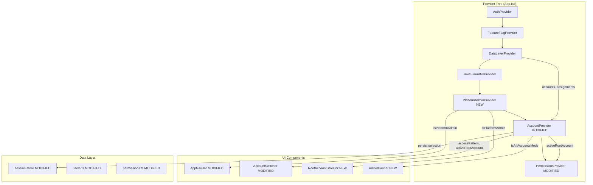

# Design Document: Multi-Account Access

## Requirements Review

### Gap Analysis

The requirements document is well-structured and comprehensive. The following gaps and clarifications were identified during review:

1. **Req 4 (Per-Root-Account Permissions) -- Missing: What happens to RoleSimulatorContext?** The existing `RoleSimulatorContext` provides a global role override (admin/marketer/viewer) that bypasses the assignment-based permissions. The requirements do not address how the role simulator interacts with per-root-account permissions. **Resolution**: The role simulator remains as-is -- it is a prototype tool that overrides all permission resolution regardless of root account. This is consistent with its purpose as a demo/walkthrough aid.

2. **Req 5 (Platform Admin) -- Missing: Relationship to existing ADMIN_BYPASS_EMAILS.** The requirements reference the pattern but do not specify whether the platform admin list is the same list or a separate one. **Resolution**: Use a single `PLATFORM_ADMIN_EMAILS` list in a new `PlatformAdminContext`. The existing `ADMIN_BYPASS_EMAILS` in `FeatureFlagContext` remains separate (feature flag bypass is a different concern from account access).

3. **Req 7 (All Accounts Mode) -- Ambiguity: Which pages require a specific root account?** AC 7.4 says the system should prompt when a page requires a specific root account, but does not enumerate which pages. **Resolution**: For the prototype, all pages except `/admin/billing`, `/admin/activity`, and `/dashboard` require a specific root account. These three pages support cross-account aggregate views. Other pages show a banner: "Select a specific account to view this page."

4. **Req 8 (Admin-Only Nav Items) -- Missing: Route paths for new admin items.** The requirements mention "Billing Report, Activity Log, and User Management (cross-org)" but do not specify routes. **Resolution**: Billing Report already exists at `/admin/billing`. Activity Log exists at `/admin/activity`. User Management (cross-org) maps to `/admin/users` (new placeholder page).

5. **Req 9 (Mock Data) -- Missing: Which existing user becomes the multi-account user?** **Resolution**: Create a new user (`usr-012`, "Jordan Blake", `jordan@ubiquity.io`) as the multi-account user with assignments across Serenity Spa Group and Christchurch City Council. The platform admin user is the authenticated Supabase user whose email matches the `PLATFORM_ADMIN_EMAILS` list. For local mode, the mock user (`local@ubiquity.dev`) is added to the admin list.

6. **Req 3 (Multi-Account Root Switching) -- Missing: What happens to child account selection when root changes?** **Resolution**: When the active root account changes, the selected account resets to the new root account (the "All Locations" equivalent for that root).

7. **Req 10 (Persistence) -- Missing: Should All Accounts Mode persist?** **Resolution**: Yes. The session store saves `'__all__'` as the `selectedRootAccountId` when in All Accounts Mode.

### Requirements Confirmed As-Is

Requirements 1, 2, 3, 6, and 10 are clear and implementable without modification. The glossary is precise and the acceptance criteria use testable WHEN/SHALL language throughout.

## Overview

This feature extends the existing single-root-account model to support three access patterns: single-account users (unchanged behaviour), multi-account users (root switching via the AccountSwitcher), and platform admins (root switching via the avatar dropdown with an "All Accounts" mode). The design introduces a `PlatformAdminContext` for admin identification, refactors `AccountContext` to manage root account selection with session persistence, and modifies `AccountSwitcher` and `AppNavBar` to render the appropriate UI for each access pattern. Permission resolution in `PermissionsContext` becomes root-account-aware. All changes follow existing patterns: React context providers, CSS Modules, Phosphor icons, and local/Supabase dual-mode data.

## Architecture



### Key Architectural Decisions

1. **New PlatformAdminContext rather than extending FeatureFlagContext.** Platform admin status is an access control concern, not a feature flag concern. Keeping them separate avoids coupling and follows single-responsibility. The email list pattern is reused but the context is independent.

2. **AccountContext refactored, not replaced.** The existing `AccountContext` already manages account selection and filtering. Adding root account awareness to it (rather than creating a parallel context) avoids breaking the 15+ components that already consume `useAccount()`.

3. **PlatformAdminProvider sits between RoleSimulatorProvider and AccountProvider.** It needs `useAuth()` (for the user email) and must be available before `AccountProvider` (which needs to know if the user is a platform admin to determine accessible root accounts).

4. **Root account selection stored in session-store.** The existing `session-store.ts` already has a `selectedAccountId` field. We add `selectedRootAccountId` alongside it. This keeps persistence co-located.

5. **AccountSwitcher adapts its rendering based on access pattern.** Rather than creating separate components for single-account vs multi-account, the existing `AccountSwitcher` gains a root account section that appears conditionally. This minimises new files and keeps the nav bar layout stable.

6. **RootAccountSelector is a new sub-component of the avatar dropdown.** For platform admins, the avatar dropdown in `AppNavBar` renders a `RootAccountSelector` section above the existing menu items. This is a small, focused component.

## Components and Interfaces

### PlatformAdminContext (NEW)

```typescript
// src/contexts/PlatformAdminContext.tsx

const PLATFORM_ADMIN_EMAILS: string[] = [
  'knewstubb@gmail.com',
  'local@ubiquity.dev',  // local mode mock user
];

interface PlatformAdminContextValue {
  isPlatformAdmin: boolean;
}

function PlatformAdminProvider({ children }: { children: ReactNode }): JSX.Element;
function usePlatformAdmin(): PlatformAdminContextValue;
```

### AccountContext (MODIFIED)

```typescript
// src/contexts/AccountContext.tsx

type AccessPattern = 'single-account' | 'multi-account' | 'platform-admin';

interface AccountContextValue {
  // Existing (preserved)
  accounts: Account[];
  selectedAccountId: string;
  selectedAccount: Account;
  setSelectedAccountId: (id: string) => void;
  filterByAccount: <T extends { accountId: string }>(items: T[]) => T[];

  // New
  accessPattern: AccessPattern;
  accessibleRootAccounts: Account[];
  activeRootAccountId: string | null;       // null = All Accounts Mode
  activeRootAccount: Account | null;        // null = All Accounts Mode
  setActiveRootAccountId: (id: string | null) => void;
  isAllAccountsMode: boolean;
  accountsInActiveTree: Account[];          // all accounts under active root (or all if All Accounts Mode)
}
```

**Behaviour changes:**
- On mount, resolves `accessibleRootAccounts` from the user's assignments (tracing each assigned account to its root) or all roots if platform admin.
- Determines `accessPattern` based on: platform admin -> `'platform-admin'`, multiple roots -> `'multi-account'`, else -> `'single-account'`.
- `setActiveRootAccountId(null)` enters All Accounts Mode (platform admin only).
- When `activeRootAccountId` changes, `selectedAccountId` resets to the new root account ID.
- `filterByAccount` respects `isAllAccountsMode` -- returns all items when in All Accounts Mode.
- `accountsInActiveTree` returns the root + all descendants for the active root, or all accounts in All Accounts Mode.
- Persists `activeRootAccountId` to session store on change; restores on mount.

### PermissionsContext (MODIFIED)

```typescript
// Changes to existing PermissionsContext

// New method added to PermissionsContextValue:
interface PermissionsContextValue {
  // ... existing methods preserved ...

  // New: resolve effective permissions for the active root account tree
  effectivePermissions: Record<string, FunctionalPermissions>;
}
```

**Behaviour changes:**
- When `activeRootAccountId` changes, re-resolves the user's effective permissions by finding assignments within the active root's account tree.
- If the user has multiple assignments within the tree (e.g., Admin on root, Viewer on a child), the highest-privilege assignment wins (union of permissions).
- In All Accounts Mode, effective permissions are the union across all assignments (platform admins have full access anyway).
- The `RoleSimulatorContext` override continues to take precedence when active.

### AccountSwitcher (MODIFIED)

```typescript
// src/components/layout/AccountSwitcher.tsx

// No prop changes -- reads from AccountContext
function AccountSwitcher(): JSX.Element;
```

**Rendering logic:**
- **Single-account user**: Unchanged. Shows root account name + child/grandchild dropdown.
- **Multi-account user**: Shows a "Root Accounts" section at the top of the dropdown (separated by a divider), listing accessible root accounts with active indicator. Below the divider, shows the active root's child/grandchild accounts as before.
- **Platform admin**: Shows the active root account name in the trigger (or "All Accounts"). The root switching happens in the avatar dropdown, not here. The AccountSwitcher shows the active root's tree only. In All Accounts Mode, the trigger shows "All Accounts" and the dropdown is disabled.

### RootAccountSelector (NEW)

```typescript
// src/components/layout/RootAccountSelector.tsx

interface RootAccountSelectorProps {
  onSelect: () => void;  // callback to close the avatar dropdown
}

function RootAccountSelector({ onSelect }: RootAccountSelectorProps): JSX.Element;
```

**Rendering:**
- Section header: "Switch Account" (Body XS, text-muted, uppercase, 600 weight).
- List of all root accounts as buttons, each showing account name.
- "All Accounts" option at the top with a globe icon (Phosphor `GlobeSimple`).
- Active selection indicated by teal text + checkmark icon (Phosphor `Check`).
- Separated from other avatar menu items by a divider.

### AppNavBar (MODIFIED)

```typescript
// Changes to AppNavBar.tsx

// Avatar dropdown gains:
// 1. RootAccountSelector section (platform admin only)
// 2. Admin-only nav items injected into NAV_ITEMS (platform admin only)
```

**Admin-only nav items** added to the Admin dropdown:
- "Billing Report" -> `/admin/billing` (already exists)
- "Activity Log" -> `/admin/activity` (already exists)
- "User Management" -> `/admin/users` (new placeholder)

These items are conditionally included when `isPlatformAdmin` is true.

### AdminAccountBanner (NEW)

```typescript
// src/components/layout/AdminAccountBanner.tsx

function AdminAccountBanner(): JSX.Element | null;
```

**Rendering:**
- Only renders when `isAllAccountsMode` is true AND the current route requires a specific account.
- Shows a subtle info banner: "This page requires a specific account context. Select an account to continue."
- Uses the existing info colour (`#38BDF8`) with a light background.
- Includes a "Select Account" button that opens the avatar dropdown or navigates to account selection.

### Session Store (MODIFIED)

```typescript
// src/lib/session-store.ts

interface SessionState {
  selectedAccountId: string;
  selectedRootAccountId: string | null;  // NEW: null = All Accounts Mode, '__all__' stored as string
  activeFilters: { /* ... existing ... */ };
  openPanels: string[];
  simulatedRole: SimulatedRole;
  lastRoute: string;
}
```

## Data Models

### Mock Data Changes

**New user in `src/data/users.ts`:**

```typescript
{
  id: 'usr-012',
  name: 'Jordan Blake',
  email: 'jordan@ubiquity.io',
  initials: 'JB',
}
```

**New assignments in `src/data/permissions.ts`:**

```typescript
// Jordan Blake: Admin on Serenity Spa Group, Viewer on Christchurch City Council
{ userId: 'usr-012', accountId: 'acc-master', permissionGroupId: 'grp-admin', customPermissions: null },
{ userId: 'usr-012', accountId: 'acc-ccc', permissionGroupId: 'grp-viewer', customPermissions: null },

// Existing CCC users get assignments (currently missing)
{ userId: 'usr-006', accountId: 'acc-ccc', permissionGroupId: 'grp-admin', customPermissions: null },
{ userId: 'usr-006', accountId: 'acc-ccc-parks', permissionGroupId: 'grp-admin', customPermissions: null },
{ userId: 'usr-006', accountId: 'acc-ccc-libraries', permissionGroupId: 'grp-admin', customPermissions: null },
{ userId: 'usr-006', accountId: 'acc-ccc-events', permissionGroupId: 'grp-admin', customPermissions: null },
// ... similar for usr-007 through usr-011 across CCC and STC trees
```

**Platform admin email list** (in `PlatformAdminContext`):

```typescript
const PLATFORM_ADMIN_EMAILS = [
  'knewstubb@gmail.com',
  'local@ubiquity.dev',
];
```

### Root Account Resolution Algorithm

Given a user's assignments, resolve accessible root accounts:

```typescript
function resolveAccessibleRoots(
  assignments: UserAccountAssignment[],
  allAccounts: Account[],
  userId: string,
): Account[] {
  const userAssignments = assignments.filter(a => a.userId === userId);
  const rootIds = new Set<string>();

  for (const assignment of userAssignments) {
    let account = allAccounts.find(a => a.id === assignment.accountId);
    while (account && account.parentId !== null) {
      account = allAccounts.find(a => a.id === account!.parentId);
    }
    if (account) {
      rootIds.add(account.id);
    }
  }

  return allAccounts.filter(a => rootIds.has(a.id));
}
```

### Permission Resolution Algorithm

Given an active root account, resolve effective permissions:

```typescript
function resolveEffectivePermissions(
  assignments: UserAccountAssignment[],
  permissionGroups: PermissionGroup[],
  accountTreeIds: string[],
  userId: string,
): Record<string, FunctionalPermissions> {
  const relevantAssignments = assignments.filter(
    a => a.userId === userId && accountTreeIds.includes(a.accountId)
  );

  // Union of all permissions (highest privilege wins per functional group)
  const result: Record<string, FunctionalPermissions> = {};

  for (const assignment of relevantAssignments) {
    const perms = assignment.customPermissions
      ?? permissionGroups.find(g => g.id === assignment.permissionGroupId)?.permissions
      ?? {};

    for (const [group, fp] of Object.entries(perms)) {
      if (!result[group]) {
        result[group] = { create: false, read: false, update: false, delete: false };
      }
      result[group] = {
        create: result[group].create || fp.create,
        read: result[group].read || fp.read,
        update: result[group].update || fp.update,
        delete: result[group].delete || fp.delete,
      };
    }
  }

  return result;
}
```

## Correctness Properties

### Property 1: Root Account Resolution Completeness
FOR ANY user with assignments to accounts A1, A2, ..., An, the set of accessible root accounts SHALL contain exactly the set of unique root ancestors of A1 through An. No root account without a descendant assignment SHALL appear. No root account with a descendant assignment SHALL be missing.
_Validates: Requirements 1.1, 1.2, 1.3_

### Property 2: Access Pattern Classification Correctness
FOR ANY user, IF the user is a platform admin THEN accessPattern SHALL be `'platform-admin'`. ELSE IF the user has accessible root accounts count > 1 THEN accessPattern SHALL be `'multi-account'`. ELSE accessPattern SHALL be `'single-account'`.
_Validates: Requirements 1.2, 1.3, 5.1, 5.2_

### Property 3: Single-Account User Isolation
FOR ANY single-account user, the AccountSwitcher SHALL NOT render a root account selector section. The set of accounts in the dropdown SHALL be identical to the current behaviour (root + descendants of the single accessible root).
_Validates: Requirements 2.1, 2.2, 2.3_

### Property 4: Root Switch Resets Child Selection
FOR ANY root account switch (from root R1 to root R2), the selectedAccountId SHALL be set to R2's ID. The accountsInActiveTree SHALL contain only R2 and its descendants.
_Validates: Requirements 3.2, 3.3_

### Property 5: Permission Resolution Per Root
FOR ANY user with assignments across roots R1 and R2, WHEN activeRootAccountId is R1, the effectivePermissions SHALL be computed only from assignments within R1's account tree. Assignments in R2's tree SHALL NOT contribute.
_Validates: Requirements 4.1, 4.2_

### Property 6: Permission Union Within Tree
FOR ANY user with multiple assignments within a single root account tree, the effectivePermissions for each functional group SHALL be the boolean OR (union) of all assignment permissions for that group within the tree.
_Validates: Requirements 4.3_

### Property 7: Platform Admin Access Completeness
FOR ANY platform admin, accessibleRootAccounts SHALL contain ALL root accounts in the system, regardless of user_account_assignments.
_Validates: Requirements 5.3_

### Property 8: All Accounts Mode Exclusivity
isAllAccountsMode SHALL be true IF AND ONLY IF activeRootAccountId is null. Only platform admins SHALL be able to set activeRootAccountId to null.
_Validates: Requirements 7.1, 7.2, 7.3_

### Property 9: Session Persistence Round-Trip
FOR ANY activeRootAccountId value V (including null for All Accounts Mode), saving to session store and loading back SHALL produce the same value V. IF V references a root account no longer accessible, the fallback SHALL be the first accessible root account.
_Validates: Requirements 10.1, 10.2, 10.3_

## Error Handling

| Scenario | Behaviour |
|---|---|
| User has zero assignments | `accessibleRootAccounts` is empty. Redirect to a "no access" state. For the prototype, fall back to showing all accounts (fail-open). |
| Stored root account ID no longer valid | Fall back to first accessible root account. Log a warning to console. |
| Platform admin email list is empty | All users treated as non-admin. `isPlatformAdmin` is false for everyone. |
| User switches to root where they have no direct root assignment | Permissions resolved from child account assignments within that tree (Req 4.3). |
| All Accounts Mode on a page requiring specific account | `AdminAccountBanner` renders with prompt to select an account. Page content is hidden or shows empty state. |
| Supabase not configured (local mode) | Mock user (`local@ubiquity.dev`) is treated as platform admin. All accounts accessible. Assignments loaded from local seed data. |

## Testing Strategy

### Unit Tests (Vitest)

1. **`resolveAccessibleRoots`** -- test with single-root user, multi-root user, user with only child-level assignments.
2. **`resolveEffectivePermissions`** -- test permission union logic, single assignment, mixed groups.
3. **`PlatformAdminContext`** -- test admin detection with matching email, non-matching email, empty list.
4. **`AccountContext` root switching** -- test that child selection resets, tree filtering updates.
5. **`RootAccountSelector` rendering** -- test active indicator, All Accounts option visibility.
6. **`AccountSwitcher` conditional rendering** -- test single-account hides root section, multi-account shows it.
7. **Session persistence** -- test save/load round-trip, fallback on invalid stored ID.

### Property-Based Tests (Vitest + fast-check)

1. **Root resolution completeness** (Property 1) -- generate random assignment sets, verify root set matches.
2. **Access pattern classification** (Property 2) -- generate user scenarios, verify classification.
3. **Permission union correctness** (Property 6) -- generate multiple assignments, verify OR logic.
4. **Session round-trip** (Property 9) -- generate random root IDs, verify persistence fidelity.

### Integration Tests

1. **Full provider tree** -- mount `AuthProvider` through `PermissionsProvider`, verify context values propagate correctly for each access pattern.
2. **Nav bar rendering** -- verify admin-only items appear/disappear based on platform admin status.
3. **Route protection** -- verify non-admin users redirected from admin-only routes.
