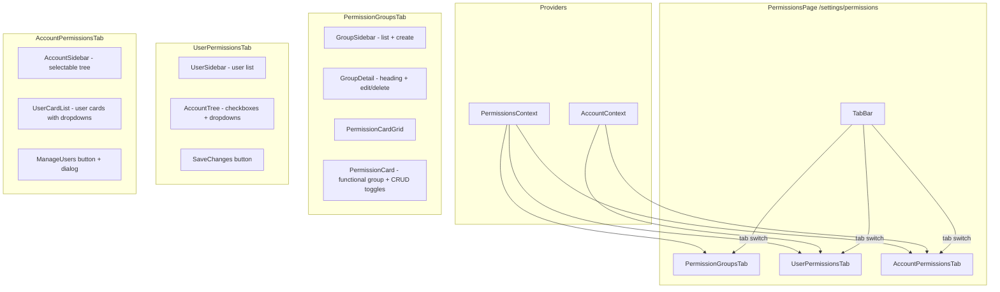

# Design Document: Permissions Management

## Overview

Add a three-tab permissions management page at `/settings/permissions`. The page uses a consistent master-detail layout across all three tabs: a left sidebar for selection and a main content area for details/actions.

- **Permission Groups tab**: Master-detail for creating/editing/deleting reusable permission templates. Left sidebar lists groups; main area shows the selected group's CRUD toggle cards. Functional groups map directly to the app's navigation sections (Dashboard, Audiences, Campaigns, Content, Analytics, Settings).
- **User Permissions tab**: Select a user from the sidebar, then assign them to accounts via an interactive account tree with checkboxes, permission group dropdowns, and cascading access.
- **Account Permissions tab**: Select an account from a hierarchy tree in the sidebar, then see and manage all users who have access to that account.

All state is local (React context + localStorage). No backend. The existing `Account` model and `accounts` data from `src/data/accounts.ts` are used directly — no separate hierarchy account type. Users are extracted from SettingsPage into a shared `src/data/users.ts` file. A new `PermissionsContext` manages permission groups, user-account assignments, and CRUD operations.

### Key Design Decisions

1. **Single PermissionsContext** — All permissions state (groups, assignments, functional groups) lives in one context. This keeps the feature self-contained and avoids cross-context coordination. The context initialises from seed data and persists to `localStorage`.

2. **Use existing Account model directly** — The existing `Account` interface (`{ id, name, parentId, childIds, region, status }`) and `accounts` array are used as-is. Hierarchy icons are derived dynamically from each account's position in the tree: `parentId === null` → Buildings (root), `childIds.length > 0 && parentId !== null` → GlobeHemisphereWest (intermediate), `childIds.length === 0` → MapPin (leaf). No `level` field, no `HierarchyAccount` type, no separate account dataset.

3. **Nav-section-based functional groups** — Functional groups map to the app's navigation sections: Dashboard, Audiences, Campaigns, Content, Analytics, Settings. This makes permissions visually demonstrable — toggling access on/off for a section could hide/show that nav item. The data model retains full CRUD granularity per group for future flexibility, but demo defaults use all-on or all-off per section.

4. **Shared user data** — The 5 users currently defined inline in SettingsPage.tsx are extracted to `src/data/users.ts`. Both SettingsPage and PermissionsPage import from this shared file.

5. **Toggle switches, not checkboxes, for CRUD permissions** — The wireframes show toggle switches for Create/Read/Update/Delete. The existing `Toggle` component is reused directly. Checkboxes are reserved for the account tree selection.

6. **Indeterminate checkbox via enhanced Checkbox component** — The existing `Checkbox` component needs an `indeterminate` prop to support the parent-with-partial-children state in the account tree.

7. **Tab state via local component state** — The active tab is managed by `useState` in the `PermissionsPage` component, not via URL params. This keeps the URL clean at `/settings/permissions` regardless of which tab is active.

8. **Permission Group auto-detection** — When a user's custom toggles exactly match a named group's definition, the dropdown automatically shows that group name instead of "Custom". This is computed on render, not stored.

## Architecture



### Component Tree

```
App
├── PermissionsContext.Provider                    (new)
│   └── PermissionsPage                           (new)
│       ├── PageShell
│       ├── TabBar                                (new, reusable)
│       │
│       ├── PermissionGroupsTab                   (new)
│       │   ├── GroupSidebar                      (new)
│       │   │   └── GroupListItem[]               (new)
│       │   └── GroupDetail                       (new)
│       │       ├── GroupHeading + Edit/Delete     
│       │       └── PermissionCardGrid            (new)
│       │           └── PermissionCard[]          (new)
│       │               └── Toggle (×4)           (reused)
│       │
│       ├── UserPermissionsTab                    (new)
│       │   ├── UserSidebar                       (new)
│       │   │   └── UserListItem[]                (new)
│       │   └── UserPermissionsMain               (new)
│       │       ├── SaveChanges button
│       │       └── AccountTree                   (new)
│       │           └── AccountTreeNode[]         (new, recursive)
│       │               ├── Checkbox              (reused, extended with indeterminate)
│       │               ├── Dropdown              (reused)
│       │               └── PencilSimple icon     
│       │
│       └── AccountPermissionsTab                 (new)
│           ├── AccountSidebar                    (new)
│           │   └── AccountTreeNode[]             (reused, no checkboxes)
│           └── AccountPermissionsMain            (new)
│               ├── ManageUsers button + dialog
│               └── UserAccessCard[]              (new)
│                   ├── Avatar
│                   ├── Dropdown                  (reused)
│                   └── PencilSimple icon
```

## Components and Interfaces

### PermissionsPage

Location: `src/pages/PermissionsPage.tsx`

Top-level page component. Renders `PageShell` with title "Permissions" and the `TabBar`. Manages active tab state via `useState<'groups' | 'users' | 'accounts'>('groups')`. Conditionally renders the active tab component.

### TabBar

Location: `src/components/permissions/TabBar.tsx`

```typescript
interface Tab {
  key: string;
  label: string;
}

interface TabBarProps {
  tabs: Tab[];
  activeKey: string;
  onTabChange: (key: string) => void;
}
```

Renders a horizontal row of tab buttons. Active tab gets teal underline/text styling matching existing UbiQuity patterns. Tabs are `<button>` elements with `role="tab"` and `aria-selected` for accessibility.

### PermissionGroupsTab

Location: `src/components/permissions/PermissionGroupsTab.tsx`

Master-detail layout with CSS Grid (`grid-template-columns: 280px 1fr`). Left column renders `GroupSidebar`, right column renders `GroupDetail` or empty state.

Manages local editing state: `editingGroupId`, `isCreating`, draft name/description/permissions.

### GroupSidebar

Location: `src/components/permissions/GroupSidebar.tsx`

```typescript
interface GroupSidebarProps {
  groups: PermissionGroup[];
  selectedGroupId: string | null;
  onSelectGroup: (id: string) => void;
  onCreateClick: () => void;
}
```

Renders "+ Create" button at top, then a scrollable list of group items. Each item shows group name (bold) and description (muted text). Selected item has light teal background.

### PermissionCard

Location: `src/components/permissions/PermissionCard.tsx`

```typescript
interface PermissionCardProps {
  functionalGroup: string;
  permissions: { create: boolean; read: boolean; update: boolean; delete: boolean };
  editable: boolean;
  onToggle?: (permission: 'create' | 'read' | 'update' | 'delete', value: boolean) => void;
}
```

Card with the functional group name (e.g. "Dashboard", "Audiences") as heading. Four `Toggle` components labelled Create, Read, Update, Delete. When `editable` is false, toggles are disabled (read-only view). Cards are arranged in a responsive grid (`grid-template-columns: repeat(auto-fill, minmax(240px, 1fr))`).

### UserSidebar

Location: `src/components/permissions/UserSidebar.tsx`

```typescript
interface UserSidebarProps {
  users: PermissionUser[];
  selectedUserId: string | null;
  onSelectUser: (id: string) => void;
}
```

Renders "Users" heading, then a scrollable list of user items. Each item shows avatar circle (initials, teal background), name, and email. Selected user has light background highlight.

### AccountTree

Location: `src/components/permissions/AccountTree.tsx`

```typescript
interface AccountTreeProps {
  accounts: Account[];                // existing Account[] from src/data/accounts.ts
  checkedAccountIds: Set<string>;
  assignments: Map<string, string>;   // accountId → permissionGroupId
  onCheckChange: (accountId: string, checked: boolean) => void;
  onGroupChange: (accountId: string, groupId: string) => void;
  onEditClick: (accountId: string) => void;
}
```

Renders the account hierarchy as a nested tree. Dynamically finds root accounts (`parentId === null`) and recursively renders children using `childIds`. Each node is an `AccountTreeNode`. The tree handles cascading logic: checking a parent checks all descendants, unchecking a parent unchecks all descendants. Parent nodes show indeterminate state when partially checked.

### AccountTreeNode

Location: `src/components/permissions/AccountTreeNode.tsx`

```typescript
interface AccountTreeNodeProps {
  account: Account;                   // existing Account interface
  allAccounts: Account[];             // full list for child lookups
  checked: boolean;
  indeterminate: boolean;
  assignment: string | null;          // permission group ID or 'custom'
  permissionGroups: PermissionGroup[];
  onCheckChange: (checked: boolean) => void;
  onGroupChange: (groupId: string) => void;
  onEditClick: () => void;
  children?: ReactNode;               // nested child nodes
  showCheckbox?: boolean;             // false for Account Permissions sidebar
}
```

Renders a single tree node with:
- Hierarchy icon derived from account position: `Buildings` if `parentId === null`, `GlobeHemisphereWest` if `childIds.length > 0 && parentId !== null`, `MapPin` if `childIds.length === 0` — all from Phosphor
- `Checkbox` with indeterminate support
- Account name
- When checked: `Dropdown` for permission group + `PencilSimple` edit icon
- Visual connecting lines via CSS `::before` pseudo-elements on nested children

### UserAccessCard

Location: `src/components/permissions/UserAccessCard.tsx`

```typescript
interface UserAccessCardProps {
  user: PermissionUser;
  assignedGroupId: string;
  permissionGroups: PermissionGroup[];
  onGroupChange: (groupId: string) => void;
  onEditClick: () => void;
}
```

Card displaying user avatar, name, email, permission group dropdown, and pencil edit icon. Cards stack vertically in the Account Permissions tab main area.

### ManageUsersDialog

Location: `src/components/permissions/ManageUsersDialog.tsx`

```typescript
interface ManageUsersDialogProps {
  open: boolean;
  accountName: string;
  allUsers: PermissionUser[];
  usersWithAccess: string[];          // user IDs
  permissionGroups: PermissionGroup[];
  onSave: (userAssignments: { userId: string; groupId: string }[]) => void;
  onClose: () => void;
}
```

Modal dialog for adding/removing users from an account. Shows a list of all users with checkboxes. Checked users get a permission group dropdown. Save commits changes.

### DeleteGroupDialog

Location: `src/components/permissions/DeleteGroupDialog.tsx`

```typescript
interface DeleteGroupDialogProps {
  open: boolean;
  groupName: string;
  affectedUserCount: number;
  onConfirm: () => void;
  onCancel: () => void;
}
```

Confirmation dialog with red "Delete" button. Shows warning about affected users being changed to "Custom".

### PermissionEditPanel

Location: `src/components/permissions/PermissionEditPanel.tsx`

```typescript
interface PermissionEditPanelProps {
  open: boolean;
  accountName: string;
  userName: string;
  permissions: Record<string, { create: boolean; read: boolean; update: boolean; delete: boolean }>;
  onToggle: (functionalGroup: string, permission: 'create' | 'read' | 'update' | 'delete', value: boolean) => void;
  onClose: () => void;
}
```

Slide-over or modal panel showing the full set of `PermissionCard` components in editable mode. Used when clicking the pencil/edit icon on a checked account (User Permissions tab) or a user card (Account Permissions tab). Shows the resolved group name or "Custom" based on current toggle state.

## Data Models

### PermissionGroup

Location: `src/models/permissions.ts`

```typescript
export type CrudPermission = 'create' | 'read' | 'update' | 'delete';

export interface FunctionalPermissions {
  create: boolean;
  read: boolean;
  update: boolean;
  delete: boolean;
}

export interface PermissionGroup {
  id: string;
  name: string;
  description: string;
  permissions: Record<string, FunctionalPermissions>;  // keyed by functional group name
}
```

### PermissionUser

Location: `src/models/permissions.ts`

```typescript
export interface PermissionUser {
  id: string;
  name: string;
  email: string;
  initials: string;
}
```

### UserAccountAssignment

Location: `src/models/permissions.ts`

```typescript
export interface UserAccountAssignment {
  userId: string;
  accountId: string;
  permissionGroupId: string | null;  // null = custom
  customPermissions: Record<string, FunctionalPermissions> | null;  // only set when custom
}
```

### Account (existing — no changes)

Location: `src/models/account.ts` (already exists)

```typescript
export interface Account {
  id: string;
  name: string;
  parentId: string | null;
  childIds: string[];
  region: string;
  status: 'active' | 'inactive';
}
```

The permissions feature uses this interface directly. No `HierarchyAccount` type. No `level` field. Hierarchy icons are derived at render time from `parentId` and `childIds`.

### Hierarchy Icon Derivation (utility function)

Location: `src/data/permissions.ts`

```typescript
import type { Account } from '../models/account';

export function getHierarchyIcon(account: Account): 'buildings' | 'globe' | 'pin' {
  if (account.parentId === null) return 'buildings';        // root
  if (account.childIds.length > 0) return 'globe';          // intermediate
  return 'pin';                                              // leaf
}
```

This works dynamically with any account hierarchy structure.

### Functional Groups (constants)

Location: `src/data/permissions.ts`

```typescript
export const FUNCTIONAL_GROUPS = [
  'Dashboard',
  'Audiences',
  'Campaigns',
  'Content',
  'Analytics',
  'Settings',
] as const;

export type FunctionalGroupName = (typeof FUNCTIONAL_GROUPS)[number];
```

These map directly to the app's navigation sections in `AppNavBar.tsx`.

### Shared User Data

Location: `src/data/users.ts` (new file)

```typescript
import type { PermissionUser } from '../models/permissions';

export const users: PermissionUser[] = [
  { id: 'usr-001', name: 'Aroha Mitchell', email: 'aroha@serenityspa.co.nz', initials: 'AM' },
  { id: 'usr-002', name: 'Nikau Patel', email: 'nikau@serenityspa.co.nz', initials: 'NP' },
  { id: 'usr-003', name: 'Maia Chen', email: 'maia@serenityspa.co.nz', initials: 'MC' },
  { id: 'usr-004', name: 'Tāne Williams', email: 'tane@serenityspa.co.nz', initials: 'TW' },
  { id: 'usr-005', name: 'Isla Thompson', email: 'isla@serenityspa.co.nz', initials: 'IT' },
];
```

SettingsPage.tsx will import from this file instead of defining users inline. The `role` field used in SettingsPage is derived from the user's permission group assignment, not stored on the user model.

### PermissionsContext

Location: `src/contexts/PermissionsContext.tsx`

```typescript
interface PermissionsContextValue {
  // Permission Groups
  permissionGroups: PermissionGroup[];
  addPermissionGroup: (group: PermissionGroup) => void;
  updatePermissionGroup: (id: string, updates: Partial<PermissionGroup>) => void;
  deletePermissionGroup: (id: string) => void;

  // Users
  users: PermissionUser[];

  // Assignments
  assignments: UserAccountAssignment[];
  setAssignmentsForUser: (userId: string, assignments: UserAccountAssignment[]) => void;
  setAssignmentForUserAccount: (userId: string, accountId: string, groupId: string | null, customPermissions: Record<string, FunctionalPermissions> | null) => void;
  removeAssignment: (userId: string, accountId: string) => void;
  getAssignmentsForUser: (userId: string) => UserAccountAssignment[];
  getAssignmentsForAccount: (accountId: string) => UserAccountAssignment[];

  // Account hierarchy helpers (using existing Account data)
  getChildAccounts: (parentId: string) => Account[];
  getAllDescendantIds: (parentId: string) => string[];
  getRootAccounts: () => Account[];

  // Utility
  resolveGroupName: (assignment: UserAccountAssignment) => string;  // returns group name or "Custom"
  matchPermissionsToGroup: (permissions: Record<string, FunctionalPermissions>) => string | null;  // returns group ID or null
}
```

- Reads accounts from `src/data/accounts.ts` via `AccountContext` or direct import
- Reads users from `src/data/users.ts`
- Initialises permission groups and assignments from `src/data/permissions.ts` seed data
- Persists to `localStorage` under key `ubiquity-permissions`
- `deletePermissionGroup` converts all assignments using that group to custom (preserving current permissions)
- `updatePermissionGroup` propagates changes to all users assigned to that group (global update)
- `resolveGroupName` checks if an assignment's effective permissions match any group definition
- `matchPermissionsToGroup` compares a permissions object against all group definitions
- `getRootAccounts` returns accounts where `parentId === null`
- `getChildAccounts` returns accounts whose `parentId` matches the given ID
- `getAllDescendantIds` recursively collects all descendant account IDs

### Seed Data

Location: `src/data/permissions.ts`

**Default Permission Groups:**

| Group | Dashboard | Audiences | Campaigns | Content | Analytics | Settings |
|-------|-----------|-----------|-----------|---------|-----------|----------|
| Admin | All CRUD | All CRUD | All CRUD | All CRUD | All CRUD | All CRUD |
| Editor | All CRUD | All CRUD | All CRUD | All CRUD | Off | Off |
| Viewer | All CRUD | Read only | Off | Off | Read only | Off |

- "Admin" — Full access to all sections, all CRUD enabled. Description: "Full access to all features and settings."
- "Editor" — Dashboard, Audiences, Campaigns, Content access (all CRUD); Analytics and Settings disabled. Description: "Can manage content and campaigns but not analytics or settings."
- "Viewer" — Dashboard (all CRUD), Audiences (Read only), Analytics (Read only); Campaigns, Content, and Settings disabled. Description: "Read-only access to data and reports."

**Seed Assignments:**

| User | Account(s) | Group | Notes |
|------|-----------|-------|-------|
| Aroha Mitchell | Serenity Spa Group (acc-master) | Admin | Cascades to all children |
| Nikau Patel | Serenity Spa Group (acc-master) | Editor | Cascades to all children |
| Maia Chen | Auckland (acc-auckland), Wellington (acc-wellington) | Editor | Two specific accounts only |
| Tāne Williams | Serenity Spa Group (acc-master) | Viewer | Cascades to all children |
| Isla Thompson | Queenstown (acc-queenstown) | Custom | Dashboard + Audiences only |

Isla Thompson's custom permissions on Queenstown:
- Dashboard: all CRUD on
- Audiences: all CRUD on
- Campaigns: all off
- Content: all off
- Analytics: all off
- Settings: all off

For cascading assignments (Aroha, Nikau, Tāne), the seed data creates explicit assignment records for the parent AND each child account, all referencing the same permission group. This means `acc-master`, `acc-auckland`, `acc-wellington`, `acc-christchurch`, and `acc-queenstown` each get an assignment row.

### Routing Changes

Add to `App.tsx`:

```typescript
import PermissionsPage from './pages/PermissionsPage';

// Inside Routes:
<Route path="/settings/permissions" element={<PermissionsPage />} />
```

The `PermissionsContext.Provider` wraps the route in `App.tsx` alongside existing providers.

### Settings Page Link

Add a "Manage Permissions" link/button to the existing Settings page that navigates to `/settings/permissions`. This sits in the "Users & Permissions" section.


## Cascading Access Logic

The cascading behaviour is implemented in the `AccountTree` component's `onCheckChange` handler. It uses the existing `Account` model's `childIds` to traverse the hierarchy:

```
When parent checked:
  1. Check parent
  2. For each child in account.childIds (recursive): check and assign parent's permission group
  
When parent unchecked:
  1. Uncheck parent
  2. For each child in account.childIds (recursive): uncheck and remove assignment

When child unchecked (parent was checked):
  1. Uncheck child and remove assignment
  2. Set parent checkbox to indeterminate (some children checked)
  3. Walk up ancestors via parentId: if any ancestor has partial children, set indeterminate

When child checked (parent was unchecked):
  1. Check child with default permission group
  2. Walk up ancestors via parentId: if all children now checked, check parent; else set indeterminate
```

The indeterminate state is computed, not stored — derived from comparing checked children count against total children count for each parent node using `childIds.length`.

## Permission Group Auto-Detection

When a user has custom permissions on an account, the system checks on every render whether those permissions match any named group:

```typescript
function matchPermissionsToGroup(
  customPerms: Record<string, FunctionalPermissions>,
  groups: PermissionGroup[]
): string | null {
  for (const group of groups) {
    const match = FUNCTIONAL_GROUPS.every(fg => {
      const custom = customPerms[fg];
      const groupPerm = group.permissions[fg];
      return custom.create === groupPerm.create
        && custom.read === groupPerm.read
        && custom.update === groupPerm.update
        && custom.delete === groupPerm.delete;
    });
    if (match) return group.id;
  }
  return null;
}
```

This runs when rendering dropdowns and when saving edits. If a match is found, the assignment is updated to reference the group ID instead of storing custom permissions.

## Checkbox Indeterminate Extension

The existing `Checkbox` component needs a small extension:

```typescript
// Added prop
interface CheckboxProps extends Omit<InputHTMLAttributes<HTMLInputElement>, 'type'> {
  label?: string;
  indeterminate?: boolean;  // NEW
}
```

Implementation uses a `ref` to set `inputRef.current.indeterminate = true` via `useEffect`. The indeterminate visual is a horizontal dash instead of a checkmark, styled via CSS `input:indeterminate + .checkmark::after`.


## Correctness Properties

*A property is a characteristic or behavior that should hold true across all valid executions of a system — essentially, a formal statement about what the system should do. Properties serve as the bridge between human-readable specifications and machine-verifiable correctness guarantees.*

### Property 1: Permission Groups sidebar renders one item per group

*For any* list of permission groups, the GroupSidebar should render exactly as many list items as there are groups, each displaying the group's name and description.

**Validates: Requirement 2.1**

### Property 2: Selected group detail shows correct permission cards

*For any* permission group with permissions across N functional groups, selecting that group should render exactly N PermissionCards, each with the correct functional group name as heading and four CRUD toggle states matching the group definition.

**Validates: Requirements 2.3, 2.5, 3.1, 3.2, 3.3**

### Property 3: Creating a group with valid name adds it to state

*For any* non-empty, non-whitespace group name with at least one permission enabled, submitting the create form should add a new group to the permission groups list and make it available in all dropdowns.

**Validates: Requirement 4.2**

### Property 4: Empty or whitespace group name prevents submission

*For any* string composed entirely of whitespace (including empty string), attempting to create or edit a permission group should be rejected, and the group list should remain unchanged.

**Validates: Requirement 4.3**

### Property 5: Deleting a group converts assignments to Custom with preserved permissions

*For any* permission group with N user-account assignments, deleting that group should result in all N assignments being converted to "Custom" with their current effective permissions preserved identically.

**Validates: Requirements 4.6, 4.7**

### Property 6: Editing a group propagates to all assigned users

*For any* permission group edit (changing CRUD toggles), all user-account assignments referencing that group should reflect the updated permissions immediately.

**Validates: Requirement 4.5**

### Property 7: User sidebar renders all users with required fields

*For any* list of users, the UserSidebar should render exactly as many list items as there are users, each displaying the user's initials, name, and email.

**Validates: Requirements 5.1, 5.2**

### Property 8: Selected user heading shows correct name

*For any* user, selecting them should display a heading containing "Permissions for {user.name}".

**Validates: Requirement 5.4**

### Property 9: Account tree renders all accounts from any valid hierarchy

*For any* valid array of accounts with consistent `parentId`/`childIds` relationships, the AccountTree should render every account as a node, with children nested under their parents and root accounts (`parentId === null`) at the top level.

**Validates: Requirements 6.1, 6.4, 6.10, 11.5**

### Property 10: Hierarchy icons match account tree position

*For any* account in the hierarchy, the rendered icon should be Buildings when `parentId === null`, GlobeHemisphereWest when `parentId !== null && childIds.length > 0`, and MapPin when `childIds.length === 0`.

**Validates: Requirements 6.2, 11.4**

### Property 11: Checking a parent cascades to all descendants with same group

*For any* parent account with N total descendants, checking the parent checkbox should result in N+1 total checked accounts (parent + all descendants), each assigned the same permission group as the parent.

**Validates: Requirements 6.5, 6.9**

### Property 12: Unchecking a parent unchecks all descendants

*For any* parent account with N total descendants that are all checked, unchecking the parent should result in 0 checked accounts in that branch and all assignments removed.

**Validates: Requirement 6.6**

### Property 13: Partial child selection shows indeterminate parent

*For any* parent account with N children where K children are checked (0 < K < N), the parent checkbox should be in the indeterminate state.

**Validates: Requirement 6.7**

### Property 14: Permission group dropdown lists all groups plus Custom

*For any* set of N permission groups, the dropdown on a checked account should contain N+1 options (all groups + "Custom").

**Validates: Requirement 7.1**

### Property 15: Custom permissions auto-detect matching group

*For any* set of CRUD toggle states that exactly match a named permission group's definition, the dropdown should display that group's name. For toggle states that don't match any group, the dropdown should display "Custom".

**Validates: Requirements 7.5, 7.6**

### Property 16: Account Permissions heading shows correct user count

*For any* account with N users who have access, the heading should display "Users with Access to {account.name}" and the subtitle should show "{N} user(s) have access."

**Validates: Requirement 8.4**

### Property 17: Account Permissions user cards show all required fields

*For any* user with access to the selected account, the user card should display avatar (initials), name, email, permission group dropdown, and edit icon.

**Validates: Requirements 9.1, 9.2**

## Error Handling

| Scenario | Handling |
|---|---|
| Empty group name on create/edit | Submit button disabled, inline validation message |
| No permissions selected on group create | Submit button disabled, inline message "Select at least one permission" |
| Delete group with assigned users | Confirmation dialog shows affected user count before proceeding |
| localStorage parse failure | PermissionsContext falls back to seed data |
| Invalid route `/settings/permissions` with corrupted state | Context reinitialises from seed data |
| Manage Users dialog — no users available | Dialog shows "All users already have access" message |

## Testing Strategy

### Unit Tests (Vitest + React Testing Library)

- **TabBar**: renders tabs, active state, click switches tabs
- **PermissionCard**: renders functional group name (Dashboard, Audiences, etc.), 4 toggles, read-only vs editable modes
- **GroupSidebar**: renders group list, selected highlight, create button
- **UserSidebar**: renders user list with avatars, selected highlight
- **AccountTreeNode**: renders correct hierarchy icon per tree position, checkbox states, dropdown visibility
- **UserAccessCard**: renders avatar, name, email, dropdown, edit icon
- **DeleteGroupDialog**: shows group name, affected count, confirm/cancel
- **ManageUsersDialog**: shows user list with checkboxes, group dropdowns, save/cancel
- **PermissionsContext**: addGroup, updateGroup, deleteGroup, assignment CRUD, cascading logic, auto-detection
- **getHierarchyIcon**: returns correct icon type for root, intermediate, and leaf accounts
- **Seed data**: verifies default groups (Admin, Editor, Viewer) and seed assignments match spec

### Property-Based Tests (fast-check)

Each correctness property above maps to a property-based test with minimum 100 iterations. Key generators:

- `arbPermissionGroup()`: generates a PermissionGroup with random name, description, and CRUD toggles across the 6 functional groups (Dashboard, Audiences, Campaigns, Content, Analytics, Settings)
- `arbPermissionUser()`: generates a PermissionUser with random name, email, initials
- `arbAccount()`: generates an Account with random id, name, parentId, childIds, region, status
- `arbAccountTree()`: generates a valid array of Account objects with consistent parent-child relationships (root → children → leaves)
- `arbAssignment()`: generates a UserAccountAssignment with random group or custom permissions
- `arbCrudToggles()`: generates a random `FunctionalPermissions` object (4 booleans)
- `arbFunctionalGroupPermissions()`: generates a `Record<string, FunctionalPermissions>` across all 6 functional groups

Each test tagged with: **Feature: permissions-management, Property {number}: {property_text}**

### Integration Tests

- Full tab navigation: click each tab, verify correct content renders
- Create group → appears in sidebar → select → see cards → edit → save → verify propagation
- Delete group → confirmation → verify assignments converted to Custom
- Select user → check parent account → verify cascade → change group → verify children update
- Select account → see user cards → change group → verify update
- Manage Users → add user → save → user appears in card list
- Verify seed data: Aroha as Admin on all accounts, Nikau as Editor on all, Maia as Editor on Auckland/Wellington, Tāne as Viewer on all, Isla as Custom on Queenstown

### File Organisation

```
src/
├── components/
│   └── permissions/
│       ├── TabBar.tsx
│       ├── TabBar.module.css
│       ├── PermissionGroupsTab.tsx
│       ├── PermissionGroupsTab.module.css
│       ├── GroupSidebar.tsx
│       ├── GroupSidebar.module.css
│       ├── PermissionCard.tsx
│       ├── PermissionCard.module.css
│       ├── UserPermissionsTab.tsx
│       ├── UserPermissionsTab.module.css
│       ├── UserSidebar.tsx
│       ├── UserSidebar.module.css
│       ├── AccountTree.tsx
│       ├── AccountTree.module.css
│       ├── AccountTreeNode.tsx
│       ├── AccountTreeNode.module.css
│       ├── AccountPermissionsTab.tsx
│       ├── AccountPermissionsTab.module.css
│       ├── UserAccessCard.tsx
│       ├── UserAccessCard.module.css
│       ├── ManageUsersDialog.tsx
│       ├── ManageUsersDialog.module.css
│       ├── DeleteGroupDialog.tsx
│       ├── DeleteGroupDialog.module.css
│       ├── PermissionEditPanel.tsx
│       └── PermissionEditPanel.module.css
├── contexts/
│   └── PermissionsContext.tsx
├── data/
│   ├── accounts.ts              (existing, unchanged)
│   ├── users.ts                 (new — shared user data)
│   └── permissions.ts           (new — seed groups, assignments, constants)
├── models/
│   ├── account.ts               (existing, unchanged)
│   └── permissions.ts           (new — PermissionGroup, PermissionUser, etc.)
├── pages/
│   ├── PermissionsPage.tsx
│   ├── PermissionsPage.module.css
│   └── SettingsPage.tsx         (modified — imports users from shared file)
```
