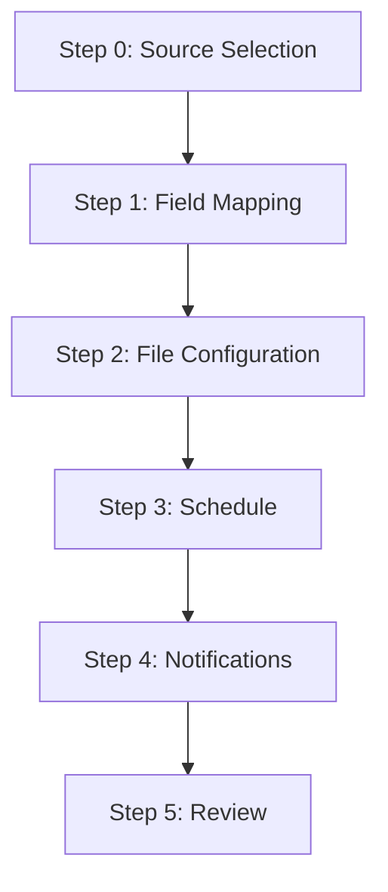
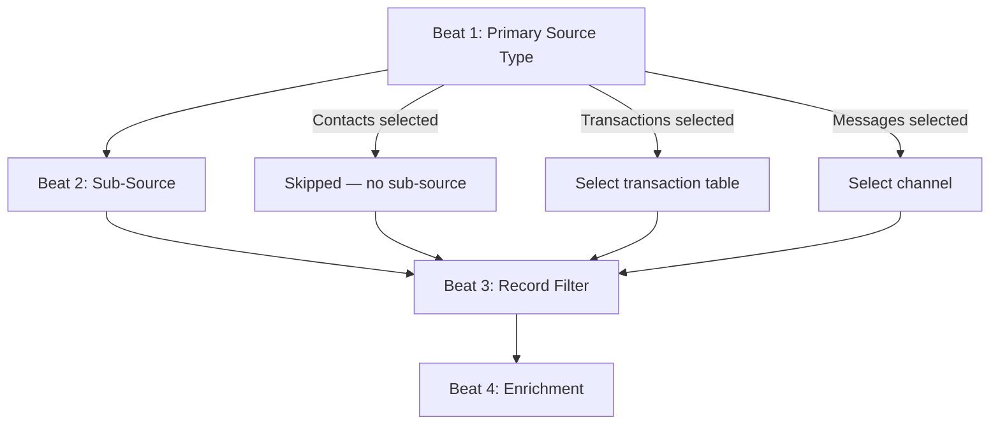

# Design Document: Progressive Data Source Selection

## Overview

This design replaces the exporter wizard's current two-step source selection (TypeSelectionStep → DataSourceStep/EventSourceStep) with a single `SourceSelectionStep` that uses progressive disclosure to guide users through a consistent four-beat rhythm: **type → sub-source → filter → enrichment**.

The three primary source paths — Contacts, Transactions, and Messages — each determine what a row in the export represents. Enrichment layers optionally add columns from related entities without changing row identity. In v1, a maximum of one enrichment layer is supported.

### Key Design Decisions

1. **Single step replaces two** — The TypeSelectionStep and DataSourceStep/EventSourceStep collapse into one SourceSelectionStep. This reduces wizard step count and keeps all source-related decisions co-located.

2. **Progressive disclosure within a single scroll area** — Each "beat" renders as a visually distinct section that appears only after the preceding beat is complete. The user scrolls down as they progress, maintaining spatial context.

3. **Canned filters over free-form filter builder** — Each path offers predefined filter options (e.g., "Created in last N days", "In list/segment") rather than the generic FilterBuilder. This reduces cognitive load for the most common use cases.

4. **Simulated match count for prototype** — Match counts are computed from in-memory seed data with a debounced delay to simulate async behaviour. No real backend query is needed.

5. **Configuration serialisation with round-trip guarantee** — The source selection state serialises to a typed configuration object that can be persisted and restored with deep equality.

6. **Enrichment as inline expansion** — Enrichment configuration renders inline within the same step rather than as a separate wizard step, keeping the four-beat rhythm contained.

## Architecture

### Wizard Flow (Updated)



The SourceSelectionStep replaces both TypeSelectionStep (Step 0) and DataSourceStep/EventSourceStep (Step 1) from the previous design. The wizard now has 6 steps instead of 7.

### Four-Beat Rhythm Within SourceSelectionStep



### Component Tree

```
WizardModal (shared shell — step array updated)
├── SourceSelectionStep (new — replaces TypeSelectionStep + DataSourceStep/EventSourceStep)
│   ├── PrimarySourceSelector (Beat 1)
│   ├── SubSourceSelector (Beat 2 — conditional)
│   │   ├── TransactionTableSelector
│   │   └── ChannelSelector
│   ├── FilterSection (Beat 3)
│   │   ├── ContactsFilterPanel
│   │   ├── TransactionsFilterPanel
│   │   └── MessagesFilterPanel
│   ├── MatchCountIndicator
│   └── EnrichmentSection (Beat 4)
│       ├── EnrichmentPicker
│       └── EnrichmentConfig
│           ├── TransactionEnrichmentConfig
│           ├── MessageEnrichmentConfig
│           └── ContactEnrichmentConfig
├── FieldMappingStep (existing — field list adapts to source + enrichment)
├── OutputConfigStep (existing)
├── ScheduleStep (existing)
├── NotificationsStep (existing)
└── ReviewStep (existing — summary adapts to new config shape)
```

## Components and Interfaces

### New Components

#### `SourceSelectionStep`
- Location: `src/components/wizard/SourceSelectionStep.tsx`
- Orchestrates the four-beat progressive disclosure flow
- Manages internal beat state and delegates to sub-components
- Props: `{ draft: ExporterWizardDraft; onUpdate: (patch: Partial<ExporterWizardDraft>) => void }`

#### `PrimarySourceSelector`
- Location: `src/components/wizard/source-selection/PrimarySourceSelector.tsx`
- Three mutually exclusive radio-style cards: Contacts, Transactions, Messages
- Emits confirmation dialog when changing selection with downstream config present
- Props: `{ selected: PrimarySourceType | null; onChange: (type: PrimarySourceType) => void; hasDownstreamConfig: boolean }`

#### `SubSourceSelector`
- Location: `src/components/wizard/source-selection/SubSourceSelector.tsx`
- Renders conditionally based on primary source type
- For Transactions: dropdown of available transaction tables
- For Messages: channel selector (Email, SMS, Push) with auto-select when only one exists
- Props: `{ primarySource: PrimarySourceType; config: SubSourceConfig; onChange: (config: SubSourceConfig) => void; availableChannels: Channel[] }`

#### `ContactsFilterPanel`
- Location: `src/components/wizard/source-selection/ContactsFilterPanel.tsx`
- Canned filter options: All contacts, Created in last N days, In list/segment, Unsubscribed, Not sent campaign
- Each option may reveal secondary inputs (days input, segment selector, campaign selector)
- Props: `{ config: ContactsFilterConfig; onChange: (config: ContactsFilterConfig) => void }`

#### `TransactionsFilterPanel`
- Location: `src/components/wizard/source-selection/TransactionsFilterPanel.tsx`
- Canned filter options: All records, Created in last N days, Field/operator/value builder (max 10 rows, AND logic)
- Props: `{ config: TransactionsFilterConfig; onChange: (config: TransactionsFilterConfig) => void; tableFields: FieldDefinition[] }`

#### `MessagesFilterPanel`
- Location: `src/components/wizard/source-selection/MessagesFilterPanel.tsx`
- Canned filter options: All sends, By status, For specific campaign, In date range
- Props: `{ config: MessagesFilterConfig; onChange: (config: MessagesFilterConfig) => void; channel: Channel }`

#### `MatchCountIndicator`
- Location: `src/components/wizard/source-selection/MatchCountIndicator.tsx`
- Displays formatted count, loading spinner, error state with retry, or "0 records match"
- Props: `{ count: number | null; loading: boolean; error: boolean; onRetry: () => void; entityLabel: string }`

#### `EnrichmentSection`
- Location: `src/components/wizard/source-selection/EnrichmentSection.tsx`
- Shows available enrichment options (excludes primary source entity)
- Renders inline config for selected enrichment
- Props: `{ primarySource: PrimarySourceType; config: EnrichmentConfig | null; onChange: (config: EnrichmentConfig | null) => void }`

#### `EnrichmentConfig` (sub-components)
- `TransactionEnrichmentConfig` — table selector + join strategy selector
- `MessageEnrichmentConfig` — channel selector + status multi-select
- `ContactEnrichmentConfig` — auto-joined via Contact ID, no additional config needed

### Modified Components

#### `WizardModal` (modified)
- Step array reduced from 7 to 6 steps
- Step 0 becomes SourceSelectionStep (replaces TypeSelectionStep)
- `canProceed` validation for Step 0 checks `isSourceConfigComplete(draft.sourceConfig)`
- Stepper label for Step 0 dynamically shows "{PrimarySourceName} Source" or "Source"
- When primary source or sub-source changes, clears `selectedFields` and `columnRenames`
- When only filter/enrichment changes, preserves valid field selections

#### `FieldMappingStep` (modified)
- Field list derived from `getFieldsForSourceConfig(sourceConfig)` instead of `getFieldsForDataType`
- Includes enrichment entity fields when an enrichment layer is configured
- Enrichment fields are prefixed with entity name (e.g., "Transaction: Treatment Type")

### Hook: `useMatchCount`

```typescript
// src/hooks/useMatchCount.ts
function useMatchCount(sourceConfig: SourceConfig | null): {
  count: number | null;
  loading: boolean;
  error: boolean;
  retry: () => void;
}
```

- Debounces config changes by 500ms before computing
- Simulates async with a 300–800ms random delay
- Computes count from in-memory seed data (contacts, transactions, messages)
- Returns error state if computation exceeds 10s timeout (simulated)

## Data Models

### `PrimarySourceType` (new)

```typescript
export type PrimarySourceType = 'contacts' | 'transactions' | 'messages';
```

### `Channel` (new)

```typescript
export type Channel = 'email' | 'sms' | 'push';
```

### `JoinStrategy` (new)

```typescript
export type JoinStrategy = 'most_recent' | 'all_records';
```

### `MessageStatus` (new)

```typescript
export type MessageStatus = 'delivered' | 'bounced' | 'failed' | 'opened';
```

### Filter Configs (new)

```typescript
// --- Contacts ---
export type ContactsFilterType =
  | 'all'
  | 'created_in_last_n_days'
  | 'in_list_segment'
  | 'unsubscribed'
  | 'not_sent_campaign';

export interface ContactsFilterConfig {
  type: ContactsFilterType;
  days?: number;                    // For 'created_in_last_n_days' (1–365)
  segmentId?: string;               // For 'in_list_segment'
  campaignId?: string;              // For 'not_sent_campaign'
}

// --- Transactions ---
export type TransactionsFilterType =
  | 'all'
  | 'created_in_last_n_days'
  | 'field_filter';

export interface FieldFilterRow {
  field: string;
  operator: string;
  value: string;
}

export interface TransactionsFilterConfig {
  type: TransactionsFilterType;
  days?: number;                    // For 'created_in_last_n_days' (1–365)
  fieldFilters?: FieldFilterRow[];  // For 'field_filter' (max 10 rows, AND logic)
}

// --- Messages ---
export type MessagesFilterType =
  | 'all'
  | 'by_status'
  | 'for_campaign'
  | 'in_date_range';

export interface MessagesFilterConfig {
  type: MessagesFilterType;
  statuses?: MessageStatus[];       // For 'by_status' (at least one required)
  campaignId?: string;              // For 'for_campaign'
  startDate?: string;               // For 'in_date_range' (ISO date)
  endDate?: string;                 // For 'in_date_range' (ISO date)
}
```

### Enrichment Config (new)

```typescript
export type EnrichmentEntity = 'contacts' | 'transactions' | 'messages';

export interface TransactionEnrichmentOptions {
  entity: 'transactions';
  tableId: string;                  // Selected transaction table
  joinStrategy: JoinStrategy;
}

export interface MessageEnrichmentOptions {
  entity: 'messages';
  channel: Channel;
  statuses: MessageStatus[];        // At least one required
}

export interface ContactEnrichmentOptions {
  entity: 'contacts';
  // Auto-joined via Contact ID — no additional config
}

export type EnrichmentConfig =
  | TransactionEnrichmentOptions
  | MessageEnrichmentOptions
  | ContactEnrichmentOptions;
```

### Source Config (new — top-level)

```typescript
export interface ContactsSourceConfig {
  primarySource: 'contacts';
  filter: ContactsFilterConfig;
  enrichment: EnrichmentConfig | null;
}

export interface TransactionsSourceConfig {
  primarySource: 'transactions';
  tableId: string;                  // Selected transaction table
  filter: TransactionsFilterConfig;
  enrichment: EnrichmentConfig | null;
}

export interface MessagesSourceConfig {
  primarySource: 'messages';
  channel: Channel;
  filter: MessagesFilterConfig;
  enrichment: EnrichmentConfig | null;
}

export type SourceConfig =
  | ContactsSourceConfig
  | TransactionsSourceConfig
  | MessagesSourceConfig;
```

### `ExporterWizardDraft` (modified)

```typescript
export interface ExporterWizardDraft {
  // Identity
  connectionId: string | null;
  name: string;

  // Source selection (Step 0 — replaces exporterType + selectedSources + etc.)
  sourceConfig: SourceConfig | null;

  // Field mapping
  selectedFields: SelectedField[];
  columnRenames: ColumnRename[];

  // File configuration
  fileNamingPrefix: string;
  formatOptions: FormatOptions;

  // Schedule
  schedule: ExporterScheduleConfig;

  // Notifications
  notifications: ExporterNotificationConfig;
}
```

The `exporterType`, `selectedSources`, `transactionalSource`, `filters`, and `selectedEventSources` fields are replaced by the single `sourceConfig` discriminated union.

### Validation Functions (new)

```typescript
// Returns true when the source config is complete enough to proceed
export function isSourceConfigComplete(config: SourceConfig | null): boolean;

// Returns true when the filter within a source config is valid
export function isFilterComplete(config: SourceConfig): boolean;

// Returns true when enrichment config (if present) is fully configured
export function isEnrichmentComplete(enrichment: EnrichmentConfig | null): boolean;

// Serialise/deserialise for persistence
export function serialiseSourceConfig(config: SourceConfig): string;
export function deserialiseSourceConfig(json: string): SourceConfig;

// Pretty-print for Review step
export function formatSourceConfigSummary(config: SourceConfig): string;
```

### Field Resolution (modified)

```typescript
// New function replacing getFieldsForDataType for the progressive source selection
export function getFieldsForSourceConfig(config: SourceConfig): FieldDefinition[];
```

This function returns:
- Primary source fields (based on primary source type + sub-source selection)
- Enrichment entity fields (prefixed with entity name) when enrichment is configured

### Available Enrichment Options

| Primary Source | Available Enrichments | Config Required |
|---|---|---|
| Contacts | Transactions | Table + join strategy |
| Contacts | Messages | Channel + status filter |
| Transactions | Contacts | None (auto-join via Contact ID) |
| Transactions | Messages | Channel + status filter |
| Messages | Contacts | None (auto-join via Contact ID) |
| Messages | Transactions | Table (join strategy fixed: most recent) |


## Correctness Properties

*A property is a characteristic or behavior that should hold true across all valid executions of a system — essentially, a formal statement about what the system should do. Properties serve as the bridge between human-readable specifications and machine-verifiable correctness guarantees.*

### Property 1: Primary source change resets downstream state

*For any* valid SourceConfig with a completed filter and/or enrichment, changing the primary source type SHALL produce a new config where the filter is reset to its default state and the enrichment is null — no downstream selections from the previous source type survive.

**Validates: Requirements 1.4**

### Property 2: Days input validation

*For any* numeric value, the days validation function SHALL return valid if and only if the value is an integer in the range 1–365 inclusive. All other values (floats, zero, negatives, values > 365) SHALL be rejected.

**Validates: Requirements 2.2, 2.3, 3.3**

### Property 3: Filter completeness

*For any* filter configuration (ContactsFilterConfig, TransactionsFilterConfig, or MessagesFilterConfig), `isFilterComplete` SHALL return true if and only if: the filter type is selected AND all required secondary inputs for that filter type contain valid values. Specifically: 'all'/'unsubscribed' types require no secondary input; 'created_in_last_n_days' requires a valid days value; 'in_list_segment' requires a non-empty segmentId; 'not_sent_campaign'/'for_campaign' requires a non-empty campaignId; 'by_status' requires at least one status selected; 'in_date_range' requires valid start and end dates with start <= end; 'field_filter' requires all rows to have non-empty field, operator, and value.

**Validates: Requirements 2.6, 2.7, 3.6, 3.7, 4.9**

### Property 4: Transaction field filter AND logic

*For any* set of field filter rows and any record, the combined filter SHALL match the record if and only if the record satisfies every individual filter row. A record that fails any single row SHALL not match the combined filter.

**Validates: Requirements 3.5**

### Property 5: Date range validation

*For any* pair of date strings, the date range validation SHALL return valid if and only if the start date is on or before the end date (chronological comparison). Pairs where start > end SHALL be rejected.

**Validates: Requirements 4.8**

### Property 6: Enrichment options exclude primary source

*For any* PrimarySourceType, the list of available enrichment entities SHALL never include the primary source entity itself. The available enrichments SHALL always be exactly the two entities that are NOT the primary source.

**Validates: Requirements 5.2**

### Property 7: Enrichment completeness

*For any* EnrichmentConfig object, `isEnrichmentComplete` SHALL return true if and only if all required fields for that enrichment type are populated: TransactionEnrichmentOptions requires a non-empty tableId; MessageEnrichmentOptions requires a non-empty channel and at least one status; ContactEnrichmentOptions is always complete (no required fields).

**Validates: Requirements 5.9**

### Property 8: Most recent record join resolution

*For any* non-empty set of related records with distinct created-date values, the "most recent record" join resolution SHALL select exactly the record with the latest created-date. For a set of size N, exactly one record SHALL be selected.

**Validates: Requirements 6.2**

### Property 9: Match count locale formatting

*For any* non-negative integer, `formatMatchCount` SHALL produce a string with locale-appropriate thousand separators (e.g., 1000 → "1,000", 4231 → "4,231", 0 → "0") and the result SHALL parse back to the original integer when separators are removed.

**Validates: Requirements 7.1**

### Property 10: Progressive disclosure visibility

*For any* SourceConfig in a partial state of completion, beat N+1 SHALL only be visible (rendered) when beat N is complete. Specifically: Beat 2 requires Beat 1 complete (primary source selected); Beat 3 requires Beat 2 complete (sub-source selected, or skipped for Contacts); Beat 4 requires Beat 3 complete (filter is valid per `isFilterComplete`).

**Validates: Requirements 8.3**

### Property 11: Field resolution from source config

*For any* valid and complete SourceConfig, `getFieldsForSourceConfig` SHALL return the union of: (a) fields for the primary source and sub-source, and (b) fields for the enrichment entity (prefixed with entity name) if enrichment is configured. The result SHALL contain no duplicate field keys within the same source prefix.

**Validates: Requirements 9.2**

### Property 12: Field preservation on filter/enrichment-only changes

*For any* set of selected fields and a source config change that modifies only the filter or enrichment (primary source and sub-source unchanged), all selected fields that belong to the primary source SHALL be preserved. Only fields belonging to a removed enrichment entity SHALL be cleared.

**Validates: Requirements 9.6**

### Property 13: Serialisation guard

*For any* SourceConfig where `isSourceConfigComplete` returns false, the serialisation function SHALL refuse to produce output (returns null or throws). Only complete, valid configurations SHALL be serialisable.

**Validates: Requirements 10.4**

### Property 14: Serialisation round-trip

*For any* valid and complete SourceConfig, `deserialiseSourceConfig(serialiseSourceConfig(config))` SHALL produce a result that is deeply equal to the original config — identical primary source type, sub-source, filter type, filter parameters, and enrichment layer settings.

**Validates: Requirements 10.5**

### Property 15: Pretty printer accepts any valid config

*For any* valid and complete SourceConfig, `formatSourceConfigSummary(config)` SHALL return a non-empty string. The function SHALL not throw for any valid input.

**Validates: Requirements 10.6**

## Error Handling

### Validation Errors (SourceSelectionStep)

| Condition | Behaviour |
|-----------|-----------|
| No primary source selected | Next button disabled, stepper shows "Source" |
| Transactions selected but no table chosen | Next button disabled, validation message on table selector |
| Messages selected but no channel available | Informational message, Next disabled |
| Messages selected but no channel chosen | Next button disabled |
| Filter type selected but secondary input incomplete | Next button disabled, inline validation on incomplete field |
| Days input outside 1–365 or non-integer | Inline error on days input |
| Date range with start > end | Inline error on date inputs |
| "By status" with no statuses selected | Inline error on status multi-select |
| Field filter row with empty field/operator/value | Inline error on incomplete row |
| Enrichment selected but config incomplete | Next button disabled, inline validation on enrichment section |
| Match count query timeout (>10s) | Error state with "Retry" button, does NOT block navigation |
| Match count returns 0 | Shows "0 records match", does NOT block navigation |

### State Recovery

- **Primary source change**: Confirmation dialog warns about downstream loss. On confirm, resets filter + enrichment + sub-source. On cancel, reverts primary source selection.
- **Sub-source change** (e.g., different transaction table): Clears filter config and field mapping selections (available fields change).
- **Filter-only change**: Preserves field mapping selections. Recalculates match count.
- **Enrichment change**: Preserves primary source field selections. Clears enrichment-specific field selections from field mapping.
- **Stale references**: When deserialising a config that references a deleted segment/campaign/table, hydrates all valid fields and marks the invalid reference with a validation indicator.

### Edge Cases

- **Single channel account**: Messages path auto-selects the only channel, skipping channel selection beat.
- **No channels configured**: Messages path shows informational message, prevents proceeding.
- **No campaigns for channel**: "For specific campaign" filter shows informational message.
- **Empty transaction tables**: Transactions path shows empty state if no tables exist.
- **Fan-out warning**: "All records" join strategy shows a non-blocking informational message about multiple output rows per primary record.
- **Match count during rapid changes**: Debounce (500ms) ensures only the final config triggers a count calculation.

## Testing Strategy

### Unit Tests (Example-based)

Focus on specific scenarios and edge cases:

- SourceSelectionStep renders three primary source options, none pre-selected
- Selecting Contacts reveals filter panel directly (no sub-source beat)
- Selecting Transactions reveals table selector, then filter panel after table chosen
- Selecting Messages reveals channel selector, then filter panel after channel chosen
- Confirmation dialog appears when changing primary source with downstream config
- "All contacts" and "Unsubscribed" filters are immediately valid (no secondary input)
- "In list/segment" shows searchable selector with available segments
- "Not sent campaign" shows campaign selector with cross-entity label
- Transaction field filter builder allows max 10 rows
- "By status" requires at least one status selected
- "In date range" shows start/end date inputs
- Auto-select channel when only one exists
- Informational message when no channels configured
- Match count shows loading state during calculation
- Match count shows error state with retry on timeout
- "0 records match" does not block navigation
- Enrichment section appears only after filter is complete
- Enrichment options exclude primary source entity
- Contact enrichment has no join strategy selector (auto-join)
- Messages→Transactions enrichment has fixed "most recent" strategy
- Remove enrichment action clears enrichment config
- Stepper label updates to "{PrimarySourceName} Source"
- Field mapping clears when primary source or sub-source changes
- Field mapping preserves when only filter/enrichment changes
- Stale reference shows validation indicator on hydration

### Property-Based Tests

Library: **fast-check** (TypeScript property-based testing library)

Each property test runs a minimum of **100 iterations** with randomly generated inputs.

| Property | Test Target | Generator Strategy |
|----------|-------------|-------------------|
| 1: Source change resets downstream | `resetDownstreamOnSourceChange(config, newSource)` | Random valid SourceConfig × random different PrimarySourceType |
| 2: Days validation | `validateDays(value)` | Arbitrary numbers (integers, floats, negatives, zero, large values) |
| 3: Filter completeness | `isFilterComplete(filterConfig)` | Random filter configs with varying completeness |
| 4: AND logic | `evaluateFieldFilters(rows, record)` | Random filter row sets × random record objects |
| 5: Date range validation | `validateDateRange(start, end)` | Random ISO date string pairs |
| 6: Enrichment exclusion | `getAvailableEnrichments(primarySource)` | All three PrimarySourceType values |
| 7: Enrichment completeness | `isEnrichmentComplete(enrichment)` | Random EnrichmentConfig objects with varying completeness |
| 8: Most recent join | `resolveMostRecent(records)` | Random arrays of records with distinct dates |
| 9: Locale formatting | `formatMatchCount(count)` | Random non-negative integers |
| 10: Progressive disclosure | `getVisibleBeats(partialConfig)` | Random partial SourceConfig states |
| 11: Field resolution | `getFieldsForSourceConfig(config)` | Random valid SourceConfig objects |
| 12: Field preservation | `preserveFields(fields, oldConfig, newConfig)` | Random field sets × config pairs differing only in filter/enrichment |
| 13: Serialisation guard | `serialiseSourceConfig(config)` | Random incomplete SourceConfig objects |
| 14: Round-trip | `deserialise(serialise(config))` | Random valid complete SourceConfig objects |
| 15: Pretty printer | `formatSourceConfigSummary(config)` | Random valid complete SourceConfig objects |

### Integration Tests

- Full wizard flow: source selection → field mapping → file config → schedule → notifications → review → save
- Edit mode hydrates sourceConfig from persisted automation
- Primary source change clears field mapping and resets completed steps
- Back navigation preserves source selection state
- Match count debounce fires only once after rapid filter changes

### Tag Format

Each property test is tagged with:
```
Feature: progressive-data-source-selection, Property {N}: {property_text}
```
