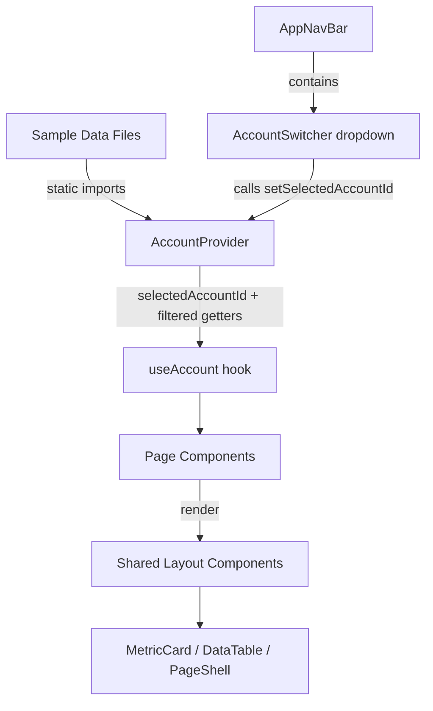

# Design Document: Prototype Scaffold

## Overview

This design covers the Phase 1 skeleton scaffold for the UbiQuity 2.0 prototype. It establishes shared TypeScript data models, realistic NZ spa chain sample data, an account context/switcher, and 16 placeholder pages — giving every future feature spec a consistent foundation to build on.

The existing Integrations section (`/` route with `DashboardPage` and `/connector/:id` with `ConnectorDetailPage`) remains completely untouched. All new work layers alongside it.

### Key Design Decisions

1. **Extend, don't replace** — The existing `ContactRecord` stays as-is. A new `Contact` interface extends it with `accountId`, `segmentIds`, `journeyIds`, and `activityTimeline`. Existing data files and contexts remain untouched.
2. **Single barrel file** — All new model interfaces export from `src/models/index.ts` alongside re-exports of existing models.
3. **AccountContext as a filter layer** — Rather than duplicating data, `AccountContext` provides a `selectedAccountId` and helper hooks that filter the shared sample data arrays by `accountId`. The master account shows all data.
4. **Shared page layout components** — Three reusable layout patterns (`MetricCard`, `DataTable`, `PageShell`) keep all 16 pages visually consistent without duplicating CSS.
5. **Explicit routes, no wildcards** — Every page gets its own `<Route>` entry. The existing wildcard routes (`/audiences/*`, etc.) are replaced with explicit paths.

## Architecture

### Component Tree

```
<BrowserRouter>
  <AppProvider>                          ← existing (unchanged)
    <AccountProvider>                    ← NEW: wraps everything
      <AppNavBar />                      ← existing (modified: add AccountSwitcher)
      <Routes>
        <Route path="/" element={<IntegrationsDashboardPage />} />     ← existing DashboardPage renamed
        <Route path="/connector/:id" element={<ConnectorDetailPage />} /> ← existing
        <Route path="/dashboard" element={<OverviewDashboardPage />} />
        <Route path="/audiences/segments" element={<SegmentsPage />} />
        <Route path="/audiences/databases" element={<DatabasesPage />} />
        <Route path="/audiences/attributes" element={<AttributesPage />} />
        <Route path="/automations/campaigns" element={<CampaignsPage />} />
        <Route path="/automations/journeys" element={<JourneysPage />} />
        <Route path="/content/templates" element={<TemplatesPage />} />
        <Route path="/content/emails" element={<EmailsPage />} />
        <Route path="/content/forms" element={<FormsPage />} />
        <Route path="/content/sms" element={<SmsPage />} />
        <Route path="/analytics/dashboards" element={<AnalyticsDashboardsPage />} />
        <Route path="/analytics/reports" element={<ReportsPage />} />
        <Route path="/analytics/activity" element={<ActivityPage />} />
        <Route path="/analytics/billing" element={<BillingPage />} />
        <Route path="/settings" element={<SettingsPage />} />
      </Routes>
    </AccountProvider>
  </AppProvider>
</BrowserRouter>
```

### Data Flow



When the master account is selected (`selectedAccountId === 'acc-master'`), all data is returned unfiltered. When a child account is selected, data arrays are filtered to `item.accountId === selectedAccountId`.

### File Structure

```
src/
├── models/
│   ├── index.ts              ← NEW barrel file (re-exports existing + new)
│   ├── account.ts            ← NEW: Account interface
│   ├── contact.ts            ← NEW: Contact interface (extends ContactRecord)
│   ├── segment.ts            ← NEW: Segment interface
│   ├── campaign.ts           ← NEW: Campaign, Journey interfaces
│   ├── asset.ts              ← NEW: Asset interface
│   ├── notification.ts       ← NEW: Notification interface
│   ├── connection.ts         ← existing (unchanged)
│   ├── connector.ts          ← existing (unchanged)
│   ├── data.ts               ← existing (unchanged)
│   ├── importer.ts           ← existing (unchanged)
│   └── wizard.ts             ← existing (unchanged)
├── data/
│   ├── accounts.ts           ← NEW: 1 master + 4 child accounts
│   ├── spaContacts.ts        ← NEW: ~50 NZ contacts with accountIds
│   ├── segments.ts           ← NEW: 4+ segment records
│   ├── campaigns.ts          ← NEW: 3-4 campaigns + 8-10 journeys
│   ├── assets.ts             ← NEW: 8+ asset records
│   ├── notifications.ts      ← NEW: 6+ notification records
│   ├── contacts.ts           ← existing (unchanged)
│   ├── connections.ts        ← existing (unchanged)
│   ├── fieldRegistry.ts      ← existing (unchanged)
│   ├── products.ts           ← existing (unchanged)
│   └── treatments.ts         ← existing (unchanged)
├── contexts/
│   ├── AccountContext.tsx     ← NEW: AccountProvider + useAccount
│   ├── ConnectionsContext.tsx ← existing (unchanged)
│   ├── ConnectorsContext.tsx  ← existing (unchanged)
│   └── DataContext.tsx        ← existing (unchanged)
├── components/
│   ├── layout/
│   │   ├── AppNavBar.tsx      ← existing (modified: add AccountSwitcher)
│   │   ├── AppNavBar.module.css ← existing (modified: add switcher styles)
│   │   ├── AccountSwitcher.tsx  ← NEW
│   │   ├── AccountSwitcher.module.css ← NEW
│   │   ├── PageShell.tsx      ← NEW: shared page wrapper
│   │   └── PageShell.module.css ← NEW
│   ├── shared/
│   │   ├── MetricCard.tsx     ← NEW: reusable metric card
│   │   ├── MetricCard.module.css ← NEW
│   │   ├── DataTable.tsx      ← NEW: reusable data table
│   │   ├── DataTable.module.css ← NEW
│   │   └── ... existing shared components (unchanged)
│   └── dashboard/             ← existing (unchanged)
├── pages/
│   ├── DashboardPage.tsx      ← existing (unchanged — Integrations page)
│   ├── DashboardPage.module.css ← existing (unchanged)
│   ├── ConnectorDetailPage.tsx ← existing (unchanged)
│   ├── ConnectorDetailPage.module.css ← existing (unchanged)
│   ├── OverviewDashboardPage.tsx ← NEW
│   ├── SegmentsPage.tsx       ← NEW
│   ├── DatabasesPage.tsx      ← NEW
│   ├── AttributesPage.tsx     ← NEW
│   ├── CampaignsPage.tsx      ← NEW
│   ├── JourneysPage.tsx       ← NEW
│   ├── TemplatesPage.tsx      ← NEW
│   ├── EmailsPage.tsx         ← NEW
│   ├── FormsPage.tsx          ← NEW
│   ├── SmsPage.tsx            ← NEW
│   ├── AnalyticsDashboardsPage.tsx ← NEW
│   ├── ReportsPage.tsx        ← NEW
│   ├── ActivityPage.tsx       ← NEW
│   ├── BillingPage.tsx        ← NEW
│   ├── SettingsPage.tsx       ← NEW
│   └── pages.module.css       ← NEW: shared page-level styles
└── App.tsx                    ← modified: explicit routes, AccountProvider
```

## Components and Interfaces

### AccountSwitcher Component

Renders as a dropdown in the `AppNavBar`, positioned between the logo and primary nav items.

```typescript
// Props: none (reads from AccountContext)
// Renders: button showing current account name → dropdown list of all accounts
// Master account shown with "(All Locations)" suffix
// Child accounts indented with region label
// Clicking an account calls setSelectedAccountId()
```

Placement in `AppNavBar`:
```tsx
<div className={styles.primaryBar}>
  <div className={styles.logo}>...</div>
  <AccountSwitcher />           {/* NEW — between logo and nav items */}
  <div className={styles.primaryItems}>...</div>
</div>
```

### PageShell Component

Wraps every new page with consistent padding, max-width, and header layout.

```typescript
interface PageShellProps {
  title: string;
  subtitle?: string;
  action?: ReactNode;       // optional top-right button
  children: ReactNode;
}
```

Renders the same layout as the existing `DashboardPage`: `max-width: 1440px`, `padding: var(--space-7) var(--space-6)`, `background: var(--color-zinc-50)`.

### MetricCard Component

Reusable card for dashboard-style KPIs.

```typescript
interface MetricCardProps {
  label: string;
  value: string | number;
  subtitle?: string;
}
```

Styled with `var(--shadow-sm)`, `border: 1px solid var(--color-border)`, `border-radius: var(--radius-md)`, white background.

### DataTable Component

Reusable table for list views (segments, contacts, journeys, etc.).

```typescript
interface Column<T> {
  key: string;
  header: string;
  render: (item: T) => ReactNode;
  width?: string;
}

interface DataTableProps<T> {
  columns: Column<T>[];
  data: T[];
  emptyMessage?: string;
}
```

Renders a `<table>` with sticky header row, zebra striping using `var(--color-zinc-50)`, and the established border/shadow tokens.

### AccountContext

```typescript
interface AccountContextValue {
  accounts: Account[];
  selectedAccountId: string;
  selectedAccount: Account;
  setSelectedAccountId: (id: string) => void;
  filterByAccount: <T extends { accountId: string }>(items: T[]) => T[];
}
```

`filterByAccount` returns all items when master account is selected, or filters to `item.accountId === selectedAccountId` for child accounts.

### Page Components

Each page follows the same pattern:

```tsx
export default function SegmentsPage() {
  const { filterByAccount } = useAccount();
  const segments = filterByAccount(allSegments);

  return (
    <PageShell title="Segments" subtitle="Smart and manual audience segments">
      <DataTable columns={segmentColumns} data={segments} />
    </PageShell>
  );
}
```

Page layout patterns by type:

| Page | Layout Pattern | Key Data |
|------|---------------|----------|
| OverviewDashboard | 4× MetricCard grid + recent activity list | contacts count, campaigns count, journeys count, segments count |
| Segments | DataTable | name, type badge, memberCount |
| Databases | DataTable with search | name, email, tier badge, account |
| Attributes | DataTable | field name, data type, source |
| Campaigns | DataTable grouped by status | name, date range, journey count, status badge |
| Journeys | DataTable | name, campaign, status badge, type, entry count |
| Templates | CSS Grid of cards | name, tags, usage count |
| Emails | DataTable | name, status badge, last modified |
| Forms | DataTable | name, status badge, response count |
| SMS | DataTable | name, status badge, send count |
| Analytics Dashboards | 4× MetricCard grid | KPI summaries |
| Reports | DataTable | name, type, date range |
| Activity | Chronological feed list | event description, timestamp, actor |
| Billing | MetricCards + summary table | plan info, usage metrics |
| Settings | Sections with config fields + users list | workspace name, timezone, user list |

## Data Models

### Account

```typescript
// src/models/account.ts
export interface Account {
  id: string;
  name: string;
  parentId: string | null;     // null for master account
  childIds: string[];           // empty for leaf accounts
  region: string;               // "National", "Auckland", "Wellington", etc.
  status: 'active' | 'inactive';
}
```

### Contact (extends ContactRecord)

```typescript
// src/models/contact.ts
import type { ContactRecord } from './data';

export interface ActivityEvent {
  id: string;
  type: 'purchase' | 'visit' | 'email_open' | 'form_submit' | 'journey_enter';
  description: string;
  timestamp: string;            // ISO datetime
}

export interface Contact extends ContactRecord {
  accountId: string;
  segmentIds: string[];
  journeyIds: string[];
  activityTimeline: ActivityEvent[];
}
```

### Segment

```typescript
// src/models/segment.ts
export interface FilterRule {
  field: string;                // e.g. "membershipTier", "joinDate"
  operator: 'equals' | 'not_equals' | 'greater_than' | 'less_than' | 'contains' | 'in';
  value: string | string[];
}

export interface Segment {
  id: string;
  name: string;
  accountId: string;
  type: 'smart' | 'manual';
  rules: FilterRule[];
  memberCount: number;
}
```

### Campaign & Journey

```typescript
// src/models/campaign.ts
export type CampaignStatus = 'draft' | 'active' | 'paused' | 'completed';
export type JourneyType = 'welcome' | 're-engagement' | 'transactional' | 'promotional';

export interface Campaign {
  id: string;
  name: string;
  accountId: string;
  goal: string;
  dateRange: { start: string; end: string };  // ISO dates
  status: CampaignStatus;
  journeyIds: string[];
  tags: string[];
}

export interface Journey {
  id: string;
  name: string;
  campaignId: string;
  accountId: string;
  status: CampaignStatus;
  nodeCount: number;
  entryCount: number;
  type: JourneyType;
}
```

### Asset

```typescript
// src/models/asset.ts
export interface Asset {
  id: string;
  name: string;
  accountId: string;
  type: 'image' | 'template' | 'snippet';
  tags: string[];
  createdAt: string;            // ISO datetime
  usageCount: number;
}
```

### Notification

```typescript
// src/models/notification.ts
export interface Notification {
  id: string;
  type: 'info' | 'warning' | 'success' | 'error';
  message: string;
  timestamp: string;            // ISO datetime
  read: boolean;
  linkTo?: string;              // optional route path
}
```

### Barrel File

```typescript
// src/models/index.ts
export type { Connection, S3Config, SFTPConfig, AzureBlobConfig } from './connection';
export type { Connector, SelectedField, FilterConfig, FormatOptions, ConnectorStatus, ExportDataType, TransactionalSource, ScheduleFrequency, FileType } from './connector';
export type { ContactRecord, TreatmentRecord, ProductRecord } from './data';
export type { Account } from './account';
export type { Contact, ActivityEvent } from './contact';
export type { Segment, FilterRule } from './segment';
export type { Campaign, Journey, CampaignStatus, JourneyType } from './campaign';
export type { Asset } from './asset';
export type { Notification } from './notification';
```

### Sample Data Structure

The NZ spa chain data follows this hierarchy:

```
Serenity Spa Group (master, National)
├── Serenity Spa Auckland (child, Auckland)
├── Serenity Spa Wellington (child, Wellington)
├── Serenity Spa Christchurch (child, Christchurch)
└── Serenity Spa Queenstown (child, Queenstown)
```

~50 contacts use NZ-appropriate names (e.g., Aroha Tūhoe, Nikau Patel, Tāne Williams, Maia Chen) distributed roughly evenly across the four child accounts with varied membership tiers.

Campaigns, journeys, segments, and assets all carry `accountId` references. Some are shared at the master level (e.g., "Gold Members" segment spans all locations), while others are regional (e.g., "Auckland Region" segment).


## Correctness Properties

*A property is a characteristic or behavior that should hold true across all valid executions of a system — essentially, a formal statement about what the system should do. Properties serve as the bridge between human-readable specifications and machine-verifiable correctness guarantees.*

### Property 1: Account filtering returns correct subset

*For any* array of entities with an `accountId` field and *for any* selected account, `filterByAccount` SHALL return only items where `accountId` matches the selected child account ID. When the master account is selected, `filterByAccount` SHALL return all items regardless of `accountId`.

**Validates: Requirements 2.8, 3.3, 3.4**

### Property 2: Navigation item click routes to correct path

*For any* navigation item defined in the `NAV_ITEMS` configuration, clicking that item SHALL result in the router location matching the expected path for that item (the item's own path for items without sub-items, or the first sub-item's path for items with sub-items).

**Validates: Requirements 5.1, 5.2**

### Property 3: Active navigation highlighting matches current route

*For any* valid route path in the application, the navigation bar SHALL apply the active CSS class to exactly one primary nav item and (if applicable) exactly one sub-item, and those active items SHALL correspond to the route's section and sub-section.

**Validates: Requirements 5.3, 5.5**

### Property 4: Status badge colour mapping

*For any* valid status value (`active`, `paused`, `draft`, `completed`), the status badge component SHALL render with the CSS class corresponding to the correct colour: teal for active, amber for paused, zinc for draft, and green for completed.

**Validates: Requirements 6.6**

## Error Handling

This is a prototype with local-only state, so error handling is minimal and focused on developer experience:

1. **Missing context** — `useAccount()` throws a descriptive error if called outside `AccountProvider`, following the same pattern as the existing `useConnections()` and `useData()` hooks.
2. **Invalid account selection** — If `setSelectedAccountId` is called with an ID not in the accounts array, the selection falls back to the master account.
3. **Empty data states** — Each page handles the case where `filterByAccount` returns an empty array by rendering an empty state message within the `DataTable` component (via the `emptyMessage` prop).
4. **Route not found** — No catch-all 404 route is added in this phase. Unknown routes simply render nothing (React Router default). A 404 page can be added in a later spec.

## Testing Strategy

### Unit Tests (Example-Based)

Unit tests cover specific rendering and data requirements:

- **Sample data shape tests** — Verify account hierarchy (1 master + 4 children), contact count (~50), segment count (≥4), campaign count (3-4), journey-per-campaign ratio (2-3), asset count (≥8), notification count (≥6)
- **AccountContext default state** — Verify initial selection is the master account
- **Page rendering tests** — For each of the 16 pages, verify it renders at the correct route with expected content (title, data table or metric cards)
- **Route preservation** — Verify `/` still renders the Integrations DashboardPage and `/connector/:id` still renders ConnectorDetailPage
- **No wildcard routes** — Verify the route configuration uses explicit paths only

### Property-Based Tests

Property-based tests use `fast-check` (already available in the Vitest ecosystem) with a minimum of 100 iterations per property:

- **Property 1: Account filtering** — Generate random arrays of objects with `accountId` fields and random account selections. Verify `filterByAccount` returns the correct subset.
  - Tag: `Feature: prototype-scaffold, Property 1: Account filtering returns correct subset`
- **Property 2: Navigation routing** — For any nav item from the config, simulate a click and verify the resulting route.
  - Tag: `Feature: prototype-scaffold, Property 2: Navigation item click routes to correct path`
- **Property 3: Active nav highlighting** — For any valid route, verify exactly one primary and one sub-item are marked active, and they match the route.
  - Tag: `Feature: prototype-scaffold, Property 3: Active navigation highlighting matches current route`
- **Property 4: Status badge mapping** — For any status value, verify the correct CSS class is applied.
  - Tag: `Feature: prototype-scaffold, Property 4: Status badge colour mapping`

### What's Not Tested

- Visual consistency (CSS custom properties, spacing, typography) — verified by visual review, not automated tests
- CSS Module naming conventions — verified by code review
- Exact pixel-level layout — this is a prototype, not production
