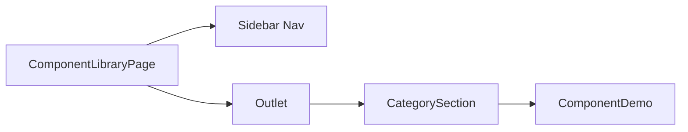

# Design Document: shadcn + Tailwind Integration

## Overview

This design integrates Tailwind CSS v4 and shadcn/ui into the existing UbiQuity prototype alongside the current CSS Modules styling system. The integration is additive — all existing components remain untouched while a new `src/components/ui/` directory provides accessible Radix-based primitives styled with Tailwind utilities mapped to the project's existing design tokens.

The key architectural decision is **coexistence, not migration**: CSS Modules remain the default for custom components, Tailwind is used exclusively within the shadcn registry. Both systems share the same design tokens from `src/styles/tokens.css`.

## Architecture

### Tailwind v4 (not v3)

**Decision:** Use Tailwind CSS v4.

**Rationale:**
- shadcn/ui has full Tailwind v4 + React 19 support since February 2025
- Tailwind v4 is CSS-first — no `tailwind.config.js` needed for most configuration
- Theme values are defined via `@theme` directives in CSS, which maps naturally to the existing `tokens.css` custom properties
- The `@custom-variant` directive allows mapping `dark:` to `[data-theme="dark"]` without a JS config file
- Smaller runtime, faster builds, and better Vite integration via the `@tailwindcss/vite` plugin (no PostCSS config needed)

### High-Level Integration Architecture

```mermaid
graph TD
    A[src/styles/tokens.css] -->|CSS custom properties| B[Tailwind @theme]
    A -->|CSS custom properties| C[CSS Modules]
    B --> D[src/components/ui/ — shadcn]
    C --> E[src/components/{feature}/ — existing]
    D --> F[Vite Build]
    E --> F
    F --> G[Single CSS bundle]
```

### Build Pipeline

Tailwind v4 integrates with Vite via `@tailwindcss/vite` as a Vite plugin — no PostCSS configuration is required. This is cleaner than the v3 approach and avoids any PostCSS conflicts with CSS Modules processing.

```
vite.config.ts
├── @vitejs/plugin-react
└── @tailwindcss/vite        ← NEW: processes Tailwind directives
```

CSS Modules continue to work via Vite's built-in CSS Modules support (unchanged). The two systems operate on different files and don't interfere.

## Components and Interfaces

### File Structure

```
src/
├── styles/
│   ├── tokens.css              # Existing — source of truth for design tokens
│   └── globals.css             # NEW — Tailwind directives + @theme mapping
├── components/
│   ├── ui/                     # NEW — shadcn registry (Tailwind-styled)
│   │   ├── button.tsx          # shadcn Button (separate from existing CSS Modules Button)
│   │   ├── dialog.tsx
│   │   ├── tabs.tsx
│   │   ├── tooltip.tsx
│   │   ├── popover.tsx
│   │   ├── select.tsx
│   │   ├── sheet.tsx
│   │   ├── accordion.tsx
│   │   ├── dropdown-menu.tsx
│   │   ├── command.tsx
│   │   └── separator.tsx
│   ├── shared/                 # Existing CSS Modules components (unchanged)
│   └── {feature}/             # Existing feature components (unchanged)
├── lib/
│   └── utils.ts               # NEW — cn() utility function
└── pages/
    └── ComponentLibraryPage.tsx  # UPDATED — tabbed navigation
```

### The `cn()` Utility

Located at `src/lib/utils.ts`:

```typescript
import { clsx, type ClassValue } from 'clsx'
import { twMerge } from 'tailwind-merge'

export function cn(...inputs: ClassValue[]) {
  return twMerge(clsx(inputs))
}
```

This is the standard shadcn utility for conditional class merging. It lives in `src/lib/` alongside the existing `supabase.ts`.

### Tailwind CSS Entry Point (`src/styles/globals.css`)

```css
@import "tailwindcss";

/* Map dark: variant to the project's data-theme attribute */
@custom-variant dark (&:where([data-theme="dark"]));

/* Disable preflight to avoid resetting existing CSS Modules components */
@layer base {
  /* Intentionally empty — preflight disabled via @import config */
}

/* Map design tokens to Tailwind theme */
@theme {
  /* Spacing */
  --spacing-xxs: 2px;
  --spacing-xs: 4px;
  --spacing-sm: 8px;
  --spacing-ms: 12px;
  --spacing-md: 16px;
  --spacing-lg: 24px;
  --spacing-xl: 32px;
  --spacing-xxl: 40px;

  /* Border Radius */
  --radius-none: 0px;
  --radius-sm: 4px;
  --radius-md: 6px;
  --radius-lg: 8px;
  --radius-xl: 12px;
  --radius-full: 9999px;

  /* Font Family */
  --font-sans: 'Inter', sans-serif;
  --font-mono: 'JetBrains Mono', monospace;

  /* Font Size */
  --text-xxs: 8px;
  --text-xs: 10px;
  --text-sm: 12px;
  --text-base: 14px;
  --text-lg: 16px;
  --text-xl: 18px;
  --text-2xl: 24px;
  --text-3xl: 30px;
  --text-4xl: 36px;
  --text-5xl: 48px;

  /* Colours — reference CSS custom properties from tokens.css */
  --color-accent-default: var(--color-accent-default);
  --color-accent-hover: var(--color-accent-hover);
  --color-accent-subtle: var(--color-accent-subtle);
  --color-accent-text: var(--color-accent-text);
  --color-accent-border: var(--color-accent-border);

  --color-text-primary: var(--color-text-primary);
  --color-text-secondary: var(--color-text-secondary);
  --color-text-tertiary: var(--color-text-tertiary);
  --color-text-disabled: var(--color-text-disabled);
  --color-text-inverse: var(--color-text-inverse);
  --color-text-on-accent: var(--color-text-on-accent);

  --color-background-default: var(--color-background-default);
  --color-background-subtle: var(--color-background-subtle);
  --color-background-elevated: var(--color-background-elevated);
  --color-background-sunken: var(--color-background-sunken);
  --color-background-overlay: var(--color-background-overlay);

  --color-border-default: var(--color-border-default);
  --color-border-strong: var(--color-border-strong);
  --color-border-focus: var(--color-border-focus);

  --color-danger-default: var(--color-danger-default);
  --color-danger-hover: var(--color-danger-hover);
  --color-danger-subtle: var(--color-danger-subtle);
  --color-danger-text: var(--color-danger-text);

  --color-warning-default: var(--color-warning-default);
  --color-warning-subtle: var(--color-warning-subtle);
  --color-warning-text: var(--color-warning-text);

  --color-success-default: var(--color-success-default);
  --color-success-subtle: var(--color-success-subtle);

  --color-info-default: var(--color-info-default);
  --color-info-subtle: var(--color-info-subtle);

  /* Shadows */
  --shadow-s: 0px 2px 3px rgba(0, 0, 0, 0.05), 0 0 0 1px var(--color-border-default);
  --shadow-m: 0px 3px 4px -1px rgba(0, 0, 0, 0.08), 0 0 0 1px var(--color-border-default);
  --shadow-l: 0px 7px 10px -3px rgba(0, 0, 0, 0.08), 0 0 0 1px var(--color-border-default);
  --shadow-xl: 0px 15px 20px -5px rgba(0, 0, 0, 0.08), 0 0 0 1px var(--color-border-default);
}
```

**Preflight disabled:** Tailwind v4 allows disabling preflight via `@import "tailwindcss" layer(utilities)` or by importing only the utilities layer. The exact mechanism is `@import "tailwindcss" prefix(tw-)` or simply not importing the base layer. For this project, we use:

```css
@import "tailwindcss/utilities";
@import "tailwindcss/theme";
```

This imports only utilities and theme without the base/preflight layer, ensuring existing CSS Modules components are unaffected.

### Vite Configuration Changes

```typescript
import { defineConfig } from 'vite'
import react from '@vitejs/plugin-react'
import tailwindcss from '@tailwindcss/vite'
import path from 'path'

export default defineConfig({
  plugins: [react(), tailwindcss()],
  resolve: {
    alias: {
      '@': path.resolve(__dirname, './src'),
    },
  },
})
```

### TypeScript Path Alias

`tsconfig.app.json` additions:

```jsonc
{
  "compilerOptions": {
    // ... existing options
    "baseUrl": ".",
    "paths": {
      "@/*": ["./src/*"]
    }
  }
}
```

### shadcn `components.json`

```json
{
  "$schema": "https://ui.shadcn.com/schema.json",
  "style": "default",
  "rsc": false,
  "tsx": true,
  "tailwind": {
    "config": "",
    "css": "src/styles/globals.css",
    "baseColor": "zinc",
    "cssVariables": true,
    "prefix": ""
  },
  "aliases": {
    "components": "@/components",
    "utils": "@/lib/utils",
    "ui": "@/components/ui",
    "lib": "@/lib",
    "hooks": "@/hooks"
  },
  "iconLibrary": "lucide"
}
```

**Design decisions:**
- `style: "default"` — the standard shadcn style (not "new-york")
- `rsc: false` — this is a Vite SPA, not a server components project
- `baseColor: "zinc"` — matches the project's existing zinc palette from Figma tokens
- `cssVariables: true` — components reference CSS variables, enabling dark mode via token overrides
- No Tailwind config path — Tailwind v4 is CSS-first, no JS config file

### Dark Mode Strategy

The project uses `[data-theme="dark"]` on the document root. In Tailwind v4, this is handled by:

```css
@custom-variant dark (&:where([data-theme="dark"]));
```

This makes `dark:bg-background-default` resolve to `--color-background-default` which is already overridden in `tokens.css` under `[data-theme="dark"]`. The shadcn components use `dark:` variants that automatically pick up the correct token values.

**No additional dark mode work is needed** — the existing `tokens.css` dark mode overrides handle everything. shadcn components reference CSS variables that already switch values based on `[data-theme="dark"]`.

### Preflight Disabled — Implications

With preflight disabled:
- shadcn components may need explicit `box-sizing: border-box` on some elements
- Form elements (inputs, buttons) won't have their browser defaults reset by Tailwind
- This is acceptable because shadcn uses Radix primitives which render custom elements, not native form controls
- The shadcn components already include all necessary styling via utility classes
- If any shadcn component renders incorrectly, a minimal reset can be scoped to `.ui-*` classes

### Component Library Page Architecture

The Component Library at `/admin/components` is upgraded to support 30+ components with sidebar navigation:

```
/admin/components                    → redirects to /admin/components/custom
/admin/components/:category          → shows category overview
/admin/components/:category/:name    → shows specific component
```

Categories:
- **Custom** — existing CSS Modules components (Button, TextField, Modal, etc.)
- **Primitives** — shadcn base components (Dialog, Tabs, Tooltip, etc.)
- **Composed** — compound components built from primitives

Implementation uses React Router nested routes with `React.lazy()` for code-splitting each component demo section.



## Data Models

No new data models are required. This feature is purely a UI/tooling integration.

The Component Library page uses a static registry array:

```typescript
interface ComponentEntry {
  name: string
  slug: string
  category: 'custom' | 'primitives' | 'composed'
  description: string
  component: React.LazyExoticComponent<React.ComponentType>
}
```

## Correctness Properties

*A property is a characteristic or behavior that should hold true across all valid executions of a system — essentially, a formal statement about what the system should do. Properties serve as the bridge between human-readable specifications and machine-verifiable correctness guarantees.*

### Property 1: cn() utility is deterministic and handles conflicts

*For any* set of Tailwind class name strings (including conflicting utilities like `p-2` and `p-4`), `cn()` SHALL produce a deterministic output where later conflicting classes override earlier ones, and the result is always a valid space-separated class string.

**Validates: Requirements 3.3**

### Property 2: Component registry entries have valid categories

*For any* component entry in the Component Library registry, the entry SHALL belong to exactly one category from the set `{ 'custom', 'primitives', 'composed' }` and SHALL have a non-empty `name`, `slug`, and `description`.

**Validates: Requirements 5.2**

### Property 3: Deep-link routing resolves to correct component

*For any* valid component slug in the registry, navigating to `/admin/components/{slug}` SHALL render the component demo matching that slug, and the slug SHALL be derivable from the component name via kebab-case transformation.

**Validates: Requirements 5.5**


## Error Handling

### Build Errors

| Scenario | Handling |
|---|---|
| Tailwind class not recognised | Vite build warns but doesn't fail — typos in class names produce no CSS output |
| CSS Modules import fails | Existing Vite error handling — TypeScript catches missing module imports |
| shadcn component missing dependency | `npx shadcn@latest add` resolves dependencies automatically; manual install if needed |
| Path alias `@/` not resolving | TypeScript compiler error at build time — caught by `tsc` and IDE |

### Runtime Errors

| Scenario | Handling |
|---|---|
| Radix primitive missing required prop | TypeScript type errors prevent this at compile time |
| Component Library lazy-load fails | React.lazy with Suspense fallback shows loading state; ErrorBoundary catches chunk load failures |
| Dark mode token not defined | CSS variables fall back to initial value — components render with transparent/default colours (visible but not broken) |

### Migration Errors

| Scenario | Handling |
|---|---|
| CSS Modules component accidentally uses Tailwind classes | No effect — Tailwind classes in CSS Modules files are just strings, not processed |
| shadcn component accidentally imports .module.css | TypeScript/ESLint catches the pattern mismatch during review |

## Testing Strategy

### Unit Tests (Example-Based)

- **Token mapping verification**: Verify each design token category (spacing, radius, colour, typography) maps correctly in the Tailwind theme
- **cn() utility**: Test specific merge scenarios (conflicting classes, empty inputs, conditional classes)
- **Component registry**: Verify all entries have required fields and valid categories
- **Route resolution**: Verify deep-link URLs resolve to correct components

### Property-Based Tests

Using `fast-check` (already installed in devDependencies):

- **Property 1 (cn() determinism)**: Generate random arrays of Tailwind class strings, verify cn() output is deterministic and conflict-free
  - Minimum 100 iterations
  - Tag: `Feature: shadcn-tailwind-integration, Property 1: cn() utility is deterministic and handles conflicts`

- **Property 2 (Registry validity)**: Generate component entries and verify category constraints
  - Minimum 100 iterations
  - Tag: `Feature: shadcn-tailwind-integration, Property 2: Component registry entries have valid categories`

- **Property 3 (Deep-link routing)**: Generate valid slugs from component names and verify URL resolution
  - Minimum 100 iterations
  - Tag: `Feature: shadcn-tailwind-integration, Property 3: Deep-link routing resolves to correct component`

### Integration Tests

- **Build pipeline**: Run `npm run build` and verify output contains both CSS Modules and Tailwind CSS
- **Dark mode**: Render shadcn components with `data-theme="dark"` and verify computed styles use dark token values
- **CSS Modules isolation**: Verify existing components render unchanged after Tailwind integration

### Smoke Tests

- `components.json` exists at project root with correct schema
- All 10 initial shadcn components exist in `src/components/ui/`
- `@/` path alias resolves in both TypeScript and Vite
- Preflight is disabled (no global resets in output CSS)
- `tailwindcss-animate` plugin is active (animation utilities available)

### What Is NOT Tested

- Visual regression (existing components look identical) — requires manual review or visual snapshot tooling not in scope
- Hot reload behaviour — manual developer experience verification
- shadcn CLI workflow — one-time setup, not ongoing behaviour
