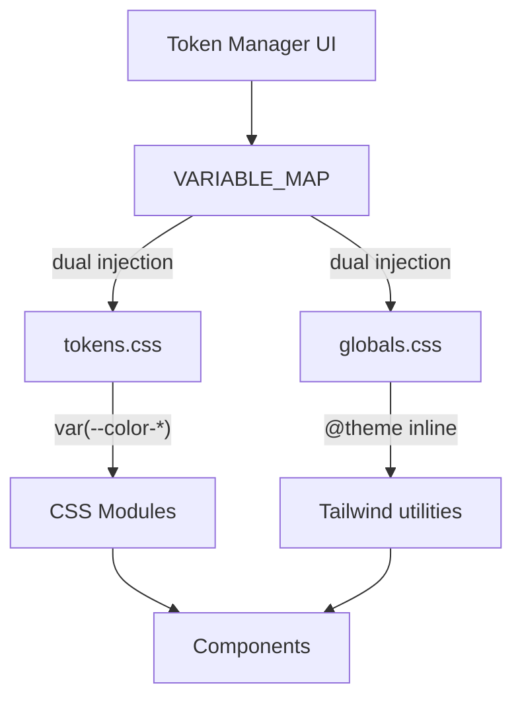
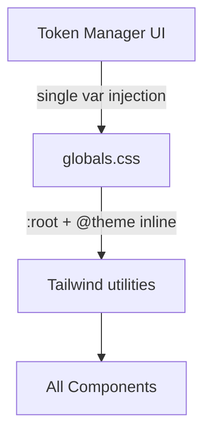
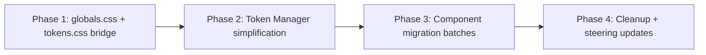

# Design Document: Tailwind Token Migration

## Overview

This design covers the full migration from a dual styling system (CSS Modules + Tailwind) to a single Tailwind-based system. The migration touches every layer of the styling stack:

1. **Token consolidation** — Eliminate duplicate tokens, adopt shadcn naming as canonical
2. **globals.css restructure** — Absorb all tokens from `tokens.css`, add mint palette, remove dead references
3. **Component migration** — Convert 129 `.module.css` files to Tailwind utility classes in JSX
4. **Token Manager simplification** — Remove `VARIABLE_MAP` dual injection, inject single canonical variables
5. **Steering file updates** — Reflect the new single-system approach in project documentation

The migration is phased to avoid breaking the app mid-flight. Each phase produces a working build.

## Architecture

### Current State



### Target State



### Design Decisions

| Decision | Rationale |
|---|---|
| shadcn names win | Already used by all `src/components/ui/` components; industry standard; predictable utility class names |
| globals.css is sole source of truth | Tailwind v4 reads from `@theme inline` which references `:root` vars — one file, one system |
| Mint palette stays as CSS vars | No built-in Tailwind equivalent; needed for brand colour utilities (`bg-mint-500`) |
| Font size scale overridden | UDS base = 14px; override Tailwind's scale so `text-base` = 14px (already done in globals.css) |
| `cn()` for conditional classes | Already exists in `src/lib/utils.ts`; standard shadcn pattern for dynamic styling |
| Phased migration | Each phase produces a working build; components can be migrated incrementally |

## Components and Interfaces

### 1. Consolidated Token Set

The final token set in globals.css. Tokens marked "REMOVE" are deleted; tokens marked "KEEP" are the canonical survivors.

#### Colour Tokens — Canonical Set

| Canonical Token | Replaces (removed duplicates) |
|---|---|
| `--background` | `--color-background-default`, `--color-bg` |
| `--foreground` | `--color-text-primary` |
| `--card` | (standalone — white surface) |
| `--card-foreground` | (standalone) |
| `--popover` | (standalone) |
| `--popover-foreground` | (standalone) |
| `--primary` | `--color-accent-default`, `--color-accent-border`, `--color-success` (alias) |
| `--primary-foreground` | `--color-text-on-accent`, `--color-text-inverse` (when on primary) |
| `--secondary` | `--color-background-subtle`, `--color-surface` |
| `--secondary-foreground` | (standalone) |
| `--muted` | (same value as secondary — kept for shadcn compatibility) |
| `--muted-foreground` | `--color-text-secondary`, `--color-neutral-default` |
| `--tertiary-foreground` | `--color-text-tertiary`, `--color-text-muted` |
| `--accent` | `--color-accent-subtle` |
| `--accent-foreground` | `--color-accent-text` |
| `--destructive` | `--color-danger-default`, `--color-error` |
| `--destructive-foreground` | (standalone) |
| `--destructive-subtle` | `--color-danger-subtle`, `--color-error-light` |
| `--destructive-border` | `--color-danger-border` |
| `--warning` | `--color-warning-default`, `--color-warning` (alias) |
| `--warning-foreground` | `--color-warning-text` |
| `--warning-subtle` | `--color-warning-subtle`, `--color-warning-light` |
| `--warning-border` | `--color-warning-border` |
| `--success` | `--color-success-default`, `--color-success-light` (alias) |
| `--success-foreground` | `--color-success-text` |
| `--success-subtle` | `--color-success-subtle` |
| `--success-border` | `--color-success-border` |
| `--info` | `--color-info-default`, `--color-info` (alias) |
| `--info-foreground` | `--color-info-text` |
| `--info-subtle` | `--color-info-subtle`, `--color-info-light` |
| `--info-border` | `--color-info-border` |
| `--border` | `--color-border-default`, `--color-border`, `--input` |
| `--input` | (kept for shadcn compat — same value as `--border`) |
| `--ring` | `--color-border-focus`, `--color-focus` |
| `--disabled` | `--color-state-disabled-bg` |
| `--disabled-foreground` | `--color-state-disabled-text`, `--color-text-disabled` |
| `--border-strong` | `--color-border-strong` |
| `--accent-hover` | `--color-accent-hover` |
| `--danger-hover` | `--color-danger-hover` |
| `--background-sunken` | `--color-background-sunken` |
| `--background-elevated` | `--color-background-elevated` |
| `--text-inverse` | `--color-text-inverse` |
| `--neutral-hover` | `--color-neutral-hover` |
| `--neutral-subtle` | `--color-neutral-subtle` |
| `--neutral-text` | `--color-neutral-text` |
| `--neutral-border` | `--color-neutral-border` |
| `--danger-text` | `--color-danger-text` |

#### Tokens Removed Entirely

These are removed because they duplicate a canonical token with the same value:

- `--color-accent-default` → use `--primary`
- `--color-accent-subtle` → use `--accent`
- `--color-accent-text` → use `--accent-foreground`
- `--color-accent-border` → use `--primary` (same value)
- `--color-text-primary` → use `--foreground`
- `--color-text-secondary` → use `--muted-foreground`
- `--color-text-tertiary` → use `--tertiary-foreground`
- `--color-text-disabled` → use `--disabled-foreground`
- `--color-text-on-accent` → use `--primary-foreground`
- `--color-background-default` → use `--background`
- `--color-background-subtle` → use `--secondary` / `--muted`
- `--color-border-default` → use `--border`
- `--color-border-focus` → use `--ring`
- `--color-state-disabled-bg` → use `--disabled`
- `--color-state-disabled-text` → use `--disabled-foreground`
- `--color-danger-default` → use `--destructive`
- `--color-danger-subtle` → use `--destructive-subtle`
- `--color-danger-border` → use `--destructive-border`
- `--color-neutral-default` → use `--muted-foreground`
- All `--color-grey-*` aliases → use Tailwind `zinc-*` utilities
- All `--color-primary-*` aliases → use Tailwind `mint-*` utilities
- All backward-compatible aliases section

#### Non-Colour Tokens

| Category | Approach |
|---|---|
| Spacing (`--space-*`) | Use Tailwind's default scale directly (`p-1` = 4px, `p-2` = 8px, etc.). No custom vars needed. |
| Radius (`--radius-*`) | Keep `--radius: 8px` base in globals.css. Derived scale via `@theme inline` (already done). |
| Font family | Keep `--font-sans` and `--font-mono` in `@theme inline` (already done). |
| Font size | Keep overridden scale in `@theme inline` so `text-base` = 14px (already done). |
| Font weight | Use Tailwind utilities directly (`font-semibold`, `font-medium`). No custom vars. |
| Shadows | Use Tailwind shadow utilities. For UDS-style shadows with border ring, use `shadow-sm ring-1 ring-border` pattern. |
| Transitions | Use Tailwind utilities (`duration-150`, `ease-out`). No custom vars. |

### 2. globals.css Restructure

The final globals.css structure:

```css
@import "tailwindcss/utilities";
@import "tailwindcss/theme";

@custom-variant dark (&:where([data-theme="dark"]));

/* ── Light Mode Tokens ── */
:root {
  /* Core surfaces */
  --background: #FAFAFA;
  --foreground: #27272A;
  --card: #FFFFFF;
  --card-foreground: #27272A;
  --popover: #FFFFFF;
  --popover-foreground: #27272A;

  /* Primary */
  --primary: #14B88A;
  --primary-foreground: #FFFFFF;

  /* Secondary */
  --secondary: #F4F4F5;
  --secondary-foreground: #27272A;

  /* Muted */
  --muted: #F4F4F5;
  --muted-foreground: #71717A;
  --tertiary-foreground: #A1A1AA;

  /* Accent */
  --accent: #E6F9F5;
  --accent-foreground: #0D8866;
  --accent-hover: #10A078;

  /* Destructive */
  --destructive: #EF4444;
  --destructive-foreground: #FFFFFF;
  --destructive-subtle: #FEF2F2;
  --destructive-border: #EF4444;

  /* Warning */
  --warning: #F59E0B;
  --warning-foreground: #92400E;
  --warning-subtle: #FFFBEB;
  --warning-border: #F59E0B;

  /* Success */
  --success: #14B88A;
  --success-foreground: #0D8866;
  --success-subtle: #E6F9F5;
  --success-border: #14B88A;

  /* Info */
  --info: #0EA5E9;
  --info-foreground: #0369A1;
  --info-subtle: #F0F9FF;
  --info-border: #0EA5E9;

  /* Border & Input */
  --border: #E4E4E7;
  --input: #E4E4E7;
  --ring: #14B88A;
  --border-strong: #D4D4D8;

  /* Disabled */
  --disabled: #E4E4E7;
  --disabled-foreground: #A1A1AA;

  /* Extended surfaces */
  --background-sunken: #E4E4E7;
  --background-elevated: #D4D4D8;

  /* Extended text */
  --text-inverse: #FFFFFF;

  /* Hover states */
  --danger-hover: #DC2626;
  --danger-text: #B91C1C;

  /* Neutral */
  --neutral-hover: #52525B;
  --neutral-subtle: #FAFAFA;
  --neutral-text: #52525B;
  --neutral-border: #A1A1AA;

  /* Radius */
  --radius: 8px;

  /* Charts */
  --chart-1: #14B88A;
  --chart-2: #3B82F6;
  --chart-3: #F59E0B;
  --chart-4: #A855F7;
  --chart-5: #0EA5E9;

  /* Sidebar */
  --sidebar: #F4F4F5;
  --sidebar-foreground: #27272A;
  --sidebar-primary: #14B88A;
  --sidebar-primary-foreground: #FFFFFF;
  --sidebar-accent: #E6F9F5;
  --sidebar-accent-foreground: #0D8866;
  --sidebar-border: #E4E4E7;
  --sidebar-ring: #14B88A;

  /* Mint palette (brand colour — no Tailwind built-in) */
  --mint-50: #E6F9F5;
  --mint-100: #B3EDE0;
  --mint-200: #80E0CB;
  --mint-300: #4DD4B6;
  --mint-400: #26C79D;
  --mint-500: #14B88A;
  --mint-600: #10A078;
  --mint-700: #0D8866;
  --mint-800: #0A7054;
  --mint-900: #075842;
  --mint-950: #043D2E;
}

/* ── Dark Mode Tokens ── */
[data-theme="dark"] {
  /* (all dark overrides — same structure as current globals.css) */
}

/* ── Tailwind Theme ── */
@theme inline {
  /* All --color-* mappings for Tailwind utilities */
  /* Mint palette exposed as --color-mint-* */
  /* Radius, font, spacing scales */
}
```

### 3. Component Migration Strategy

#### Variable-to-Utility Mapping

The most-used CSS variables and their Tailwind replacements:

| CSS Variable (296 uses) | Tailwind Utility |
|---|---|
| `var(--color-accent-default)` | `text-primary` / `bg-primary` / `border-primary` |
| `var(--color-text-primary)` | `text-foreground` |
| `var(--color-text-secondary)` | `text-muted-foreground` |
| `var(--color-background-default)` | `bg-background` |
| `var(--color-border-default)` | `border-border` |
| `var(--color-border)` | `border-border` |
| `var(--color-text-tertiary)` | `text-tertiary-foreground` |
| `var(--color-background-subtle)` | `bg-secondary` / `bg-muted` |
| `var(--color-text-muted)` | `text-tertiary-foreground` |
| `var(--color-bg)` | `bg-background` |
| `var(--color-accent-subtle)` | `bg-accent` |
| `var(--color-text-on-accent)` | `text-primary-foreground` |
| `var(--color-accent-hover)` | `bg-accent-hover` |
| `var(--color-error)` | `text-destructive` / `bg-destructive` |
| `var(--color-border-strong)` | `border-border-strong` |
| `var(--color-accent-text)` | `text-accent-foreground` |
| `var(--color-text-inverse)` | `text-text-inverse` |

#### Non-Colour Variable Mapping

| CSS Variable | Tailwind Utility |
|---|---|
| `var(--font-sm)` / `var(--font-size-sm)` | `text-sm` (12px) |
| `var(--font-xs)` / `var(--font-size-xs)` | `text-xs` (10px) |
| `var(--font-base)` / `var(--font-size-base)` | `text-base` (14px) |
| `var(--font-lg)` | `text-lg` (16px) |
| `var(--weight-semibold)` / `var(--font-weight-semibold)` | `font-semibold` |
| `var(--weight-medium)` / `var(--font-weight-medium)` | `font-medium` |
| `var(--weight-normal)` | `font-normal` |
| `var(--radius-md)` | `rounded-md` |
| `var(--radius-sm)` | `rounded-sm` |
| `var(--radius-lg)` | `rounded-lg` |
| `var(--radius-full)` | `rounded-full` |
| `var(--space-1)` / `var(--space-xs)` | `p-1` / `gap-1` (4px) |
| `var(--space-2)` / `var(--space-sm)` | `p-2` / `gap-2` (8px) |
| `var(--space-3)` / `var(--space-ms)` | `p-3` / `gap-3` (12px) |
| `var(--space-4)` / `var(--space-md)` | `p-4` / `gap-4` (16px) |
| `var(--space-6)` / `var(--space-lg)` | `p-6` / `gap-6` (24px) |
| `var(--transition-fast)` | `duration-150 ease-out` |
| `var(--transition-base)` | `duration-200 ease-in-out` |
| `var(--font-family-primary)` | `font-sans` |

#### Migration Process Per Component

For each `.module.css` file:

1. **Read** the CSS module and its paired `.tsx` component
2. **Map** each CSS property + variable to Tailwind utilities using the tables above
3. **Replace** `className={styles.foo}` with Tailwind classes directly in JSX
4. **Use `cn()`** for any conditional/dynamic classes (e.g. active states, variants)
5. **Handle hover/focus** with Tailwind state variants (`hover:bg-muted`, `focus-visible:ring-2`)
6. **Handle pseudo-elements** (like `::after` for active indicators) with Tailwind's `after:` variant or a child `<span>`
7. **Delete** the `.module.css` file and its import
8. **Verify** visual appearance in both light and dark modes

#### Example Conversion

**Before** (CSS Module):
```css
.primaryItem:hover {
  background: var(--color-background-subtle);
}
.primaryItemActive {
  color: var(--color-accent-default);
}
```
```tsx
<button className={cn(styles.primaryItem, isActive && styles.primaryItemActive)}>
```

**After** (Tailwind):
```tsx
<button className={cn(
  "px-3 py-2 flex items-center gap-1 text-sm font-semibold text-foreground",
  "rounded-md transition-colors duration-150 hover:bg-muted",
  isActive && "text-primary"
)}>
```

### 4. Token Manager Simplification

#### Current Flow (with VARIABLE_MAP)

```typescript
// For each token, inject into MULTIPLE CSS variables
const mappedVars = VARIABLE_MAP[tokenName]  // e.g. ['--primary', '--color-accent-default']
for (const varName of mappedVars) {
  setCSSVariable(varName, hex)
}
```

#### Target Flow (single injection)

```typescript
// For each token, inject into ONE CSS variable
setCSSVariable(`--${tokenName}`, hex)
```

#### Changes to `defaultTokenConfig.ts`

1. **Remove** the `VARIABLE_MAP` export entirely
2. **Remove** all UDS-named tokens from `DEFAULT_TOKEN_CONFIG.colours` (e.g. `accent-hover`, `danger-subtle`, `neutral-*`)
3. **Update** `COLOUR_TOKEN_GROUPS` to reference only canonical token names
4. **Update** `TOKEN_DESCRIPTIONS` to remove `duplicateOf` annotations and UDS-named entries
5. **Add** new canonical tokens that weren't previously in the config (e.g. `disabled`, `disabled-foreground`, `border-strong`)

#### Changes to `useTokenConfig.ts`

1. **Remove** the `VARIABLE_MAP` import
2. **Simplify** `injectColourVariables` to always use `--${tokenName}` (no dual injection check)

#### Resulting Token Groups

```typescript
export const COLOUR_TOKEN_GROUPS = [
  { name: 'Core Surfaces', tokens: ['background', 'foreground', 'card', 'card-foreground', 'popover', 'popover-foreground'] },
  { name: 'Primary', tokens: ['primary', 'primary-foreground'] },
  { name: 'Secondary', tokens: ['secondary', 'secondary-foreground'] },
  { name: 'Muted', tokens: ['muted', 'muted-foreground', 'tertiary-foreground'] },
  { name: 'Accent', tokens: ['accent', 'accent-foreground', 'accent-hover'] },
  { name: 'Destructive', tokens: ['destructive', 'destructive-foreground', 'destructive-subtle', 'destructive-border'] },
  { name: 'Warning', tokens: ['warning', 'warning-foreground', 'warning-subtle', 'warning-border'] },
  { name: 'Success', tokens: ['success', 'success-foreground', 'success-subtle', 'success-border'] },
  { name: 'Info', tokens: ['info', 'info-foreground', 'info-subtle', 'info-border'] },
  { name: 'Border', tokens: ['border', 'input', 'ring', 'border-strong'] },
  { name: 'Disabled', tokens: ['disabled', 'disabled-foreground'] },
  { name: 'Extended', tokens: ['background-sunken', 'background-elevated', 'text-inverse', 'danger-hover', 'danger-text', 'neutral-hover', 'neutral-subtle', 'neutral-text', 'neutral-border'] },
  { name: 'Sidebar', tokens: ['sidebar', 'sidebar-foreground', 'sidebar-primary', 'sidebar-primary-foreground', 'sidebar-accent', 'sidebar-accent-foreground', 'sidebar-border', 'sidebar-ring'] },
  { name: 'Charts', tokens: ['chart-1', 'chart-2', 'chart-3', 'chart-4', 'chart-5'] },
]
```

### 5. Migration Phasing



#### Phase 1: Token Foundation (non-breaking)

1. Add all new canonical tokens to globals.css `:root` and `[data-theme="dark"]`
2. Add mint palette CSS variables to globals.css
3. Expose new tokens in `@theme inline` block
4. Add backward-compatible aliases in tokens.css pointing OLD → NEW (e.g. `--color-accent-default: var(--primary)`)
5. **Result:** Both old and new variable names resolve correctly. Zero visual change.

#### Phase 2: Token Manager Simplification

1. Remove `VARIABLE_MAP` from `defaultTokenConfig.ts`
2. Simplify `useTokenConfig.ts` injection logic
3. Update `COLOUR_TOKEN_GROUPS` and `TOKEN_DESCRIPTIONS` to canonical names only
4. Remove UDS-named tokens from `DEFAULT_TOKEN_CONFIG.colours`
5. **Result:** Token Manager works with single injection. App still renders correctly because tokens.css aliases still exist.

#### Phase 3: Component Migration (batched)

Migrate in dependency order — leaf components first, layout components last:

| Batch | Components | Count | Rationale |
|---|---|---|---|
| 3a | Simple cards, badges, pills | ~20 | Leaf components, no children to break |
| 3b | Form inputs, filters, search | ~25 | Self-contained, well-scoped |
| 3c | Tables, lists, panels | ~30 | Medium complexity, some layout |
| 3d | Modals, dialogs, overlays | ~20 | Floating surfaces, z-index concerns |
| 3e | Page layouts, nav, shells | ~15 | High-level layout, migrate last |
| 3f | Pages (co-located styles) | ~19 | Page-level styles, final batch |

Each batch:
- Convert all `.module.css` → Tailwind utilities
- Delete `.module.css` files
- Remove `import styles from` statements
- Verify light + dark mode rendering

#### Phase 4: Cleanup

1. Delete `src/styles/tokens.css`
2. Remove `tokens.css` import from wherever it's referenced
3. Remove `scripts/generate-tokens.mjs` (no longer needed)
4. Update `tech-stack.md` steering file
5. Update `project-structure.md` steering file
6. Remove backward-compatible aliases from globals.css (if any remain)
7. **Result:** Zero `.module.css` files, zero `tokens.css` references, single styling system.

## Data Models

No new data models are introduced. The existing `TokenConfig` interface remains unchanged:

```typescript
interface TokenConfig {
  colours: Record<string, ColourTokenValue>;
  spacing: Record<string, number>;
  radius: { base: number };
  typography: { fontSizes: Record<string, number> };
}

interface ColourTokenValue {
  light: PrimitiveRef;
  dark: PrimitiveRef;
}
```

The only change is the set of keys in `colours` — UDS-named duplicates are removed, and new canonical tokens (like `disabled`, `disabled-foreground`) are added.


## Correctness Properties

*A property is a characteristic or behavior that should hold true across all valid executions of a system — essentially, a formal statement about what the system should do. Properties serve as the bridge between human-readable specifications and machine-verifiable correctness guarantees.*

### Property 1: Zero CSS Modules Remaining

*For any* file in `src/components/` or `src/pages/`, the file SHALL NOT be a `.module.css` file, and no `.tsx` file SHALL contain an import statement referencing a `.module.css` file.

**Validates: Requirements 3.1, 3.2, 3.4, 3.7, 8.3**

### Property 2: Single-Variable Injection Correctness

*For any* token name in `DEFAULT_TOKEN_CONFIG.colours` and any valid `PrimitiveRef` value, when the token is updated via the Token Manager, exactly one CSS variable (`--{tokenName}`) SHALL be set on `document.documentElement.style` with the resolved hex value, and no other CSS variables SHALL be set as a side effect of that single token update.

**Validates: Requirements 4.2, 4.3, 4.4**

### Property 3: Token Coverage Completeness

*For any* token defined in `DEFAULT_TOKEN_CONFIG.colours`, there SHALL exist a corresponding CSS variable `--{tokenName}` in the globals.css `:root` selector, AND a corresponding `--color-{tokenName}: var(--{tokenName})` entry in the `@theme inline` block.

**Validates: Requirements 2.1, 2.2**

### Property 4: No UDS Naming in Canonical Config

*For any* key in `DEFAULT_TOKEN_CONFIG.colours`, the key SHALL NOT match UDS naming patterns: it SHALL NOT start with `color-`, `state-`, `danger-` (except `danger-hover`, `danger-text`), or contain the substring `text-` as a prefix (except `text-inverse`), and SHALL NOT duplicate a shadcn-named token's value and semantic purpose.

**Validates: Requirements 5.5, 5.6**

### Property 5: Token Group Consistency

*For any* token name listed in any group within `COLOUR_TOKEN_GROUPS`, that token name SHALL exist as a key in `DEFAULT_TOKEN_CONFIG.colours`.

**Validates: Requirements 4.5**

### Property 6: Foreground Pairing Invariant

*For any* token in `DEFAULT_TOKEN_CONFIG.colours` whose name ends with `-foreground`, there SHALL exist a corresponding base token (the name without the `-foreground` suffix) also present in `DEFAULT_TOKEN_CONFIG.colours`.

**Validates: Requirements 5.1**

## Error Handling

### Migration Errors

| Scenario | Handling |
|---|---|
| CSS Module uses a variable with no Tailwind equivalent | Use arbitrary value syntax: `bg-[var(--custom)]`. Flag for manual review. |
| Component has complex pseudo-element styling (e.g. `::after` with positioned content) | Convert to a child `<span>` element with Tailwind classes, or use `after:` variant. |
| Token Manager localStorage has old token names | `mergeWithDefaults()` already handles this — old keys are ignored, new defaults are merged in. |
| Dark mode override missing for a new token | Build-time check: every token in `:root` must have a corresponding entry in `[data-theme="dark"]`. |

### Runtime Errors

| Scenario | Handling |
|---|---|
| Token Manager sets a variable that doesn't exist in globals.css | No visual effect — CSS ignores unknown variables. Caught by Property 3 (coverage test). |
| Invalid PrimitiveRef passed to updateColour | Existing `resolveToHex()` returns `null`; `updateColour` rejects the update silently. No change needed. |
| User has stale localStorage with VARIABLE_MAP-era config | `mergeWithDefaults()` fills in missing keys from new defaults. Old keys that no longer exist are harmless (stored but not injected). |

## Testing Strategy

### Property-Based Tests (fast-check)

The project already has `fast-check` installed. Each property test runs minimum 100 iterations.

| Property | Test Approach |
|---|---|
| Property 1: Zero CSS Modules | Scan filesystem — generate random subsets of src/ paths, verify none match `*.module.css`. (Note: this is better as a single assertion test since the filesystem is fixed.) |
| Property 2: Single-Variable Injection | Generate random token names from config keys, random valid PrimitiveRefs, call injection function, assert exactly one CSS variable set per call. |
| Property 3: Token Coverage | Parse globals.css at test time, for each token in DEFAULT_TOKEN_CONFIG verify :root and @theme inline entries exist. |
| Property 4: No UDS Naming | Iterate all keys in DEFAULT_TOKEN_CONFIG.colours, assert none match forbidden patterns. |
| Property 5: Token Group Consistency | For each token in each group, assert it exists in DEFAULT_TOKEN_CONFIG.colours. |
| Property 6: Foreground Pairing | For each *-foreground token, assert the base token exists. |

**Practical note:** Properties 1, 3, 4, 5, and 6 are structural invariants on fixed data — they're better expressed as exhaustive unit tests rather than randomised property tests. Property 2 is the primary candidate for true property-based testing with random inputs.

### Unit Tests (vitest)

| Test | What it verifies |
|---|---|
| Token consolidation completeness | All expected canonical tokens exist in DEFAULT_TOKEN_CONFIG |
| No VARIABLE_MAP export | `defaultTokenConfig.ts` does not export VARIABLE_MAP |
| Mint palette in globals.css | All 11 mint variables defined in :root |
| Dark mode completeness | Every :root token has a [data-theme="dark"] override |
| Zero .module.css files | `find src -name "*.module.css"` returns empty |
| No tokens.css file | `src/styles/tokens.css` does not exist |
| Steering files updated | tech-stack.md mentions "single styling mechanism" |

### Integration / Visual Tests

- Manual verification of all migrated components in light and dark modes
- Spot-check Token Manager: change a colour, verify it applies immediately
- Verify `cn()` usage in components with conditional styling

### Test Configuration

- Framework: Vitest
- PBT library: fast-check (already installed)
- Minimum iterations: 100 per property test
- Tag format: **Feature: tailwind-token-migration, Property {N}: {title}**
