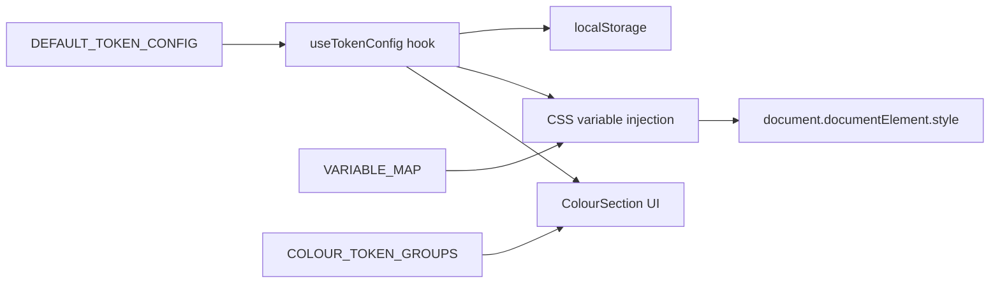

# Design Document: Token Management Consolidation

## Overview

This feature consolidates all semantic colour tokens from `tokens.css` into the existing Token Manager system so that every colour in the application is editable from a single UI. Currently, the Token Manager only manages Tailwind/shadcn tokens from `globals.css`. The CSS Module semantic tokens (border-strong, background-subtle, accent-hover, state-disabled-bg, neutral-*, danger-*, etc.) are unmanaged.

The implementation is purely additive — extending `DEFAULT_TOKEN_CONFIG`, `COLOUR_TOKEN_GROUPS`, and `VARIABLE_MAP` in `src/data/defaultTokenConfig.ts`. No changes are needed to the hook logic (`useTokenConfig.ts`) or the UI component (`ColourSection.tsx`) because both are already data-driven.

## Architecture

The existing architecture already supports this consolidation. The data flow is:



**Key insight:** The `useTokenConfig` hook iterates over `config.colours` and for each token either:
1. Checks `VARIABLE_MAP[tokenName]` — if present, sets all listed CSS variables (dual injection)
2. Falls back to setting `--{tokenName}` directly

The `ColourSection` component iterates over `COLOUR_TOKEN_GROUPS` and renders whatever tokens are listed. Adding new tokens requires only data changes.

### Design Decision: Data-only changes

The hook and UI are already generic. No logic changes are needed — only expanding the three data structures in `defaultTokenConfig.ts`. This keeps the change surface minimal and low-risk.

## Components and Interfaces

### Modified File: `src/data/defaultTokenConfig.ts`

This is the only file that needs modification. Three exports are extended:

#### 1. `VARIABLE_MAP` — Extended Dual Injection Mappings

New entries for tokens that exist in both `globals.css` and `tokens.css`:

| Token Name | Mapped CSS Variables |
|---|---|
| `border-strong` | `['--color-border-strong']` |
| `border-focus` | `['--color-border-focus']` |
| `background-subtle` | `['--color-background-subtle']` |
| `background-sunken` | `['--color-background-sunken']` |
| `background-elevated` | `['--color-background-elevated']` |
| `text-tertiary` | `['--color-text-tertiary']` |
| `text-disabled` | `['--color-text-disabled']` |
| `text-inverse` | `['--color-text-inverse']` |
| `text-on-accent` | `['--color-text-on-accent']` |
| `accent-hover` | `['--color-accent-hover']` |
| `accent-subtle` | `['--color-accent-subtle']` |
| `accent-text` | `['--color-accent-text']` |
| `accent-border` | `['--color-accent-border']` |
| `state-disabled-bg` | `['--color-state-disabled-bg']` |
| `state-disabled-text` | `['--color-state-disabled-text']` |
| `danger-hover` | `['--color-danger-hover']` |
| `danger-subtle` | `['--color-danger-subtle']` |
| `danger-text` | `['--color-danger-text']` |
| `danger-border` | `['--color-danger-border']` |
| `neutral-default` | `['--color-neutral-default']` |
| `neutral-hover` | `['--color-neutral-hover']` |
| `neutral-subtle` | `['--color-neutral-subtle']` |
| `neutral-text` | `['--color-neutral-text']` |
| `neutral-border` | `['--color-neutral-border']` |

Existing dual-injection entries (e.g. `'background': ['--background', '--color-background-default']`) remain unchanged.

#### 2. `COLOUR_TOKEN_GROUPS` — Extended Group Definitions

New and modified groups:

| Group Name | Tokens |
|---|---|
| **Border** (extended) | `border`, `input`, `ring`, `border-strong`, `border-focus` |
| **Background** (new) | `background-subtle`, `background-sunken`, `background-elevated` |
| **Text** (new) | `text-tertiary`, `text-disabled`, `text-inverse`, `text-on-accent` |
| **Accent** (extended) | `accent`, `accent-foreground`, `accent-hover`, `accent-subtle`, `accent-text`, `accent-border` |
| **State** (new) | `state-disabled-bg`, `state-disabled-text` |
| **Danger** (new) | `danger-hover`, `danger-subtle`, `danger-text`, `danger-border` |
| **Neutral** (new) | `neutral-default`, `neutral-hover`, `neutral-subtle`, `neutral-text`, `neutral-border` |

#### 3. `DEFAULT_TOKEN_CONFIG.colours` — New Token Entries

Each new token maps to a `{ light: PrimitiveRef, dark: PrimitiveRef }` pair derived from the hex values in `tokens.css`:

| Token | Light Ref | Dark Ref |
|---|---|---|
| `border-strong` | `zinc-300` | `zinc-600` |
| `border-focus` | `mint-500` | `mint-500` |
| `background-subtle` | `zinc-100` | `zinc-800` |
| `background-sunken` | `zinc-200` | `zinc-950` |
| `background-elevated` | `zinc-300` | `zinc-700` |
| `text-tertiary` | `zinc-400` | `zinc-500` |
| `text-disabled` | `zinc-300` | `zinc-600` |
| `text-inverse` | `white-50` | `zinc-900` |
| `text-on-accent` | `white-50` | `white-50` |
| `accent-hover` | `mint-600` | `mint-400` |
| `accent-subtle` | `mint-50` | `mint-950` |
| `accent-text` | `mint-700` | `mint-300` |
| `accent-border` | `mint-500` | `mint-500` |
| `state-disabled-bg` | `zinc-200` | `zinc-700` |
| `state-disabled-text` | `zinc-400` | `zinc-600` |
| `danger-hover` | `red-600` | `red-500` |
| `danger-subtle` | `red-50` | `red-950` |
| `danger-text` | `red-700` | `red-300` |
| `danger-border` | `red-500` | `red-400` |
| `neutral-default` | `zinc-500` | `zinc-400` |
| `neutral-hover` | `zinc-600` | `zinc-500` |
| `neutral-subtle` | `zinc-50` | `zinc-950` |
| `neutral-text` | `zinc-600` | `zinc-400` |
| `neutral-border` | `zinc-400` | `zinc-600` |

### Unchanged Files

- **`src/lib/useTokenConfig.ts`** — No changes. The `injectColourVariables` function already iterates `config.colours` and checks `VARIABLE_MAP`. New tokens are automatically handled.
- **`src/components/tokens/ColourSection.tsx`** — No changes. It iterates `COLOUR_TOKEN_GROUPS` and renders whatever is there.
- **`src/models/tokenConfig.ts`** — No changes. The `TokenConfig` interface uses `Record<string, ColourTokenValue>` which accepts any string key.

## Data Models

No new data models are introduced. The existing `TokenConfig` interface already supports arbitrary colour token keys:

```typescript
interface TokenConfig {
  colours: Record<string, ColourTokenValue>;  // ← accepts any token name
  spacing: Record<string, number>;
  radius: { base: number };
  typography: { fontSizes: Record<string, number> };
}
```

The `ColourTokenValue` type remains `{ light: PrimitiveRef; dark: PrimitiveRef }`.

The `VARIABLE_MAP` type remains `Record<string, string[]>`.

## Correctness Properties

*A property is a characteristic or behavior that should hold true across all valid executions of a system — essentially, a formal statement about what the system should do. Properties serve as the bridge between human-readable specifications and machine-verifiable correctness guarantees.*

### Property 1: CSS Variable Injection Correctness

*For any* token in `DEFAULT_TOKEN_CONFIG.colours`, when that token is updated via `updateColour`, the hook SHALL set the correct CSS variable(s) on the document root: if the token has a `VARIABLE_MAP` entry, all listed variables are set to the resolved hex; otherwise `--{tokenName}` is set to the resolved hex.

**Validates: Requirements 1.3, 1.4, 2.3, 2.4, 2.5, 3.3, 3.4, 3.5, 3.6, 4.3, 4.4, 4.5, 4.6, 5.3, 5.4, 6.3, 6.4, 7.3, 8.2**

### Property 2: Complete Token Coverage

*For any* semantic colour variable in `tokens.css` (matching `--color-*` and excluding primitive palette variables like `--color-zinc-*`, `--color-mint-*`, `--color-red-*`, etc.), `DEFAULT_TOKEN_CONFIG` SHALL contain a corresponding token entry whose resolved light value matches the `:root` hex and whose resolved dark value matches the `[data-theme="dark"]` hex.

**Validates: Requirements 10.1, 10.2, 10.3**

### Property 3: ColourSection Renders All Groups and Tokens

*For any* configuration of `COLOUR_TOKEN_GROUPS` and a `TokenConfig` containing matching colour entries, the `ColourSection` component SHALL render a group heading for each group and display the token name, light mode value, and dark mode value for each token within that group.

**Validates: Requirements 9.1, 9.2, 9.3**

### Property 4: Export Structure Invariant

*For any* colour token in the exported JSON produced by `exportJSON`, the token entry SHALL have the structure `{ light: PrimitiveRef, dark: PrimitiveRef }` where both `light` and `dark` are valid primitive references that resolve to hex values via `resolveToHex`.

**Validates: Requirements 12.1, 12.2, 12.3**

## Error Handling

This feature has minimal error surface since it's purely additive data configuration:

1. **Invalid primitive references** — The existing `resolveToHex` function returns `null` for unrecognised references. The `updateColour` callback already validates references before applying them. No new error handling needed.

2. **Missing tokens in stored config** — The existing `mergeWithDefaults` function in `useTokenConfig.ts` deep-merges stored config with `DEFAULT_TOKEN_CONFIG`. New tokens are automatically populated from defaults when a user loads with an older localStorage snapshot.

3. **VARIABLE_MAP mismatches** — If a token has a `VARIABLE_MAP` entry but the CSS variable name is wrong, the variable will be set but have no visual effect. This is caught by Property 2 (coverage test) which validates that resolved values match the CSS file.

## Testing Strategy

### Property-Based Tests (fast-check)

The project already has `fast-check` as a dev dependency. Property tests will use it with minimum 100 iterations per property.

| Property | Test Approach |
|---|---|
| Property 1: CSS Variable Injection | Generate random token names from `DEFAULT_TOKEN_CONFIG.colours`, random valid primitive refs, call the injection function, assert correct CSS variables are set |
| Property 2: Complete Token Coverage | Parse `tokens.css` at test time, extract semantic variables, verify each has a config entry with matching hex values |
| Property 3: ColourSection Rendering | Generate random subsets of token groups, render component, assert DOM contains all group headings and token names |
| Property 4: Export Structure | Generate random token configs, call export logic, parse JSON, assert all entries have valid `{ light, dark }` structure |

### Unit Tests (vitest)

Example-based tests for specific acceptance criteria:

- Verify `VARIABLE_MAP` contains expected specific mappings (8.3–8.7)
- Verify `COLOUR_TOKEN_GROUPS` contains expected groups with expected tokens (1.2, 2.2, 3.2, 4.2, 5.2, 6.2, 7.2)
- Verify `DEFAULT_TOKEN_CONFIG` contains expected token entries (1.1, 2.1, 3.1, 4.1, 5.1, 6.1, 7.1)
- Verify reset clears inline styles and restores defaults (11.1, 11.2, 11.3)
- Verify export includes all new tokens (12.1, 12.2)

### Test Configuration

- Framework: Vitest
- PBT library: fast-check (already installed)
- Minimum iterations: 100 per property test
- Tag format: `Feature: token-management-consolidation, Property {N}: {title}`
