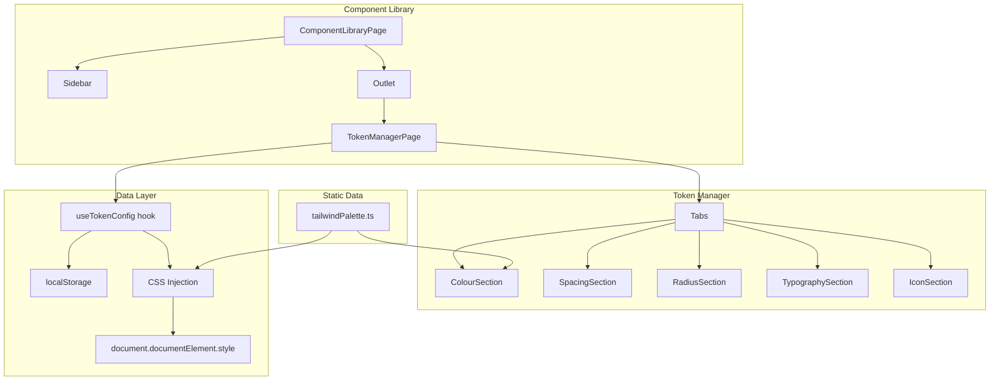
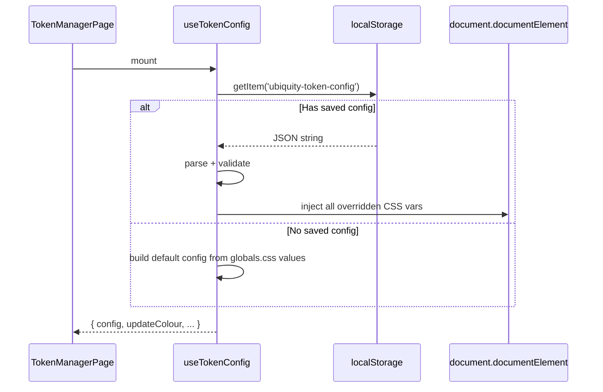

# Design Document: Token Management UI

## Overview

The Token Management UI is a new page within the existing Component Library (`/admin/components`) that provides a visual interface for viewing and editing all design tokens in the UbiQuity design system. It replaces manual CSS file editing with a live, interactive editor that stores token assignments as Tailwind primitive references (e.g. `zinc-800` instead of `#27272A`).

The page integrates into the existing `componentRegistry` pattern, renders inside the Component Library's sidebar + content layout, and uses shadcn/ui components (Tabs, Popover, Input, Button) for its UI. Token changes are applied immediately via CSS custom property injection on `document.documentElement` and persisted to localStorage.

### Key Design Decisions

1. **Tailwind primitive references, not hex** — Token values are stored as `{palette}-{shade}` strings. A lookup table resolves these to hex at runtime. This keeps the config human-readable and aligned with the Tailwind ecosystem.
2. **localStorage persistence** — No backend required. The prototype stores overrides in `localStorage['ubiquity-token-config']` and applies them on page load.
3. **Dual CSS variable injection** — Changes update both the `globals.css` semantic tokens (shadcn/Tailwind) and the equivalent `tokens.css` variables (CSS Modules) so all components respond.
4. **Component Library integration** — The page is a standard `componentRegistry` entry under `foundations`, lazy-loaded like all other demos.

---

## Architecture



### Page Routing

The Token Manager page is accessed at `/admin/components/foundations/tokens`. It fits into the existing nested route structure:

```
/admin/components              → ComponentLibraryPage (layout)
  /admin/components/:category/:name → ComponentDemoView (renders registry entry)
```

The page is registered in `componentRegistry.ts` under the `foundations` category with slug `tokens`. The existing `ComponentDemoView` component will lazy-load and render it like any other demo.

---

## Components and Interfaces

### Component Tree

```
TokenManagerPage
├── Tabs (shadcn)
│   ├── TabsTrigger: "Colours"
│   ├── TabsTrigger: "Spacing"
│   ├── TabsTrigger: "Border Radius"
│   ├── TabsTrigger: "Typography"
│   └── TabsTrigger: "Icons"
├── TabsContent: ColourSection
│   ├── TokenGroupHeader (per subsection)
│   └── ColourTokenRow[] 
│       ├── TokenName
│       ├── ColourValue (light) → Popover → ColourPicker
│       └── ColourValue (dark) → Popover → ColourPicker
├── TabsContent: SpacingSection
│   └── SpacingTokenRow[]
│       ├── TokenName
│       ├── Input (numeric px)
│       └── VisualBar
├── TabsContent: RadiusSection
│   ├── BaseRadiusInput
│   └── RadiusTokenRow[]
│       ├── TokenName
│       ├── PixelValue (derived, read-only except base)
│       └── ShapePreview (square with border-radius)
├── TabsContent: TypographySection
│   ├── FontFamilyDisplay
│   ├── FontSizeScale[]
│   └── FontWeightSamples[]
├── TabsContent: IconSection
│   ├── LibraryLabel
│   ├── StyleLabel
│   └── IconGrid
└── ActionBar
    ├── Button: "Reset to Defaults"
    └── Button: "Export JSON"
```

### Key Interfaces

```typescript
// src/models/tokenConfig.ts

/** A Tailwind primitive reference: "{palette}-{shade}" */
type PrimitiveRef = `${string}-${string}`

interface ColourTokenValue {
  light: PrimitiveRef
  dark: PrimitiveRef
}

interface TokenConfig {
  colours: Record<string, ColourTokenValue>
  spacing: Record<string, number>  // px values
  radius: { base: number }         // derived values computed from base
  typography: {
    fontSizes: Record<string, number>  // px values
  }
}

/** The full Tailwind palette lookup table */
type PaletteLookup = Record<string, Record<string, string>>
// e.g. { zinc: { '50': '#FAFAFA', '100': '#F4F4F5', ... }, ... }
```

### Custom Hook: `useTokenConfig`

```typescript
// src/lib/useTokenConfig.ts

interface UseTokenConfigReturn {
  config: TokenConfig
  updateColour: (tokenName: string, mode: 'light' | 'dark', value: PrimitiveRef) => void
  updateSpacing: (tokenName: string, value: number) => void
  updateRadius: (base: number) => void
  updateFontSize: (tokenName: string, value: number) => void
  reset: () => void
  exportJSON: () => void
}
```

The hook:
1. Reads from `localStorage['ubiquity-token-config']` on mount
2. Merges overrides with defaults (derived from current `globals.css` values)
3. On every change: updates state → writes to localStorage → injects CSS variables

---

## Data Models

### Token_Config JSON Structure

Stored in `localStorage['ubiquity-token-config']`:

```json
{
  "colours": {
    "background": { "light": "zinc-50", "dark": "zinc-950" },
    "foreground": { "light": "zinc-800", "dark": "zinc-50" },
    "primary": { "light": "mint-500", "dark": "mint-500" },
    "primary-foreground": { "light": "zinc-50", "dark": "zinc-50" },
    "secondary": { "light": "zinc-100", "dark": "zinc-800" },
    "muted": { "light": "zinc-100", "dark": "zinc-800" },
    "muted-foreground": { "light": "zinc-500", "dark": "zinc-400" },
    "accent": { "light": "mint-50", "dark": "mint-950" },
    "accent-foreground": { "light": "mint-700", "dark": "mint-300" },
    "destructive": { "light": "red-500", "dark": "red-500" },
    "warning": { "light": "amber-500", "dark": "amber-500" },
    "success": { "light": "mint-500", "dark": "mint-500" },
    "info": { "light": "sky-500", "dark": "sky-400" },
    "border": { "light": "zinc-200", "dark": "zinc-700" },
    "ring": { "light": "mint-500", "dark": "mint-500" },
    "chart-1": { "light": "mint-500", "dark": "mint-500" },
    "chart-2": { "light": "blue-500", "dark": "blue-400" },
    "chart-3": { "light": "amber-500", "dark": "amber-400" },
    "chart-4": { "light": "purple-500", "dark": "purple-400" },
    "chart-5": { "light": "sky-500", "dark": "sky-400" }
  },
  "spacing": {
    "xxs": 2,
    "xs": 4,
    "sm": 8,
    "ms": 12,
    "md": 16,
    "lg": 24,
    "xl": 32,
    "xxl": 40
  },
  "radius": {
    "base": 8
  },
  "typography": {
    "fontSizes": {
      "xxs": 8,
      "xs": 10,
      "sm": 12,
      "base": 14,
      "lg": 16,
      "xl": 18,
      "2xl": 24,
      "3xl": 30,
      "4xl": 36,
      "5xl": 48
    }
  }
}
```

### Tailwind Palette Lookup Table

A static data file (`src/data/tailwindPalette.ts`) provides the full colour palette as a nested object. This is the resolution layer between primitive names and hex values.

```typescript
// src/data/tailwindPalette.ts

export const PALETTE_NAMES = [
  'zinc', 'slate', 'gray', 'neutral', 'stone',
  'red', 'orange', 'amber', 'yellow', 'lime',
  'green', 'emerald', 'teal', 'cyan', 'sky',
  'blue', 'indigo', 'violet', 'purple', 'fuchsia',
  'pink', 'rose',
  'mint',  // custom UDS brand palette
] as const

export const SHADE_STEPS = ['50', '100', '200', '300', '400', '500', '600', '700', '800', '900', '950'] as const

export const tailwindPalette: Record<string, Record<string, string>> = {
  zinc: {
    '50': '#FAFAFA', '100': '#F4F4F5', '200': '#E4E4E7',
    '300': '#D4D4D8', '400': '#A1A1AA', '500': '#71717A',
    '600': '#52525B', '700': '#3F3F46', '800': '#27272A',
    '900': '#18181B', '950': '#09090B',
  },
  mint: {
    '50': '#E6F9F5', '100': '#B3EDE0', '200': '#80E0CB',
    '300': '#4DD4B6', '400': '#26C79D', '500': '#14B88A',
    '600': '#10A078', '700': '#0D8866', '800': '#0A7054',
    '900': '#075842', '950': '#043D2E',
  },
  // ... all standard Tailwind palettes with their hex values
}

/** Resolve a primitive reference to its hex value */
export function resolveToHex(ref: string): string | null {
  const [palette, shade] = ref.split('-')
  return tailwindPalette[palette]?.[shade] ?? null
}
```

The mint palette values come from the existing `tokens.css` `--color-mint-*` definitions. All other palettes use standard Tailwind v4 default values.

---

### Colour Token Groups

The Colour Section organises tokens into these subsections (matching the `globals.css` structure):

| Group | Tokens |
|---|---|
| Core Surfaces | background, foreground, card, card-foreground, popover, popover-foreground |
| Primary | primary, primary-foreground |
| Secondary | secondary, secondary-foreground |
| Muted | muted, muted-foreground, tertiary-foreground |
| Accent | accent, accent-foreground |
| Destructive | destructive, destructive-foreground, destructive-subtle, destructive-border |
| Warning | warning, warning-foreground, warning-subtle, warning-border |
| Success | success, success-foreground, success-subtle, success-border |
| Info | info, info-foreground, info-subtle, info-border |
| Border | border, input, ring |
| Sidebar | sidebar, sidebar-foreground, sidebar-primary, sidebar-primary-foreground, sidebar-accent, sidebar-accent-foreground, sidebar-border, sidebar-ring |
| Charts | chart-1, chart-2, chart-3, chart-4, chart-5 |

---

## Colour Section — Detailed Design

Each token row displays:

```
┌─────────────────────────────────────────────────────────────────────┐
│  Token Name          Light Mode              Dark Mode              │
│  --background        [■] zinc-50  #FAFAFA    [■] zinc-950 #09090B  │
│  --foreground        [■] zinc-800 #27272A    [■] zinc-50  #FAFAFA  │
└─────────────────────────────────────────────────────────────────────┘
```

- `[■]` = colour swatch (16×16 rounded square filled with the resolved hex)
- Clicking the swatch or the primitive name opens a Popover containing the ColourPicker

### ColourPicker Popover

The picker displays a grid of all palettes × shades:

```
┌─────────────────────────────────────────────┐
│  Select Colour                              │
│                                             │
│  zinc   [50][100][200]...[900][950]         │
│  slate  [50][100][200]...[900][950]         │
│  ...                                        │
│  mint   [50][100][200]...[900][950]         │
│  red    [50][100][200]...[900][950]         │
│  ...                                        │
│                                             │
│  Selected: mint-500  #14B88A                │
└─────────────────────────────────────────────┘
```

Each cell is a small colour swatch button. The currently selected value gets a ring indicator. Clicking a cell closes the popover and updates the token.

---

## Spacing Section

Displays spacing tokens as horizontal bars:

```
┌──────────────────────────────────────────────────┐
│  xxs   2px   [==]                                │
│  xs    4px   [====]                              │
│  sm    8px   [========]                          │
│  ms   12px   [============]                      │
│  md   16px   [================]                  │
│  lg   24px   [========================]          │
│  xl   32px   [================================]  │
│  xxl  40px   [====================================]│
└──────────────────────────────────────────────────┘
```

- Bar width is proportional to the token value (max width = container width at the largest value)
- The pixel value is an editable `<Input>` (type number, min 0)
- Changes update the bar width immediately and persist

---

## Radius Section

Displays radius tokens with shape previews:

```
┌──────────────────────────────────────────────────────────┐
│  Base Radius: [8] px  (other values derived from base)   │
│                                                          │
│  none  0px    [□]     sm   4.8px  [□]                    │
│  md    6.4px  [□]     lg   8px    [□]                    │
│  xl   11.2px  [□]     full 9999px [●]                    │
└──────────────────────────────────────────────────────────┘
```

- Each `[□]` is a 48×48 div with `border: 2px solid var(--border)` and the corresponding `border-radius`
- Derived formula: sm = base × 0.6, md = base × 0.8, lg = base, xl = base × 1.4
- Only the base value is editable; derived values update reactively

---

## Typography Section

Three sub-areas:

**Font Families:**
```
Primary (Inter):     The quick brown fox jumps over the lazy dog
Mono (JetBrains):    const x = await fetch('/api')
```

**Font Size Scale:**
```
xxs  8px   Sample text
xs  10px   Sample text
sm  12px   Sample text
base 14px  Sample text
lg  16px   Sample text
...
```
Each sample is rendered at its corresponding size. The pixel value is editable.

**Font Weights:**
```
Light (300):     The quick brown fox
Normal (400):    The quick brown fox
Medium (500):    The quick brown fox
SemiBold (600):  The quick brown fox
Bold (700):      The quick brown fox
```

---

## Icon Section

A read-only display section:

```
┌──────────────────────────────────────────────────┐
│  Icon Library: Phosphor Icons                    │
│  Style: Regular weight                           │
│                                                  │
│  [🔍] [⚙️] [✕] [✓] [→] [+] [🗑] [📋]          │
│  [👤] [📧] [🔔] [📁] [⬇️] [↗️] [⭐] [💬]       │
└──────────────────────────────────────────────────┘
```

Uses actual Phosphor icon components: MagnifyingGlass, GearSix, X, Check, ArrowRight, Plus, Trash, ClipboardText, User, EnvelopeSimple, Bell, Folder, DownloadSimple, ArrowSquareOut, Star, ChatCircle.

---

## Live Preview Mechanism

### CSS Custom Property Injection

When a token value changes, the system injects the resolved hex value directly onto the document root:

```typescript
function injectTokenValue(tokenName: string, hex: string) {
  document.documentElement.style.setProperty(`--${tokenName}`, hex)
}
```

For colour tokens, the flow is:
1. User selects `mint-600` for `--primary` in light mode
2. `resolveToHex('mint-600')` → `'#10A078'`
3. `document.documentElement.style.setProperty('--primary', '#10A078')`
4. All components using `bg-primary` or `var(--primary)` update immediately

### Dual Variable System

Some tokens exist in both `globals.css` (shadcn names) and `tokens.css` (UDS names). The injection maps overlapping tokens:

```typescript
const VARIABLE_MAP: Record<string, string[]> = {
  'primary': ['--primary', '--color-accent-default'],
  'background': ['--background', '--color-background-default'],
  'foreground': ['--foreground', '--color-text-primary'],
  'border': ['--border', '--color-border-default'],
  'destructive': ['--destructive', '--color-danger-default'],
  'warning': ['--warning', '--color-warning-default'],
  'success': ['--success', '--color-success-default'],
  'info': ['--info', '--color-info-default'],
  'muted-foreground': ['--muted-foreground', '--color-text-secondary'],
  'ring': ['--ring', '--color-border-focus'],
}
```

When a token with overlapping variables is updated, all mapped CSS variables are set.

### Mode-Aware Injection

The current theme mode (`data-theme` attribute on `<html>`) determines which set of values to inject:
- If `data-theme="dark"` → inject dark mode values
- Otherwise → inject light mode values

On theme toggle, re-inject all overridden values for the new mode.

---

## Persistence

### localStorage Strategy

- **Key:** `'ubiquity-token-config'`
- **Value:** JSON string of `TokenConfig`
- **Read:** On page load (in `useTokenConfig` hook init), parse and apply overrides
- **Write:** On every token change, serialize full config and write
- **Reset:** Remove the localStorage key and reload CSS from stylesheet defaults
- **Export:** `JSON.stringify(config, null, 2)` → create Blob → trigger download as `token-config.json`

### Initialisation Flow



---

## Error Handling

| Scenario | Handling |
|---|---|
| Invalid primitive reference (palette or shade not found) | `resolveToHex` returns `null` → update is rejected, toast error shown |
| Corrupted localStorage JSON | Catch parse error → fall back to defaults, remove bad key |
| Negative or zero spacing/radius value | Input validation prevents submission (min=0 for spacing, min=1 for radius) |
| Non-numeric input in spacing/radius/font-size fields | HTML `type="number"` prevents non-numeric entry; `onChange` ignores NaN |

---

## Correctness Properties

*A property is a characteristic or behavior that should hold true across all valid executions of a system — essentially, a formal statement about what the system should do. Properties serve as the bridge between human-readable specifications and machine-verifiable correctness guarantees.*

### Property 1: Primitive Resolution Correctness

*For any* valid Tailwind primitive reference in the format `{palette}-{shade}` where the palette is one of the known palettes and the shade is one of [50, 100, 200, 300, 400, 500, 600, 700, 800, 900, 950], the `resolveToHex` function SHALL return a valid 7-character hex string (matching `/^#[0-9A-Fa-f]{6}$/`), and for any string that does not match a known palette-shade combination, it SHALL return `null`.

**Validates: Requirements 2.5, 10.2**

### Property 2: Token Config Serialization Round-Trip

*For any* valid `TokenConfig` object, serializing it to JSON via `JSON.stringify` and then parsing it back via `JSON.parse` SHALL produce an object deeply equal to the original. Additionally, writing to localStorage and reading back SHALL produce an equivalent config.

**Validates: Requirements 4.1, 4.2, 4.4**

### Property 3: CSS Injection Correctness

*For any* token name and valid primitive reference, after calling `updateColour(tokenName, mode, primitiveRef)`, the value of `document.documentElement.style.getPropertyValue('--' + tokenName)` SHALL equal the hex value returned by `resolveToHex(primitiveRef)`. If the token has overlapping variables in the VARIABLE_MAP, all mapped CSS variables SHALL also be set to the same hex value.

**Validates: Requirements 3.3, 9.1, 9.2**

### Property 4: Light/Dark Mode Independence

*For any* colour token, updating the light mode value SHALL NOT change the dark mode value stored in the config, and updating the dark mode value SHALL NOT change the light mode value. Formally: for any token T, `updateColour(T, 'light', X)` leaves `config.colours[T].dark` unchanged, and vice versa.

**Validates: Requirements 3.4**

### Property 5: Radius Derivation Formula

*For any* positive base radius value B (where B > 0), the derived radius values SHALL be: sm = B × 0.6, md = B × 0.8, lg = B, xl = B × 1.4. The `none` value is always 0 and `full` is always 9999.

**Validates: Requirements 6.3**

### Property 6: Token Format Invariant

*For any* `TokenConfig` produced by the Token Manager editor (via any sequence of user interactions), every colour value in `config.colours` SHALL be a string matching the pattern `{palette}-{shade}` where palette is a member of `PALETTE_NAMES` and shade is a member of `SHADE_STEPS`.

**Validates: Requirements 10.1, 3.2**

### Property 7: Spacing Ordering Invariant

*For any* set of spacing token values displayed in the Spacing Section, the rendered order SHALL be sorted in ascending order by pixel value. Formally: for displayed tokens at indices i and j where i < j, `value[i] <= value[j]`.

**Validates: Requirements 5.2**

---

## Testing Strategy

### Property-Based Tests (Vitest + fast-check)

The project uses Vitest. Property tests will use `fast-check` for generation.

- Minimum 100 iterations per property
- Each test tagged with: `Feature: token-management-ui, Property {N}: {title}`
- Tests target pure functions (`resolveToHex`, `deriveRadiusScale`, serialization logic) and the `useTokenConfig` hook

### Unit Tests (Vitest + React Testing Library)

Example-based tests for:
- Route renders correctly (Req 1.1, 1.2, 1.3)
- Colour picker popover opens with all palettes (Req 3.1)
- Reset action restores defaults (Req 4.3)
- Token group headings present (Req 2.4)
- Icon section displays library name and grid (Req 8.1, 8.2, 8.3)
- Mint palette present in picker (Req 10.4)

### Edge Case Tests

- Invalid primitive reference rejected (Req 9.3)
- Corrupted localStorage handled gracefully
- Zero/negative numeric inputs rejected

---

## File Changes

### New Files

| File | Purpose |
|---|---|
| `src/pages/component-demos/TokenManagerDemo.tsx` | Main Token Manager page component |
| `src/components/tokens/ColourSection.tsx` | Colour token display and editing |
| `src/components/tokens/ColourPicker.tsx` | Palette grid popover for colour selection |
| `src/components/tokens/SpacingSection.tsx` | Spacing token display and editing |
| `src/components/tokens/RadiusSection.tsx` | Radius token display and editing |
| `src/components/tokens/TypographySection.tsx` | Typography token display |
| `src/components/tokens/IconSection.tsx` | Icon set display |
| `src/components/tokens/ActionBar.tsx` | Reset + Export buttons |
| `src/data/tailwindPalette.ts` | Full Tailwind palette lookup table + mint |
| `src/data/defaultTokenConfig.ts` | Default token config (derived from globals.css) |
| `src/lib/useTokenConfig.ts` | Custom hook for token state, persistence, CSS injection |
| `src/models/tokenConfig.ts` | TypeScript interfaces for TokenConfig |

### Modified Files

| File | Change |
|---|---|
| `src/data/componentRegistry.ts` | Add "Design Tokens" entry under `foundations` category with slug `tokens` |
| `src/styles/globals.css` | No structural changes — the Token Manager overrides values at runtime via `style.setProperty`, not by modifying the file |
